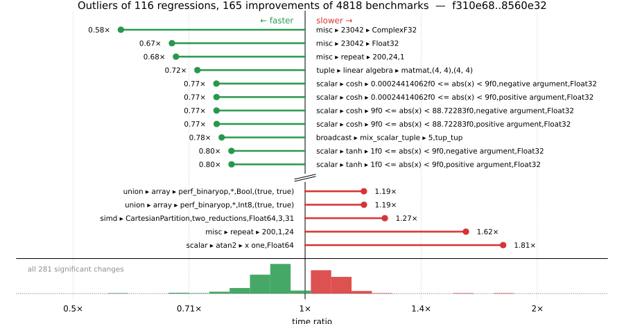

# Benchmark Report

## Summary

**4818** benchmarks were executed, **116** showed regressions, and **165** showed improvements.



## Job Properties

*Commit:* [JuliaLang/julia@8560e32f58aca53fd7a6c9151f0fe0eab1235985](https://github.com/JuliaLang/julia/commit/8560e32f58aca53fd7a6c9151f0fe0eab1235985)

*Comparison Range:* [link](https://github.com/JuliaLang/julia/compare/f310e681488e793ba600baa867e5095a4f8eced8...8560e32f58aca53fd7a6c9151f0fe0eab1235985)

*Triggered By:* [link](https://github.com/JuliaLang/julia/commit/8560e32f58aca53fd7a6c9151f0fe0eab1235985#commitcomment-184571198)

*Tag Predicate:* `ALL`

*Daily Job:* 2026-05-07 vs [2026-05-06](../../2026-05/06/report.md)

## Results

*Note: If Chrome is your browser, I strongly recommend installing the [Wide GitHub](https://chrome.google.com/webstore/detail/wide-github/kaalofacklcidaampbokdplbklpeldpj?hl=en)
extension, which makes the result table easier to read.*

Below is a table of this job's results, obtained by running the benchmarks found in
[JuliaCI/BaseBenchmarks.jl](https://github.com/JuliaCI/BaseBenchmarks.jl). The values
listed in the `ID` column have the structure `[parent_group, child_group, ..., key]`,
and can be used to index into the BaseBenchmarks suite to retrieve the corresponding
benchmarks.

The percentages accompanying time and memory values in the below table are noise tolerances. The "true"
time/memory value for a given benchmark is expected to fall within this percentage of the reported value.

A ratio greater than `1.0` denotes a possible regression (marked with :x:), while a ratio less
than `1.0` denotes a possible improvement (marked with :white_check_mark:). Only significant results - results
that indicate possible regressions or improvements - are shown below (thus, an empty table means that all
benchmark results remained invariant between builds).

| ID | time ratio | memory ratio |
|----|------------|--------------|
| `["alloc", "grow_array"]` | 1.05 (5%) :x: | 1.00 (1%)  |
| `["alloc", "strings"]` | 1.07 (5%) :x: | 1.00 (1%)  |
| `["array", "bool", "bitarray_true_fill!"]` | 0.89 (5%) :white_check_mark: | 1.00 (1%)  |
| `["array", "cat", ("catnd", 5)]` | 0.91 (5%) :white_check_mark: | 1.00 (1%)  |
| `["broadcast", "mix_scalar_tuple", (10, "scal_tup")]` | 0.90 (5%) :white_check_mark: | 1.00 (1%)  |
| `["broadcast", "mix_scalar_tuple", (10, "tup_tup")]` | 0.92 (5%) :white_check_mark: | 1.00 (1%)  |
| `["broadcast", "mix_scalar_tuple", (5, "tup_tup")]` | 0.78 (5%) :white_check_mark: | 1.00 (1%)  |
| `["broadcast", "typeargs", ("tuple", 5)]` | 0.85 (5%) :white_check_mark: | 1.00 (1%)  |
| `["dates", "accessor", "millisecond"]` | 0.85 (5%) :white_check_mark: | 1.00 (1%)  |
| `["dates", "arithmetic", ("Date", "Day")]` | 1.10 (5%) :x: | 1.00 (1%)  |
| `["dates", "arithmetic", ("DateTime", "Day")]` | 0.91 (5%) :white_check_mark: | 1.00 (1%)  |
| `["dates", "arithmetic", ("DateTime", "Hour")]` | 1.10 (5%) :x: | 1.00 (1%)  |
| `["dates", "arithmetic", ("DateTime", "Millisecond")]` | 1.10 (5%) :x: | 1.00 (1%)  |
| `["dates", "arithmetic", ("DateTime", "Minute")]` | 1.10 (5%) :x: | 1.00 (1%)  |
| `["dates", "arithmetic", ("DateTime", "Second")]` | 0.91 (5%) :white_check_mark: | 1.00 (1%)  |
| `["inference", "abstract interpretation", "Base.init_stdio(::Ptr{Cvoid})"]` | 1.02 (5%)  | 0.99 (1%) :white_check_mark: |
| `["inference", "abstract interpretation", "REPL.REPLCompletions.completions"]` | 1.02 (5%)  | 0.98 (1%) :white_check_mark: |
| `["inference", "abstract interpretation", "many_const_calls"]` | 1.01 (5%)  | 0.97 (1%) :white_check_mark: |
| `["inference", "abstract interpretation", "many_global_refs"]` | 1.06 (5%) :x: | 1.00 (1%)  |
| `["inference", "abstract interpretation", "many_local_vars"]` | 1.00 (5%)  | 0.94 (1%) :white_check_mark: |
| `["inference", "abstract interpretation", "sin(42)"]` | 1.05 (5%)  | 0.99 (1%) :white_check_mark: |
| `["inference", "allinference", "Base.init_stdio(::Ptr{Cvoid})"]` | 1.00 (5%)  | 0.99 (1%) :white_check_mark: |
| `["inference", "allinference", "many_const_calls"]` | 0.98 (5%)  | 0.97 (1%) :white_check_mark: |
| `["inference", "allinference", "many_local_vars"]` | 1.00 (5%)  | 0.96 (1%) :white_check_mark: |
| `["inference", "optimization", "many_local_vars"]` | 0.96 (5%)  | 0.97 (1%) :white_check_mark: |
| `["inference", "optimization", "sin(42)"]` | 0.98 (5%)  | 0.99 (1%) :white_check_mark: |
| `["io", "serialization", ("serialize", "Matrix{Float64}")]` | 1.11 (5%) :x: | 1.00 (1%)  |
| `["linalg", "small exp #29116"]` | 1.06 (5%) :x: | 1.00 (1%)  |
| `["misc", "23042", "ComplexF32"]` | 0.58 (5%) :white_check_mark: | 1.00 (1%)  |
| `["misc", "23042", "Float32"]` | 0.67 (5%) :white_check_mark: | 1.00 (1%)  |
| `["misc", "bitshift", ("Int", "Int")]` | 0.93 (5%) :white_check_mark: | 1.00 (1%)  |
| `["misc", "bitshift", ("Int", "UInt")]` | 0.92 (5%) :white_check_mark: | 1.00 (1%)  |
| `["misc", "iterators", "zip(1:1, 1:1)"]` | 1.06 (5%) :x: | 1.00 (1%)  |
| `["misc", "iterators", "zip(1:1, 1:1, 1:1, 1:1)"]` | 1.12 (5%) :x: | 1.00 (1%)  |
| `["misc", "parse", "Float64"]` | 0.93 (5%) :white_check_mark: | 1.00 (1%)  |
| `["misc", "repeat", (200, 1, 24)]` | 1.62 (5%) :x: | 1.00 (1%)  |
| `["misc", "repeat", (200, 24, 1)]` | 0.68 (5%) :white_check_mark: | 1.00 (1%)  |
| `["scalar", "acos", ("one", "negative argument", "Float32")]` | 1.12 (5%) :x: | 1.00 (1%)  |
| `["scalar", "acos", ("one", "negative argument", "Float64")]` | 1.06 (5%) :x: | 1.00 (1%)  |
| `["scalar", "acos", ("one", "positive argument", "Float32")]` | 1.12 (5%) :x: | 1.00 (1%)  |
| `["scalar", "acos", ("one", "positive argument", "Float64")]` | 1.06 (5%) :x: | 1.00 (1%)  |
| `["scalar", "acos", ("small", "negative argument", "Float32")]` | 0.90 (5%) :white_check_mark: | 1.00 (1%)  |
| `["scalar", "acos", ("small", "negative argument", "Float64")]` | 1.05 (5%) :x: | 1.00 (1%)  |
| `["scalar", "acos", ("small", "positive argument", "Float32")]` | 0.90 (5%) :white_check_mark: | 1.00 (1%)  |
| `["scalar", "acos", ("small", "positive argument", "Float64")]` | 1.05 (5%) :x: | 1.00 (1%)  |
| `["scalar", "acos", ("zero", "Float32")]` | 0.90 (5%) :white_check_mark: | 1.00 (1%)  |
| `["scalar", "acos", ("zero", "Float64")]` | 1.05 (5%) :x: | 1.00 (1%)  |
| `["scalar", "acosh", ("one", "Float32")]` | 1.06 (5%) :x: | 1.00 (1%)  |
| `["scalar", "asin", ("0.5 <= abs(x) < 0.975", "negative argument", "Float32")]` | 0.93 (5%) :white_check_mark: | 1.00 (1%)  |
| `["scalar", "asin", ("0.5 <= abs(x) < 0.975", "negative argument", "Float64")]` | 0.92 (5%) :white_check_mark: | 1.00 (1%)  |
| `["scalar", "asin", ("0.975 <= abs(x) < 1.0", "negative argument", "Float64")]` | 0.90 (5%) :white_check_mark: | 1.00 (1%)  |
| `["scalar", "asin", ("one", "negative argument", "Float32")]` | 0.95 (5%) :white_check_mark: | 1.00 (1%)  |
| `["scalar", "asin", ("one", "negative argument", "Float64")]` | 0.95 (5%) :white_check_mark: | 1.00 (1%)  |
| `["scalar", "asin", ("one", "positive argument", "Float32")]` | 0.95 (5%) :white_check_mark: | 1.00 (1%)  |
| `["scalar", "asin", ("one", "positive argument", "Float64")]` | 0.95 (5%) :white_check_mark: | 1.00 (1%)  |
| `["scalar", "asin", ("small", "negative argument", "Float32")]` | 0.95 (5%) :white_check_mark: | 1.00 (1%)  |
| `["scalar", "asin", ("small", "positive argument", "Float32")]` | 0.95 (5%) :white_check_mark: | 1.00 (1%)  |
| `["scalar", "asin", ("zero", "Float32")]` | 0.95 (5%) :white_check_mark: | 1.00 (1%)  |
| `["scalar", "asinh", ("0 <= abs(x) < 2^-28", "negative argument", "Float32")]` | 0.90 (5%) :white_check_mark: | 1.00 (1%)  |
| `["scalar", "asinh", ("0 <= abs(x) < 2^-28", "positive argument", "Float32")]` | 0.90 (5%) :white_check_mark: | 1.00 (1%)  |
| `["scalar", "asinh", ("very small", "negative argument", "Float32")]` | 0.85 (5%) :white_check_mark: | 1.00 (1%)  |
| `["scalar", "asinh", ("very small", "negative argument", "Float64")]` | 1.05 (5%) :x: | 1.00 (1%)  |
| `["scalar", "asinh", ("very small", "positive argument", "Float32")]` | 0.85 (5%) :white_check_mark: | 1.00 (1%)  |
| `["scalar", "asinh", ("very small", "positive argument", "Float64")]` | 1.05 (5%) :x: | 1.00 (1%)  |
| `["scalar", "asinh", ("zero", "Float32")]` | 0.85 (5%) :white_check_mark: | 1.00 (1%)  |
| `["scalar", "asinh", ("zero", "Float64")]` | 1.05 (5%) :x: | 1.00 (1%)  |
| `["scalar", "atan", ("0 <= abs(x) < 7/16", "negative argument", "Float32")]` | 0.86 (5%) :white_check_mark: | 1.00 (1%)  |
| `["scalar", "atan", ("0 <= abs(x) < 7/16", "positive argument", "Float32")]` | 0.86 (5%) :white_check_mark: | 1.00 (1%)  |
| `["scalar", "atan", ("very large", "negative argument", "Float32")]` | 0.95 (5%) :white_check_mark: | 1.00 (1%)  |
| `["scalar", "atan", ("very large", "positive argument", "Float32")]` | 0.95 (5%) :white_check_mark: | 1.00 (1%)  |
| `["scalar", "atan", ("very small", "negative argument", "Float32")]` | 0.85 (5%) :white_check_mark: | 1.00 (1%)  |
| `["scalar", "atan", ("very small", "negative argument", "Float64")]` | 0.95 (5%) :white_check_mark: | 1.00 (1%)  |
| `["scalar", "atan", ("very small", "positive argument", "Float32")]` | 0.85 (5%) :white_check_mark: | 1.00 (1%)  |
| `["scalar", "atan", ("very small", "positive argument", "Float64")]` | 0.95 (5%) :white_check_mark: | 1.00 (1%)  |
| `["scalar", "atan", ("zero", "Float32")]` | 0.85 (5%) :white_check_mark: | 1.00 (1%)  |
| `["scalar", "atan", ("zero", "Float64")]` | 0.95 (5%) :white_check_mark: | 1.00 (1%)  |
| `["scalar", "atan2", ("abs(y/x) high", "y infinite", "y negative", "x finite", "x negative", "Float32")]` | 0.86 (5%) :white_check_mark: | 1.00 (1%)  |
| `["scalar", "atan2", ("abs(y/x) high", "y infinite", "y negative", "x finite", "x negative", "Float64")]` | 1.11 (5%) :x: | 1.00 (1%)  |
| `["scalar", "atan2", ("abs(y/x) high", "y negative", "x negative", "Float64")]` | 1.10 (5%) :x: | 1.00 (1%)  |
| `["scalar", "atan2", ("abs(y/x) high", "y positive", "x negative", "Float32")]` | 0.92 (5%) :white_check_mark: | 1.00 (1%)  |
| `["scalar", "atan2", ("abs(y/x) high", "y positive", "x negative", "Float64")]` | 1.15 (5%) :x: | 1.00 (1%)  |
| `["scalar", "atan2", ("abs(y/x) small", "y positive", "x positive", "Float32")]` | 0.91 (5%) :white_check_mark: | 1.00 (1%)  |
| `["scalar", "atan2", ("x one", "Float64")]` | 1.81 (5%) :x: | 1.00 (1%)  |
| `["scalar", "atan2", ("x zero", "y negative", "Float32")]` | 0.85 (5%) :white_check_mark: | 1.00 (1%)  |
| `["scalar", "atan2", ("x zero", "y negative", "Float64")]` | 1.18 (5%) :x: | 1.00 (1%)  |
| `["scalar", "atan2", ("x zero", "y positive", "Float32")]` | 0.85 (5%) :white_check_mark: | 1.00 (1%)  |
| `["scalar", "atan2", ("x zero", "y positive", "Float64")]` | 1.18 (5%) :x: | 1.00 (1%)  |
| `["scalar", "atan2", ("y finite", "y negative", "x infinite", "x negative", "Float32")]` | 0.81 (5%) :white_check_mark: | 1.00 (1%)  |
| `["scalar", "atan2", ("y finite", "y negative", "x infinite", "x negative", "Float64")]` | 1.05 (5%) :x: | 1.00 (1%)  |
| `["scalar", "atan2", ("y finite", "y negative", "x infinite", "x positive", "Float32")]` | 0.81 (5%) :white_check_mark: | 1.00 (1%)  |
| `["scalar", "atan2", ("y finite", "y negative", "x infinite", "x positive", "Float64")]` | 1.05 (5%) :x: | 1.00 (1%)  |
| `["scalar", "atan2", ("y finite", "y positive", "x infinite", "x negative", "Float32")]` | 0.81 (5%) :white_check_mark: | 1.00 (1%)  |
| `["scalar", "atan2", ("y finite", "y positive", "x infinite", "x negative", "Float64")]` | 1.05 (5%) :x: | 1.00 (1%)  |
| `["scalar", "atan2", ("y finite", "y positive", "x infinite", "x positive", "Float32")]` | 0.82 (5%) :white_check_mark: | 1.00 (1%)  |
| `["scalar", "atan2", ("y finite", "y positive", "x infinite", "x positive", "Float64")]` | 1.05 (5%) :x: | 1.00 (1%)  |
| `["scalar", "atan2", ("y infinite", "y negative", "x finite", "x negative", "Float32")]` | 0.86 (5%) :white_check_mark: | 1.00 (1%)  |
| `["scalar", "atan2", ("y infinite", "y negative", "x finite", "x negative", "Float64")]` | 1.11 (5%) :x: | 1.00 (1%)  |
| `["scalar", "atan2", ("y infinite", "y negative", "x finite", "x positive", "Float32")]` | 0.86 (5%) :white_check_mark: | 1.00 (1%)  |
| `["scalar", "atan2", ("y infinite", "y negative", "x finite", "x positive", "Float64")]` | 1.11 (5%) :x: | 1.00 (1%)  |
| `["scalar", "atan2", ("y infinite", "y negative", "x infinite", "x negative", "Float32")]` | 0.86 (5%) :white_check_mark: | 1.00 (1%)  |
| `["scalar", "atan2", ("y infinite", "y negative", "x infinite", "x positive", "Float32")]` | 0.86 (5%) :white_check_mark: | 1.00 (1%)  |
| `["scalar", "atan2", ("y infinite", "y positive", "x finite", "x negative", "Float32")]` | 0.86 (5%) :white_check_mark: | 1.00 (1%)  |
| `["scalar", "atan2", ("y infinite", "y positive", "x finite", "x negative", "Float64")]` | 1.11 (5%) :x: | 1.00 (1%)  |
| `["scalar", "atan2", ("y infinite", "y positive", "x finite", "x positive", "Float32")]` | 0.86 (5%) :white_check_mark: | 1.00 (1%)  |
| `["scalar", "atan2", ("y infinite", "y positive", "x finite", "x positive", "Float64")]` | 1.11 (5%) :x: | 1.00 (1%)  |
| `["scalar", "atan2", ("y infinite", "y positive", "x infinite", "x negative", "Float32")]` | 0.86 (5%) :white_check_mark: | 1.00 (1%)  |
| `["scalar", "atan2", ("y infinite", "y positive", "x infinite", "x positive", "Float32")]` | 0.86 (5%) :white_check_mark: | 1.00 (1%)  |
| `["scalar", "atan2", ("y zero", "y negative", "x negative", "Float32")]` | 0.95 (5%) :white_check_mark: | 1.00 (1%)  |
| `["scalar", "atan2", ("y zero", "y negative", "x negative", "Float64")]` | 1.12 (5%) :x: | 1.00 (1%)  |
| `["scalar", "atan2", ("y zero", "y negative", "x positive", "Float32")]` | 0.88 (5%) :white_check_mark: | 1.00 (1%)  |
| `["scalar", "atan2", ("y zero", "y negative", "x positive", "Float64")]` | 1.14 (5%) :x: | 1.00 (1%)  |
| `["scalar", "atan2", ("y zero", "y positive", "x negative", "Float32")]` | 0.84 (5%) :white_check_mark: | 1.00 (1%)  |
| `["scalar", "atan2", ("y zero", "y positive", "x negative", "Float64")]` | 1.12 (5%) :x: | 1.00 (1%)  |
| `["scalar", "atan2", ("y zero", "y positive", "x positive", "Float32")]` | 0.88 (5%) :white_check_mark: | 1.00 (1%)  |
| `["scalar", "atan2", ("y zero", "y positive", "x positive", "Float64")]` | 1.14 (5%) :x: | 1.00 (1%)  |
| `["scalar", "atanh", ("one", "Float32")]` | 1.09 (5%) :x: | 1.00 (1%)  |
| `["scalar", "atanh", ("zero", "Float64")]` | 0.92 (5%) :white_check_mark: | 1.00 (1%)  |
| `["scalar", "cbrt", ("large", "negative argument", "Float32")]` | 1.12 (5%) :x: | 1.00 (1%)  |
| `["scalar", "cbrt", ("large", "positive argument", "Float32")]` | 1.12 (5%) :x: | 1.00 (1%)  |
| `["scalar", "cbrt", ("zero", "Float32")]` | 1.06 (5%) :x: | 1.00 (1%)  |
| `["scalar", "cbrt", ("zero", "Float64")]` | 1.06 (5%) :x: | 1.00 (1%)  |
| `["scalar", "cos", ("no reduction", "zero", "Float32")]` | 1.05 (5%) :x: | 1.00 (1%)  |
| `["scalar", "cos", ("no reduction", "zero", "Float64")]` | 1.05 (5%) :x: | 1.00 (1%)  |
| `["scalar", "cosh", ("0 <= abs(x) < 2.7755602085408512e-17", "negative argument", "Float64")]` | 0.95 (5%) :white_check_mark: | 1.00 (1%)  |
| `["scalar", "cosh", ("0 <= abs(x) < 2.7755602085408512e-17", "positive argument", "Float64")]` | 0.95 (5%) :white_check_mark: | 1.00 (1%)  |
| `["scalar", "cosh", ("0.00024414062f0 <= abs(x) < 9f0", "negative argument", "Float32")]` | 0.77 (5%) :white_check_mark: | 1.00 (1%)  |
| `["scalar", "cosh", ("0.00024414062f0 <= abs(x) < 9f0", "positive argument", "Float32")]` | 0.77 (5%) :white_check_mark: | 1.00 (1%)  |
| `["scalar", "cosh", ("9f0 <= abs(x) < 88.72283f0", "negative argument", "Float32")]` | 0.77 (5%) :white_check_mark: | 1.00 (1%)  |
| `["scalar", "cosh", ("9f0 <= abs(x) < 88.72283f0", "positive argument", "Float32")]` | 0.77 (5%) :white_check_mark: | 1.00 (1%)  |
| `["scalar", "cosh", ("very large", "negative argument", "Float32")]` | 1.10 (5%) :x: | 1.00 (1%)  |
| `["scalar", "cosh", ("very large", "positive argument", "Float32")]` | 1.10 (5%) :x: | 1.00 (1%)  |
| `["scalar", "cosh", ("very small", "negative argument", "Float64")]` | 0.95 (5%) :white_check_mark: | 1.00 (1%)  |
| `["scalar", "cosh", ("very small", "positive argument", "Float64")]` | 0.95 (5%) :white_check_mark: | 1.00 (1%)  |
| `["scalar", "cosh", ("zero", "Float64")]` | 0.95 (5%) :white_check_mark: | 1.00 (1%)  |
| `["scalar", "exp2", ("2pow1023", "negative argument", "Float64")]` | 1.08 (5%) :x: | 1.00 (1%)  |
| `["scalar", "exp2", ("2pow1023", "positive argument", "Float64")]` | 1.08 (5%) :x: | 1.00 (1%)  |
| `["scalar", "exp2", ("2pow127", "positive argument", "Float32")]` | 0.94 (5%) :white_check_mark: | 1.00 (1%)  |
| `["scalar", "exp2", ("2pow3", "negative argument", "Float32")]` | 0.92 (5%) :white_check_mark: | 1.00 (1%)  |
| `["scalar", "exp2", ("2pow3", "positive argument", "Float32")]` | 0.92 (5%) :white_check_mark: | 1.00 (1%)  |
| `["scalar", "exp2", ("2pow35", "negative argument", "Float32")]` | 0.84 (5%) :white_check_mark: | 1.00 (1%)  |
| `["scalar", "exp2", ("2pow35", "positive argument", "Float32")]` | 0.88 (5%) :white_check_mark: | 1.00 (1%)  |
| `["scalar", "exp2", ("one", "Float32")]` | 0.92 (5%) :white_check_mark: | 1.00 (1%)  |
| `["scalar", "exp2", ("small", "negative argument", "Float32")]` | 0.92 (5%) :white_check_mark: | 1.00 (1%)  |
| `["scalar", "exp2", ("small", "positive argument", "Float32")]` | 0.92 (5%) :white_check_mark: | 1.00 (1%)  |
| `["scalar", "exp2", ("zero", "Float32")]` | 0.92 (5%) :white_check_mark: | 1.00 (1%)  |
| `["scalar", "expm1", ("huge", "positive argument", "Float3")]` | 1.06 (5%) :x: | 1.00 (1%)  |
| `["scalar", "expm1", ("huge", "positive argument", "Float64")]` | 1.05 (5%) :x: | 1.00 (1%)  |
| `["scalar", "expm1", ("large", "negative argument", "Float32")]` | 1.06 (5%) :x: | 1.00 (1%)  |
| `["scalar", "expm1", ("large", "negative argument", "Float64")]` | 1.05 (5%) :x: | 1.00 (1%)  |
| `["scalar", "expm1", ("large", "positive argument", "Float32")]` | 1.12 (5%) :x: | 1.00 (1%)  |
| `["scalar", "expm1", ("large", "positive argument", "Float64")]` | 1.06 (5%) :x: | 1.00 (1%)  |
| `["scalar", "expm1", ("medium", "negative argument", "Float32")]` | 1.06 (5%) :x: | 1.00 (1%)  |
| `["scalar", "expm1", ("medium", "negative argument", "Float64")]` | 1.05 (5%) :x: | 1.00 (1%)  |
| `["scalar", "expm1", ("medium", "positive argument", "Float32")]` | 1.13 (5%) :x: | 1.00 (1%)  |
| `["scalar", "fastmath", "13786"]` | 1.11 (5%) :x: | 1.00 (1%)  |
| `["scalar", "mod2pi", ("argument reduction (easy) abs(x) < 2.0^20π/4", "negative argument", "Float64")]` | 0.91 (5%) :white_check_mark: | 1.00 (1%)  |
| `["scalar", "mod2pi", ("argument reduction (easy) abs(x) < 5π/4", "negative argument", "Float64")]` | 0.91 (5%) :white_check_mark: | 1.00 (1%)  |
| `["scalar", "mod2pi", ("argument reduction (easy) abs(x) < 5π/4", "positive argument", "Float64")]` | 0.90 (5%) :white_check_mark: | 1.00 (1%)  |
| `["scalar", "mod2pi", ("argument reduction (easy) abs(x) < 6π/4", "negative argument", "Float64")]` | 0.91 (5%) :white_check_mark: | 1.00 (1%)  |
| `["scalar", "mod2pi", ("argument reduction (easy) abs(x) < 6π/4", "positive argument", "Float64")]` | 0.90 (5%) :white_check_mark: | 1.00 (1%)  |
| `["scalar", "mod2pi", ("argument reduction (easy) abs(x) < 7π/4", "negative argument", "Float64")]` | 0.91 (5%) :white_check_mark: | 1.00 (1%)  |
| `["scalar", "mod2pi", ("argument reduction (easy) abs(x) < 7π/4", "positive argument", "Float64")]` | 0.90 (5%) :white_check_mark: | 1.00 (1%)  |
| `["scalar", "mod2pi", ("argument reduction (easy) abs(x) < 8π/4", "negative argument", "Float64")]` | 0.91 (5%) :white_check_mark: | 1.00 (1%)  |
| `["scalar", "mod2pi", ("argument reduction (easy) abs(x) < 8π/4", "positive argument", "Float64")]` | 0.90 (5%) :white_check_mark: | 1.00 (1%)  |
| `["scalar", "mod2pi", ("argument reduction (easy) abs(x) < 9π/4", "positive argument", "Float64")]` | 0.93 (5%) :white_check_mark: | 1.00 (1%)  |
| `["scalar", "mod2pi", ("argument reduction (hard) abs(x) < 6π/4", "negative argument", "Float64")]` | 0.91 (5%) :white_check_mark: | 1.00 (1%)  |
| `["scalar", "mod2pi", ("argument reduction (hard) abs(x) < 6π/4", "positive argument", "Float64")]` | 0.90 (5%) :white_check_mark: | 1.00 (1%)  |
| `["scalar", "mod2pi", ("no reduction", "negative argument", "Float64")]` | 0.91 (5%) :white_check_mark: | 1.00 (1%)  |
| `["scalar", "mod2pi", ("no reduction", "positive argument", "Float64")]` | 0.90 (5%) :white_check_mark: | 1.00 (1%)  |
| `["scalar", "mod2pi", ("no reduction", "zero", "Float64")]` | 0.90 (5%) :white_check_mark: | 1.00 (1%)  |
| `["scalar", "rem_pio2", ("argument reduction (easy) abs(x) < 2π/4", "negative argument", "Float64")]` | 1.05 (5%) :x: | 1.00 (1%)  |
| `["scalar", "rem_pio2", ("argument reduction (easy) abs(x) < 2π/4", "positive argument", "Float64")]` | 1.11 (5%) :x: | 1.00 (1%)  |
| `["scalar", "rem_pio2", ("argument reduction (easy) abs(x) < 3π/4", "negative argument", "Float64")]` | 1.05 (5%) :x: | 1.00 (1%)  |
| `["scalar", "rem_pio2", ("argument reduction (easy) abs(x) < 3π/4", "positive argument", "Float64")]` | 1.11 (5%) :x: | 1.00 (1%)  |
| `["scalar", "rem_pio2", ("argument reduction (easy) abs(x) < 4π/4", "positive argument", "Float64")]` | 1.17 (5%) :x: | 1.00 (1%)  |
| `["scalar", "rem_pio2", ("argument reduction (easy) abs(x) < 5π/4", "positive argument", "Float64")]` | 1.17 (5%) :x: | 1.00 (1%)  |
| `["scalar", "rem_pio2", ("argument reduction (easy) abs(x) < 6π/4", "positive argument", "Float64")]` | 0.91 (5%) :white_check_mark: | 1.00 (1%)  |
| `["scalar", "rem_pio2", ("argument reduction (easy) abs(x) < 7π/4", "positive argument", "Float64")]` | 0.91 (5%) :white_check_mark: | 1.00 (1%)  |
| `["scalar", "rem_pio2", ("argument reduction (easy) abs(x) < 8π/4", "negative argument", "Float64")]` | 0.90 (5%) :white_check_mark: | 1.00 (1%)  |
| `["scalar", "rem_pio2", ("argument reduction (easy) abs(x) < 9π/4", "negative argument", "Float64")]` | 0.90 (5%) :white_check_mark: | 1.00 (1%)  |
| `["scalar", "rem_pio2", ("argument reduction (hard) abs(x) < 2π/4", "negative argument", "Float64")]` | 1.13 (5%) :x: | 1.00 (1%)  |
| `["scalar", "rem_pio2", ("argument reduction (hard) abs(x) < 2π/4", "positive argument", "Float64")]` | 1.11 (5%) :x: | 1.00 (1%)  |
| `["scalar", "rem_pio2", ("argument reduction (hard) abs(x) < 4π/4", "negative argument", "Float64")]` | 1.11 (5%) :x: | 1.00 (1%)  |
| `["scalar", "rem_pio2", ("argument reduction (hard) abs(x) < 4π/4", "positive argument", "Float64")]` | 1.13 (5%) :x: | 1.00 (1%)  |
| `["scalar", "rem_pio2", ("argument reduction (hard) abs(x) < 6π/4", "negative argument", "Float64")]` | 1.11 (5%) :x: | 1.00 (1%)  |
| `["scalar", "rem_pio2", ("argument reduction (hard) abs(x) < 6π/4", "positive argument", "Float64")]` | 1.11 (5%) :x: | 1.00 (1%)  |
| `["scalar", "rem_pio2", ("argument reduction (hard) abs(x) < 8π/4", "negative argument", "Float64")]` | 1.10 (5%) :x: | 1.00 (1%)  |
| `["scalar", "rem_pio2", ("argument reduction (hard) abs(x) < 8π/4", "positive argument", "Float64")]` | 1.10 (5%) :x: | 1.00 (1%)  |
| `["scalar", "sin", ("argument reduction (easy) abs(x) < 2.0^20π/4", "negative argument", "Float32", "sin_kernel")]` | 1.07 (5%) :x: | 1.00 (1%)  |
| `["scalar", "sin", ("argument reduction (easy) abs(x) < 2.0^20π/4", "positive argument", "Float32", "sin_kernel")]` | 1.07 (5%) :x: | 1.00 (1%)  |
| `["scalar", "sin", ("argument reduction (easy) abs(x) < 2π/4", "negative argument", "Float64", "cos_kernel")]` | 0.94 (5%) :white_check_mark: | 1.00 (1%)  |
| `["scalar", "sin", ("argument reduction (easy) abs(x) < 2π/4", "positive argument", "Float64", "cos_kernel")]` | 0.94 (5%) :white_check_mark: | 1.00 (1%)  |
| `["scalar", "sin", ("argument reduction (easy) abs(x) < 3π/4", "negative argument", "Float64", "cos_kernel")]` | 0.94 (5%) :white_check_mark: | 1.00 (1%)  |
| `["scalar", "sin", ("argument reduction (easy) abs(x) < 3π/4", "positive argument", "Float64", "cos_kernel")]` | 0.94 (5%) :white_check_mark: | 1.00 (1%)  |
| `["scalar", "sin", ("argument reduction (easy) abs(x) < 6π/4", "negative argument", "Float64", "cos_kernel")]` | 0.88 (5%) :white_check_mark: | 1.00 (1%)  |
| `["scalar", "sin", ("argument reduction (easy) abs(x) < 6π/4", "positive argument", "Float64", "cos_kernel")]` | 0.85 (5%) :white_check_mark: | 1.00 (1%)  |
| `["scalar", "sin", ("argument reduction (easy) abs(x) < 7π/4", "negative argument", "Float64", "sin_kernel")]` | 0.88 (5%) :white_check_mark: | 1.00 (1%)  |
| `["scalar", "sin", ("argument reduction (easy) abs(x) < 7π/4", "positive argument", "Float64", "sin_kernel")]` | 0.85 (5%) :white_check_mark: | 1.00 (1%)  |
| `["scalar", "sin", ("argument reduction (easy) abs(x) < 8π/4", "negative argument", "Float32", "sin_kernel")]` | 1.06 (5%) :x: | 1.00 (1%)  |
| `["scalar", "sin", ("argument reduction (easy) abs(x) < 8π/4", "negative argument", "Float64", "sin_kernel")]` | 0.94 (5%) :white_check_mark: | 1.00 (1%)  |
| `["scalar", "sin", ("argument reduction (easy) abs(x) < 8π/4", "positive argument", "Float32", "sin_kernel")]` | 1.06 (5%) :x: | 1.00 (1%)  |
| `["scalar", "sin", ("argument reduction (easy) abs(x) < 8π/4", "positive argument", "Float64", "sin_kernel")]` | 0.91 (5%) :white_check_mark: | 1.00 (1%)  |
| `["scalar", "sin", ("argument reduction (easy) abs(x) < 9π/4", "negative argument", "Float32", "sin_kernel")]` | 1.06 (5%) :x: | 1.00 (1%)  |
| `["scalar", "sin", ("argument reduction (easy) abs(x) < 9π/4", "negative argument", "Float64", "sin_kernel")]` | 0.90 (5%) :white_check_mark: | 1.00 (1%)  |
| `["scalar", "sin", ("argument reduction (easy) abs(x) < 9π/4", "positive argument", "Float32", "sin_kernel")]` | 1.07 (5%) :x: | 1.00 (1%)  |
| `["scalar", "sin", ("argument reduction (easy) abs(x) < 9π/4", "positive argument", "Float64", "sin_kernel")]` | 0.91 (5%) :white_check_mark: | 1.00 (1%)  |
| `["scalar", "sin", ("argument reduction (hard) abs(x) < 8π/4", "negative argument", "Float32", "sin_kernel")]` | 1.07 (5%) :x: | 1.00 (1%)  |
| `["scalar", "sin", ("argument reduction (hard) abs(x) < 8π/4", "positive argument", "Float32", "sin_kernel")]` | 1.06 (5%) :x: | 1.00 (1%)  |
| `["scalar", "sin", ("no reduction", "negative argument", "Float32", "sin_kernel")]` | 1.05 (5%) :x: | 1.00 (1%)  |
| `["scalar", "sin", ("no reduction", "positive argument", "Float32", "sin_kernel")]` | 1.05 (5%) :x: | 1.00 (1%)  |
| `["scalar", "sin", ("no reduction", "zero", "Float32")]` | 1.12 (5%) :x: | 1.00 (1%)  |
| `["scalar", "sincos", ("no reduction", "zero", "Float32")]` | 0.94 (5%) :white_check_mark: | 1.00 (1%)  |
| `["scalar", "sincos", ("no reduction", "zero", "Float64")]` | 0.94 (5%) :white_check_mark: | 1.00 (1%)  |
| `["scalar", "sinh", ("0 <= abs(x) < 2f-12", "positive argument", "Float32")]` | 1.05 (5%) :x: | 1.00 (1%)  |
| `["scalar", "sinh", ("2f-12 <= abs(x) < 9f0", "negative argument", "Float32")]` | 0.81 (5%) :white_check_mark: | 1.00 (1%)  |
| `["scalar", "sinh", ("2f-12 <= abs(x) < 9f0", "positive argument", "Float32")]` | 0.81 (5%) :white_check_mark: | 1.00 (1%)  |
| `["scalar", "sinh", ("9f0 <= abs(x) < 88.72283f0", "negative argument", "Float32")]` | 0.81 (5%) :white_check_mark: | 1.00 (1%)  |
| `["scalar", "sinh", ("9f0 <= abs(x) < 88.72283f0", "positive argument", "Float32")]` | 0.81 (5%) :white_check_mark: | 1.00 (1%)  |
| `["scalar", "tan", ("small", "negative argument", "Float32")]` | 1.06 (5%) :x: | 1.00 (1%)  |
| `["scalar", "tan", ("small", "negative argument", "Float64")]` | 1.06 (5%) :x: | 1.00 (1%)  |
| `["scalar", "tan", ("small", "positive argument", "Float32")]` | 1.06 (5%) :x: | 1.00 (1%)  |
| `["scalar", "tan", ("small", "positive argument", "Float64")]` | 1.06 (5%) :x: | 1.00 (1%)  |
| `["scalar", "tan", ("very small", "negative argument", "Float32")]` | 1.06 (5%) :x: | 1.00 (1%)  |
| `["scalar", "tan", ("very small", "negative argument", "Float64")]` | 1.06 (5%) :x: | 1.00 (1%)  |
| `["scalar", "tan", ("very small", "positive argument", "Float32")]` | 1.06 (5%) :x: | 1.00 (1%)  |
| `["scalar", "tan", ("very small", "positive argument", "Float64")]` | 1.06 (5%) :x: | 1.00 (1%)  |
| `["scalar", "tan", ("zero", "Float32")]` | 1.06 (5%) :x: | 1.00 (1%)  |
| `["scalar", "tan", ("zero", "Float64")]` | 1.06 (5%) :x: | 1.00 (1%)  |
| `["scalar", "tanh", ("1f0 <= abs(x) < 9f0", "negative argument", "Float32")]` | 0.80 (5%) :white_check_mark: | 1.00 (1%)  |
| `["scalar", "tanh", ("1f0 <= abs(x) < 9f0", "positive argument", "Float32")]` | 0.80 (5%) :white_check_mark: | 1.00 (1%)  |
| `["scalar", "tanh", ("very large", "negative argument", "Float64")]` | 1.12 (5%) :x: | 1.00 (1%)  |
| `["scalar", "tanh", ("very large", "positive argument", "Float64")]` | 1.12 (5%) :x: | 1.00 (1%)  |
| `["simd", ("CartesianPartition", "two_reductions", "Float64", 3, 31)]` | 1.27 (20%) :x: | 1.00 (1%)  |
| `["sparse", "constructors", ("IJV", 1000)]` | 0.94 (5%) :white_check_mark: | 1.00 (1%)  |
| `["string", "findfirst", "Char"]` | 0.92 (5%) :white_check_mark: | 1.00 (1%)  |
| `["string", "readuntil", "target length 1"]` | 1.06 (5%) :x: | 1.00 (1%)  |
| `["string", "repeat", "repeat str len 16"]` | 0.94 (5%) :white_check_mark: | 1.00 (1%)  |
| `["tuple", "linear algebra", ("matmat", "(2, 2)", "(2, 2)")]` | 0.91 (5%) :white_check_mark: | 1.00 (1%)  |
| `["tuple", "linear algebra", ("matmat", "(4, 4)", "(4, 4)")]` | 0.72 (5%) :white_check_mark: | 1.00 (1%)  |
| `["tuple", "linear algebra", ("matvec", "(2, 2)", "(2,)")]` | 0.94 (5%) :white_check_mark: | 1.00 (1%)  |
| `["tuple", "reduction", ("minimum", "(2,)")]` | 1.07 (5%) :x: | 1.00 (1%)  |
| `["tuple", "reduction", ("sum", "(2,)")]` | 0.93 (5%) :white_check_mark: | 1.00 (1%)  |
| `["union", "array", ("broadcast", "*", "Float32", "(false, true)")]` | 0.92 (5%) :white_check_mark: | 1.00 (1%)  |
| `["union", "array", ("broadcast", "*", "Int64", "(false, true)")]` | 0.91 (5%) :white_check_mark: | 1.00 (1%)  |
| `["union", "array", ("broadcast", "*", "Int64", "(true, true)")]` | 0.88 (5%) :white_check_mark: | 1.00 (1%)  |
| `["union", "array", ("broadcast", "abs", "Bool", 1)]` | 1.07 (5%) :x: | 1.00 (1%)  |
| `["union", "array", ("collect", "all", "Bool", 1)]` | 0.90 (5%) :white_check_mark: | 1.00 (1%)  |
| `["union", "array", ("collect", "all", "Float32", 0)]` | 0.95 (5%) :white_check_mark: | 1.00 (1%)  |
| `["union", "array", ("collect", "all", "Float32", 1)]` | 1.07 (5%) :x: | 1.00 (1%)  |
| `["union", "array", ("collect", "all", "Float64", 1)]` | 0.87 (5%) :white_check_mark: | 1.00 (1%)  |
| `["union", "array", ("collect", "all", "Int64", 1)]` | 0.87 (5%) :white_check_mark: | 1.00 (1%)  |
| `["union", "array", ("collect", "all", "Int8", 1)]` | 0.90 (5%) :white_check_mark: | 1.00 (1%)  |
| `["union", "array", ("collect", "filter", "BigFloat", 1)]` | 0.93 (5%) :white_check_mark: | 1.00 (1%)  |
| `["union", "array", ("map", "*", "Float32", "(false, true)")]` | 1.06 (5%) :x: | 1.00 (1%)  |
| `["union", "array", ("map", "*", "Float64", "(false, true)")]` | 1.06 (5%) :x: | 1.00 (1%)  |
| `["union", "array", ("map", "abs", "Bool", 1)]` | 0.90 (5%) :white_check_mark: | 1.00 (1%)  |
| `["union", "array", ("map", "abs", "ComplexF64", 0)]` | 0.95 (5%) :white_check_mark: | 1.00 (1%)  |
| `["union", "array", ("map", "abs", "Float64", 1)]` | 0.91 (5%) :white_check_mark: | 1.00 (1%)  |
| `["union", "array", ("map", "abs", "Int8", 1)]` | 0.94 (5%) :white_check_mark: | 1.00 (1%)  |
| `["union", "array", ("map", "identity", "Bool", 1)]` | 0.89 (5%) :white_check_mark: | 1.00 (1%)  |
| `["union", "array", ("map", "identity", "Float32", 0)]` | 0.95 (5%) :white_check_mark: | 1.00 (1%)  |
| `["union", "array", ("map", "identity", "Float32", 1)]` | 1.09 (5%) :x: | 1.00 (1%)  |
| `["union", "array", ("map", "identity", "Float64", 1)]` | 0.86 (5%) :white_check_mark: | 1.00 (1%)  |
| `["union", "array", ("map", "identity", "Int64", 1)]` | 0.84 (5%) :white_check_mark: | 1.00 (1%)  |
| `["union", "array", ("map", "identity", "Int8", 1)]` | 0.90 (5%) :white_check_mark: | 1.00 (1%)  |
| `["union", "array", ("perf_binaryop", "*", "Bool", "(true, true)")]` | 1.19 (5%) :x: | 1.00 (1%)  |
| `["union", "array", ("perf_binaryop", "*", "ComplexF64", "(false, true)")]` | 1.08 (5%) :x: | 1.00 (1%)  |
| `["union", "array", ("perf_binaryop", "*", "Float32", "(false, true)")]` | 1.08 (5%) :x: | 1.00 (1%)  |
| `["union", "array", ("perf_binaryop", "*", "Float32", "(true, true)")]` | 0.88 (5%) :white_check_mark: | 1.00 (1%)  |
| `["union", "array", ("perf_binaryop", "*", "Float64", "(false, true)")]` | 0.93 (5%) :white_check_mark: | 1.00 (1%)  |
| `["union", "array", ("perf_binaryop", "*", "Float64", "(true, true)")]` | 1.11 (5%) :x: | 1.00 (1%)  |
| `["union", "array", ("perf_binaryop", "*", "Int64", "(false, true)")]` | 0.95 (5%) :white_check_mark: | 1.00 (1%)  |
| `["union", "array", ("perf_binaryop", "*", "Int64", "(true, true)")]` | 0.86 (5%) :white_check_mark: | 1.00 (1%)  |
| `["union", "array", ("perf_binaryop", "*", "Int8", "(true, true)")]` | 1.19 (5%) :x: | 1.00 (1%)  |
| `["union", "array", ("perf_simplecopy", "Bool", 1)]` | 0.88 (5%) :white_check_mark: | 1.00 (1%)  |
| `["union", "array", ("perf_simplecopy", "Int8", 1)]` | 0.92 (5%) :white_check_mark: | 1.00 (1%)  |
| `["union", "array", ("perf_sum2", "BigInt", 0)]` | 0.93 (5%) :white_check_mark: | 1.00 (1%)  |
| `["union", "array", ("perf_sum2", "BigInt", 1)]` | 0.89 (5%) :white_check_mark: | 1.00 (1%)  |
| `["union", "array", ("skipmissing", "collect", "ComplexF64", 0)]` | 1.09 (5%) :x: | 1.00 (1%)  |
| `["union", "array", ("skipmissing", "perf_sumskipmissing", "BigFloat", 0)]` | 1.05 (5%) :x: | 1.00 (1%)  |
| `["union", "array", ("skipmissing", "sum", "ComplexF64", 0)]` | 1.06 (5%) :x: | 1.00 (1%)  |

## Benchmark Group List

Here's a list of all the benchmark groups executed by this job:

- `["alloc"]`
- `["array", "accumulate"]`
- `["array", "any/all"]`
- `["array", "bool"]`
- `["array", "cat"]`
- `["array", "comprehension"]`
- `["array", "convert"]`
- `["array", "equality"]`
- `["array", "growth"]`
- `["array", "index"]`
- `["array", "reductions"]`
- `["array", "reverse"]`
- `["array", "setindex!"]`
- `["array", "subarray"]`
- `["broadcast"]`
- `["broadcast", "dotop"]`
- `["broadcast", "fusion"]`
- `["broadcast", "mix_scalar_tuple"]`
- `["broadcast", "sparse"]`
- `["broadcast", "typeargs"]`
- `["collection", "deletion"]`
- `["collection", "initialization"]`
- `["collection", "iteration"]`
- `["collection", "optimizations"]`
- `["collection", "queries & updates"]`
- `["collection", "set operations"]`
- `["dates", "accessor"]`
- `["dates", "arithmetic"]`
- `["dates", "construction"]`
- `["dates", "conversion"]`
- `["dates", "parse"]`
- `["dates", "query"]`
- `["dates", "string"]`
- `["find", "findall"]`
- `["find", "findnext"]`
- `["find", "findprev"]`
- `["frontend"]`
- `["inference", "abstract interpretation"]`
- `["inference", "allinference"]`
- `["inference", "optimization"]`
- `["io", "array_limit"]`
- `["io", "read"]`
- `["io", "serialization"]`
- `["io"]`
- `["linalg", "arithmetic"]`
- `["linalg", "blas"]`
- `["linalg", "factorization"]`
- `["linalg"]`
- `["micro"]`
- `["misc"]`
- `["misc", "23042"]`
- `["misc", "afoldl"]`
- `["misc", "allocation elision view"]`
- `["misc", "bitshift"]`
- `["misc", "foldl"]`
- `["misc", "issue 12165"]`
- `["misc", "iterators"]`
- `["misc", "julia"]`
- `["misc", "parse"]`
- `["misc", "repeat"]`
- `["misc", "splatting"]`
- `["problem", "chaosgame"]`
- `["problem", "fem"]`
- `["problem", "go"]`
- `["problem", "grigoriadis khachiyan"]`
- `["problem", "imdb"]`
- `["problem", "json"]`
- `["problem", "laplacian"]`
- `["problem", "monte carlo"]`
- `["problem", "raytrace"]`
- `["problem", "seismic"]`
- `["problem", "simplex"]`
- `["problem", "spellcheck"]`
- `["problem", "stockcorr"]`
- `["problem", "ziggurat"]`
- `["random", "collections"]`
- `["random", "randstring"]`
- `["random", "ranges"]`
- `["random", "sequences"]`
- `["random", "types"]`
- `["scalar", "acos"]`
- `["scalar", "acosh"]`
- `["scalar", "arithmetic"]`
- `["scalar", "asin"]`
- `["scalar", "asinh"]`
- `["scalar", "atan"]`
- `["scalar", "atan2"]`
- `["scalar", "atanh"]`
- `["scalar", "cbrt"]`
- `["scalar", "cos"]`
- `["scalar", "cosh"]`
- `["scalar", "exp2"]`
- `["scalar", "expm1"]`
- `["scalar", "fastmath"]`
- `["scalar", "floatexp"]`
- `["scalar", "intfuncs"]`
- `["scalar", "iteration"]`
- `["scalar", "mod2pi"]`
- `["scalar", "predicate"]`
- `["scalar", "rem_pio2"]`
- `["scalar", "sin"]`
- `["scalar", "sincos"]`
- `["scalar", "sinh"]`
- `["scalar", "tan"]`
- `["scalar", "tanh"]`
- `["shootout"]`
- `["simd"]`
- `["sort", "insertionsort"]`
- `["sort", "issorted"]`
- `["sort", "issues"]`
- `["sort", "length = 10"]`
- `["sort", "length = 100"]`
- `["sort", "length = 1000"]`
- `["sort", "length = 10000"]`
- `["sort", "length = 3"]`
- `["sort", "length = 30"]`
- `["sort", "mergesort"]`
- `["sort", "quicksort"]`
- `["sparse", "arithmetic"]`
- `["sparse", "constructors"]`
- `["sparse", "index"]`
- `["sparse", "matmul"]`
- `["sparse", "sparse matvec"]`
- `["sparse", "sparse solves"]`
- `["sparse", "transpose"]`
- `["string", "==(::AbstractString, ::AbstractString)"]`
- `["string", "==(::SubString, ::String)"]`
- `["string", "findfirst"]`
- `["string"]`
- `["string", "readuntil"]`
- `["string", "repeat"]`
- `["tuple", "index"]`
- `["tuple", "linear algebra"]`
- `["tuple", "misc"]`
- `["tuple", "reduction"]`
- `["union", "array"]`

## Version Info

#### Primary Build

```
Julia Version 1.14.0-DEV.2130
Commit 8560e32f58 (2026-05-06 21:53 UTC)
Platform Info:
  OS: Linux (x86_64-linux-gnu)
      Ubuntu 22.04.5 LTS
  uname: Linux 5.15.0-174-generic #184-Ubuntu SMP Fri Mar 13 18:41:50 UTC 2026 x86_64 x86_64
  CPU: Intel(R) Xeon(R) CPU E3-1241 v3 @ 3.50GHz: 
              speed         user         nice          sys         idle          irq
       #1  3500 MHz      36849 s         16 s       9257 s    2954672 s          0 s  
       #2  3500 MHz     399872 s          6 s       8927 s    2596821 s          0 s  
       #3  3500 MHz      20422 s         13 s       3225 s    2973691 s          0 s  
       #4  3501 MHz      19150 s          6 s       3572 s    2982744 s          0 s  
  Memory: 31.301368713378906 GB (26958.296875 MB free)
  Uptime: 3.00878906e6 sec
  Load Avg:  1.0  1.0  1.0
  WORD_SIZE: 64
  LLVM: libLLVM-20.1.8 (ORCJIT, haswell)
  GC: Built with stock GC
Threads: 1 default, 1 interactive, 1 GC (on 4 virtual cores)

```

#### Nanosoldier
Nanosoldier commit: [`97af47c`](https://github.com/JuliaCI/Nanosoldier.jl/commit/97af47cb08d526629aa6f0680adb28fd8a94079b)
