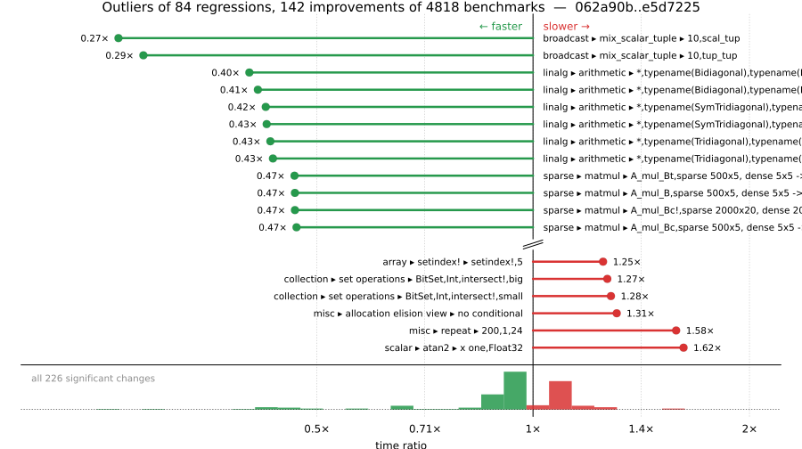

# Benchmark Report

## Summary

**4818** benchmarks were executed, **84** showed regressions, and **142** showed improvements.



## Job Properties

*Commit:* [JuliaLang/julia@e5d7225bad6a56ce52d08fb35bf4579da51ba6d1](https://github.com/JuliaLang/julia/commit/e5d7225bad6a56ce52d08fb35bf4579da51ba6d1)

*Comparison Range:* [link](https://github.com/JuliaLang/julia/compare/062a90bc8c2e393cddc52de58d1b373645ea88ee...e5d7225bad6a56ce52d08fb35bf4579da51ba6d1)

*Triggered By:* [link](https://github.com/JuliaLang/julia/commit/e5d7225bad6a56ce52d08fb35bf4579da51ba6d1#commitcomment-186331502)

*Tag Predicate:* `ALL`

*Daily Job:* 2026-05-23 vs [2026-05-19](../../2026-05/19/report.md)

## Results

*Note: If Chrome is your browser, I strongly recommend installing the [Wide GitHub](https://chrome.google.com/webstore/detail/wide-github/kaalofacklcidaampbokdplbklpeldpj?hl=en)
extension, which makes the result table easier to read.*

Below is a table of this job's results, obtained by running the benchmarks found in
[JuliaCI/BaseBenchmarks.jl](https://github.com/JuliaCI/BaseBenchmarks.jl). The values
listed in the `ID` column have the structure `[parent_group, child_group, ..., key]`,
and can be used to index into the BaseBenchmarks suite to retrieve the corresponding
benchmarks.

The percentages accompanying time and memory values in the below table are noise tolerances. The "true"
time/memory value for a given benchmark is expected to fall within this percentage of the reported value.

A ratio greater than `1.0` denotes a possible regression (marked with :x:), while a ratio less
than `1.0` denotes a possible improvement (marked with :white_check_mark:). Only significant results - results
that indicate possible regressions or improvements - are shown below (thus, an empty table means that all
benchmark results remained invariant between builds).

| ID | time ratio | memory ratio |
|----|------------|--------------|
| `["array", "bool", "bitarray_true_fill!"]` | 0.89 (5%) :white_check_mark: | 1.00 (1%)  |
| `["array", "equality", ("==", "UnitRange{Int64}")]` | 0.84 (5%) :white_check_mark: | 1.00 (1%)  |
| `["array", "equality", ("==", "Vector{Int16} == Vector{Int16}")]` | 1.07 (5%) :x: | 1.00 (1%)  |
| `["array", "equality", ("isequal", "UnitRange{Int64}")]` | 1.09 (5%) :x: | 1.00 (1%)  |
| `["array", "growth", ("push_multiple!", 8)]` | 1.10 (5%) :x: | 1.00 (1%)  |
| `["array", "setindex!", ("setindex!", 2)]` | 1.09 (5%) :x: | 1.00 (1%)  |
| `["array", "setindex!", ("setindex!", 4)]` | 1.05 (5%) :x: | 1.00 (1%)  |
| `["array", "setindex!", ("setindex!", 5)]` | 1.25 (5%) :x: | 1.00 (1%)  |
| `["broadcast", "mix_scalar_tuple", (10, "scal_tup")]` | 0.27 (5%) :white_check_mark: | 1.00 (1%)  |
| `["broadcast", "mix_scalar_tuple", (10, "tup_tup")]` | 0.29 (5%) :white_check_mark: | 1.00 (1%)  |
| `["broadcast", "typeargs", ("tuple", 10)]` | 0.73 (5%) :white_check_mark: | 1.00 (1%)  |
| `["collection", "set operations", ("BitSet", "Int", "intersect!", "big")]` | 1.27 (25%) :x: | 1.00 (1%)  |
| `["collection", "set operations", ("BitSet", "Int", "intersect!", "small")]` | 1.28 (25%) :x: | 1.00 (1%)  |
| `["dates", "accessor", "millisecond"]` | 1.18 (5%) :x: | 1.00 (1%)  |
| `["dates", "arithmetic", ("Date", "Day")]` | 0.91 (5%) :white_check_mark: | 1.00 (1%)  |
| `["dates", "arithmetic", ("DateTime", "Day")]` | 1.10 (5%) :x: | 1.00 (1%)  |
| `["dates", "arithmetic", ("DateTime", "Hour")]` | 0.91 (5%) :white_check_mark: | 1.00 (1%)  |
| `["dates", "arithmetic", ("DateTime", "Millisecond")]` | 0.91 (5%) :white_check_mark: | 1.00 (1%)  |
| `["dates", "arithmetic", ("DateTime", "Minute")]` | 0.91 (5%) :white_check_mark: | 1.00 (1%)  |
| `["dates", "arithmetic", ("DateTime", "Second")]` | 1.10 (5%) :x: | 1.00 (1%)  |
| `["find", "findall", ("Vector{Bool}", "10-90")]` | 1.19 (5%) :x: | 1.00 (1%)  |
| `["find", "findnext", ("ispos", "Vector{UInt8}")]` | 1.09 (5%) :x: | 1.00 (1%)  |
| `["find", "findprev", ("ispos", "Vector{Bool}")]` | 0.88 (5%) :white_check_mark: | 1.00 (1%)  |
| `["inference", "abstract interpretation", "many_local_vars"]` | 0.92 (5%) :white_check_mark: | 1.00 (1%)  |
| `["inference", "optimization", "many_local_vars"]` | 0.94 (5%) :white_check_mark: | 1.00 (1%)  |
| `["io", "serialization", ("serialize", "Matrix{Float64}")]` | 0.89 (5%) :white_check_mark: | 1.00 (1%)  |
| `["linalg", "arithmetic", ("*", "typename(Bidiagonal)", "typename(Bidiagonal)", 1024)]` | 0.41 (45%) :white_check_mark: | 1.00 (1%)  |
| `["linalg", "arithmetic", ("*", "typename(Bidiagonal)", "typename(Bidiagonal)", 256)]` | 0.40 (45%) :white_check_mark: | 1.00 (1%)  |
| `["linalg", "arithmetic", ("*", "typename(SymTridiagonal)", "typename(SymTridiagonal)", 1024)]` | 0.43 (45%) :white_check_mark: | 1.00 (1%)  |
| `["linalg", "arithmetic", ("*", "typename(SymTridiagonal)", "typename(SymTridiagonal)", 256)]` | 0.42 (45%) :white_check_mark: | 1.00 (1%)  |
| `["linalg", "arithmetic", ("*", "typename(Tridiagonal)", "typename(Tridiagonal)", 1024)]` | 0.43 (45%) :white_check_mark: | 1.00 (1%)  |
| `["linalg", "arithmetic", ("*", "typename(Tridiagonal)", "typename(Tridiagonal)", 256)]` | 0.43 (45%) :white_check_mark: | 1.00 (1%)  |
| `["misc", "23042", "ComplexF32"]` | 0.58 (5%) :white_check_mark: | 1.00 (1%)  |
| `["misc", "23042", "Float32"]` | 0.68 (5%) :white_check_mark: | 1.00 (1%)  |
| `["misc", "allocation elision view", "conditional"]` | 0.88 (5%) :white_check_mark: | 1.00 (1%)  |
| `["misc", "allocation elision view", "no conditional"]` | 1.31 (5%) :x: | 1.00 (1%)  |
| `["misc", "foldl", "foldl(+, filter(...); init = 0.0)"]` | 1.09 (5%) :x: | 1.00 (1%)  |
| `["misc", "iterators", "zip(1:1)"]` | 0.87 (5%) :white_check_mark: | 1.00 (1%)  |
| `["misc", "iterators", "zip(1:1, 1:1)"]` | 0.91 (5%) :white_check_mark: | 1.00 (1%)  |
| `["misc", "iterators", "zip(1:1, 1:1, 1:1, 1:1)"]` | 0.82 (5%) :white_check_mark: | 1.00 (1%)  |
| `["misc", "repeat", (200, 1, 24)]` | 1.58 (5%) :x: | 1.00 (1%)  |
| `["misc", "repeat", (200, 24, 1)]` | 0.68 (5%) :white_check_mark: | 1.00 (1%)  |
| `["misc", "splatting", (3, 3, 3)]` | 0.94 (5%) :white_check_mark: | 1.00 (1%)  |
| `["problem", "chaosgame", "chaosgame"]` | 0.91 (5%) :white_check_mark: | 1.00 (1%)  |
| `["scalar", "acos", ("0.5 <= abs(x) < 1", "negative argument", "Float64")]` | 1.05 (5%) :x: | 1.00 (1%)  |
| `["scalar", "acos", ("one", "negative argument", "Float32")]` | 1.17 (5%) :x: | 1.00 (1%)  |
| `["scalar", "acos", ("one", "negative argument", "Float64")]` | 1.12 (5%) :x: | 1.00 (1%)  |
| `["scalar", "acos", ("one", "positive argument", "Float32")]` | 1.17 (5%) :x: | 1.00 (1%)  |
| `["scalar", "acos", ("one", "positive argument", "Float64")]` | 1.12 (5%) :x: | 1.00 (1%)  |
| `["scalar", "acos", ("small", "negative argument", "Float32")]` | 0.90 (5%) :white_check_mark: | 1.00 (1%)  |
| `["scalar", "acos", ("small", "positive argument", "Float32")]` | 0.90 (5%) :white_check_mark: | 1.00 (1%)  |
| `["scalar", "acos", ("small", "positive argument", "Float64")]` | 0.90 (5%) :white_check_mark: | 1.00 (1%)  |
| `["scalar", "acos", ("zero", "Float32")]` | 0.90 (5%) :white_check_mark: | 1.00 (1%)  |
| `["scalar", "acos", ("zero", "Float64")]` | 0.90 (5%) :white_check_mark: | 1.00 (1%)  |
| `["scalar", "acosh", ("one", "Float32")]` | 1.12 (5%) :x: | 1.00 (1%)  |
| `["scalar", "acosh", ("one", "Float64")]` | 1.06 (5%) :x: | 1.00 (1%)  |
| `["scalar", "asin", ("one", "negative argument", "Float32")]` | 0.95 (5%) :white_check_mark: | 1.00 (1%)  |
| `["scalar", "asin", ("one", "negative argument", "Float64")]` | 0.95 (5%) :white_check_mark: | 1.00 (1%)  |
| `["scalar", "asin", ("one", "positive argument", "Float32")]` | 0.95 (5%) :white_check_mark: | 1.00 (1%)  |
| `["scalar", "asin", ("one", "positive argument", "Float64")]` | 0.95 (5%) :white_check_mark: | 1.00 (1%)  |
| `["scalar", "asin", ("small", "negative argument", "Float32")]` | 0.95 (5%) :white_check_mark: | 1.00 (1%)  |
| `["scalar", "asin", ("small", "negative argument", "Float64")]` | 0.95 (5%) :white_check_mark: | 1.00 (1%)  |
| `["scalar", "asin", ("small", "positive argument", "Float32")]` | 0.95 (5%) :white_check_mark: | 1.00 (1%)  |
| `["scalar", "asin", ("small", "positive argument", "Float64")]` | 0.95 (5%) :white_check_mark: | 1.00 (1%)  |
| `["scalar", "asin", ("zero", "Float32")]` | 0.95 (5%) :white_check_mark: | 1.00 (1%)  |
| `["scalar", "asin", ("zero", "Float64")]` | 0.95 (5%) :white_check_mark: | 1.00 (1%)  |
| `["scalar", "asinh", ("0 <= abs(x) < 2^-28", "negative argument", "Float32")]` | 0.93 (5%) :white_check_mark: | 1.00 (1%)  |
| `["scalar", "asinh", ("0 <= abs(x) < 2^-28", "positive argument", "Float32")]` | 0.93 (5%) :white_check_mark: | 1.00 (1%)  |
| `["scalar", "asinh", ("very small", "negative argument", "Float32")]` | 0.85 (5%) :white_check_mark: | 1.00 (1%)  |
| `["scalar", "asinh", ("very small", "positive argument", "Float32")]` | 0.85 (5%) :white_check_mark: | 1.00 (1%)  |
| `["scalar", "asinh", ("zero", "Float32")]` | 0.85 (5%) :white_check_mark: | 1.00 (1%)  |
| `["scalar", "atan", ("0 <= abs(x) < 7/16", "negative argument", "Float64")]` | 0.86 (5%) :white_check_mark: | 1.00 (1%)  |
| `["scalar", "atan", ("0 <= abs(x) < 7/16", "positive argument", "Float64")]` | 0.86 (5%) :white_check_mark: | 1.00 (1%)  |
| `["scalar", "atan", ("very large", "negative argument", "Float32")]` | 0.95 (5%) :white_check_mark: | 1.00 (1%)  |
| `["scalar", "atan", ("very large", "negative argument", "Float64")]` | 0.95 (5%) :white_check_mark: | 1.00 (1%)  |
| `["scalar", "atan", ("very large", "positive argument", "Float32")]` | 0.95 (5%) :white_check_mark: | 1.00 (1%)  |
| `["scalar", "atan", ("very large", "positive argument", "Float64")]` | 0.95 (5%) :white_check_mark: | 1.00 (1%)  |
| `["scalar", "atan", ("very small", "negative argument", "Float64")]` | 0.95 (5%) :white_check_mark: | 1.00 (1%)  |
| `["scalar", "atan", ("very small", "positive argument", "Float64")]` | 0.85 (5%) :white_check_mark: | 1.00 (1%)  |
| `["scalar", "atan", ("zero", "Float64")]` | 0.95 (5%) :white_check_mark: | 1.00 (1%)  |
| `["scalar", "atan2", ("x one", "Float32")]` | 1.62 (5%) :x: | 1.00 (1%)  |
| `["scalar", "atan2", ("x one", "Float64")]` | 0.56 (5%) :white_check_mark: | 1.00 (1%)  |
| `["scalar", "cbrt", ("large", "negative argument", "Float32")]` | 1.06 (5%) :x: | 1.00 (1%)  |
| `["scalar", "cbrt", ("large", "positive argument", "Float32")]` | 1.06 (5%) :x: | 1.00 (1%)  |
| `["scalar", "cbrt", ("zero", "Float32")]` | 1.06 (5%) :x: | 1.00 (1%)  |
| `["scalar", "cbrt", ("zero", "Float64")]` | 1.06 (5%) :x: | 1.00 (1%)  |
| `["scalar", "cos", ("argument reduction (easy) abs(x) < 4π/4", "positive argument", "Float64", "cos_kernel")]` | 1.07 (5%) :x: | 1.00 (1%)  |
| `["scalar", "cos", ("argument reduction (easy) abs(x) < 5π/4", "positive argument", "Float32", "cos_kernel")]` | 1.07 (5%) :x: | 1.00 (1%)  |
| `["scalar", "cos", ("argument reduction (easy) abs(x) < 5π/4", "positive argument", "Float64", "cos_kernel")]` | 1.07 (5%) :x: | 1.00 (1%)  |
| `["scalar", "cos", ("no reduction", "zero", "Float32")]` | 1.05 (5%) :x: | 1.00 (1%)  |
| `["scalar", "cos", ("no reduction", "zero", "Float64")]` | 1.05 (5%) :x: | 1.00 (1%)  |
| `["scalar", "cosh", ("0 <= abs(x) < 2.7755602085408512e-17", "negative argument", "Float64")]` | 0.95 (5%) :white_check_mark: | 1.00 (1%)  |
| `["scalar", "cosh", ("0 <= abs(x) < 2.7755602085408512e-17", "positive argument", "Float64")]` | 0.95 (5%) :white_check_mark: | 1.00 (1%)  |
| `["scalar", "cosh", ("very small", "negative argument", "Float64")]` | 0.95 (5%) :white_check_mark: | 1.00 (1%)  |
| `["scalar", "cosh", ("very small", "positive argument", "Float64")]` | 0.95 (5%) :white_check_mark: | 1.00 (1%)  |
| `["scalar", "cosh", ("zero", "Float64")]` | 0.95 (5%) :white_check_mark: | 1.00 (1%)  |
| `["scalar", "exp2", ("2pow127", "positive argument", "Float32")]` | 1.07 (5%) :x: | 1.00 (1%)  |
| `["scalar", "exp2", ("2pow3", "negative argument", "Float32")]` | 0.92 (5%) :white_check_mark: | 1.00 (1%)  |
| `["scalar", "exp2", ("2pow3", "positive argument", "Float32")]` | 0.92 (5%) :white_check_mark: | 1.00 (1%)  |
| `["scalar", "exp2", ("2pow35", "negative argument", "Float32")]` | 0.84 (5%) :white_check_mark: | 1.00 (1%)  |
| `["scalar", "exp2", ("2pow35", "positive argument", "Float32")]` | 0.88 (5%) :white_check_mark: | 1.00 (1%)  |
| `["scalar", "exp2", ("one", "Float32")]` | 0.92 (5%) :white_check_mark: | 1.00 (1%)  |
| `["scalar", "exp2", ("small", "negative argument", "Float32")]` | 0.92 (5%) :white_check_mark: | 1.00 (1%)  |
| `["scalar", "exp2", ("small", "positive argument", "Float32")]` | 0.92 (5%) :white_check_mark: | 1.00 (1%)  |
| `["scalar", "exp2", ("zero", "Float32")]` | 0.92 (5%) :white_check_mark: | 1.00 (1%)  |
| `["scalar", "expm1", ("huge", "positive argument", "Float3")]` | 1.06 (5%) :x: | 1.00 (1%)  |
| `["scalar", "expm1", ("huge", "positive argument", "Float64")]` | 1.05 (5%) :x: | 1.00 (1%)  |
| `["scalar", "expm1", ("large", "negative argument", "Float32")]` | 1.06 (5%) :x: | 1.00 (1%)  |
| `["scalar", "expm1", ("large", "negative argument", "Float64")]` | 1.05 (5%) :x: | 1.00 (1%)  |
| `["scalar", "expm1", ("large", "positive argument", "Float32")]` | 1.06 (5%) :x: | 1.00 (1%)  |
| `["scalar", "expm1", ("large", "positive argument", "Float64")]` | 1.06 (5%) :x: | 1.00 (1%)  |
| `["scalar", "expm1", ("medium", "negative argument", "Float32")]` | 1.06 (5%) :x: | 1.00 (1%)  |
| `["scalar", "expm1", ("medium", "negative argument", "Float64")]` | 1.05 (5%) :x: | 1.00 (1%)  |
| `["scalar", "expm1", ("medium", "positive argument", "Float32")]` | 1.06 (5%) :x: | 1.00 (1%)  |
| `["scalar", "fastmath", "13786"]` | 1.11 (5%) :x: | 1.00 (1%)  |
| `["scalar", "mod2pi", ("argument reduction (easy) abs(x) < 5π/4", "positive argument", "Float64")]` | 0.95 (5%) :white_check_mark: | 1.00 (1%)  |
| `["scalar", "mod2pi", ("argument reduction (easy) abs(x) < 6π/4", "positive argument", "Float64")]` | 0.95 (5%) :white_check_mark: | 1.00 (1%)  |
| `["scalar", "mod2pi", ("argument reduction (easy) abs(x) < 7π/4", "positive argument", "Float64")]` | 0.95 (5%) :white_check_mark: | 1.00 (1%)  |
| `["scalar", "mod2pi", ("argument reduction (easy) abs(x) < 8π/4", "positive argument", "Float64")]` | 0.95 (5%) :white_check_mark: | 1.00 (1%)  |
| `["scalar", "mod2pi", ("argument reduction (hard) abs(x) < 6π/4", "positive argument", "Float64")]` | 0.95 (5%) :white_check_mark: | 1.00 (1%)  |
| `["scalar", "mod2pi", ("no reduction", "positive argument", "Float64")]` | 0.95 (5%) :white_check_mark: | 1.00 (1%)  |
| `["scalar", "mod2pi", ("no reduction", "zero", "Float64")]` | 0.95 (5%) :white_check_mark: | 1.00 (1%)  |
| `["scalar", "rem_pio2", ("argument reduction (easy) abs(x) < 2π/4", "negative argument", "Float64")]` | 1.05 (5%) :x: | 1.00 (1%)  |
| `["scalar", "rem_pio2", ("argument reduction (easy) abs(x) < 2π/4", "positive argument", "Float64")]` | 1.11 (5%) :x: | 1.00 (1%)  |
| `["scalar", "rem_pio2", ("argument reduction (easy) abs(x) < 3π/4", "negative argument", "Float64")]` | 1.05 (5%) :x: | 1.00 (1%)  |
| `["scalar", "rem_pio2", ("argument reduction (easy) abs(x) < 3π/4", "positive argument", "Float64")]` | 1.11 (5%) :x: | 1.00 (1%)  |
| `["scalar", "rem_pio2", ("argument reduction (easy) abs(x) < 4π/4", "positive argument", "Float64")]` | 1.18 (5%) :x: | 1.00 (1%)  |
| `["scalar", "rem_pio2", ("argument reduction (easy) abs(x) < 5π/4", "positive argument", "Float64")]` | 1.18 (5%) :x: | 1.00 (1%)  |
| `["scalar", "rem_pio2", ("argument reduction (easy) abs(x) < 6π/4", "positive argument", "Float64")]` | 0.91 (5%) :white_check_mark: | 1.00 (1%)  |
| `["scalar", "rem_pio2", ("argument reduction (easy) abs(x) < 7π/4", "positive argument", "Float64")]` | 0.91 (5%) :white_check_mark: | 1.00 (1%)  |
| `["scalar", "rem_pio2", ("argument reduction (easy) abs(x) < 8π/4", "negative argument", "Float64")]` | 0.90 (5%) :white_check_mark: | 1.00 (1%)  |
| `["scalar", "rem_pio2", ("argument reduction (easy) abs(x) < 9π/4", "negative argument", "Float64")]` | 0.90 (5%) :white_check_mark: | 1.00 (1%)  |
| `["scalar", "sin", ("argument reduction (easy) abs(x) < 2π/4", "negative argument", "Float64", "cos_kernel")]` | 0.94 (5%) :white_check_mark: | 1.00 (1%)  |
| `["scalar", "sin", ("argument reduction (easy) abs(x) < 2π/4", "positive argument", "Float64", "cos_kernel")]` | 0.94 (5%) :white_check_mark: | 1.00 (1%)  |
| `["scalar", "sin", ("argument reduction (easy) abs(x) < 3π/4", "negative argument", "Float64", "cos_kernel")]` | 0.94 (5%) :white_check_mark: | 1.00 (1%)  |
| `["scalar", "sin", ("argument reduction (easy) abs(x) < 3π/4", "positive argument", "Float64", "cos_kernel")]` | 0.94 (5%) :white_check_mark: | 1.00 (1%)  |
| `["scalar", "sin", ("argument reduction (easy) abs(x) < 4π/4", "negative argument", "Float64", "sin_kernel")]` | 0.94 (5%) :white_check_mark: | 1.00 (1%)  |
| `["scalar", "sin", ("argument reduction (easy) abs(x) < 4π/4", "positive argument", "Float64", "sin_kernel")]` | 0.91 (5%) :white_check_mark: | 1.00 (1%)  |
| `["scalar", "sin", ("argument reduction (easy) abs(x) < 5π/4", "negative argument", "Float64", "sin_kernel")]` | 0.94 (5%) :white_check_mark: | 1.00 (1%)  |
| `["scalar", "sin", ("argument reduction (easy) abs(x) < 5π/4", "positive argument", "Float64", "sin_kernel")]` | 0.91 (5%) :white_check_mark: | 1.00 (1%)  |
| `["scalar", "sin", ("argument reduction (easy) abs(x) < 8π/4", "positive argument", "Float64", "sin_kernel")]` | 0.94 (5%) :white_check_mark: | 1.00 (1%)  |
| `["scalar", "sin", ("argument reduction (easy) abs(x) < 9π/4", "positive argument", "Float64", "sin_kernel")]` | 0.94 (5%) :white_check_mark: | 1.00 (1%)  |
| `["scalar", "sin", ("no reduction", "negative argument", "Float32", "sin_kernel")]` | 1.05 (5%) :x: | 1.00 (1%)  |
| `["scalar", "sin", ("no reduction", "positive argument", "Float32", "sin_kernel")]` | 1.05 (5%) :x: | 1.00 (1%)  |
| `["scalar", "sin", ("no reduction", "zero", "Float64")]` | 0.95 (5%) :white_check_mark: | 1.00 (1%)  |
| `["scalar", "sinh", ("0 <= abs(x) < 2f-12", "negative argument", "Float32")]` | 1.12 (5%) :x: | 1.00 (1%)  |
| `["scalar", "sinh", ("0 <= abs(x) < 2f-12", "positive argument", "Float32")]` | 1.12 (5%) :x: | 1.00 (1%)  |
| `["scalar", "sinh", ("very large", "negative argument", "Float32")]` | 0.92 (5%) :white_check_mark: | 1.00 (1%)  |
| `["scalar", "sinh", ("very large", "positive argument", "Float32")]` | 0.92 (5%) :white_check_mark: | 1.00 (1%)  |
| `["scalar", "sinh", ("zero", "Float32")]` | 1.12 (5%) :x: | 1.00 (1%)  |
| `["scalar", "tan", ("large", "negative argument", "Float32")]` | 0.93 (5%) :white_check_mark: | 1.00 (1%)  |
| `["scalar", "tan", ("large", "positive argument", "Float32")]` | 0.92 (5%) :white_check_mark: | 1.00 (1%)  |
| `["scalar", "tan", ("medium", "negative argument", "Float32")]` | 0.95 (5%) :white_check_mark: | 1.00 (1%)  |
| `["scalar", "tan", ("small", "negative argument", "Float32")]` | 1.06 (5%) :x: | 1.00 (1%)  |
| `["scalar", "tan", ("small", "negative argument", "Float64")]` | 0.95 (5%) :white_check_mark: | 1.00 (1%)  |
| `["scalar", "tan", ("small", "positive argument", "Float32")]` | 1.06 (5%) :x: | 1.00 (1%)  |
| `["scalar", "tan", ("small", "positive argument", "Float64")]` | 0.95 (5%) :white_check_mark: | 1.00 (1%)  |
| `["scalar", "tan", ("very small", "negative argument", "Float32")]` | 1.06 (5%) :x: | 1.00 (1%)  |
| `["scalar", "tan", ("very small", "negative argument", "Float64")]` | 0.95 (5%) :white_check_mark: | 1.00 (1%)  |
| `["scalar", "tan", ("very small", "positive argument", "Float32")]` | 1.06 (5%) :x: | 1.00 (1%)  |
| `["scalar", "tan", ("very small", "positive argument", "Float64")]` | 0.95 (5%) :white_check_mark: | 1.00 (1%)  |
| `["scalar", "tan", ("zero", "Float32")]` | 1.06 (5%) :x: | 1.00 (1%)  |
| `["scalar", "tan", ("zero", "Float64")]` | 0.95 (5%) :white_check_mark: | 1.00 (1%)  |
| `["scalar", "tanh", ("very large", "negative argument", "Float64")]` | 1.13 (5%) :x: | 1.00 (1%)  |
| `["scalar", "tanh", ("very large", "positive argument", "Float64")]` | 1.13 (5%) :x: | 1.00 (1%)  |
| `["sort", "length = 10", "all same"]` | 1.22 (20%) :x: | 1.00 (1%)  |
| `["sparse", "matmul", ("A_mul_B!", "sparse 4000x40, dense 40x40 -> dense 4000x40")]` | 0.49 (30%) :white_check_mark: | 1.00 (1%)  |
| `["sparse", "matmul", ("A_mul_B", "sparse 500x5, dense 5x5 -> dense 500x5")]` | 0.47 (30%) :white_check_mark: | 1.00 (1%)  |
| `["sparse", "matmul", ("A_mul_B", "sparse 500x50, dense 50x5 -> dense 500x5")]` | 0.68 (30%) :white_check_mark: | 1.00 (1%)  |
| `["sparse", "matmul", ("A_mul_B", "sparse 50x5, dense 5x50 -> dense 50x50")]` | 0.66 (30%) :white_check_mark: | 1.00 (1%)  |
| `["sparse", "matmul", ("A_mul_Bc!", "sparse 2000x20, dense 20x20 -> dense 2000x20")]` | 0.47 (30%) :white_check_mark: | 1.00 (1%)  |
| `["sparse", "matmul", ("A_mul_Bc", "sparse 500x5, dense 5x5 -> dense 500x5")]` | 0.47 (30%) :white_check_mark: | 1.00 (1%)  |
| `["sparse", "matmul", ("A_mul_Bc", "sparse 500x50, dense 5x50 -> dense 500x5")]` | 0.67 (30%) :white_check_mark: | 1.00 (1%)  |
| `["sparse", "matmul", ("A_mul_Bc", "sparse 50x5, dense 50x5 -> dense 50x50")]` | 0.67 (30%) :white_check_mark: | 1.00 (1%)  |
| `["sparse", "matmul", ("A_mul_Bt!", "sparse 4000x40, dense 40x40 -> dense 4000x40")]` | 0.49 (30%) :white_check_mark: | 1.00 (1%)  |
| `["sparse", "matmul", ("A_mul_Bt", "sparse 500x5, dense 5x5 -> dense 500x5")]` | 0.47 (30%) :white_check_mark: | 1.00 (1%)  |
| `["sparse", "matmul", ("A_mul_Bt", "sparse 500x50, dense 5x50 -> dense 500x5")]` | 0.67 (30%) :white_check_mark: | 1.00 (1%)  |
| `["sparse", "matmul", ("A_mul_Bt", "sparse 50x5, dense 50x5 -> dense 50x50")]` | 0.67 (30%) :white_check_mark: | 1.00 (1%)  |
| `["sparse", "matmul", ("Ac_mul_Bc", "sparse 5x500, dense 5x5 -> dense 500x5")]` | 0.70 (30%) :white_check_mark: | 1.00 (1%)  |
| `["tuple", "linear algebra", ("matvec", "(8, 8)", "(8,)")]` | 1.07 (5%) :x: | 1.00 (1%)  |
| `["tuple", "misc", "11899"]` | 1.10 (5%) :x: | 1.00 (1%)  |
| `["tuple", "misc", "longtuple"]` | 0.94 (5%) :white_check_mark: | 1.00 (1%)  |
| `["tuple", "reduction", ("minimum", "(16,)")]` | 1.07 (5%) :x: | 1.00 (1%)  |
| `["tuple", "reduction", ("minimum", "(8,)")]` | 1.08 (5%) :x: | 1.00 (1%)  |
| `["tuple", "reduction", ("sum", "(2,)")]` | 0.93 (5%) :white_check_mark: | 1.00 (1%)  |
| `["tuple", "reduction", ("sumabs", "(2,)")]` | 1.07 (5%) :x: | 1.00 (1%)  |
| `["union", "array", ("broadcast", "*", "ComplexF64", "(false, true)")]` | 0.94 (5%) :white_check_mark: | 1.00 (1%)  |
| `["union", "array", ("broadcast", "*", "Float32", "(false, true)")]` | 0.94 (5%) :white_check_mark: | 1.00 (1%)  |
| `["union", "array", ("broadcast", "*", "Float32", "(true, true)")]` | 0.94 (5%) :white_check_mark: | 1.00 (1%)  |
| `["union", "array", ("broadcast", "*", "Float64", "(false, true)")]` | 0.94 (5%) :white_check_mark: | 1.00 (1%)  |
| `["union", "array", ("broadcast", "*", "Float64", "(true, true)")]` | 0.95 (5%) :white_check_mark: | 1.00 (1%)  |
| `["union", "array", ("broadcast", "abs", "BigFloat", 0)]` | 0.95 (5%) :white_check_mark: | 1.00 (1%)  |
| `["union", "array", ("broadcast", "identity", "Float32", 0)]` | 0.94 (5%) :white_check_mark: | 1.00 (1%)  |
| `["union", "array", ("broadcast", "identity", "Float32", 1)]` | 1.07 (5%) :x: | 1.00 (1%)  |
| `["union", "array", ("collect", "all", "Bool", 1)]` | 0.89 (5%) :white_check_mark: | 1.00 (1%)  |
| `["union", "array", ("collect", "filter", "BigInt", 1)]` | 1.08 (5%) :x: | 1.00 (1%)  |
| `["union", "array", ("map", "*", "ComplexF64", "(false, true)")]` | 1.08 (5%) :x: | 1.00 (1%)  |
| `["union", "array", ("map", "*", "Float32", "(false, true)")]` | 0.94 (5%) :white_check_mark: | 1.00 (1%)  |
| `["union", "array", ("map", "abs", "BigFloat", 0)]` | 0.93 (5%) :white_check_mark: | 1.00 (1%)  |
| `["union", "array", ("map", "abs", "Bool", 1)]` | 1.12 (5%) :x: | 1.00 (1%)  |
| `["union", "array", ("map", "abs", "Float64", 1)]` | 0.92 (5%) :white_check_mark: | 1.00 (1%)  |
| `["union", "array", ("map", "identity", "Bool", 1)]` | 0.89 (5%) :white_check_mark: | 1.00 (1%)  |
| `["union", "array", ("perf_binaryop", "*", "Bool", "(false, true)")]` | 1.05 (5%) :x: | 1.00 (1%)  |
| `["union", "array", ("perf_binaryop", "*", "Bool", "(true, true)")]` | 0.93 (5%) :white_check_mark: | 1.00 (1%)  |
| `["union", "array", ("perf_binaryop", "*", "Float64", "(false, true)")]` | 0.94 (5%) :white_check_mark: | 1.00 (1%)  |
| `["union", "array", ("perf_binaryop", "*", "Float64", "(true, true)")]` | 0.87 (5%) :white_check_mark: | 1.00 (1%)  |
| `["union", "array", ("perf_binaryop", "*", "Int8", "(false, true)")]` | 1.15 (5%) :x: | 1.00 (1%)  |
| `["union", "array", ("perf_binaryop", "*", "Int8", "(true, true)")]` | 1.11 (5%) :x: | 1.00 (1%)  |
| `["union", "array", ("perf_countequals", "BigInt")]` | 0.92 (5%) :white_check_mark: | 1.00 (1%)  |
| `["union", "array", ("perf_simplecopy", "BigFloat", 1)]` | 1.07 (5%) :x: | 1.00 (1%)  |
| `["union", "array", ("perf_simplecopy", "Bool", 1)]` | 1.13 (5%) :x: | 1.00 (1%)  |
| `["union", "array", ("perf_simplecopy", "Float64", 1)]` | 0.84 (5%) :white_check_mark: | 1.00 (1%)  |
| `["union", "array", ("perf_sum", "Int8", 0)]` | 1.09 (5%) :x: | 1.00 (1%)  |
| `["union", "array", ("perf_sum2", "BigInt", 0)]` | 0.95 (5%) :white_check_mark: | 1.00 (1%)  |
| `["union", "array", ("perf_sum2", "Int8", 0)]` | 1.07 (5%) :x: | 1.00 (1%)  |
| `["union", "array", ("perf_sum4", "Int8", 0)]` | 1.09 (5%) :x: | 1.00 (1%)  |
| `["union", "array", ("skipmissing", "filter", "Float32", 0)]` | 1.05 (5%) :x: | 1.00 (1%)  |
| `["union", "array", ("skipmissing", "filter", "Union{Missing, Float32}", 1)]` | 0.90 (5%) :white_check_mark: | 1.00 (1%)  |
| `["union", "array", ("skipmissing", "filter", "Union{Missing, Float64}", 1)]` | 1.14 (5%) :x: | 1.00 (1%)  |
| `["union", "array", ("skipmissing", "perf_sumskipmissing", "BigInt", 0)]` | 0.94 (5%) :white_check_mark: | 1.00 (1%)  |
| `["union", "array", ("skipmissing", "perf_sumskipmissing", "Int8", 0)]` | 0.91 (5%) :white_check_mark: | 1.00 (1%)  |
| `["union", "array", ("skipmissing", "perf_sumskipmissing", "Union{Missing, Bool}", 1)]` | 1.07 (5%) :x: | 1.00 (1%)  |
| `["union", "array", ("skipmissing", "perf_sumskipmissing", "Union{Missing, Float32}", 1)]` | 1.08 (5%) :x: | 1.00 (1%)  |
| `["union", "array", ("sort", "BigInt", 0)]` | 0.94 (5%) :white_check_mark: | 1.00 (1%)  |
| `["union", "array", ("sort", "Union{Nothing, BigInt}", 0)]` | 0.94 (5%) :white_check_mark: | 1.00 (1%)  |
| `["union", "array", ("sort", "Union{Nothing, Int64}", 0)]` | 0.92 (5%) :white_check_mark: | 1.00 (1%)  |

## Benchmark Group List

Here's a list of all the benchmark groups executed by this job:

- `["alloc"]`
- `["array", "accumulate"]`
- `["array", "any/all"]`
- `["array", "bool"]`
- `["array", "cat"]`
- `["array", "comprehension"]`
- `["array", "convert"]`
- `["array", "equality"]`
- `["array", "growth"]`
- `["array", "index"]`
- `["array", "reductions"]`
- `["array", "reverse"]`
- `["array", "setindex!"]`
- `["array", "subarray"]`
- `["broadcast"]`
- `["broadcast", "dotop"]`
- `["broadcast", "fusion"]`
- `["broadcast", "mix_scalar_tuple"]`
- `["broadcast", "sparse"]`
- `["broadcast", "typeargs"]`
- `["collection", "deletion"]`
- `["collection", "initialization"]`
- `["collection", "iteration"]`
- `["collection", "optimizations"]`
- `["collection", "queries & updates"]`
- `["collection", "set operations"]`
- `["dates", "accessor"]`
- `["dates", "arithmetic"]`
- `["dates", "construction"]`
- `["dates", "conversion"]`
- `["dates", "parse"]`
- `["dates", "query"]`
- `["dates", "string"]`
- `["find", "findall"]`
- `["find", "findnext"]`
- `["find", "findprev"]`
- `["frontend"]`
- `["inference", "abstract interpretation"]`
- `["inference", "allinference"]`
- `["inference", "optimization"]`
- `["io", "array_limit"]`
- `["io", "read"]`
- `["io", "serialization"]`
- `["io"]`
- `["linalg", "arithmetic"]`
- `["linalg", "blas"]`
- `["linalg", "factorization"]`
- `["linalg"]`
- `["micro"]`
- `["misc"]`
- `["misc", "23042"]`
- `["misc", "afoldl"]`
- `["misc", "allocation elision view"]`
- `["misc", "bitshift"]`
- `["misc", "foldl"]`
- `["misc", "issue 12165"]`
- `["misc", "iterators"]`
- `["misc", "julia"]`
- `["misc", "parse"]`
- `["misc", "repeat"]`
- `["misc", "splatting"]`
- `["problem", "chaosgame"]`
- `["problem", "fem"]`
- `["problem", "go"]`
- `["problem", "grigoriadis khachiyan"]`
- `["problem", "imdb"]`
- `["problem", "json"]`
- `["problem", "laplacian"]`
- `["problem", "monte carlo"]`
- `["problem", "raytrace"]`
- `["problem", "seismic"]`
- `["problem", "simplex"]`
- `["problem", "spellcheck"]`
- `["problem", "stockcorr"]`
- `["problem", "ziggurat"]`
- `["random", "collections"]`
- `["random", "randstring"]`
- `["random", "ranges"]`
- `["random", "sequences"]`
- `["random", "types"]`
- `["scalar", "acos"]`
- `["scalar", "acosh"]`
- `["scalar", "arithmetic"]`
- `["scalar", "asin"]`
- `["scalar", "asinh"]`
- `["scalar", "atan"]`
- `["scalar", "atan2"]`
- `["scalar", "atanh"]`
- `["scalar", "cbrt"]`
- `["scalar", "cos"]`
- `["scalar", "cosh"]`
- `["scalar", "exp2"]`
- `["scalar", "expm1"]`
- `["scalar", "fastmath"]`
- `["scalar", "floatexp"]`
- `["scalar", "intfuncs"]`
- `["scalar", "iteration"]`
- `["scalar", "mod2pi"]`
- `["scalar", "predicate"]`
- `["scalar", "rem_pio2"]`
- `["scalar", "sin"]`
- `["scalar", "sincos"]`
- `["scalar", "sinh"]`
- `["scalar", "tan"]`
- `["scalar", "tanh"]`
- `["shootout"]`
- `["simd"]`
- `["sort", "insertionsort"]`
- `["sort", "issorted"]`
- `["sort", "issues"]`
- `["sort", "length = 10"]`
- `["sort", "length = 100"]`
- `["sort", "length = 1000"]`
- `["sort", "length = 10000"]`
- `["sort", "length = 3"]`
- `["sort", "length = 30"]`
- `["sort", "mergesort"]`
- `["sort", "quicksort"]`
- `["sparse", "arithmetic"]`
- `["sparse", "constructors"]`
- `["sparse", "index"]`
- `["sparse", "matmul"]`
- `["sparse", "sparse matvec"]`
- `["sparse", "sparse solves"]`
- `["sparse", "transpose"]`
- `["string", "==(::AbstractString, ::AbstractString)"]`
- `["string", "==(::SubString, ::String)"]`
- `["string", "findfirst"]`
- `["string"]`
- `["string", "readuntil"]`
- `["string", "repeat"]`
- `["tuple", "index"]`
- `["tuple", "linear algebra"]`
- `["tuple", "misc"]`
- `["tuple", "reduction"]`
- `["union", "array"]`

## Version Info

#### Primary Build

```
Julia Version 1.14.0-DEV.2225
Build Info:
  Commit e5d7225bad (2026-05-23 03:09 UTC)
  GC: Built with stock GC
  Sysimage: native (x86_64-linux-gnu)
Platform Info:
  OS: Linux (x86_64-unknown-linux-gnu)
      Ubuntu 22.04.5 LTS
  uname: Linux 5.15.0-174-generic #184-Ubuntu SMP Fri Mar 13 18:41:50 UTC 2026 x86_64 x86_64
  CPU: Intel(R) Xeon(R) CPU E3-1241 v3 @ 3.50GHz (haswell):
              speed         user         nice          sys         idle          irq
       #1  3767 MHz      48521 s         22 s      12815 s    4350510 s          0 s  
       #2  3897 MHz     528466 s         11 s      13271 s    3876077 s          0 s  
       #3  3899 MHz      30399 s         19 s       5312 s    4369079 s          0 s  
       #4  3709 MHz      29878 s          9 s       5912 s    4381866 s          0 s  
  Memory: 31.301368713378906 GiB (26953.1328125 MiB free)
  Uptime: 4.42308432e6 sec
  Load Avg:  1.19  1.06  1.02
  WORD_SIZE: 64
  LLVM: libLLVM-21.1.8 (ORCJIT, haswell)
Threads: 1 default, 1 interactive, 1 GC (on 4 virtual cores)

```

#### Nanosoldier
Nanosoldier commit: [`97af47c`](https://github.com/JuliaCI/Nanosoldier.jl/commit/97af47cb08d526629aa6f0680adb28fd8a94079b)
