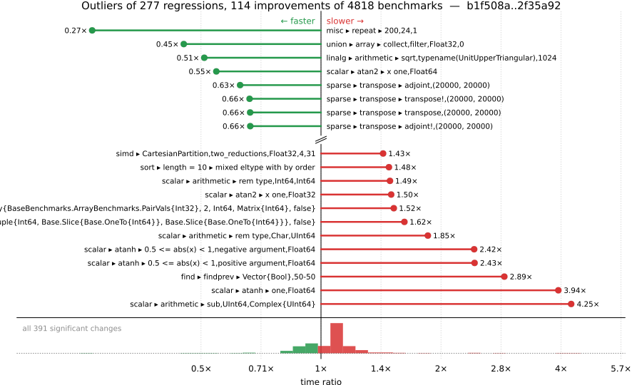

# Benchmark Report

## Summary

**4818** benchmarks were executed, **277** showed regressions, and **114** showed improvements.



## Job Properties

*Commit:* [JuliaLang/julia@2f35a920f04cfe7a3c9948c5f919159b17e75df4](https://github.com/JuliaLang/julia/commit/2f35a920f04cfe7a3c9948c5f919159b17e75df4)

*Comparison Range:* [link](https://github.com/JuliaLang/julia/compare/b1f508aceff4861e4fdc164b8e78e2a20791bec1...2f35a920f04cfe7a3c9948c5f919159b17e75df4)

*Triggered By:* [link](https://github.com/JuliaLang/julia/commit/2f35a920f04cfe7a3c9948c5f919159b17e75df4#commitcomment-192969017)

*Tag Predicate:* `ALL`

*Daily Job:* 2026-07-19 vs [2026-07-12](../../2026-07/12/report.md)

## Results

*Note: If Chrome is your browser, I strongly recommend installing the [Wide GitHub](https://chrome.google.com/webstore/detail/wide-github/kaalofacklcidaampbokdplbklpeldpj?hl=en)
extension, which makes the result table easier to read.*

Below is a table of this job's results, obtained by running the benchmarks found in
[JuliaCI/BaseBenchmarks.jl](https://github.com/JuliaCI/BaseBenchmarks.jl). The values
listed in the `ID` column have the structure `[parent_group, child_group, ..., key]`,
and can be used to index into the BaseBenchmarks suite to retrieve the corresponding
benchmarks.

The percentages accompanying time and memory values in the below table are noise tolerances. The "true"
time/memory value for a given benchmark is expected to fall within this percentage of the reported value.

A ratio greater than `1.0` denotes a possible regression (marked with :x:), while a ratio less
than `1.0` denotes a possible improvement (marked with :white_check_mark:). Only significant results - results
that indicate possible regressions or improvements - are shown below (thus, an empty table means that all
benchmark results remained invariant between builds).

| ID | time ratio | memory ratio |
|----|------------|--------------|
| `["alloc", "arrays"]` | 1.15 (5%) :x: | 1.00 (1%)  |
| `["alloc", "grow_array"]` | 1.05 (5%) :x: | 1.00 (1%)  |
| `["alloc", "strings"]` | 0.83 (5%) :white_check_mark: | 1.00 (1%)  |
| `["alloc", "structs"]` | 1.15 (5%) :x: | 1.00 (1%)  |
| `["array", "bool", "bitarray_true_fill!"]` | 1.14 (5%) :x: | 1.00 (1%)  |
| `["array", "bool", "boolarray_true_load!"]` | 0.95 (5%) :white_check_mark: | 1.00 (1%)  |
| `["array", "cat", ("catnd", 5)]` | 1.10 (5%) :x: | 1.00 (1%)  |
| `["array", "growth", ("push_single!", 256)]` | 0.94 (5%) :white_check_mark: | 1.00 (1%)  |
| `["array", "growth", ("push_single!", 8)]` | 0.95 (5%) :white_check_mark: | 1.00 (1%)  |
| `["array", "index", ("sumvector", "Base.ReinterpretArray{BaseBenchmarks.ArrayBenchmarks.PairVals{Int32}, 2, Int64, Matrix{Int64}, false}")]` | 1.52 (50%) :x: | 1.00 (1%)  |
| `["array", "index", ("sumvector", "SubArray{Int32, 2, BaseBenchmarks.ArrayBenchmarks.ArrayLS{Int32, 3}, Tuple{Int64, Base.Slice{Base.OneTo{Int64}}, Base.Slice{Base.OneTo{Int64}}}, false}")]` | 1.62 (50%) :x: | 1.00 (1%)  |
| `["array", "reverse", "rev_load_slow!"]` | 0.88 (5%) :white_check_mark: | 1.00 (1%)  |
| `["array", "setindex!", ("setindex!", 1)]` | 1.26 (5%) :x: | 1.00 (1%)  |
| `["array", "setindex!", ("setindex!", 2)]` | 1.13 (5%) :x: | 1.00 (1%)  |
| `["array", "setindex!", ("setindex!", 3)]` | 1.26 (5%) :x: | 1.00 (1%)  |
| `["array", "setindex!", ("setindex!", 4)]` | 1.10 (5%) :x: | 1.00 (1%)  |
| `["array", "setindex!", ("setindex!", 5)]` | 0.93 (5%) :white_check_mark: | 1.00 (1%)  |
| `["array", "subarray", ("lucompletepivCopy!", 100)]` | 1.06 (5%) :x: | 1.00 (1%)  |
| `["array", "subarray", ("lucompletepivCopy!", 1000)]` | 1.09 (5%) :x: | 1.00 (1%)  |
| `["array", "subarray", ("lucompletepivCopy!", 250)]` | 1.07 (5%) :x: | 1.00 (1%)  |
| `["array", "subarray", ("lucompletepivCopy!", 500)]` | 1.07 (5%) :x: | 1.00 (1%)  |
| `["array", "subarray", ("lucompletepivSub!", 100)]` | 1.06 (5%) :x: | 1.00 (1%)  |
| `["array", "subarray", ("lucompletepivSub!", 1000)]` | 1.08 (5%) :x: | 1.00 (1%)  |
| `["array", "subarray", ("lucompletepivSub!", 250)]` | 1.07 (5%) :x: | 1.00 (1%)  |
| `["array", "subarray", ("lucompletepivSub!", 500)]` | 1.07 (5%) :x: | 1.00 (1%)  |
| `["broadcast", "dotop", ("Float64", "(1000, 1000)", 2)]` | 0.86 (5%) :white_check_mark: | 1.00 (1%)  |
| `["broadcast", "dotop", ("Float64", "(1000000,)", 1)]` | 0.95 (5%) :white_check_mark: | 1.00 (1%)  |
| `["broadcast", "dotop", ("Float64", "(1000000,)", 2)]` | 0.92 (5%) :white_check_mark: | 1.00 (1%)  |
| `["broadcast", "fusion", ("Float64", "(1000000,)", 1)]` | 1.06 (5%) :x: | 1.00 (1%)  |
| `["broadcast", "fusion", ("Float64", "(1000000,)", 2)]` | 1.05 (5%) :x: | 1.00 (1%)  |
| `["broadcast", "mix_scalar_tuple", (10, "scal_tup")]` | 1.08 (5%) :x: | 1.00 (1%)  |
| `["broadcast", "mix_scalar_tuple", (5, "scal_tup")]` | 1.09 (5%) :x: | 1.00 (1%)  |
| `["broadcast", "sparse", ("(10000000,)", 2)]` | 1.08 (5%) :x: | 1.00 (1%)  |
| `["broadcast", "typeargs", ("array", 10)]` | 1.13 (5%) :x: | 1.00 (1%)  |
| `["broadcast", "typeargs", ("array", 3)]` | 1.19 (5%) :x: | 1.00 (1%)  |
| `["broadcast", "typeargs", ("array", 5)]` | 1.20 (5%) :x: | 1.00 (1%)  |
| `["collection", "initialization", ("Dict", "Any", "iterator")]` | 1.30 (25%) :x: | 1.00 (1%)  |
| `["dates", "arithmetic", ("Date", "Day")]` | 1.10 (5%) :x: | 1.00 (1%)  |
| `["dates", "arithmetic", ("DateTime", "Hour")]` | 1.10 (5%) :x: | 1.00 (1%)  |
| `["dates", "arithmetic", ("DateTime", "Minute")]` | 1.10 (5%) :x: | 1.00 (1%)  |
| `["dates", "arithmetic", ("DateTime", "Second")]` | 0.91 (5%) :white_check_mark: | 1.00 (1%)  |
| `["dates", "conversion", "Date -> DateTime"]` | 1.10 (5%) :x: | 1.00 (1%)  |
| `["find", "findall", ("> q0.5", "Vector{Float32}")]` | 0.93 (5%) :white_check_mark: | 1.00 (1%)  |
| `["find", "findall", ("BitVector", "90-10")]` | 0.94 (5%) :white_check_mark: | 1.00 (1%)  |
| `["find", "findall", ("ispos", "Vector{Float32}")]` | 0.94 (5%) :white_check_mark: | 1.00 (1%)  |
| `["find", "findall", ("ispos", "Vector{Float64}")]` | 0.93 (5%) :white_check_mark: | 1.00 (1%)  |
| `["find", "findall", ("ispos", "Vector{Int64}")]` | 0.93 (5%) :white_check_mark: | 1.00 (1%)  |
| `["find", "findnext", ("ispos", "Vector{Float32}")]` | 1.05 (5%) :x: | 1.00 (1%)  |
| `["find", "findnext", ("ispos", "Vector{Float64}")]` | 1.14 (5%) :x: | 1.00 (1%)  |
| `["find", "findnext", ("ispos", "Vector{Int8}")]` | 1.06 (5%) :x: | 1.00 (1%)  |
| `["find", "findnext", ("ispos", "Vector{UInt8}")]` | 1.10 (5%) :x: | 1.00 (1%)  |
| `["find", "findprev", ("Vector{Bool}", "50-50")]` | 2.89 (5%) :x: | 1.00 (1%)  |
| `["find", "findprev", ("ispos", "Vector{Bool}")]` | 1.06 (5%) :x: | 1.00 (1%)  |
| `["find", "findprev", ("ispos", "Vector{Float32}")]` | 1.09 (5%) :x: | 1.00 (1%)  |
| `["find", "findprev", ("ispos", "Vector{Float64}")]` | 1.08 (5%) :x: | 1.00 (1%)  |
| `["find", "findprev", ("ispos", "Vector{Int8}")]` | 1.08 (5%) :x: | 1.00 (1%)  |
| `["find", "findprev", ("ispos", "Vector{UInt64}")]` | 1.09 (5%) :x: | 1.00 (1%)  |
| `["find", "findprev", ("ispos", "Vector{UInt8}")]` | 1.11 (5%) :x: | 1.00 (1%)  |
| `["inference", "abstract interpretation", "Base.init_stdio(::Ptr{Cvoid})"]` | 1.06 (5%) :x: | 1.01 (1%)  |
| `["inference", "abstract interpretation", "broadcasting"]` | 1.06 (5%) :x: | 1.00 (1%)  |
| `["inference", "abstract interpretation", "many_global_refs"]` | 1.06 (5%) :x: | 1.00 (1%)  |
| `["inference", "abstract interpretation", "many_invoke_calls"]` | 1.07 (5%) :x: | 1.00 (1%)  |
| `["inference", "abstract interpretation", "many_method_matches"]` | 1.05 (5%) :x: | 1.00 (1%)  |
| `["inference", "abstract interpretation", "println(::QuoteNode)"]` | 1.08 (5%) :x: | 1.02 (1%) :x: |
| `["inference", "abstract interpretation", "rand(Float64)"]` | 1.09 (5%) :x: | 1.01 (1%) :x: |
| `["inference", "abstract interpretation", "sin(42)"]` | 1.07 (5%) :x: | 1.00 (1%)  |
| `["inference", "allinference", "Base.init_stdio(::Ptr{Cvoid})"]` | 1.06 (5%) :x: | 1.02 (1%) :x: |
| `["inference", "allinference", "broadcasting"]` | 1.06 (5%) :x: | 1.02 (1%) :x: |
| `["inference", "allinference", "many_const_calls"]` | 1.05 (5%) :x: | 1.00 (1%)  |
| `["inference", "allinference", "println(::QuoteNode)"]` | 1.09 (5%) :x: | 1.04 (1%) :x: |
| `["inference", "allinference", "rand(Float64)"]` | 1.09 (5%) :x: | 1.03 (1%) :x: |
| `["inference", "allinference", "sin(42)"]` | 1.06 (5%) :x: | 1.00 (1%)  |
| `["inference", "optimization", "many_local_vars"]` | 1.10 (5%) :x: | 1.00 (1%)  |
| `["io", "serialization", ("serialize", "Matrix{Float64}")]` | 0.83 (5%) :white_check_mark: | 1.00 (1%)  |
| `["linalg", "arithmetic", ("sqrt", "typename(UnitUpperTriangular)", 1024)]` | 0.51 (45%) :white_check_mark: | 1.00 (1%)  |
| `["micro", "printfd"]` | 0.86 (5%) :white_check_mark: | 1.00 (1%)  |
| `["misc", "18129"]` | 0.94 (5%) :white_check_mark: | 1.00 (1%)  |
| `["misc", "afoldl", "Int"]` | 1.08 (5%) :x: | 1.00 (1%)  |
| `["misc", "allocation elision view", "conditional"]` | 0.87 (5%) :white_check_mark: | 1.00 (1%)  |
| `["misc", "allocation elision view", "no conditional"]` | 0.87 (5%) :white_check_mark: | 1.00 (1%)  |
| `["misc", "iterators", "zip(1:1, 1:1, 1:1)"]` | 1.09 (5%) :x: | 1.00 (1%)  |
| `["misc", "iterators", "zip(1:1, 1:1, 1:1, 1:1)"]` | 1.13 (5%) :x: | 1.00 (1%)  |
| `["misc", "iterators", "zip(1:1000, 1:1000)"]` | 0.92 (5%) :white_check_mark: | 1.00 (1%)  |
| `["misc", "iterators", "zip(1:1000, 1:1000, 1:1000)"]` | 0.92 (5%) :white_check_mark: | 1.00 (1%)  |
| `["misc", "repeat", (200, 24, 1)]` | 0.27 (5%) :white_check_mark: | 1.00 (1%)  |
| `["scalar", "acos", ("0.5 <= abs(x) < 1", "negative argument", "Float32")]` | 1.17 (5%) :x: | 1.00 (1%)  |
| `["scalar", "acos", ("0.5 <= abs(x) < 1", "negative argument", "Float64")]` | 1.11 (5%) :x: | 1.00 (1%)  |
| `["scalar", "acos", ("one", "negative argument", "Float64")]` | 0.95 (5%) :white_check_mark: | 1.00 (1%)  |
| `["scalar", "acos", ("one", "positive argument", "Float64")]` | 0.94 (5%) :white_check_mark: | 1.00 (1%)  |
| `["scalar", "acosh", ("one", "Float32")]` | 1.06 (5%) :x: | 1.00 (1%)  |
| `["scalar", "arithmetic", ("add", "BigFloat", "ComplexF32")]` | 1.22 (50%)  | 1.25 (1%) :x: |
| `["scalar", "arithmetic", ("add", "BigInt", "ComplexF32")]` | 1.32 (50%)  | 1.25 (1%) :x: |
| `["scalar", "arithmetic", ("add", "BigInt", "Float32")]` | 1.18 (50%)  | 1.17 (1%) :x: |
| `["scalar", "arithmetic", ("add", "ComplexF32", "BigFloat")]` | 1.21 (50%)  | 1.25 (1%) :x: |
| `["scalar", "arithmetic", ("add", "ComplexF32", "BigInt")]` | 1.32 (50%)  | 1.25 (1%) :x: |
| `["scalar", "arithmetic", ("add", "ComplexF32", "Complex{BigInt}")]` | 1.23 (50%)  | 1.17 (1%) :x: |
| `["scalar", "arithmetic", ("add", "Complex{BigInt}", "ComplexF32")]` | 1.23 (50%)  | 1.17 (1%) :x: |
| `["scalar", "arithmetic", ("add", "Complex{BigInt}", "Float32")]` | 1.11 (50%)  | 1.12 (1%) :x: |
| `["scalar", "arithmetic", ("add", "Float32", "BigInt")]` | 1.19 (50%)  | 1.17 (1%) :x: |
| `["scalar", "arithmetic", ("add", "Float32", "Complex{BigInt}")]` | 1.15 (50%)  | 1.12 (1%) :x: |
| `["scalar", "arithmetic", ("div", "BigFloat", "ComplexF32")]` | 1.07 (50%)  | 1.10 (1%) :x: |
| `["scalar", "arithmetic", ("div", "BigInt", "ComplexF32")]` | 1.07 (50%)  | 1.10 (1%) :x: |
| `["scalar", "arithmetic", ("div", "BigInt", "Float32")]` | 1.07 (50%)  | 1.17 (1%) :x: |
| `["scalar", "arithmetic", ("div", "BigInt", "Int64")]` | 1.22 (50%)  | 1.17 (1%) :x: |
| `["scalar", "arithmetic", ("div", "ComplexF32", "BigInt")]` | 1.12 (50%)  | 1.17 (1%) :x: |
| `["scalar", "arithmetic", ("div", "ComplexF32", "Complex{BigFloat}")]` | 1.08 (50%)  | 1.08 (1%) :x: |
| `["scalar", "arithmetic", ("div", "ComplexF32", "Complex{BigInt}")]` | 1.07 (50%)  | 1.07 (1%) :x: |
| `["scalar", "arithmetic", ("div", "Complex{BigFloat}", "ComplexF32")]` | 1.07 (50%)  | 1.08 (1%) :x: |
| `["scalar", "arithmetic", ("div", "Complex{BigInt}", "ComplexF32")]` | 1.05 (50%)  | 1.07 (1%) :x: |
| `["scalar", "arithmetic", ("div", "Complex{BigInt}", "Float32")]` | 1.11 (50%)  | 1.17 (1%) :x: |
| `["scalar", "arithmetic", ("div", "Complex{BigInt}", "Int64")]` | 1.27 (50%)  | 1.17 (1%) :x: |
| `["scalar", "arithmetic", ("div", "Float32", "BigInt")]` | 1.08 (50%)  | 1.17 (1%) :x: |
| `["scalar", "arithmetic", ("mul", "BigInt", "ComplexF32")]` | 1.18 (50%)  | 1.17 (1%) :x: |
| `["scalar", "arithmetic", ("mul", "BigInt", "Float32")]` | 1.16 (50%)  | 1.17 (1%) :x: |
| `["scalar", "arithmetic", ("mul", "ComplexF32", "BigInt")]` | 1.17 (50%)  | 1.17 (1%) :x: |
| `["scalar", "arithmetic", ("mul", "ComplexF32", "Complex{BigInt}")]` | 1.19 (50%)  | 1.14 (1%) :x: |
| `["scalar", "arithmetic", ("mul", "Complex{BigInt}", "ComplexF32")]` | 1.18 (50%)  | 1.14 (1%) :x: |
| `["scalar", "arithmetic", ("mul", "Complex{BigInt}", "Float32")]` | 1.19 (50%)  | 1.17 (1%) :x: |
| `["scalar", "arithmetic", ("mul", "Float32", "BigInt")]` | 1.15 (50%)  | 1.17 (1%) :x: |
| `["scalar", "arithmetic", ("mul", "Float32", "Complex{BigInt}")]` | 1.19 (50%)  | 1.17 (1%) :x: |
| `["scalar", "arithmetic", ("rem type", "Char", "UInt64")]` | 1.85 (40%) :x: | 1.00 (1%)  |
| `["scalar", "arithmetic", ("rem type", "Int64", "Int64")]` | 1.49 (25%) :x: | 1.00 (1%)  |
| `["scalar", "arithmetic", ("sub", "BigFloat", "ComplexF32")]` | 1.17 (50%)  | 1.17 (1%) :x: |
| `["scalar", "arithmetic", ("sub", "BigInt", "ComplexF32")]` | 1.29 (50%)  | 1.20 (1%) :x: |
| `["scalar", "arithmetic", ("sub", "BigInt", "Float32")]` | 1.22 (50%)  | 1.17 (1%) :x: |
| `["scalar", "arithmetic", ("sub", "ComplexF32", "BigFloat")]` | 1.20 (50%)  | 1.25 (1%) :x: |
| `["scalar", "arithmetic", ("sub", "ComplexF32", "BigInt")]` | 1.32 (50%)  | 1.25 (1%) :x: |
| `["scalar", "arithmetic", ("sub", "ComplexF32", "Complex{BigInt}")]` | 1.23 (50%)  | 1.17 (1%) :x: |
| `["scalar", "arithmetic", ("sub", "Complex{BigInt}", "ComplexF32")]` | 1.25 (50%)  | 1.17 (1%) :x: |
| `["scalar", "arithmetic", ("sub", "Complex{BigInt}", "Float32")]` | 1.18 (50%)  | 1.12 (1%) :x: |
| `["scalar", "arithmetic", ("sub", "Float32", "BigInt")]` | 1.24 (50%)  | 1.17 (1%) :x: |
| `["scalar", "arithmetic", ("sub", "Float32", "Complex{BigInt}")]` | 1.11 (50%)  | 1.10 (1%) :x: |
| `["scalar", "arithmetic", ("sub", "UInt64", "Complex{UInt64}")]` | 4.25 (50%) :x: | 1.00 (1%)  |
| `["scalar", "asin", ("0.5 <= abs(x) < 0.975", "negative argument", "Float32")]` | 1.13 (5%) :x: | 1.00 (1%)  |
| `["scalar", "asin", ("0.5 <= abs(x) < 0.975", "negative argument", "Float64")]` | 1.15 (5%) :x: | 1.00 (1%)  |
| `["scalar", "asin", ("abs(x) < 0.5", "negative argument", "Float32")]` | 1.05 (5%) :x: | 1.00 (1%)  |
| `["scalar", "asin", ("abs(x) < 0.5", "positive argument", "Float32")]` | 1.05 (5%) :x: | 1.00 (1%)  |
| `["scalar", "asin", ("one", "negative argument", "Float32")]` | 1.05 (5%) :x: | 1.00 (1%)  |
| `["scalar", "asin", ("one", "positive argument", "Float32")]` | 1.05 (5%) :x: | 1.00 (1%)  |
| `["scalar", "asin", ("small", "negative argument", "Float32")]` | 1.05 (5%) :x: | 1.00 (1%)  |
| `["scalar", "asin", ("small", "negative argument", "Float64")]` | 1.05 (5%) :x: | 1.00 (1%)  |
| `["scalar", "asin", ("small", "positive argument", "Float32")]` | 1.05 (5%) :x: | 1.00 (1%)  |
| `["scalar", "asin", ("small", "positive argument", "Float64")]` | 0.94 (5%) :white_check_mark: | 1.00 (1%)  |
| `["scalar", "asin", ("zero", "Float32")]` | 1.05 (5%) :x: | 1.00 (1%)  |
| `["scalar", "asin", ("zero", "Float64")]` | 0.94 (5%) :white_check_mark: | 1.00 (1%)  |
| `["scalar", "asinh", ("very small", "negative argument", "Float64")]` | 0.95 (5%) :white_check_mark: | 1.00 (1%)  |
| `["scalar", "asinh", ("very small", "positive argument", "Float64")]` | 0.95 (5%) :white_check_mark: | 1.00 (1%)  |
| `["scalar", "asinh", ("zero", "Float64")]` | 0.94 (5%) :white_check_mark: | 1.00 (1%)  |
| `["scalar", "atan", ("0 <= abs(x) < 7/16", "negative argument", "Float32")]` | 1.10 (5%) :x: | 1.00 (1%)  |
| `["scalar", "atan", ("0 <= abs(x) < 7/16", "positive argument", "Float32")]` | 1.10 (5%) :x: | 1.00 (1%)  |
| `["scalar", "atan", ("very large", "negative argument", "Float64")]` | 0.95 (5%) :white_check_mark: | 1.00 (1%)  |
| `["scalar", "atan", ("very large", "positive argument", "Float64")]` | 0.95 (5%) :white_check_mark: | 1.00 (1%)  |
| `["scalar", "atan", ("very small", "negative argument", "Float32")]` | 1.11 (5%) :x: | 1.00 (1%)  |
| `["scalar", "atan", ("very small", "negative argument", "Float64")]` | 0.95 (5%) :white_check_mark: | 1.00 (1%)  |
| `["scalar", "atan", ("very small", "positive argument", "Float32")]` | 1.11 (5%) :x: | 1.00 (1%)  |
| `["scalar", "atan", ("very small", "positive argument", "Float64")]` | 0.95 (5%) :white_check_mark: | 1.00 (1%)  |
| `["scalar", "atan", ("zero", "Float32")]` | 1.11 (5%) :x: | 1.00 (1%)  |
| `["scalar", "atan", ("zero", "Float64")]` | 0.95 (5%) :white_check_mark: | 1.00 (1%)  |
| `["scalar", "atan2", ("abs(y/x) high", "y infinite", "y negative", "x finite", "x negative", "Float32")]` | 0.91 (5%) :white_check_mark: | 1.00 (1%)  |
| `["scalar", "atan2", ("abs(y/x) high", "y positive", "x negative", "Float32")]` | 0.92 (5%) :white_check_mark: | 1.00 (1%)  |
| `["scalar", "atan2", ("abs(y/x) small", "y positive", "x negative", "Float32")]` | 0.92 (5%) :white_check_mark: | 1.00 (1%)  |
| `["scalar", "atan2", ("abs(y/x) small", "y positive", "x positive", "Float32")]` | 1.14 (5%) :x: | 1.00 (1%)  |
| `["scalar", "atan2", ("x one", "Float32")]` | 1.50 (5%) :x: | 1.00 (1%)  |
| `["scalar", "atan2", ("x one", "Float64")]` | 0.55 (5%) :white_check_mark: | 1.00 (1%)  |
| `["scalar", "atan2", ("x zero", "y negative", "Float32")]` | 0.85 (5%) :white_check_mark: | 1.00 (1%)  |
| `["scalar", "atan2", ("x zero", "y positive", "Float32")]` | 0.85 (5%) :white_check_mark: | 1.00 (1%)  |
| `["scalar", "atan2", ("y finite", "y negative", "x infinite", "x negative", "Float32")]` | 0.86 (5%) :white_check_mark: | 1.00 (1%)  |
| `["scalar", "atan2", ("y finite", "y negative", "x infinite", "x positive", "Float32")]` | 0.86 (5%) :white_check_mark: | 1.00 (1%)  |
| `["scalar", "atan2", ("y finite", "y positive", "x infinite", "x negative", "Float32")]` | 0.86 (5%) :white_check_mark: | 1.00 (1%)  |
| `["scalar", "atan2", ("y finite", "y positive", "x infinite", "x positive", "Float32")]` | 0.86 (5%) :white_check_mark: | 1.00 (1%)  |
| `["scalar", "atan2", ("y infinite", "y negative", "x finite", "x negative", "Float32")]` | 0.91 (5%) :white_check_mark: | 1.00 (1%)  |
| `["scalar", "atan2", ("y infinite", "y negative", "x finite", "x positive", "Float32")]` | 0.91 (5%) :white_check_mark: | 1.00 (1%)  |
| `["scalar", "atan2", ("y infinite", "y negative", "x infinite", "x negative", "Float32")]` | 0.90 (5%) :white_check_mark: | 1.00 (1%)  |
| `["scalar", "atan2", ("y infinite", "y negative", "x infinite", "x positive", "Float32")]` | 0.90 (5%) :white_check_mark: | 1.00 (1%)  |
| `["scalar", "atan2", ("y infinite", "y positive", "x finite", "x negative", "Float32")]` | 0.91 (5%) :white_check_mark: | 1.00 (1%)  |
| `["scalar", "atan2", ("y infinite", "y positive", "x finite", "x positive", "Float32")]` | 0.91 (5%) :white_check_mark: | 1.00 (1%)  |
| `["scalar", "atan2", ("y infinite", "y positive", "x infinite", "x negative", "Float32")]` | 0.90 (5%) :white_check_mark: | 1.00 (1%)  |
| `["scalar", "atan2", ("y infinite", "y positive", "x infinite", "x positive", "Float32")]` | 0.90 (5%) :white_check_mark: | 1.00 (1%)  |
| `["scalar", "atan2", ("y zero", "y negative", "x negative", "Float32")]` | 0.94 (5%) :white_check_mark: | 1.00 (1%)  |
| `["scalar", "atan2", ("y zero", "y negative", "x positive", "Float32")]` | 0.88 (5%) :white_check_mark: | 1.00 (1%)  |
| `["scalar", "atan2", ("y zero", "y positive", "x negative", "Float32")]` | 0.84 (5%) :white_check_mark: | 1.00 (1%)  |
| `["scalar", "atan2", ("y zero", "y positive", "x positive", "Float32")]` | 0.88 (5%) :white_check_mark: | 1.00 (1%)  |
| `["scalar", "atanh", ("0.5 <= abs(x) < 1", "negative argument", "Float64")]` | 2.42 (5%) :x: | Inf (1%) :x: |
| `["scalar", "atanh", ("0.5 <= abs(x) < 1", "positive argument", "Float64")]` | 2.43 (5%) :x: | Inf (1%) :x: |
| `["scalar", "atanh", ("one", "Float64")]` | 3.94 (5%) :x: | Inf (1%) :x: |
| `["scalar", "cbrt", ("large", "negative argument", "Float32")]` | 0.95 (5%) :white_check_mark: | 1.00 (1%)  |
| `["scalar", "cbrt", ("large", "positive argument", "Float32")]` | 0.95 (5%) :white_check_mark: | 1.00 (1%)  |
| `["scalar", "cbrt", ("zero", "Float32")]` | 0.94 (5%) :white_check_mark: | 1.00 (1%)  |
| `["scalar", "cbrt", ("zero", "Float64")]` | 0.88 (5%) :white_check_mark: | 1.00 (1%)  |
| `["scalar", "cos", ("argument reduction (easy) abs(x) < 2π/4", "negative argument", "Float32", "sin_kernel")]` | 1.14 (5%) :x: | 1.00 (1%)  |
| `["scalar", "cos", ("argument reduction (easy) abs(x) < 2π/4", "negative argument", "Float64", "sin_kernel")]` | 1.14 (5%) :x: | 1.00 (1%)  |
| `["scalar", "cos", ("argument reduction (easy) abs(x) < 2π/4", "positive argument", "Float32", "sin_kernel")]` | 1.07 (5%) :x: | 1.00 (1%)  |
| `["scalar", "cos", ("argument reduction (easy) abs(x) < 2π/4", "positive argument", "Float64", "sin_kernel")]` | 1.07 (5%) :x: | 1.00 (1%)  |
| `["scalar", "cos", ("argument reduction (easy) abs(x) < 3π/4", "negative argument", "Float32", "sin_kernel")]` | 1.14 (5%) :x: | 1.00 (1%)  |
| `["scalar", "cos", ("argument reduction (easy) abs(x) < 3π/4", "negative argument", "Float64", "sin_kernel")]` | 1.14 (5%) :x: | 1.00 (1%)  |
| `["scalar", "cos", ("argument reduction (easy) abs(x) < 3π/4", "positive argument", "Float32", "sin_kernel")]` | 1.07 (5%) :x: | 1.00 (1%)  |
| `["scalar", "cos", ("argument reduction (easy) abs(x) < 3π/4", "positive argument", "Float64", "sin_kernel")]` | 1.07 (5%) :x: | 1.00 (1%)  |
| `["scalar", "cos", ("argument reduction (easy) abs(x) < 4π/4", "negative argument", "Float32", "cos_kernel")]` | 1.07 (5%) :x: | 1.00 (1%)  |
| `["scalar", "cos", ("argument reduction (easy) abs(x) < 4π/4", "negative argument", "Float64", "cos_kernel")]` | 1.07 (5%) :x: | 1.00 (1%)  |
| `["scalar", "cos", ("argument reduction (easy) abs(x) < 4π/4", "positive argument", "Float64", "cos_kernel")]` | 1.07 (5%) :x: | 1.00 (1%)  |
| `["scalar", "cos", ("argument reduction (easy) abs(x) < 5π/4", "negative argument", "Float32", "cos_kernel")]` | 1.07 (5%) :x: | 1.00 (1%)  |
| `["scalar", "cos", ("argument reduction (easy) abs(x) < 5π/4", "negative argument", "Float64", "cos_kernel")]` | 1.10 (5%) :x: | 1.00 (1%)  |
| `["scalar", "cos", ("argument reduction (easy) abs(x) < 5π/4", "positive argument", "Float32", "cos_kernel")]` | 1.07 (5%) :x: | 1.00 (1%)  |
| `["scalar", "cos", ("argument reduction (easy) abs(x) < 5π/4", "positive argument", "Float64", "cos_kernel")]` | 1.07 (5%) :x: | 1.00 (1%)  |
| `["scalar", "cos", ("argument reduction (easy) abs(x) < 6π/4", "positive argument", "Float32", "sin_kernel")]` | 1.10 (5%) :x: | 1.00 (1%)  |
| `["scalar", "cos", ("argument reduction (easy) abs(x) < 6π/4", "positive argument", "Float64", "sin_kernel")]` | 1.10 (5%) :x: | 1.00 (1%)  |
| `["scalar", "cos", ("argument reduction (easy) abs(x) < 7π/4", "positive argument", "Float32", "cos_kernel")]` | 1.10 (5%) :x: | 1.00 (1%)  |
| `["scalar", "cos", ("argument reduction (easy) abs(x) < 7π/4", "positive argument", "Float64", "cos_kernel")]` | 1.10 (5%) :x: | 1.00 (1%)  |
| `["scalar", "cos", ("argument reduction (easy) abs(x) < 8π/4", "negative argument", "Float32", "cos_kernel")]` | 1.10 (5%) :x: | 1.00 (1%)  |
| `["scalar", "cos", ("argument reduction (easy) abs(x) < 8π/4", "negative argument", "Float64", "cos_kernel")]` | 1.10 (5%) :x: | 1.00 (1%)  |
| `["scalar", "cos", ("argument reduction (easy) abs(x) < 8π/4", "positive argument", "Float32", "cos_kernel")]` | 1.10 (5%) :x: | 1.00 (1%)  |
| `["scalar", "cos", ("argument reduction (easy) abs(x) < 8π/4", "positive argument", "Float64", "cos_kernel")]` | 1.10 (5%) :x: | 1.00 (1%)  |
| `["scalar", "cos", ("argument reduction (easy) abs(x) < 9π/4", "negative argument", "Float32", "cos_kernel")]` | 1.10 (5%) :x: | 1.00 (1%)  |
| `["scalar", "cos", ("argument reduction (easy) abs(x) < 9π/4", "negative argument", "Float64", "cos_kernel")]` | 1.10 (5%) :x: | 1.00 (1%)  |
| `["scalar", "cos", ("argument reduction (easy) abs(x) < 9π/4", "positive argument", "Float32", "cos_kernel")]` | 1.10 (5%) :x: | 1.00 (1%)  |
| `["scalar", "cos", ("argument reduction (easy) abs(x) < 9π/4", "positive argument", "Float64", "cos_kernel")]` | 1.10 (5%) :x: | 1.00 (1%)  |
| `["scalar", "cosh", ("0 <= abs(x) < 2.7755602085408512e-17", "negative argument", "Float64")]` | 1.05 (5%) :x: | 1.00 (1%)  |
| `["scalar", "cosh", ("0 <= abs(x) < 2.7755602085408512e-17", "positive argument", "Float64")]` | 1.05 (5%) :x: | 1.00 (1%)  |
| `["scalar", "cosh", ("very small", "negative argument", "Float64")]` | 1.05 (5%) :x: | 1.00 (1%)  |
| `["scalar", "cosh", ("very small", "positive argument", "Float64")]` | 1.06 (5%) :x: | 1.00 (1%)  |
| `["scalar", "cosh", ("zero", "Float64")]` | 1.05 (5%) :x: | 1.00 (1%)  |
| `["scalar", "exp2", ("2pow1023", "negative argument", "Float64")]` | 1.13 (5%) :x: | 1.00 (1%)  |
| `["scalar", "exp2", ("2pow1023", "positive argument", "Float64")]` | 1.13 (5%) :x: | 1.00 (1%)  |
| `["scalar", "exp2", ("2pow35", "negative argument", "Float32")]` | 1.06 (5%) :x: | 1.00 (1%)  |
| `["scalar", "exp2", ("2pow35", "positive argument", "Float32")]` | 1.07 (5%) :x: | 1.00 (1%)  |
| `["scalar", "expm1", ("huge", "positive argument", "Float3")]` | 0.94 (5%) :white_check_mark: | 1.00 (1%)  |
| `["scalar", "expm1", ("large", "negative argument", "Float32")]` | 0.94 (5%) :white_check_mark: | 1.00 (1%)  |
| `["scalar", "expm1", ("large", "positive argument", "Float32")]` | 0.89 (5%) :white_check_mark: | 1.00 (1%)  |
| `["scalar", "expm1", ("medium", "negative argument", "Float32")]` | 0.94 (5%) :white_check_mark: | 1.00 (1%)  |
| `["scalar", "expm1", ("medium", "positive argument", "Float32")]` | 0.89 (5%) :white_check_mark: | 1.00 (1%)  |
| `["scalar", "fastmath", "13786"]` | 0.90 (5%) :white_check_mark: | 1.00 (1%)  |
| `["scalar", "mod2pi", ("argument reduction (easy) abs(x) < 2.0^20π/4", "negative argument", "Float64")]` | 1.10 (5%) :x: | 1.00 (1%)  |
| `["scalar", "mod2pi", ("argument reduction (easy) abs(x) < 5π/4", "negative argument", "Float64")]` | 1.10 (5%) :x: | 1.00 (1%)  |
| `["scalar", "mod2pi", ("argument reduction (easy) abs(x) < 5π/4", "positive argument", "Float64")]` | 1.11 (5%) :x: | 1.00 (1%)  |
| `["scalar", "mod2pi", ("argument reduction (easy) abs(x) < 6π/4", "negative argument", "Float64")]` | 1.10 (5%) :x: | 1.00 (1%)  |
| `["scalar", "mod2pi", ("argument reduction (easy) abs(x) < 6π/4", "positive argument", "Float64")]` | 1.11 (5%) :x: | 1.00 (1%)  |
| `["scalar", "mod2pi", ("argument reduction (easy) abs(x) < 7π/4", "negative argument", "Float64")]` | 1.10 (5%) :x: | 1.00 (1%)  |
| `["scalar", "mod2pi", ("argument reduction (easy) abs(x) < 7π/4", "positive argument", "Float64")]` | 1.11 (5%) :x: | 1.00 (1%)  |
| `["scalar", "mod2pi", ("argument reduction (easy) abs(x) < 8π/4", "negative argument", "Float64")]` | 1.10 (5%) :x: | 1.00 (1%)  |
| `["scalar", "mod2pi", ("argument reduction (easy) abs(x) < 8π/4", "positive argument", "Float64")]` | 1.11 (5%) :x: | 1.00 (1%)  |
| `["scalar", "mod2pi", ("argument reduction (easy) abs(x) < 9π/4", "negative argument", "Float64")]` | 1.07 (5%) :x: | 1.00 (1%)  |
| `["scalar", "mod2pi", ("argument reduction (easy) abs(x) < 9π/4", "positive argument", "Float64")]` | 1.08 (5%) :x: | 1.00 (1%)  |
| `["scalar", "mod2pi", ("argument reduction (hard) abs(x) < 6π/4", "negative argument", "Float64")]` | 1.10 (5%) :x: | 1.00 (1%)  |
| `["scalar", "mod2pi", ("argument reduction (hard) abs(x) < 6π/4", "positive argument", "Float64")]` | 1.11 (5%) :x: | 1.00 (1%)  |
| `["scalar", "mod2pi", ("no reduction", "negative argument", "Float64")]` | 1.10 (5%) :x: | 1.00 (1%)  |
| `["scalar", "mod2pi", ("no reduction", "positive argument", "Float64")]` | 1.11 (5%) :x: | 1.00 (1%)  |
| `["scalar", "mod2pi", ("no reduction", "zero", "Float64")]` | 1.11 (5%) :x: | 1.00 (1%)  |
| `["scalar", "rem_pio2", ("argument reduction (easy) abs(x) < 2.0^20π/4", "negative argument", "Float64")]` | 0.91 (5%) :white_check_mark: | 1.00 (1%)  |
| `["scalar", "rem_pio2", ("argument reduction (easy) abs(x) < 2.0^20π/4", "positive argument", "Float64")]` | 0.91 (5%) :white_check_mark: | 1.00 (1%)  |
| `["scalar", "rem_pio2", ("argument reduction (easy) abs(x) < 2π/4", "negative argument", "Float64")]` | 1.05 (5%) :x: | 1.00 (1%)  |
| `["scalar", "rem_pio2", ("argument reduction (easy) abs(x) < 3π/4", "negative argument", "Float64")]` | 1.05 (5%) :x: | 1.00 (1%)  |
| `["scalar", "rem_pio2", ("argument reduction (easy) abs(x) < 4π/4", "negative argument", "Float64")]` | 1.05 (5%) :x: | 1.00 (1%)  |
| `["scalar", "rem_pio2", ("argument reduction (easy) abs(x) < 5π/4", "negative argument", "Float64")]` | 1.05 (5%) :x: | 1.00 (1%)  |
| `["scalar", "rem_pio2", ("argument reduction (easy) abs(x) < 6π/4", "positive argument", "Float64")]` | 1.05 (5%) :x: | 1.00 (1%)  |
| `["scalar", "rem_pio2", ("argument reduction (easy) abs(x) < 8π/4", "negative argument", "Float64")]` | 1.05 (5%) :x: | 1.00 (1%)  |
| `["scalar", "rem_pio2", ("argument reduction (easy) abs(x) < 9π/4", "negative argument", "Float64")]` | 1.05 (5%) :x: | 1.00 (1%)  |
| `["scalar", "rem_pio2", ("argument reduction (hard) abs(x) < 2π/4", "negative argument", "Float64")]` | 0.80 (5%) :white_check_mark: | 1.00 (1%)  |
| `["scalar", "rem_pio2", ("argument reduction (hard) abs(x) < 2π/4", "positive argument", "Float64")]` | 0.80 (5%) :white_check_mark: | 1.00 (1%)  |
| `["scalar", "rem_pio2", ("argument reduction (hard) abs(x) < 4π/4", "negative argument", "Float64")]` | 0.80 (5%) :white_check_mark: | 1.00 (1%)  |
| `["scalar", "rem_pio2", ("argument reduction (hard) abs(x) < 4π/4", "positive argument", "Float64")]` | 0.80 (5%) :white_check_mark: | 1.00 (1%)  |
| `["scalar", "rem_pio2", ("argument reduction (hard) abs(x) < 6π/4", "negative argument", "Float64")]` | 0.81 (5%) :white_check_mark: | 1.00 (1%)  |
| `["scalar", "rem_pio2", ("argument reduction (hard) abs(x) < 6π/4", "positive argument", "Float64")]` | 0.81 (5%) :white_check_mark: | 1.00 (1%)  |
| `["scalar", "rem_pio2", ("argument reduction (hard) abs(x) < 8π/4", "negative argument", "Float64")]` | 0.80 (5%) :white_check_mark: | 1.00 (1%)  |
| `["scalar", "rem_pio2", ("argument reduction (hard) abs(x) < 8π/4", "positive argument", "Float64")]` | 0.80 (5%) :white_check_mark: | 1.00 (1%)  |
| `["scalar", "sin", ("no reduction", "zero", "Float64")]` | 1.06 (5%) :x: | 1.00 (1%)  |
| `["scalar", "sinh", ("0 <= abs(x) < 2f-12", "negative argument", "Float32")]` | 0.91 (5%) :white_check_mark: | 1.00 (1%)  |
| `["scalar", "sinh", ("0 <= abs(x) < 2f-12", "positive argument", "Float32")]` | 0.90 (5%) :white_check_mark: | 1.00 (1%)  |
| `["scalar", "sinh", ("2f-12 <= abs(x) < 9f0", "negative argument", "Float32")]` | 1.05 (5%) :x: | 1.00 (1%)  |
| `["scalar", "sinh", ("2f-12 <= abs(x) < 9f0", "positive argument", "Float32")]` | 1.05 (5%) :x: | 1.00 (1%)  |
| `["scalar", "sinh", ("9f0 <= abs(x) < 88.72283f0", "negative argument", "Float32")]` | 1.05 (5%) :x: | 1.00 (1%)  |
| `["scalar", "sinh", ("9f0 <= abs(x) < 88.72283f0", "positive argument", "Float32")]` | 1.05 (5%) :x: | 1.00 (1%)  |
| `["scalar", "sinh", ("very large", "negative argument", "Float32")]` | 1.13 (5%) :x: | 1.00 (1%)  |
| `["scalar", "sinh", ("very large", "positive argument", "Float32")]` | 1.13 (5%) :x: | 1.00 (1%)  |
| `["scalar", "sinh", ("zero", "Float32")]` | 0.90 (5%) :white_check_mark: | 1.00 (1%)  |
| `["scalar", "tan", ("large", "negative argument", "Float32")]` | 1.08 (5%) :x: | 1.00 (1%)  |
| `["scalar", "tan", ("large", "negative argument", "Float64")]` | 1.18 (5%) :x: | 1.00 (1%)  |
| `["scalar", "tan", ("large", "positive argument", "Float32")]` | 1.23 (5%) :x: | 1.00 (1%)  |
| `["scalar", "tan", ("medium", "negative argument", "Float32")]` | 1.21 (5%) :x: | 1.00 (1%)  |
| `["scalar", "tan", ("medium", "negative argument", "Float64")]` | 1.14 (5%) :x: | 1.00 (1%)  |
| `["scalar", "tan", ("medium", "positive argument", "Float32")]` | 1.20 (5%) :x: | 1.00 (1%)  |
| `["scalar", "tan", ("medium", "positive argument", "Float64")]` | 1.16 (5%) :x: | 1.00 (1%)  |
| `["scalar", "tan", ("small", "negative argument", "Float32")]` | 0.95 (5%) :white_check_mark: | 1.00 (1%)  |
| `["scalar", "tan", ("small", "positive argument", "Float32")]` | 0.95 (5%) :white_check_mark: | 1.00 (1%)  |
| `["scalar", "tan", ("very small", "negative argument", "Float32")]` | 0.95 (5%) :white_check_mark: | 1.00 (1%)  |
| `["scalar", "tan", ("very small", "positive argument", "Float32")]` | 0.95 (5%) :white_check_mark: | 1.00 (1%)  |
| `["scalar", "tan", ("zero", "Float32")]` | 0.95 (5%) :white_check_mark: | 1.00 (1%)  |
| `["scalar", "tanh", ("very large", "negative argument", "Float32")]` | 0.94 (5%) :white_check_mark: | 1.00 (1%)  |
| `["scalar", "tanh", ("very large", "negative argument", "Float64")]` | 0.94 (5%) :white_check_mark: | 1.00 (1%)  |
| `["scalar", "tanh", ("very large", "positive argument", "Float32")]` | 0.93 (5%) :white_check_mark: | 1.00 (1%)  |
| `["scalar", "tanh", ("very large", "positive argument", "Float64")]` | 0.94 (5%) :white_check_mark: | 1.00 (1%)  |
| `["shootout", "binary_trees"]` | 1.07 (5%) :x: | 1.00 (1%)  |
| `["shootout", "meteor_contest"]` | 1.05 (5%) :x: | 1.00 (1%)  |
| `["simd", ("CartesianPartition", "two_reductions", "Float32", 4, 31)]` | 1.43 (20%) :x: | 1.00 (1%)  |
| `["simd", ("Linear", "conditional_loop!", "Int64", 4095)]` | 1.25 (20%) :x: | 1.00 (1%)  |
| `["sort", "issues", "partialsort!(rand(10_000), 1:3, rev=true)"]` | 1.06 (20%)  | 0.99 (1%) :white_check_mark: |
| `["sort", "issues", "sort(rand(10^8))"]` | 1.25 (20%) :x: | 1.00 (1%)  |
| `["sort", "length = 10", "mixed eltype with by order"]` | 1.48 (20%) :x: | 1.00 (1%)  |
| `["sparse", "constructors", ("Tridiagonal", 100)]` | 0.95 (5%) :white_check_mark: | 1.00 (1%)  |
| `["sparse", "transpose", ("adjoint!", "(20000, 20000)")]` | 0.66 (30%) :white_check_mark: | 1.00 (1%)  |
| `["sparse", "transpose", ("adjoint", "(20000, 20000)")]` | 0.63 (30%) :white_check_mark: | 1.00 (1%)  |
| `["sparse", "transpose", ("transpose!", "(20000, 20000)")]` | 0.66 (30%) :white_check_mark: | 1.00 (1%)  |
| `["sparse", "transpose", ("transpose", "(20000, 20000)")]` | 0.66 (30%) :white_check_mark: | 1.00 (1%)  |
| `["string", "readuntil", "backtracking"]` | 0.91 (5%) :white_check_mark: | 1.00 (1%)  |
| `["string", "readuntil", "barbarian backtrack"]` | 0.88 (5%) :white_check_mark: | 1.00 (1%)  |
| `["string", "readuntil", "no backtracking"]` | 0.89 (5%) :white_check_mark: | 1.00 (1%)  |
| `["string", "readuntil", "target length 1"]` | 1.10 (5%) :x: | 1.00 (1%)  |
| `["string", "readuntil", "target length 1000"]` | 1.06 (5%) :x: | 1.00 (1%)  |
| `["string", "readuntil", "target length 50000"]` | 1.06 (5%) :x: | 1.00 (1%)  |
| `["tuple", "linear algebra", ("matmat", "(16, 16)", "(16, 16)")]` | 1.09 (5%) :x: | 1.00 (1%)  |
| `["tuple", "linear algebra", ("matmat", "(2, 2)", "(2, 2)")]` | 0.88 (5%) :white_check_mark: | 1.00 (1%)  |
| `["tuple", "linear algebra", ("matvec", "(4, 4)", "(4,)")]` | 1.08 (5%) :x: | 1.00 (1%)  |
| `["tuple", "misc", "11899"]` | 0.91 (5%) :white_check_mark: | 1.00 (1%)  |
| `["tuple", "misc", "longtuple"]` | 0.90 (5%) :white_check_mark: | 1.00 (1%)  |
| `["tuple", "reduction", ("minimum", "(8,)")]` | 0.93 (5%) :white_check_mark: | 1.00 (1%)  |
| `["tuple", "reduction", ("sum", "(8,)")]` | 1.06 (5%) :x: | 1.00 (1%)  |
| `["tuple", "reduction", ("sumabs", "(4,)")]` | 1.07 (5%) :x: | 1.00 (1%)  |
| `["union", "array", ("broadcast", "*", "ComplexF64", "(false, false)")]` | 1.11 (5%) :x: | 1.00 (1%)  |
| `["union", "array", ("broadcast", "*", "ComplexF64", "(false, true)")]` | 1.09 (5%) :x: | 1.00 (1%)  |
| `["union", "array", ("broadcast", "*", "ComplexF64", "(true, true)")]` | 1.07 (5%) :x: | 1.00 (1%)  |
| `["union", "array", ("broadcast", "*", "Float64", "(false, false)")]` | 1.05 (5%) :x: | 1.00 (1%)  |
| `["union", "array", ("broadcast", "abs", "BigFloat", 0)]` | 1.07 (5%) :x: | 1.00 (1%)  |
| `["union", "array", ("broadcast", "abs", "Bool", 1)]` | 1.12 (5%) :x: | 1.00 (1%)  |
| `["union", "array", ("broadcast", "identity", "BigFloat", 0)]` | 1.13 (5%) :x: | 1.00 (1%)  |
| `["union", "array", ("broadcast", "identity", "BigFloat", 1)]` | 1.05 (5%) :x: | 1.00 (1%)  |
| `["union", "array", ("broadcast", "identity", "BigInt", 0)]` | 1.13 (5%) :x: | 1.00 (1%)  |
| `["union", "array", ("broadcast", "identity", "BigInt", 1)]` | 1.06 (5%) :x: | 1.00 (1%)  |
| `["union", "array", ("collect", "all", "BigFloat", 0)]` | 1.11 (5%) :x: | 1.00 (1%)  |
| `["union", "array", ("collect", "all", "BigInt", 1)]` | 1.14 (5%) :x: | 1.00 (1%)  |
| `["union", "array", ("collect", "all", "Bool", 1)]` | 1.12 (5%) :x: | 1.00 (1%)  |
| `["union", "array", ("collect", "all", "Float64", 1)]` | 1.05 (5%) :x: | 1.00 (1%)  |
| `["union", "array", ("collect", "all", "Int64", 1)]` | 0.94 (5%) :white_check_mark: | 1.00 (1%)  |
| `["union", "array", ("collect", "filter", "BigFloat", 0)]` | 1.06 (5%) :x: | 1.00 (1%)  |
| `["union", "array", ("collect", "filter", "BigInt", 0)]` | 1.08 (5%) :x: | 1.00 (1%)  |
| `["union", "array", ("collect", "filter", "Float32", 0)]` | 0.45 (5%) :white_check_mark: | 1.00 (1%)  |
| `["union", "array", ("map", "*", "ComplexF64", "(false, false)")]` | 1.09 (5%) :x: | 1.00 (1%)  |
| `["union", "array", ("map", "*", "Int8", "(false, true)")]` | 0.93 (5%) :white_check_mark: | 1.00 (1%)  |
| `["union", "array", ("map", "abs", "BigFloat", 0)]` | 1.06 (5%) :x: | 1.00 (1%)  |
| `["union", "array", ("map", "abs", "Bool", 1)]` | 0.90 (5%) :white_check_mark: | 1.00 (1%)  |
| `["union", "array", ("map", "abs", "ComplexF64", 0)]` | 1.06 (5%) :x: | 1.00 (1%)  |
| `["union", "array", ("map", "abs", "ComplexF64", 1)]` | 1.05 (5%) :x: | 1.00 (1%)  |
| `["union", "array", ("map", "abs", "Float32", 1)]` | 1.17 (5%) :x: | 1.00 (1%)  |
| `["union", "array", ("map", "abs", "Float64", 1)]` | 0.92 (5%) :white_check_mark: | 1.00 (1%)  |
| `["union", "array", ("map", "abs", "Int8", 1)]` | 0.95 (5%) :white_check_mark: | 1.00 (1%)  |
| `["union", "array", ("map", "identity", "BigFloat", 0)]` | 1.11 (5%) :x: | 1.00 (1%)  |
| `["union", "array", ("map", "identity", "BigInt", 0)]` | 1.17 (5%) :x: | 1.00 (1%)  |
| `["union", "array", ("map", "identity", "BigInt", 1)]` | 1.12 (5%) :x: | 1.00 (1%)  |
| `["union", "array", ("map", "identity", "Bool", 1)]` | 1.12 (5%) :x: | 1.00 (1%)  |
| `["union", "array", ("map", "identity", "Float64", 1)]` | 1.07 (5%) :x: | 1.00 (1%)  |
| `["union", "array", ("map", "identity", "Int64", 1)]` | 0.95 (5%) :white_check_mark: | 1.00 (1%)  |
| `["union", "array", ("perf_binaryop", "*", "ComplexF64", "(true, true)")]` | 1.07 (5%) :x: | 1.00 (1%)  |
| `["union", "array", ("perf_binaryop", "*", "Float32", "(true, true)")]` | 0.95 (5%) :white_check_mark: | 1.00 (1%)  |
| `["union", "array", ("perf_binaryop", "*", "Int64", "(true, true)")]` | 0.92 (5%) :white_check_mark: | 1.00 (1%)  |
| `["union", "array", ("perf_binaryop", "*", "Int8", "(true, true)")]` | 0.90 (5%) :white_check_mark: | 1.00 (1%)  |
| `["union", "array", ("perf_countequals", "BigFloat")]` | 1.26 (5%) :x: | 1.00 (1%)  |
| `["union", "array", ("perf_countequals", "BigInt")]` | 1.14 (5%) :x: | 1.00 (1%)  |
| `["union", "array", ("perf_countnothing", "BigFloat", 0)]` | 1.29 (5%) :x: | 1.00 (1%)  |
| `["union", "array", ("perf_countnothing", "BigFloat", 1)]` | 1.23 (5%) :x: | 1.00 (1%)  |
| `["union", "array", ("perf_countnothing", "BigInt", 0)]` | 1.13 (5%) :x: | 1.00 (1%)  |
| `["union", "array", ("perf_countnothing", "BigInt", 1)]` | 1.13 (5%) :x: | 1.00 (1%)  |
| `["union", "array", ("perf_simplecopy", "BigFloat", 0)]` | 1.11 (5%) :x: | 1.00 (1%)  |
| `["union", "array", ("perf_simplecopy", "BigFloat", 1)]` | 1.33 (5%) :x: | 1.00 (1%)  |
| `["union", "array", ("perf_simplecopy", "BigInt", 0)]` | 1.07 (5%) :x: | 1.00 (1%)  |
| `["union", "array", ("perf_simplecopy", "BigInt", 1)]` | 1.08 (5%) :x: | 1.00 (1%)  |
| `["union", "array", ("perf_sum", "BigInt", 0)]` | 1.05 (5%) :x: | 1.00 (1%)  |
| `["union", "array", ("perf_sum", "Int64", 0)]` | 1.12 (5%) :x: | 1.00 (1%)  |
| `["union", "array", ("perf_sum", "Int64", 1)]` | 1.12 (5%) :x: | 1.00 (1%)  |
| `["union", "array", ("perf_sum2", "BigInt", 0)]` | 1.07 (5%) :x: | 1.00 (1%)  |
| `["union", "array", ("perf_sum2", "Int64", 0)]` | 1.13 (5%) :x: | 1.00 (1%)  |
| `["union", "array", ("perf_sum2", "Int64", 1)]` | 1.12 (5%) :x: | 1.00 (1%)  |
| `["union", "array", ("perf_sum3", "ComplexF64", 1)]` | 1.12 (5%) :x: | 1.00 (1%)  |
| `["union", "array", ("perf_sum3", "Int64", 0)]` | 1.05 (5%) :x: | 1.00 (1%)  |
| `["union", "array", ("perf_sum4", "BigInt", 0)]` | 1.11 (5%) :x: | 1.00 (1%)  |
| `["union", "array", ("perf_sum4", "BigInt", 1)]` | 1.11 (5%) :x: | 1.00 (1%)  |
| `["union", "array", ("perf_sum4", "ComplexF64", 1)]` | 1.06 (5%) :x: | 1.00 (1%)  |
| `["union", "array", ("perf_sum4", "Int64", 0)]` | 1.13 (5%) :x: | 1.00 (1%)  |
| `["union", "array", ("perf_sum4", "Int64", 1)]` | 1.12 (5%) :x: | 1.00 (1%)  |
| `["union", "array", ("skipmissing", "collect", "Union{Nothing, BigFloat}", 0)]` | 1.10 (5%) :x: | 1.00 (1%)  |
| `["union", "array", ("skipmissing", "eachindex", "Union{Missing, BigFloat}", 1)]` | 1.08 (5%) :x: | 1.00 (1%)  |
| `["union", "array", ("skipmissing", "filter", "BigInt", 0)]` | 1.10 (5%) :x: | 1.00 (1%)  |
| `["union", "array", ("skipmissing", "filter", "Union{Missing, BigInt}", 1)]` | 1.05 (5%) :x: | 1.00 (1%)  |
| `["union", "array", ("skipmissing", "filter", "Union{Missing, Bool}", 1)]` | 1.08 (5%) :x: | 1.00 (1%)  |
| `["union", "array", ("skipmissing", "filter", "Union{Missing, Float64}", 1)]` | 1.13 (5%) :x: | 1.00 (1%)  |
| `["union", "array", ("skipmissing", "keys", "Union{Missing, BigFloat}", 1)]` | 1.06 (5%) :x: | 1.00 (1%)  |
| `["union", "array", ("skipmissing", "perf_sumskipmissing", "BigInt", 0)]` | 1.05 (5%) :x: | 1.00 (1%)  |
| `["union", "array", ("skipmissing", "perf_sumskipmissing", "Union{Missing, Int8}", 1)]` | 1.06 (5%) :x: | 1.00 (1%)  |
| `["union", "array", ("skipmissing", "perf_sumskipmissing", "Union{Nothing, Int64}", 0)]` | 1.12 (5%) :x: | 1.00 (1%)  |
| `["union", "array", ("skipmissing", "sum", "ComplexF64", 0)]` | 1.08 (5%) :x: | 1.00 (1%)  |
| `["union", "array", ("skipmissing", "sum", "Union{Missing, Int64}", 1)]` | 1.06 (5%) :x: | 1.00 (1%)  |
| `["union", "array", ("skipmissing", "sum", "Union{Nothing, Int64}", 0)]` | 1.08 (5%) :x: | 1.00 (1%)  |
| `["union", "array", ("sort", "Float64", 0)]` | 1.05 (5%) :x: | 1.00 (1%)  |
| `["union", "array", ("sort", "Union{Missing, Bool}", 1)]` | 0.93 (5%) :white_check_mark: | 1.00 (1%)  |

## Benchmark Group List

Here's a list of all the benchmark groups executed by this job:

- `["alloc"]`
- `["array", "accumulate"]`
- `["array", "any/all"]`
- `["array", "bool"]`
- `["array", "cat"]`
- `["array", "comprehension"]`
- `["array", "convert"]`
- `["array", "equality"]`
- `["array", "growth"]`
- `["array", "index"]`
- `["array", "reductions"]`
- `["array", "reverse"]`
- `["array", "setindex!"]`
- `["array", "subarray"]`
- `["broadcast"]`
- `["broadcast", "dotop"]`
- `["broadcast", "fusion"]`
- `["broadcast", "mix_scalar_tuple"]`
- `["broadcast", "sparse"]`
- `["broadcast", "typeargs"]`
- `["collection", "deletion"]`
- `["collection", "initialization"]`
- `["collection", "iteration"]`
- `["collection", "optimizations"]`
- `["collection", "queries & updates"]`
- `["collection", "set operations"]`
- `["dates", "accessor"]`
- `["dates", "arithmetic"]`
- `["dates", "construction"]`
- `["dates", "conversion"]`
- `["dates", "parse"]`
- `["dates", "query"]`
- `["dates", "string"]`
- `["find", "findall"]`
- `["find", "findnext"]`
- `["find", "findprev"]`
- `["frontend"]`
- `["inference", "abstract interpretation"]`
- `["inference", "allinference"]`
- `["inference", "optimization"]`
- `["io", "array_limit"]`
- `["io", "read"]`
- `["io", "serialization"]`
- `["io"]`
- `["linalg", "arithmetic"]`
- `["linalg", "blas"]`
- `["linalg", "factorization"]`
- `["linalg"]`
- `["micro"]`
- `["misc"]`
- `["misc", "23042"]`
- `["misc", "afoldl"]`
- `["misc", "allocation elision view"]`
- `["misc", "bitshift"]`
- `["misc", "foldl"]`
- `["misc", "issue 12165"]`
- `["misc", "iterators"]`
- `["misc", "julia"]`
- `["misc", "parse"]`
- `["misc", "repeat"]`
- `["misc", "splatting"]`
- `["problem", "chaosgame"]`
- `["problem", "fem"]`
- `["problem", "go"]`
- `["problem", "grigoriadis khachiyan"]`
- `["problem", "imdb"]`
- `["problem", "json"]`
- `["problem", "laplacian"]`
- `["problem", "monte carlo"]`
- `["problem", "raytrace"]`
- `["problem", "seismic"]`
- `["problem", "simplex"]`
- `["problem", "spellcheck"]`
- `["problem", "stockcorr"]`
- `["problem", "ziggurat"]`
- `["random", "collections"]`
- `["random", "randstring"]`
- `["random", "ranges"]`
- `["random", "sequences"]`
- `["random", "types"]`
- `["scalar", "acos"]`
- `["scalar", "acosh"]`
- `["scalar", "arithmetic"]`
- `["scalar", "asin"]`
- `["scalar", "asinh"]`
- `["scalar", "atan"]`
- `["scalar", "atan2"]`
- `["scalar", "atanh"]`
- `["scalar", "cbrt"]`
- `["scalar", "cos"]`
- `["scalar", "cosh"]`
- `["scalar", "exp2"]`
- `["scalar", "expm1"]`
- `["scalar", "fastmath"]`
- `["scalar", "floatexp"]`
- `["scalar", "intfuncs"]`
- `["scalar", "iteration"]`
- `["scalar", "mod2pi"]`
- `["scalar", "predicate"]`
- `["scalar", "rem_pio2"]`
- `["scalar", "sin"]`
- `["scalar", "sincos"]`
- `["scalar", "sinh"]`
- `["scalar", "tan"]`
- `["scalar", "tanh"]`
- `["shootout"]`
- `["simd"]`
- `["sort", "insertionsort"]`
- `["sort", "issorted"]`
- `["sort", "issues"]`
- `["sort", "length = 10"]`
- `["sort", "length = 100"]`
- `["sort", "length = 1000"]`
- `["sort", "length = 10000"]`
- `["sort", "length = 3"]`
- `["sort", "length = 30"]`
- `["sort", "mergesort"]`
- `["sort", "quicksort"]`
- `["sparse", "arithmetic"]`
- `["sparse", "constructors"]`
- `["sparse", "index"]`
- `["sparse", "matmul"]`
- `["sparse", "sparse matvec"]`
- `["sparse", "sparse solves"]`
- `["sparse", "transpose"]`
- `["string", "==(::AbstractString, ::AbstractString)"]`
- `["string", "==(::SubString, ::String)"]`
- `["string", "findfirst"]`
- `["string"]`
- `["string", "readuntil"]`
- `["string", "repeat"]`
- `["tuple", "index"]`
- `["tuple", "linear algebra"]`
- `["tuple", "misc"]`
- `["tuple", "reduction"]`
- `["union", "array"]`

## Version Info

#### Primary Build

```
Julia Version 1.14.0-DEV.2705
Build Info:
  Commit 2f35a920f0 (2026-07-18 19:54 UTC)
  GC: Built with stock GC
  Sysimage: native (x86_64-linux-gnu)
Platform Info:
  OS: Linux (x86_64-unknown-linux-gnu)
      Ubuntu 22.04.5 LTS
  uname: Linux 5.15.0-174-generic #184-Ubuntu SMP Fri Mar 13 18:41:50 UTC 2026 x86_64 x86_64
  CPU: Intel(R) Xeon(R) CPU E3-1241 v3 @ 3.50GHz (haswell):
              speed         user         nice          sys         idle          irq
       #1  3639 MHz      94486 s         41 s      25923 s    9153925 s          0 s  
       #2  3506 MHz     927724 s         40 s      30124 s    8325909 s          0 s  
       #3  3500 MHz      73610 s         42 s      13600 s    9168103 s          0 s  
       #4  3500 MHz      78206 s         19 s      15307 s    9190451 s          0 s  
  Memory: 31.301368713378906 GiB (26800.01171875 MiB free)
  Uptime: 9.29650115e6 sec
  Load Avg:  1.0  1.0  1.0
  WORD_SIZE: 64
  LLVM: libLLVM-21.1.8 (ORCJIT, haswell)
Threads: 1 default, 1 interactive, 1 GC (on 4 virtual cores)

```

#### Nanosoldier
Nanosoldier commit: [`68f7ae1`](https://github.com/JuliaCI/Nanosoldier.jl/commit/68f7ae1308b5151b0b33c1cae9898f5c79df4f47)
