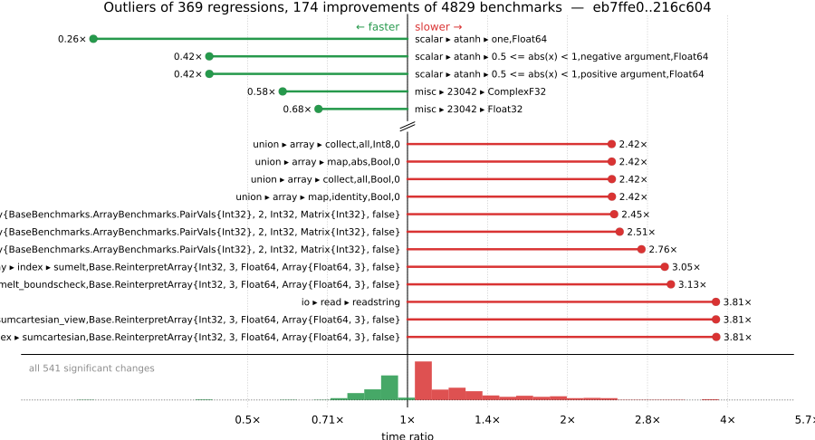

# Benchmark Report

## Summary

**4829** benchmarks were executed, **369** showed regressions, and **174** showed improvements.



## Job Properties

*Commit:* [JuliaLang/julia@216c604f36413c4452f5424bcd86f358469c9ee7](https://github.com/JuliaLang/julia/commit/216c604f36413c4452f5424bcd86f358469c9ee7)

*Comparison Range:* [link](https://github.com/JuliaLang/julia/compare/eb7ffe0e6f0cfa2df938f96d69d159665df9010a...216c604f36413c4452f5424bcd86f358469c9ee7)

*Triggered By:* [link](https://github.com/JuliaLang/julia/commit/216c604f36413c4452f5424bcd86f358469c9ee7#commitcomment-197310975)

*Tag Predicate:* `ALL`

*Daily Job:* 2026-08-22 vs [2026-07-30](../../2026-07/30/report.md)

## Results

*Note: If Chrome is your browser, I strongly recommend installing the [Wide GitHub](https://chrome.google.com/webstore/detail/wide-github/kaalofacklcidaampbokdplbklpeldpj?hl=en)
extension, which makes the result table easier to read.*

Below is a table of this job's results, obtained by running the benchmarks found in
[JuliaCI/BaseBenchmarks.jl](https://github.com/JuliaCI/BaseBenchmarks.jl). The values
listed in the `ID` column have the structure `[parent_group, child_group, ..., key]`,
and can be used to index into the BaseBenchmarks suite to retrieve the corresponding
benchmarks.

The percentages accompanying time and memory values in the below table are noise tolerances. The "true"
time/memory value for a given benchmark is expected to fall within this percentage of the reported value.

A ratio greater than `1.0` denotes a possible regression (marked with :x:), while a ratio less
than `1.0` denotes a possible improvement (marked with :white_check_mark:). Only significant results - results
that indicate possible regressions or improvements - are shown below (thus, an empty table means that all
benchmark results remained invariant between builds).

| ID | time ratio | memory ratio |
|----|------------|--------------|
| `["alloc", "arrays"]` | 0.87 (5%) :white_check_mark: | 1.00 (1%)  |
| `["alloc", "structs"]` | 0.87 (5%) :white_check_mark: | 1.00 (1%)  |
| `["array", "bool", "bitarray_true_fill!"]` | 0.90 (5%) :white_check_mark: | 1.00 (1%)  |
| `["array", "cat", "4467"]` | 1.25 (5%) :x: | 1.00 (1%)  |
| `["array", "cat", ("vcat_setind", 5)]` | 1.06 (5%) :x: | 1.00 (1%)  |
| `["array", "convert", ("Complex{Float64}", "Int")]` | 1.32 (5%) :x: | 1.00 (1%)  |
| `["array", "growth", ("push_multiple!", 8)]` | 0.92 (5%) :white_check_mark: | 1.00 (1%)  |
| `["array", "growth", ("push_single!", 8)]` | 1.06 (5%) :x: | 1.00 (1%)  |
| `["array", "index", ("sumcartesian", "Base.ReinterpretArray{BaseBenchmarks.ArrayBenchmarks.PairVals{Float32}, 2, Float32, Matrix{Float32}, false}")]` | 1.96 (50%) :x: | 1.00 (1%)  |
| `["array", "index", ("sumcartesian", "Base.ReinterpretArray{BaseBenchmarks.ArrayBenchmarks.PairVals{Int32}, 2, Int32, Matrix{Int32}, false}")]` | 2.45 (50%) :x: | 1.00 (1%)  |
| `["array", "index", ("sumcartesian", "Base.ReinterpretArray{Int32, 3, Float64, Array{Float64, 3}, false}")]` | 3.81 (50%) :x: | 1.00 (1%)  |
| `["array", "index", ("sumcartesian_view", "Base.ReinterpretArray{BaseBenchmarks.ArrayBenchmarks.PairVals{Float32}, 2, Float32, Matrix{Float32}, false}")]` | 1.89 (50%) :x: | 1.00 (1%)  |
| `["array", "index", ("sumcartesian_view", "Base.ReinterpretArray{BaseBenchmarks.ArrayBenchmarks.PairVals{Int32}, 2, Int32, Matrix{Int32}, false}")]` | 2.51 (50%) :x: | 1.00 (1%)  |
| `["array", "index", ("sumcartesian_view", "Base.ReinterpretArray{Int32, 3, Float64, Array{Float64, 3}, false}")]` | 3.81 (50%) :x: | 1.00 (1%)  |
| `["array", "index", ("sumcolon", "BaseBenchmarks.ArrayBenchmarks.ArrayLS{Float32, 2}")]` | 0.97 (50%)  | 0.98 (1%) :white_check_mark: |
| `["array", "index", ("sumcolon", "BaseBenchmarks.ArrayBenchmarks.ArrayLS{Int32, 2}")]` | 0.98 (50%)  | 0.98 (1%) :white_check_mark: |
| `["array", "index", ("sumelt", "Base.ReinterpretArray{BaseBenchmarks.ArrayBenchmarks.PairVals{Float32}, 2, Float32, Matrix{Float32}, false}")]` | 2.02 (50%) :x: | 1.00 (1%)  |
| `["array", "index", ("sumelt", "Base.ReinterpretArray{BaseBenchmarks.ArrayBenchmarks.PairVals{Int32}, 2, Int32, Matrix{Int32}, false}")]` | 2.76 (50%) :x: | 1.00 (1%)  |
| `["array", "index", ("sumelt", "Base.ReinterpretArray{Int32, 3, Float64, Array{Float64, 3}, false}")]` | 3.05 (50%) :x: | 1.00 (1%)  |
| `["array", "index", ("sumelt_boundscheck", "Base.ReinterpretArray{BaseBenchmarks.ArrayBenchmarks.PairVals{Float32}, 2, Float32, Matrix{Float32}, false}")]` | 1.69 (50%) :x: | 1.00 (1%)  |
| `["array", "index", ("sumelt_boundscheck", "Base.ReinterpretArray{BaseBenchmarks.ArrayBenchmarks.PairVals{Int32}, 2, Int32, Matrix{Int32}, false}")]` | 2.19 (50%) :x: | 1.00 (1%)  |
| `["array", "index", ("sumelt_boundscheck", "Base.ReinterpretArray{Int32, 3, Float64, Array{Float64, 3}, false}")]` | 3.13 (50%) :x: | 1.00 (1%)  |
| `["array", "reductions", ("sumabs", "Float64")]` | 1.22 (5%) :x: | 1.00 (1%)  |
| `["array", "setindex!", ("setindex!", 4)]` | 0.95 (5%) :white_check_mark: | 1.00 (1%)  |
| `["broadcast", "26942"]` | 1.08 (5%) :x: | 1.00 (1%)  |
| `["broadcast", "dotop", ("Float64", "(1000, 1000)", 2)]` | 1.12 (5%) :x: | 1.00 (1%)  |
| `["broadcast", "fusion", ("Float64", "(1000000,)", 1)]` | 0.93 (5%) :white_check_mark: | 1.00 (1%)  |
| `["broadcast", "fusion", ("Float64", "(1000000,)", 2)]` | 0.94 (5%) :white_check_mark: | 1.00 (1%)  |
| `["broadcast", "mix_scalar_tuple", (10, "scal_tup")]` | 0.92 (5%) :white_check_mark: | 1.00 (1%)  |
| `["broadcast", "mix_scalar_tuple", (3, "scal_tup_x3")]` | 1.07 (5%) :x: | 1.00 (1%)  |
| `["broadcast", "mix_scalar_tuple", (3, "tup_tup")]` | 1.09 (5%) :x: | 1.00 (1%)  |
| `["broadcast", "mix_scalar_tuple", (5, "scal_tup_x3")]` | 1.07 (5%) :x: | 1.00 (1%)  |
| `["broadcast", "mix_scalar_tuple", (5, "tup_tup")]` | 1.09 (5%) :x: | 1.00 (1%)  |
| `["broadcast", "sparse", ("(10000000,)", 2)]` | 0.94 (5%) :white_check_mark: | 1.00 (1%)  |
| `["broadcast", "typeargs", ("array", 3)]` | 0.95 (5%) :white_check_mark: | 1.00 (1%)  |
| `["broadcast", "typeargs", ("tuple", 10)]` | 1.42 (5%) :x: | 1.00 (1%)  |
| `["broadcast", "typeargs", ("tuple", 3)]` | 1.18 (5%) :x: | 1.00 (1%)  |
| `["broadcast", "typeargs", ("tuple", 5)]` | 1.19 (5%) :x: | 1.00 (1%)  |
| `["dates", "accessor", "millisecond"]` | 1.18 (5%) :x: | 1.00 (1%)  |
| `["dates", "arithmetic", ("Date", "Day")]` | 1.10 (5%) :x: | 1.00 (1%)  |
| `["dates", "arithmetic", ("DateTime", "Hour")]` | 1.10 (5%) :x: | 1.00 (1%)  |
| `["dates", "arithmetic", ("DateTime", "Minute")]` | 1.09 (5%) :x: | 1.00 (1%)  |
| `["dates", "conversion", "Date -> DateTime"]` | 1.22 (5%) :x: | 1.00 (1%)  |
| `["dates", "conversion", "DateTime -> Date"]` | 1.08 (5%) :x: | 1.00 (1%)  |
| `["dates", "parse", "DateTime"]` | 0.94 (5%) :white_check_mark: | 1.00 (1%)  |
| `["dates", "parse", ("DateTime", "RFC1123Format", "Titlecase")]` | 1.05 (5%) :x: | 1.00 (1%)  |
| `["dates", "query", ("firstdayofweek", "Date")]` | 1.29 (25%) :x: | 1.00 (1%)  |
| `["find", "findall", ("Vector{Bool}", "10-90")]` | 1.21 (5%) :x: | 1.00 (1%)  |
| `["find", "findall", ("Vector{Bool}", "90-10")]` | 1.17 (5%) :x: | 1.00 (1%)  |
| `["find", "findnext", ("Vector{Bool}", "50-50")]` | 1.13 (5%) :x: | 1.00 (1%)  |
| `["find", "findprev", ("BitVector", "50-50")]` | 0.93 (5%) :white_check_mark: | 1.00 (1%)  |
| `["globals", "getglobal_dynamic"]` | 1.24 (5%) :x: | 1.00 (1%)  |
| `["globals", "rmw_typed"]` | 1.09 (5%) :x: | 1.00 (1%)  |
| `["inference", "abstract interpretation", "Base.init_stdio(::Ptr{Cvoid})"]` | 1.09 (5%) :x: | 1.12 (1%) :x: |
| `["inference", "abstract interpretation", "REPL.REPLCompletions.completions"]` | 1.08 (5%) :x: | 1.12 (1%) :x: |
| `["inference", "abstract interpretation", "broadcasting"]` | 1.05 (5%)  | 1.09 (1%) :x: |
| `["inference", "abstract interpretation", "many_const_calls"]` | 1.07 (5%) :x: | 1.04 (1%) :x: |
| `["inference", "abstract interpretation", "many_invoke_calls"]` | 1.04 (5%)  | 1.06 (1%) :x: |
| `["inference", "abstract interpretation", "many_local_vars"]` | 0.87 (5%) :white_check_mark: | 1.06 (1%) :x: |
| `["inference", "abstract interpretation", "many_method_matches"]` | 1.04 (5%)  | 1.06 (1%) :x: |
| `["inference", "abstract interpretation", "many_opaque_closures"]` | 1.02 (5%)  | 1.06 (1%) :x: |
| `["inference", "abstract interpretation", "println(::QuoteNode)"]` | 1.04 (5%)  | 1.08 (1%) :x: |
| `["inference", "abstract interpretation", "rand(Float64)"]` | 1.04 (5%)  | 1.07 (1%) :x: |
| `["inference", "abstract interpretation", "sin(42)"]` | 1.05 (5%)  | 1.07 (1%) :x: |
| `["inference", "allinference", "Base.init_stdio(::Ptr{Cvoid})"]` | 1.09 (5%) :x: | 1.08 (1%) :x: |
| `["inference", "allinference", "REPL.REPLCompletions.completions"]` | 1.06 (5%) :x: | 1.05 (1%) :x: |
| `["inference", "allinference", "broadcasting"]` | 1.03 (5%)  | 1.03 (1%) :x: |
| `["inference", "allinference", "many_const_calls"]` | 1.04 (5%)  | 1.02 (1%) :x: |
| `["inference", "allinference", "many_invoke_calls"]` | 1.03 (5%)  | 1.01 (1%) :x: |
| `["inference", "allinference", "many_local_vars"]` | 0.94 (5%) :white_check_mark: | 1.02 (1%) :x: |
| `["inference", "allinference", "println(::QuoteNode)"]` | 1.04 (5%)  | 1.03 (1%) :x: |
| `["inference", "allinference", "rand(Float64)"]` | 1.03 (5%)  | 1.03 (1%) :x: |
| `["inference", "allinference", "sin(42)"]` | 1.03 (5%)  | 1.03 (1%) :x: |
| `["io", "read", "readstring"]` | 3.81 (5%) :x: | 4.20 (1%) :x: |
| `["io", "skipchars"]` | 1.14 (5%) :x: | 1.00 (1%)  |
| `["linalg", "arithmetic", ("sqrt", "NPDUpperTriangular", 1024)]` | 1.53 (45%) :x: | 1.00 (1%)  |
| `["micro", "fib"]` | 1.09 (5%) :x: | 1.00 (1%)  |
| `["micro", "printfd"]` | 1.26 (5%) :x: | 1.00 (1%)  |
| `["misc", "23042", "ComplexF32"]` | 0.58 (5%) :white_check_mark: | 1.00 (1%)  |
| `["misc", "23042", "Float32"]` | 0.68 (5%) :white_check_mark: | 1.00 (1%)  |
| `["misc", "allocation elision view", "no conditional"]` | 1.16 (5%) :x: | 1.00 (1%)  |
| `["misc", "bitshift", ("UInt", "UInt")]` | 1.09 (5%) :x: | 1.00 (1%)  |
| `["misc", "iterators", "zip(1:1)"]` | 1.24 (5%) :x: | 1.00 (1%)  |
| `["misc", "iterators", "zip(1:1, 1:1)"]` | 1.06 (5%) :x: | 1.00 (1%)  |
| `["misc", "iterators", "zip(1:1, 1:1, 1:1)"]` | 1.08 (5%) :x: | 1.00 (1%)  |
| `["misc", "iterators", "zip(1:1, 1:1, 1:1, 1:1)"]` | 1.05 (5%) :x: | 1.00 (1%)  |
| `["misc", "julia", ("macroexpand", "evalpoly")]` | 0.95 (5%) :white_check_mark: | 1.00 (1%)  |
| `["misc", "julia", ("parse", "array")]` | 1.00 (5%)  | 0.94 (1%) :white_check_mark: |
| `["misc", "julia", ("parse", "nested")]` | 1.00 (5%)  | 0.96 (1%) :white_check_mark: |
| `["misc", "repeat", (200, 24, 1)]` | 2.37 (5%) :x: | 1.00 (1%)  |
| `["problem", "monte carlo", "euro_option_devec"]` | 0.89 (5%) :white_check_mark: | 1.00 (1%)  |
| `["random", "collections", ("rand", "MersenneTwister", "small BitSet")]` | 1.25 (25%) :x: | 1.00 (1%)  |
| `["random", "ranges", ("RangeGenerator", "BigInt", "1:1")]` | 1.40 (25%) :x: | 1.00 (1%)  |
| `["random", "ranges", ("RangeGenerator", "BigInt", "1:170141183460469231731687303715884105728")]` | 1.40 (25%) :x: | 1.00 (1%)  |
| `["random", "ranges", ("RangeGenerator", "BigInt", "1:18446744073709551615")]` | 1.39 (25%) :x: | 1.00 (1%)  |
| `["random", "ranges", ("RangeGenerator", "BigInt", "1:18446744073709551616")]` | 1.39 (25%) :x: | 1.00 (1%)  |
| `["random", "ranges", ("RangeGenerator", "BigInt", "1:4294967295")]` | 1.39 (25%) :x: | 1.00 (1%)  |
| `["random", "ranges", ("RangeGenerator", "BigInt", "1:4294967297")]` | 1.39 (25%) :x: | 1.00 (1%)  |
| `["random", "ranges", ("rand", "MersenneTwister", "BigInt", "RangeGenerator(1:1)")]` | 1.32 (25%) :x: | 1.00 (1%)  |
| `["scalar", "acos", ("one", "negative argument", "Float32")]` | 1.06 (5%) :x: | 1.00 (1%)  |
| `["scalar", "acos", ("one", "positive argument", "Float32")]` | 1.06 (5%) :x: | 1.00 (1%)  |
| `["scalar", "acos", ("small", "negative argument", "Float64")]` | 0.86 (5%) :white_check_mark: | 1.00 (1%)  |
| `["scalar", "acos", ("small", "positive argument", "Float32")]` | 1.05 (5%) :x: | 1.00 (1%)  |
| `["scalar", "acos", ("small", "positive argument", "Float64")]` | 0.86 (5%) :white_check_mark: | 1.00 (1%)  |
| `["scalar", "acos", ("zero", "Float64")]` | 0.86 (5%) :white_check_mark: | 1.00 (1%)  |
| `["scalar", "acosh", ("one", "Float32")]` | 1.06 (5%) :x: | 1.00 (1%)  |
| `["scalar", "acosh", ("one", "Float64")]` | 0.89 (5%) :white_check_mark: | 1.00 (1%)  |
| `["scalar", "arithmetic", ("add", "BigFloat", "ComplexF32")]` | 0.87 (50%)  | 0.80 (1%) :white_check_mark: |
| `["scalar", "arithmetic", ("add", "BigInt", "ComplexF32")]` | 0.75 (50%)  | 0.80 (1%) :white_check_mark: |
| `["scalar", "arithmetic", ("add", "BigInt", "Float32")]` | 0.82 (50%)  | 0.86 (1%) :white_check_mark: |
| `["scalar", "arithmetic", ("add", "ComplexF32", "BigFloat")]` | 0.86 (50%)  | 0.80 (1%) :white_check_mark: |
| `["scalar", "arithmetic", ("add", "ComplexF32", "BigInt")]` | 0.75 (50%)  | 0.80 (1%) :white_check_mark: |
| `["scalar", "arithmetic", ("add", "ComplexF32", "Complex{BigInt}")]` | 0.78 (50%)  | 0.86 (1%) :white_check_mark: |
| `["scalar", "arithmetic", ("add", "Complex{BigInt}", "ComplexF32")]` | 0.79 (50%)  | 0.86 (1%) :white_check_mark: |
| `["scalar", "arithmetic", ("add", "Complex{BigInt}", "Float32")]` | 0.85 (50%)  | 0.89 (1%) :white_check_mark: |
| `["scalar", "arithmetic", ("add", "Float32", "BigInt")]` | 0.83 (50%)  | 0.86 (1%) :white_check_mark: |
| `["scalar", "arithmetic", ("add", "Float32", "Complex{BigInt}")]` | 0.85 (50%)  | 0.89 (1%) :white_check_mark: |
| `["scalar", "arithmetic", ("div", "BigFloat", "ComplexF32")]` | 0.83 (50%)  | 0.91 (1%) :white_check_mark: |
| `["scalar", "arithmetic", ("div", "BigInt", "ComplexF32")]` | 0.90 (50%)  | 0.91 (1%) :white_check_mark: |
| `["scalar", "arithmetic", ("div", "BigInt", "Float32")]` | 0.91 (50%)  | 0.86 (1%) :white_check_mark: |
| `["scalar", "arithmetic", ("div", "BigInt", "Int64")]` | 0.80 (50%)  | 0.86 (1%) :white_check_mark: |
| `["scalar", "arithmetic", ("div", "ComplexF32", "BigInt")]` | 0.90 (50%)  | 0.86 (1%) :white_check_mark: |
| `["scalar", "arithmetic", ("div", "ComplexF32", "Complex{BigFloat}")]` | 0.90 (50%)  | 0.93 (1%) :white_check_mark: |
| `["scalar", "arithmetic", ("div", "ComplexF32", "Complex{BigInt}")]` | 0.90 (50%)  | 0.94 (1%) :white_check_mark: |
| `["scalar", "arithmetic", ("div", "Complex{BigFloat}", "ComplexF32")]` | 0.90 (50%)  | 0.93 (1%) :white_check_mark: |
| `["scalar", "arithmetic", ("div", "Complex{BigInt}", "ComplexF32")]` | 0.90 (50%)  | 0.94 (1%) :white_check_mark: |
| `["scalar", "arithmetic", ("div", "Complex{BigInt}", "Float32")]` | 0.87 (50%)  | 0.86 (1%) :white_check_mark: |
| `["scalar", "arithmetic", ("div", "Complex{BigInt}", "Int64")]` | 0.79 (50%)  | 0.86 (1%) :white_check_mark: |
| `["scalar", "arithmetic", ("div", "Float32", "BigInt")]` | 0.92 (50%)  | 0.86 (1%) :white_check_mark: |
| `["scalar", "arithmetic", ("div", "Int64", "ComplexF64")]` | 1.74 (50%) :x: | 1.00 (1%)  |
| `["scalar", "arithmetic", ("mul", "BigInt", "ComplexF32")]` | 0.82 (50%)  | 0.86 (1%) :white_check_mark: |
| `["scalar", "arithmetic", ("mul", "BigInt", "Float32")]` | 0.83 (50%)  | 0.86 (1%) :white_check_mark: |
| `["scalar", "arithmetic", ("mul", "ComplexF32", "BigInt")]` | 0.73 (50%)  | 0.86 (1%) :white_check_mark: |
| `["scalar", "arithmetic", ("mul", "ComplexF32", "Complex{BigInt}")]` | 0.82 (50%)  | 0.88 (1%) :white_check_mark: |
| `["scalar", "arithmetic", ("mul", "Complex{BigInt}", "ComplexF32")]` | 0.82 (50%)  | 0.88 (1%) :white_check_mark: |
| `["scalar", "arithmetic", ("mul", "Complex{BigInt}", "Float32")]` | 0.81 (50%)  | 0.86 (1%) :white_check_mark: |
| `["scalar", "arithmetic", ("mul", "Float32", "BigInt")]` | 0.85 (50%)  | 0.86 (1%) :white_check_mark: |
| `["scalar", "arithmetic", ("mul", "Float32", "Complex{BigInt}")]` | 0.81 (50%)  | 0.86 (1%) :white_check_mark: |
| `["scalar", "arithmetic", ("rem type", "UInt64", "UInt64")]` | 1.30 (25%) :x: | 1.00 (1%)  |
| `["scalar", "arithmetic", ("sub", "BigFloat", "ComplexF32")]` | 0.85 (50%)  | 0.86 (1%) :white_check_mark: |
| `["scalar", "arithmetic", ("sub", "BigInt", "ComplexF32")]` | 0.75 (50%)  | 0.83 (1%) :white_check_mark: |
| `["scalar", "arithmetic", ("sub", "BigInt", "Float32")]` | 0.81 (50%)  | 0.86 (1%) :white_check_mark: |
| `["scalar", "arithmetic", ("sub", "ComplexF32", "BigFloat")]` | 0.83 (50%)  | 0.80 (1%) :white_check_mark: |
| `["scalar", "arithmetic", ("sub", "ComplexF32", "BigInt")]` | 0.73 (50%)  | 0.80 (1%) :white_check_mark: |
| `["scalar", "arithmetic", ("sub", "ComplexF32", "Complex{BigInt}")]` | 0.77 (50%)  | 0.86 (1%) :white_check_mark: |
| `["scalar", "arithmetic", ("sub", "Complex{BigInt}", "ComplexF32")]` | 0.79 (50%)  | 0.86 (1%) :white_check_mark: |
| `["scalar", "arithmetic", ("sub", "Complex{BigInt}", "Float32")]` | 0.83 (50%)  | 0.89 (1%) :white_check_mark: |
| `["scalar", "arithmetic", ("sub", "Float32", "BigInt")]` | 0.81 (50%)  | 0.86 (1%) :white_check_mark: |
| `["scalar", "arithmetic", ("sub", "Float32", "Complex{BigInt}")]` | 0.83 (50%)  | 0.91 (1%) :white_check_mark: |
| `["scalar", "asin", ("0.5 <= abs(x) < 0.975", "positive argument", "Float64")]` | 1.10 (5%) :x: | 1.00 (1%)  |
| `["scalar", "asin", ("0.975 <= abs(x) < 1.0", "negative argument", "Float64")]` | 1.14 (5%) :x: | 1.00 (1%)  |
| `["scalar", "asin", ("0.975 <= abs(x) < 1.0", "positive argument", "Float64")]` | 1.14 (5%) :x: | 1.00 (1%)  |
| `["scalar", "asin", ("abs(x) < 0.5", "negative argument", "Float32")]` | 1.05 (5%) :x: | 1.00 (1%)  |
| `["scalar", "asin", ("abs(x) < 0.5", "positive argument", "Float32")]` | 1.05 (5%) :x: | 1.00 (1%)  |
| `["scalar", "asin", ("one", "negative argument", "Float64")]` | 1.05 (5%) :x: | 1.00 (1%)  |
| `["scalar", "asin", ("one", "positive argument", "Float64")]` | 1.05 (5%) :x: | 1.00 (1%)  |
| `["scalar", "asin", ("small", "negative argument", "Float32")]` | 1.06 (5%) :x: | 1.00 (1%)  |
| `["scalar", "asin", ("small", "positive argument", "Float32")]` | 1.06 (5%) :x: | 1.00 (1%)  |
| `["scalar", "asin", ("zero", "Float32")]` | 1.05 (5%) :x: | 1.00 (1%)  |
| `["scalar", "atan", ("very large", "negative argument", "Float32")]` | 1.06 (5%) :x: | 1.00 (1%)  |
| `["scalar", "atan", ("very large", "positive argument", "Float32")]` | 1.06 (5%) :x: | 1.00 (1%)  |
| `["scalar", "atan", ("very small", "negative argument", "Float32")]` | 1.05 (5%) :x: | 1.00 (1%)  |
| `["scalar", "atan", ("very small", "positive argument", "Float32")]` | 1.05 (5%) :x: | 1.00 (1%)  |
| `["scalar", "atan", ("zero", "Float32")]` | 1.05 (5%) :x: | 1.00 (1%)  |
| `["scalar", "atan2", ("abs(y/x) high", "y infinite", "y negative", "x finite", "x negative", "Float64")]` | 1.28 (5%) :x: | 1.00 (1%)  |
| `["scalar", "atan2", ("abs(y/x) high", "y negative", "x negative", "Float32")]` | 1.09 (5%) :x: | 1.00 (1%)  |
| `["scalar", "atan2", ("abs(y/x) high", "y negative", "x negative", "Float64")]` | 1.20 (5%) :x: | 1.00 (1%)  |
| `["scalar", "atan2", ("abs(y/x) high", "y positive", "x negative", "Float64")]` | 1.20 (5%) :x: | 1.00 (1%)  |
| `["scalar", "atan2", ("abs(y/x) safe (small)", "y negative", "x negative", "Float32")]` | 1.08 (5%) :x: | 1.00 (1%)  |
| `["scalar", "atan2", ("abs(y/x) safe (small)", "y negative", "x positive", "Float32")]` | 1.07 (5%) :x: | 1.00 (1%)  |
| `["scalar", "atan2", ("abs(y/x) safe (small)", "y positive", "x negative", "Float32")]` | 1.08 (5%) :x: | 1.00 (1%)  |
| `["scalar", "atan2", ("abs(y/x) safe (small)", "y positive", "x positive", "Float32")]` | 1.09 (5%) :x: | 1.00 (1%)  |
| `["scalar", "atan2", ("abs(y/x) small", "y positive", "x negative", "Float32")]` | 1.13 (5%) :x: | 1.00 (1%)  |
| `["scalar", "atan2", ("abs(y/x) small", "y positive", "x negative", "Float64")]` | 1.09 (5%) :x: | 1.00 (1%)  |
| `["scalar", "atan2", ("abs(y/x) small", "y positive", "x positive", "Float64")]` | 1.14 (5%) :x: | 1.00 (1%)  |
| `["scalar", "atan2", ("x one", "Float32")]` | 1.39 (5%) :x: | 1.00 (1%)  |
| `["scalar", "atan2", ("x zero", "y negative", "Float32")]` | 0.90 (5%) :white_check_mark: | 1.00 (1%)  |
| `["scalar", "atan2", ("x zero", "y negative", "Float64")]` | 1.18 (5%) :x: | 1.00 (1%)  |
| `["scalar", "atan2", ("x zero", "y positive", "Float32")]` | 0.90 (5%) :white_check_mark: | 1.00 (1%)  |
| `["scalar", "atan2", ("x zero", "y positive", "Float64")]` | 1.18 (5%) :x: | 1.00 (1%)  |
| `["scalar", "atan2", ("y finite", "y negative", "x infinite", "x negative", "Float32")]` | 0.91 (5%) :white_check_mark: | 1.00 (1%)  |
| `["scalar", "atan2", ("y finite", "y negative", "x infinite", "x negative", "Float64")]` | 1.11 (5%) :x: | 1.00 (1%)  |
| `["scalar", "atan2", ("y finite", "y negative", "x infinite", "x positive", "Float32")]` | 0.90 (5%) :white_check_mark: | 1.00 (1%)  |
| `["scalar", "atan2", ("y finite", "y negative", "x infinite", "x positive", "Float64")]` | 1.10 (5%) :x: | 1.00 (1%)  |
| `["scalar", "atan2", ("y finite", "y positive", "x infinite", "x negative", "Float32")]` | 0.90 (5%) :white_check_mark: | 1.00 (1%)  |
| `["scalar", "atan2", ("y finite", "y positive", "x infinite", "x negative", "Float64")]` | 1.10 (5%) :x: | 1.00 (1%)  |
| `["scalar", "atan2", ("y finite", "y positive", "x infinite", "x positive", "Float32")]` | 0.91 (5%) :white_check_mark: | 1.00 (1%)  |
| `["scalar", "atan2", ("y finite", "y positive", "x infinite", "x positive", "Float64")]` | 1.10 (5%) :x: | 1.00 (1%)  |
| `["scalar", "atan2", ("y infinite", "y negative", "x finite", "x negative", "Float64")]` | 1.27 (5%) :x: | 1.00 (1%)  |
| `["scalar", "atan2", ("y infinite", "y negative", "x finite", "x positive", "Float64")]` | 1.27 (5%) :x: | 1.00 (1%)  |
| `["scalar", "atan2", ("y infinite", "y negative", "x infinite", "x negative", "Float32")]` | 0.91 (5%) :white_check_mark: | 1.00 (1%)  |
| `["scalar", "atan2", ("y infinite", "y negative", "x infinite", "x positive", "Float32")]` | 0.91 (5%) :white_check_mark: | 1.00 (1%)  |
| `["scalar", "atan2", ("y infinite", "y positive", "x finite", "x negative", "Float64")]` | 1.27 (5%) :x: | 1.00 (1%)  |
| `["scalar", "atan2", ("y infinite", "y positive", "x finite", "x positive", "Float64")]` | 1.27 (5%) :x: | 1.00 (1%)  |
| `["scalar", "atan2", ("y infinite", "y positive", "x infinite", "x negative", "Float32")]` | 0.91 (5%) :white_check_mark: | 1.00 (1%)  |
| `["scalar", "atan2", ("y infinite", "y positive", "x infinite", "x positive", "Float32")]` | 0.91 (5%) :white_check_mark: | 1.00 (1%)  |
| `["scalar", "atan2", ("y zero", "y negative", "x negative", "Float64")]` | 1.18 (5%) :x: | 1.00 (1%)  |
| `["scalar", "atan2", ("y zero", "y negative", "x positive", "Float64")]` | 1.28 (5%) :x: | 1.00 (1%)  |
| `["scalar", "atan2", ("y zero", "y positive", "x negative", "Float32")]` | 0.95 (5%) :white_check_mark: | 1.00 (1%)  |
| `["scalar", "atan2", ("y zero", "y positive", "x negative", "Float64")]` | 1.18 (5%) :x: | 1.00 (1%)  |
| `["scalar", "atan2", ("y zero", "y positive", "x positive", "Float64")]` | 1.28 (5%) :x: | 1.00 (1%)  |
| `["scalar", "atanh", ("0.5 <= abs(x) < 1", "negative argument", "Float64")]` | 0.42 (5%) :white_check_mark: | 0.00 (1%) :white_check_mark: |
| `["scalar", "atanh", ("0.5 <= abs(x) < 1", "positive argument", "Float64")]` | 0.42 (5%) :white_check_mark: | 0.00 (1%) :white_check_mark: |
| `["scalar", "atanh", ("one", "Float64")]` | 0.26 (5%) :white_check_mark: | 0.00 (1%) :white_check_mark: |
| `["scalar", "atanh", ("very small", "negative argument", "Float64")]` | 0.94 (5%) :white_check_mark: | 1.00 (1%)  |
| `["scalar", "cbrt", ("large", "negative argument", "Float32")]` | 1.06 (5%) :x: | 1.00 (1%)  |
| `["scalar", "cbrt", ("large", "positive argument", "Float32")]` | 1.06 (5%) :x: | 1.00 (1%)  |
| `["scalar", "cbrt", ("zero", "Float32")]` | 1.06 (5%) :x: | 1.00 (1%)  |
| `["scalar", "cbrt", ("zero", "Float64")]` | 0.94 (5%) :white_check_mark: | 1.00 (1%)  |
| `["scalar", "cosh", ("0 <= abs(x) < 0.00024414062f0", "negative argument", "Float32")]` | 1.07 (5%) :x: | 1.00 (1%)  |
| `["scalar", "cosh", ("0 <= abs(x) < 0.00024414062f0", "positive argument", "Float32")]` | 1.07 (5%) :x: | 1.00 (1%)  |
| `["scalar", "cosh", ("0 <= abs(x) < 2.7755602085408512e-17", "negative argument", "Float64")]` | 1.11 (5%) :x: | 1.00 (1%)  |
| `["scalar", "cosh", ("0 <= abs(x) < 2.7755602085408512e-17", "positive argument", "Float64")]` | 1.11 (5%) :x: | 1.00 (1%)  |
| `["scalar", "cosh", ("very large", "negative argument", "Float32")]` | 1.05 (5%) :x: | 1.00 (1%)  |
| `["scalar", "cosh", ("very small", "negative argument", "Float32")]` | 1.07 (5%) :x: | 1.00 (1%)  |
| `["scalar", "cosh", ("very small", "negative argument", "Float64")]` | 1.11 (5%) :x: | 1.00 (1%)  |
| `["scalar", "cosh", ("very small", "positive argument", "Float32")]` | 1.06 (5%) :x: | 1.00 (1%)  |
| `["scalar", "cosh", ("very small", "positive argument", "Float64")]` | 1.11 (5%) :x: | 1.00 (1%)  |
| `["scalar", "cosh", ("zero", "Float32")]` | 1.06 (5%) :x: | 1.00 (1%)  |
| `["scalar", "cosh", ("zero", "Float64")]` | 1.11 (5%) :x: | 1.00 (1%)  |
| `["scalar", "exp2", ("2pow1023", "negative argument", "Float64")]` | 0.80 (5%) :white_check_mark: | 1.00 (1%)  |
| `["scalar", "exp2", ("2pow1023", "positive argument", "Float64")]` | 0.79 (5%) :white_check_mark: | 1.00 (1%)  |
| `["scalar", "exp2", ("2pow127", "negative argument", "Float32")]` | 1.07 (5%) :x: | 1.00 (1%)  |
| `["scalar", "exp2", ("2pow35", "positive argument", "Float32")]` | 0.94 (5%) :white_check_mark: | 1.00 (1%)  |
| `["scalar", "expm1", ("arg reduction I", "negative argument", "Float64")]` | 1.08 (5%) :x: | 1.00 (1%)  |
| `["scalar", "expm1", ("arg reduction I", "positive argument", "Float64")]` | 1.08 (5%) :x: | 1.00 (1%)  |
| `["scalar", "expm1", ("arg reduction II", "negative argument", "Float64")]` | 1.08 (5%) :x: | 1.00 (1%)  |
| `["scalar", "expm1", ("arg reduction II", "positive argument", "Float64")]` | 1.07 (5%) :x: | 1.00 (1%)  |
| `["scalar", "expm1", ("huge", "positive argument", "Float64")]` | 0.95 (5%) :white_check_mark: | 1.00 (1%)  |
| `["scalar", "expm1", ("large", "negative argument", "Float64")]` | 0.95 (5%) :white_check_mark: | 1.00 (1%)  |
| `["scalar", "expm1", ("large", "positive argument", "Float32")]` | 0.94 (5%) :white_check_mark: | 1.00 (1%)  |
| `["scalar", "expm1", ("large", "positive argument", "Float64")]` | 0.95 (5%) :white_check_mark: | 1.00 (1%)  |
| `["scalar", "expm1", ("medium", "negative argument", "Float64")]` | 0.95 (5%) :white_check_mark: | 1.00 (1%)  |
| `["scalar", "expm1", ("medium", "positive argument", "Float32")]` | 0.95 (5%) :white_check_mark: | 1.00 (1%)  |
| `["scalar", "expm1", ("one", "Float64")]` | 1.08 (5%) :x: | 1.00 (1%)  |
| `["scalar", "expm1", ("small", "negative argument", "Float64")]` | 1.25 (5%) :x: | 1.00 (1%)  |
| `["scalar", "expm1", ("small", "positive argument", "Float64")]` | 1.08 (5%) :x: | 1.00 (1%)  |
| `["scalar", "expm1", ("zero", "Float64")]` | 1.25 (5%) :x: | 1.00 (1%)  |
| `["scalar", "fastmath", ("sub", "BigInt")]` | 1.40 (40%) :x: | 1.00 (1%)  |
| `["scalar", "intfuncs", ("#6", "Int64", "+")]` | 1.37 (25%) :x: | 1.00 (1%)  |
| `["scalar", "intfuncs", ("#6", "UInt64", "+")]` | 1.38 (25%) :x: | 1.00 (1%)  |
| `["scalar", "intfuncs", ("#8", "Int64", "+")]` | 1.39 (25%) :x: | 1.00 (1%)  |
| `["scalar", "intfuncs", ("#8", "UInt64", "+")]` | 1.33 (25%) :x: | 1.00 (1%)  |
| `["scalar", "mod2pi", ("argument reduction (easy) abs(x) < 2.0^20π/4", "negative argument", "Float64")]` | 1.13 (5%) :x: | 1.00 (1%)  |
| `["scalar", "mod2pi", ("argument reduction (easy) abs(x) < 5π/4", "negative argument", "Float64")]` | 1.10 (5%) :x: | 1.00 (1%)  |
| `["scalar", "mod2pi", ("argument reduction (easy) abs(x) < 5π/4", "positive argument", "Float64")]` | 1.11 (5%) :x: | 1.00 (1%)  |
| `["scalar", "mod2pi", ("argument reduction (easy) abs(x) < 6π/4", "negative argument", "Float64")]` | 1.10 (5%) :x: | 1.00 (1%)  |
| `["scalar", "mod2pi", ("argument reduction (easy) abs(x) < 6π/4", "positive argument", "Float64")]` | 1.11 (5%) :x: | 1.00 (1%)  |
| `["scalar", "mod2pi", ("argument reduction (easy) abs(x) < 7π/4", "negative argument", "Float64")]` | 1.10 (5%) :x: | 1.00 (1%)  |
| `["scalar", "mod2pi", ("argument reduction (easy) abs(x) < 7π/4", "positive argument", "Float64")]` | 1.11 (5%) :x: | 1.00 (1%)  |
| `["scalar", "mod2pi", ("argument reduction (easy) abs(x) < 8π/4", "negative argument", "Float64")]` | 1.10 (5%) :x: | 1.00 (1%)  |
| `["scalar", "mod2pi", ("argument reduction (easy) abs(x) < 8π/4", "positive argument", "Float64")]` | 1.11 (5%) :x: | 1.00 (1%)  |
| `["scalar", "mod2pi", ("argument reduction (hard) abs(x) < 6π/4", "negative argument", "Float64")]` | 1.10 (5%) :x: | 1.00 (1%)  |
| `["scalar", "mod2pi", ("argument reduction (hard) abs(x) < 6π/4", "positive argument", "Float64")]` | 1.11 (5%) :x: | 1.00 (1%)  |
| `["scalar", "mod2pi", ("no reduction", "negative argument", "Float64")]` | 1.10 (5%) :x: | 1.00 (1%)  |
| `["scalar", "mod2pi", ("no reduction", "positive argument", "Float64")]` | 1.11 (5%) :x: | 1.00 (1%)  |
| `["scalar", "mod2pi", ("no reduction", "zero", "Float64")]` | 1.11 (5%) :x: | 1.00 (1%)  |
| `["scalar", "rem_pio2", ("argument reduction (easy) abs(x) < 2π/4", "negative argument", "Float64")]` | 1.05 (5%) :x: | 1.00 (1%)  |
| `["scalar", "rem_pio2", ("argument reduction (easy) abs(x) < 2π/4", "positive argument", "Float64")]` | 1.23 (5%) :x: | 1.00 (1%)  |
| `["scalar", "rem_pio2", ("argument reduction (easy) abs(x) < 3π/4", "negative argument", "Float64")]` | 1.05 (5%) :x: | 1.00 (1%)  |
| `["scalar", "rem_pio2", ("argument reduction (easy) abs(x) < 3π/4", "positive argument", "Float64")]` | 1.23 (5%) :x: | 1.00 (1%)  |
| `["scalar", "rem_pio2", ("argument reduction (easy) abs(x) < 4π/4", "negative argument", "Float64")]` | 1.05 (5%) :x: | 1.00 (1%)  |
| `["scalar", "rem_pio2", ("argument reduction (easy) abs(x) < 4π/4", "positive argument", "Float64")]` | 1.17 (5%) :x: | 1.00 (1%)  |
| `["scalar", "rem_pio2", ("argument reduction (easy) abs(x) < 5π/4", "negative argument", "Float64")]` | 1.05 (5%) :x: | 1.00 (1%)  |
| `["scalar", "rem_pio2", ("argument reduction (easy) abs(x) < 5π/4", "positive argument", "Float64")]` | 1.17 (5%) :x: | 1.00 (1%)  |
| `["scalar", "rem_pio2", ("argument reduction (easy) abs(x) < 6π/4", "negative argument", "Float64")]` | 1.05 (5%) :x: | 1.00 (1%)  |
| `["scalar", "rem_pio2", ("argument reduction (easy) abs(x) < 6π/4", "positive argument", "Float64")]` | 1.05 (5%) :x: | 1.00 (1%)  |
| `["scalar", "rem_pio2", ("argument reduction (easy) abs(x) < 7π/4", "negative argument", "Float64")]` | 1.05 (5%) :x: | 1.00 (1%)  |
| `["scalar", "rem_pio2", ("argument reduction (easy) abs(x) < 7π/4", "positive argument", "Float64")]` | 1.05 (5%) :x: | 1.00 (1%)  |
| `["scalar", "rem_pio2", ("argument reduction (easy) abs(x) < 8π/4", "positive argument", "Float64")]` | 1.10 (5%) :x: | 1.00 (1%)  |
| `["scalar", "rem_pio2", ("argument reduction (easy) abs(x) < 9π/4", "positive argument", "Float64")]` | 1.10 (5%) :x: | 1.00 (1%)  |
| `["scalar", "sin", ("no reduction", "zero", "Float32")]` | 1.06 (5%) :x: | 1.00 (1%)  |
| `["scalar", "sin", ("no reduction", "zero", "Float64")]` | 1.06 (5%) :x: | 1.00 (1%)  |
| `["scalar", "sincos", ("argument reduction (easy) abs(x) < 6π/4", "negative argument", "Float32")]` | 0.94 (5%) :white_check_mark: | 1.00 (1%)  |
| `["scalar", "sincos", ("argument reduction (easy) abs(x) < 6π/4", "negative argument", "Float64")]` | 0.94 (5%) :white_check_mark: | 1.00 (1%)  |
| `["scalar", "sincos", ("argument reduction (easy) abs(x) < 7π/4", "negative argument", "Float32")]` | 0.94 (5%) :white_check_mark: | 1.00 (1%)  |
| `["scalar", "sincos", ("argument reduction (easy) abs(x) < 7π/4", "negative argument", "Float64")]` | 0.94 (5%) :white_check_mark: | 1.00 (1%)  |
| `["scalar", "sincos", ("argument reduction (easy) abs(x) < 8π/4", "negative argument", "Float32")]` | 0.93 (5%) :white_check_mark: | 1.00 (1%)  |
| `["scalar", "sincos", ("argument reduction (easy) abs(x) < 8π/4", "negative argument", "Float64")]` | 0.93 (5%) :white_check_mark: | 1.00 (1%)  |
| `["scalar", "sincos", ("argument reduction (easy) abs(x) < 9π/4", "negative argument", "Float32")]` | 0.93 (5%) :white_check_mark: | 1.00 (1%)  |
| `["scalar", "sincos", ("argument reduction (easy) abs(x) < 9π/4", "negative argument", "Float64")]` | 0.93 (5%) :white_check_mark: | 1.00 (1%)  |
| `["scalar", "sincos", ("argument reduction (hard) abs(x) < 4π/4", "negative argument", "Float32")]` | 1.05 (5%) :x: | 1.00 (1%)  |
| `["scalar", "sincos", ("argument reduction (hard) abs(x) < 4π/4", "positive argument", "Float32")]` | 1.05 (5%) :x: | 1.00 (1%)  |
| `["scalar", "sincos", ("no reduction", "zero", "Float32")]` | 1.06 (5%) :x: | 1.00 (1%)  |
| `["scalar", "sincos", ("no reduction", "zero", "Float64")]` | 1.06 (5%) :x: | 1.00 (1%)  |
| `["scalar", "sinh", ("0 <= abs(x) < 2.0^-28", "negative argument", "Float64")]` | 0.78 (5%) :white_check_mark: | 1.00 (1%)  |
| `["scalar", "sinh", ("0 <= abs(x) < 2.0^-28", "positive argument", "Float64")]` | 0.78 (5%) :white_check_mark: | 1.00 (1%)  |
| `["scalar", "sinh", ("0 <= abs(x) < 2f-12", "negative argument", "Float32")]` | 1.05 (5%) :x: | 1.00 (1%)  |
| `["scalar", "sinh", ("0 <= abs(x) < 2f-12", "positive argument", "Float32")]` | 1.05 (5%) :x: | 1.00 (1%)  |
| `["scalar", "sinh", ("very large", "negative argument", "Float32")]` | 1.17 (5%) :x: | 1.00 (1%)  |
| `["scalar", "sinh", ("very large", "positive argument", "Float32")]` | 1.17 (5%) :x: | 1.00 (1%)  |
| `["scalar", "sinh", ("zero", "Float32")]` | 1.05 (5%) :x: | 1.00 (1%)  |
| `["scalar", "sinh", ("zero", "Float64")]` | 0.78 (5%) :white_check_mark: | 1.00 (1%)  |
| `["scalar", "tan", ("large", "negative argument", "Float32")]` | 1.08 (5%) :x: | 1.00 (1%)  |
| `["scalar", "tan", ("large", "negative argument", "Float64")]` | 0.84 (5%) :white_check_mark: | 1.00 (1%)  |
| `["scalar", "tan", ("large", "positive argument", "Float64")]` | 0.88 (5%) :white_check_mark: | 1.00 (1%)  |
| `["scalar", "tan", ("medium", "negative argument", "Float64")]` | 0.88 (5%) :white_check_mark: | 1.00 (1%)  |
| `["scalar", "tan", ("medium", "positive argument", "Float32")]` | 0.76 (5%) :white_check_mark: | 1.00 (1%)  |
| `["scalar", "tan", ("medium", "positive argument", "Float64")]` | 1.06 (5%) :x: | 1.00 (1%)  |
| `["scalar", "tan", ("small", "negative argument", "Float32")]` | 0.95 (5%) :white_check_mark: | 1.00 (1%)  |
| `["scalar", "tan", ("small", "negative argument", "Float64")]` | 1.05 (5%) :x: | 1.00 (1%)  |
| `["scalar", "tan", ("small", "positive argument", "Float32")]` | 0.95 (5%) :white_check_mark: | 1.00 (1%)  |
| `["scalar", "tan", ("small", "positive argument", "Float64")]` | 1.05 (5%) :x: | 1.00 (1%)  |
| `["scalar", "tan", ("very small", "negative argument", "Float32")]` | 0.95 (5%) :white_check_mark: | 1.00 (1%)  |
| `["scalar", "tan", ("very small", "negative argument", "Float64")]` | 1.05 (5%) :x: | 1.00 (1%)  |
| `["scalar", "tan", ("very small", "positive argument", "Float32")]` | 0.95 (5%) :white_check_mark: | 1.00 (1%)  |
| `["scalar", "tan", ("very small", "positive argument", "Float64")]` | 1.05 (5%) :x: | 1.00 (1%)  |
| `["scalar", "tan", ("zero", "Float32")]` | 0.95 (5%) :white_check_mark: | 1.00 (1%)  |
| `["scalar", "tan", ("zero", "Float64")]` | 1.05 (5%) :x: | 1.00 (1%)  |
| `["scalar", "tanh", ("0 <= abs(x) < 2f0^-12", "negative argument", "Float32")]` | 1.06 (5%) :x: | 1.00 (1%)  |
| `["scalar", "tanh", ("0 <= abs(x) < 2f0^-12", "positive argument", "Float32")]` | 1.06 (5%) :x: | 1.00 (1%)  |
| `["scalar", "tanh", ("2f0^-12 <= abs(x) < 1f0", "negative argument", "Float32")]` | 1.05 (5%) :x: | 1.00 (1%)  |
| `["scalar", "tanh", ("2f0^-12 <= abs(x) < 1f0", "positive argument", "Float32")]` | 1.06 (5%) :x: | 1.00 (1%)  |
| `["scalar", "tanh", ("very large", "negative argument", "Float32")]` | 0.94 (5%) :white_check_mark: | 1.00 (1%)  |
| `["scalar", "tanh", ("very large", "negative argument", "Float64")]` | 0.95 (5%) :white_check_mark: | 1.00 (1%)  |
| `["scalar", "tanh", ("very large", "positive argument", "Float32")]` | 0.94 (5%) :white_check_mark: | 1.00 (1%)  |
| `["scalar", "tanh", ("very large", "positive argument", "Float64")]` | 0.95 (5%) :white_check_mark: | 1.00 (1%)  |
| `["scalar", "tanh", ("zero", "Float32")]` | 1.06 (5%) :x: | 1.00 (1%)  |
| `["shootout", "binary_trees"]` | 1.06 (5%) :x: | 1.00 (1%)  |
| `["shootout", "nbody"]` | 1.37 (5%) :x: | 1.00 (1%)  |
| `["shootout", "pidigits"]` | 1.07 (5%) :x: | 1.00 (1%)  |
| `["simd", ("CartesianPartition", "manual_example!", "Float64", 2, 32)]` | 1.23 (20%) :x: | 1.00 (1%)  |
| `["sort", "issorted", ("forwards", "descending")]` | 0.77 (20%) :white_check_mark: | 1.00 (1%)  |
| `["sort", "issues", "partialsort!(rand(10_000), 1:3, rev=true)"]` | 0.95 (20%)  | 0.95 (1%) :white_check_mark: |
| `["sort", "length = 10", "all same"]` | 0.79 (20%) :white_check_mark: | 1.00 (1%)  |
| `["sparse", "constructors", ("IV", 10)]` | 1.27 (5%) :x: | 1.00 (1%)  |
| `["sparse", "constructors", ("IV", 100)]` | 1.15 (5%) :x: | 1.00 (1%)  |
| `["sparse", "matmul", ("A_mul_B", "sparse 50x500, dense 500x5 -> dense 50x5")]` | 1.34 (30%) :x: | 1.00 (1%)  |
| `["string", "readuntil", "backtracking"]` | 1.05 (5%) :x: | 1.00 (1%)  |
| `["string", "readuntil", "no backtracking"]` | 1.09 (5%) :x: | 1.00 (1%)  |
| `["string", "readuntil", "target length 1"]` | 1.30 (5%) :x: | 1.00 (1%)  |
| `["string", "readuntil", "target length 2"]` | 1.32 (5%) :x: | 1.00 (1%)  |
| `["string", "repeat", "repeat char 1"]` | 1.09 (5%) :x: | 1.00 (1%)  |
| `["string", "repeat", "repeat str len 1"]` | 1.18 (5%) :x: | 1.00 (1%)  |
| `["string", "repeat", "repeat str len 16"]` | 1.55 (5%) :x: | 1.00 (1%)  |
| `["tuple", "linear algebra", ("matmat", "(2, 2)", "(2, 2)")]` | 1.10 (5%) :x: | 1.00 (1%)  |
| `["tuple", "reduction", ("minimum", "(16,)")]` | 0.94 (5%) :white_check_mark: | 1.00 (1%)  |
| `["tuple", "reduction", ("sum", "(8,)")]` | 1.06 (5%) :x: | 1.00 (1%)  |
| `["union", "array", ("broadcast", "*", "BigInt", "(false, false)")]` | 1.27 (5%) :x: | 1.00 (1%)  |
| `["union", "array", ("broadcast", "*", "BigInt", "(false, true)")]` | 1.29 (5%) :x: | 1.00 (1%)  |
| `["union", "array", ("broadcast", "*", "BigInt", "(true, true)")]` | 1.31 (5%) :x: | 1.00 (1%)  |
| `["union", "array", ("broadcast", "*", "Bool", "(false, true)")]` | 1.86 (5%) :x: | 1.00 (1%)  |
| `["union", "array", ("broadcast", "*", "Bool", "(true, true)")]` | 1.94 (5%) :x: | 1.00 (1%)  |
| `["union", "array", ("broadcast", "*", "ComplexF64", "(false, false)")]` | 1.70 (5%) :x: | 1.00 (1%)  |
| `["union", "array", ("broadcast", "*", "ComplexF64", "(false, true)")]` | 1.44 (5%) :x: | 1.00 (1%)  |
| `["union", "array", ("broadcast", "*", "ComplexF64", "(true, true)")]` | 1.43 (5%) :x: | 1.00 (1%)  |
| `["union", "array", ("broadcast", "*", "Float32", "(false, false)")]` | 2.27 (5%) :x: | 1.00 (1%)  |
| `["union", "array", ("broadcast", "*", "Float32", "(false, true)")]` | 2.15 (5%) :x: | 1.00 (1%)  |
| `["union", "array", ("broadcast", "*", "Float32", "(true, true)")]` | 2.17 (5%) :x: | 1.00 (1%)  |
| `["union", "array", ("broadcast", "*", "Float64", "(false, false)")]` | 2.15 (5%) :x: | 1.00 (1%)  |
| `["union", "array", ("broadcast", "*", "Float64", "(false, true)")]` | 1.90 (5%) :x: | 1.00 (1%)  |
| `["union", "array", ("broadcast", "*", "Float64", "(true, true)")]` | 1.97 (5%) :x: | 1.00 (1%)  |
| `["union", "array", ("broadcast", "*", "Int64", "(false, false)")]` | 1.32 (5%) :x: | 1.00 (1%)  |
| `["union", "array", ("broadcast", "*", "Int64", "(false, true)")]` | 1.88 (5%) :x: | 1.00 (1%)  |
| `["union", "array", ("broadcast", "*", "Int64", "(true, true)")]` | 1.94 (5%) :x: | 1.00 (1%)  |
| `["union", "array", ("broadcast", "*", "Int8", "(false, false)")]` | 1.22 (5%) :x: | 1.00 (1%)  |
| `["union", "array", ("broadcast", "*", "Int8", "(false, true)")]` | 1.75 (5%) :x: | 1.00 (1%)  |
| `["union", "array", ("broadcast", "*", "Int8", "(true, true)")]` | 1.74 (5%) :x: | 1.00 (1%)  |
| `["union", "array", ("broadcast", "abs", "BigFloat", 0)]` | 0.91 (5%) :white_check_mark: | 1.00 (1%)  |
| `["union", "array", ("broadcast", "abs", "BigInt", 0)]` | 1.28 (5%) :x: | 1.00 (1%)  |
| `["union", "array", ("broadcast", "abs", "BigInt", 1)]` | 1.28 (5%) :x: | 1.00 (1%)  |
| `["union", "array", ("broadcast", "abs", "Bool", 1)]` | 2.06 (5%) :x: | 1.00 (1%)  |
| `["union", "array", ("broadcast", "abs", "Float32", 0)]` | 1.65 (5%) :x: | 1.00 (1%)  |
| `["union", "array", ("broadcast", "abs", "Float32", 1)]` | 1.82 (5%) :x: | 1.00 (1%)  |
| `["union", "array", ("broadcast", "abs", "Float64", 0)]` | 1.35 (5%) :x: | 1.00 (1%)  |
| `["union", "array", ("broadcast", "abs", "Float64", 1)]` | 1.74 (5%) :x: | 1.00 (1%)  |
| `["union", "array", ("broadcast", "abs", "Int64", 0)]` | 1.38 (5%) :x: | 1.00 (1%)  |
| `["union", "array", ("broadcast", "abs", "Int64", 1)]` | 1.78 (5%) :x: | 1.00 (1%)  |
| `["union", "array", ("broadcast", "abs", "Int8", 0)]` | 1.51 (5%) :x: | 1.00 (1%)  |
| `["union", "array", ("broadcast", "abs", "Int8", 1)]` | 2.23 (5%) :x: | 1.00 (1%)  |
| `["union", "array", ("broadcast", "identity", "BigFloat", 0)]` | 0.86 (5%) :white_check_mark: | 1.00 (1%)  |
| `["union", "array", ("broadcast", "identity", "BigFloat", 1)]` | 0.95 (5%) :white_check_mark: | 1.00 (1%)  |
| `["union", "array", ("broadcast", "identity", "BigInt", 0)]` | 0.88 (5%) :white_check_mark: | 1.00 (1%)  |
| `["union", "array", ("broadcast", "identity", "BigInt", 1)]` | 0.92 (5%) :white_check_mark: | 1.00 (1%)  |
| `["union", "array", ("broadcast", "identity", "Bool", 1)]` | 2.21 (5%) :x: | 1.00 (1%)  |
| `["union", "array", ("broadcast", "identity", "ComplexF64", 0)]` | 1.07 (5%) :x: | 1.00 (1%)  |
| `["union", "array", ("broadcast", "identity", "ComplexF64", 1)]` | 1.19 (5%) :x: | 1.00 (1%)  |
| `["union", "array", ("broadcast", "identity", "Float32", 0)]` | 1.71 (5%) :x: | 1.00 (1%)  |
| `["union", "array", ("broadcast", "identity", "Float32", 1)]` | 2.19 (5%) :x: | 1.00 (1%)  |
| `["union", "array", ("broadcast", "identity", "Float64", 0)]` | 1.44 (5%) :x: | 1.00 (1%)  |
| `["union", "array", ("broadcast", "identity", "Float64", 1)]` | 1.73 (5%) :x: | 1.00 (1%)  |
| `["union", "array", ("broadcast", "identity", "Int64", 0)]` | 1.39 (5%) :x: | 1.00 (1%)  |
| `["union", "array", ("broadcast", "identity", "Int64", 1)]` | 1.71 (5%) :x: | 1.00 (1%)  |
| `["union", "array", ("broadcast", "identity", "Int8", 0)]` | 1.75 (5%) :x: | 1.00 (1%)  |
| `["union", "array", ("broadcast", "identity", "Int8", 1)]` | 2.03 (5%) :x: | 1.00 (1%)  |
| `["union", "array", ("collect", "all", "BigFloat", 0)]` | 0.89 (5%) :white_check_mark: | 1.00 (1%)  |
| `["union", "array", ("collect", "all", "BigInt", 1)]` | 0.94 (5%) :white_check_mark: | 1.00 (1%)  |
| `["union", "array", ("collect", "all", "Bool", 0)]` | 2.42 (5%) :x: | 1.00 (1%)  |
| `["union", "array", ("collect", "all", "Bool", 1)]` | 1.25 (5%) :x: | 1.00 (1%)  |
| `["union", "array", ("collect", "all", "ComplexF64", 0)]` | 1.12 (5%) :x: | 1.00 (1%)  |
| `["union", "array", ("collect", "all", "ComplexF64", 1)]` | 1.11 (5%) :x: | 1.00 (1%)  |
| `["union", "array", ("collect", "all", "Float32", 0)]` | 1.96 (5%) :x: | 1.00 (1%)  |
| `["union", "array", ("collect", "all", "Float32", 1)]` | 1.54 (5%) :x: | 1.00 (1%)  |
| `["union", "array", ("collect", "all", "Float64", 0)]` | 1.71 (5%) :x: | 1.00 (1%)  |
| `["union", "array", ("collect", "all", "Float64", 1)]` | 1.34 (5%) :x: | 1.00 (1%)  |
| `["union", "array", ("collect", "all", "Int64", 0)]` | 1.69 (5%) :x: | 1.00 (1%)  |
| `["union", "array", ("collect", "all", "Int64", 1)]` | 1.16 (5%) :x: | 1.00 (1%)  |
| `["union", "array", ("collect", "all", "Int8", 0)]` | 2.42 (5%) :x: | 1.00 (1%)  |
| `["union", "array", ("collect", "all", "Int8", 1)]` | 1.32 (5%) :x: | 1.00 (1%)  |
| `["union", "array", ("collect", "filter", "BigFloat", 0)]` | 0.94 (5%) :white_check_mark: | 1.00 (1%)  |
| `["union", "array", ("collect", "filter", "BigInt", 0)]` | 0.92 (5%) :white_check_mark: | 1.00 (1%)  |
| `["union", "array", ("collect", "filter", "Bool", 0)]` | 1.28 (5%) :x: | 1.00 (1%)  |
| `["union", "array", ("collect", "filter", "Bool", 1)]` | 1.06 (5%) :x: | 1.00 (1%)  |
| `["union", "array", ("collect", "filter", "Float32", 0)]` | 1.22 (5%) :x: | 1.00 (1%)  |
| `["union", "array", ("collect", "filter", "Int64", 0)]` | 1.18 (5%) :x: | 1.00 (1%)  |
| `["union", "array", ("collect", "filter", "Int8", 0)]` | 1.28 (5%) :x: | 1.00 (1%)  |
| `["union", "array", ("collect", "filter", "Int8", 1)]` | 1.05 (5%) :x: | 1.00 (1%)  |
| `["union", "array", ("map", "*", "BigInt", "(false, false)")]` | 1.30 (5%) :x: | 1.00 (1%)  |
| `["union", "array", ("map", "*", "BigInt", "(false, true)")]` | 1.29 (5%) :x: | 1.00 (1%)  |
| `["union", "array", ("map", "*", "BigInt", "(true, true)")]` | 1.32 (5%) :x: | 1.00 (1%)  |
| `["union", "array", ("map", "*", "Bool", "(false, false)")]` | 2.01 (5%) :x: | 1.00 (1%)  |
| `["union", "array", ("map", "*", "Bool", "(true, true)")]` | 1.11 (5%) :x: | 1.00 (1%)  |
| `["union", "array", ("map", "*", "ComplexF64", "(false, false)")]` | 1.41 (5%) :x: | 1.00 (1%)  |
| `["union", "array", ("map", "*", "ComplexF64", "(false, true)")]` | 1.25 (5%) :x: | 1.00 (1%)  |
| `["union", "array", ("map", "*", "ComplexF64", "(true, true)")]` | 1.24 (5%) :x: | 1.00 (1%)  |
| `["union", "array", ("map", "*", "Float32", "(false, false)")]` | 2.06 (5%) :x: | 1.00 (1%)  |
| `["union", "array", ("map", "*", "Float32", "(false, true)")]` | 1.08 (5%) :x: | 1.00 (1%)  |
| `["union", "array", ("map", "*", "Float32", "(true, true)")]` | 1.12 (5%) :x: | 1.00 (1%)  |
| `["union", "array", ("map", "*", "Float64", "(false, false)")]` | 2.02 (5%) :x: | 1.00 (1%)  |
| `["union", "array", ("map", "*", "Float64", "(false, true)")]` | 1.08 (5%) :x: | 1.00 (1%)  |
| `["union", "array", ("map", "*", "Float64", "(true, true)")]` | 1.11 (5%) :x: | 1.00 (1%)  |
| `["union", "array", ("map", "*", "Int64", "(false, false)")]` | 1.97 (5%) :x: | 1.00 (1%)  |
| `["union", "array", ("map", "*", "Int8", "(false, false)")]` | 1.89 (5%) :x: | 1.00 (1%)  |
| `["union", "array", ("map", "*", "Int8", "(true, true)")]` | 1.11 (5%) :x: | 1.00 (1%)  |
| `["union", "array", ("map", "abs", "BigFloat", 0)]` | 0.94 (5%) :white_check_mark: | 1.00 (1%)  |
| `["union", "array", ("map", "abs", "BigFloat", 1)]` | 0.95 (5%) :white_check_mark: | 1.00 (1%)  |
| `["union", "array", ("map", "abs", "BigInt", 0)]` | 1.24 (5%) :x: | 1.00 (1%)  |
| `["union", "array", ("map", "abs", "BigInt", 1)]` | 1.26 (5%) :x: | 1.00 (1%)  |
| `["union", "array", ("map", "abs", "Bool", 0)]` | 2.42 (5%) :x: | 1.00 (1%)  |
| `["union", "array", ("map", "abs", "Bool", 1)]` | 1.33 (5%) :x: | 1.00 (1%)  |
| `["union", "array", ("map", "abs", "ComplexF64", 0)]` | 0.95 (5%) :white_check_mark: | 1.00 (1%)  |
| `["union", "array", ("map", "abs", "ComplexF64", 1)]` | 1.12 (5%) :x: | 1.00 (1%)  |
| `["union", "array", ("map", "abs", "Float32", 0)]` | 1.95 (5%) :x: | 1.00 (1%)  |
| `["union", "array", ("map", "abs", "Float32", 1)]` | 1.84 (5%) :x: | 1.00 (1%)  |
| `["union", "array", ("map", "abs", "Float64", 0)]` | 1.61 (5%) :x: | 1.00 (1%)  |
| `["union", "array", ("map", "abs", "Float64", 1)]` | 1.24 (5%) :x: | 1.00 (1%)  |
| `["union", "array", ("map", "abs", "Int64", 0)]` | 1.61 (5%) :x: | 1.00 (1%)  |
| `["union", "array", ("map", "abs", "Int64", 1)]` | 1.31 (5%) :x: | 1.00 (1%)  |
| `["union", "array", ("map", "abs", "Int8", 0)]` | 1.91 (5%) :x: | 1.00 (1%)  |
| `["union", "array", ("map", "abs", "Int8", 1)]` | 1.36 (5%) :x: | 1.00 (1%)  |
| `["union", "array", ("map", "identity", "BigFloat", 0)]` | 0.88 (5%) :white_check_mark: | 1.00 (1%)  |
| `["union", "array", ("map", "identity", "BigInt", 0)]` | 0.85 (5%) :white_check_mark: | 1.00 (1%)  |
| `["union", "array", ("map", "identity", "Bool", 0)]` | 2.42 (5%) :x: | 1.00 (1%)  |
| `["union", "array", ("map", "identity", "Bool", 1)]` | 1.25 (5%) :x: | 1.00 (1%)  |
| `["union", "array", ("map", "identity", "ComplexF64", 0)]` | 1.09 (5%) :x: | 1.00 (1%)  |
| `["union", "array", ("map", "identity", "ComplexF64", 1)]` | 1.11 (5%) :x: | 1.00 (1%)  |
| `["union", "array", ("map", "identity", "Float32", 0)]` | 2.01 (5%) :x: | 1.00 (1%)  |
| `["union", "array", ("map", "identity", "Float32", 1)]` | 1.54 (5%) :x: | 1.00 (1%)  |
| `["union", "array", ("map", "identity", "Float64", 0)]` | 1.71 (5%) :x: | 1.00 (1%)  |
| `["union", "array", ("map", "identity", "Float64", 1)]` | 1.36 (5%) :x: | 1.00 (1%)  |
| `["union", "array", ("map", "identity", "Int64", 0)]` | 1.68 (5%) :x: | 1.00 (1%)  |
| `["union", "array", ("map", "identity", "Int64", 1)]` | 1.20 (5%) :x: | 1.00 (1%)  |
| `["union", "array", ("map", "identity", "Int8", 0)]` | 2.42 (5%) :x: | 1.00 (1%)  |
| `["union", "array", ("map", "identity", "Int8", 1)]` | 1.32 (5%) :x: | 1.00 (1%)  |
| `["union", "array", ("perf_binaryop", "*", "BigFloat", "(false, false)")]` | 0.94 (5%) :white_check_mark: | 1.00 (1%)  |
| `["union", "array", ("perf_binaryop", "*", "BigFloat", "(false, true)")]` | 0.95 (5%) :white_check_mark: | 1.00 (1%)  |
| `["union", "array", ("perf_binaryop", "*", "BigFloat", "(true, true)")]` | 0.95 (5%) :white_check_mark: | 1.00 (1%)  |
| `["union", "array", ("perf_binaryop", "*", "BigInt", "(false, false)")]` | 1.29 (5%) :x: | 1.00 (1%)  |
| `["union", "array", ("perf_binaryop", "*", "BigInt", "(false, true)")]` | 1.29 (5%) :x: | 1.00 (1%)  |
| `["union", "array", ("perf_binaryop", "*", "BigInt", "(true, true)")]` | 1.33 (5%) :x: | 1.00 (1%)  |
| `["union", "array", ("perf_binaryop", "*", "Bool", "(false, false)")]` | 1.81 (5%) :x: | 1.00 (1%)  |
| `["union", "array", ("perf_binaryop", "*", "Bool", "(false, true)")]` | 1.57 (5%) :x: | 1.00 (1%)  |
| `["union", "array", ("perf_binaryop", "*", "Bool", "(true, true)")]` | 1.58 (5%) :x: | 1.00 (1%)  |
| `["union", "array", ("perf_binaryop", "*", "ComplexF64", "(false, false)")]` | 1.48 (5%) :x: | 1.00 (1%)  |
| `["union", "array", ("perf_binaryop", "*", "ComplexF64", "(false, true)")]` | 1.51 (5%) :x: | 1.00 (1%)  |
| `["union", "array", ("perf_binaryop", "*", "ComplexF64", "(true, true)")]` | 1.42 (5%) :x: | 1.00 (1%)  |
| `["union", "array", ("perf_binaryop", "*", "Float32", "(false, false)")]` | 1.66 (5%) :x: | 1.00 (1%)  |
| `["union", "array", ("perf_binaryop", "*", "Float32", "(false, true)")]` | 1.60 (5%) :x: | 1.00 (1%)  |
| `["union", "array", ("perf_binaryop", "*", "Float32", "(true, true)")]` | 1.49 (5%) :x: | 1.00 (1%)  |
| `["union", "array", ("perf_binaryop", "*", "Float64", "(false, false)")]` | 1.59 (5%) :x: | 1.00 (1%)  |
| `["union", "array", ("perf_binaryop", "*", "Float64", "(false, true)")]` | 1.61 (5%) :x: | 1.00 (1%)  |
| `["union", "array", ("perf_binaryop", "*", "Float64", "(true, true)")]` | 1.79 (5%) :x: | 1.00 (1%)  |
| `["union", "array", ("perf_binaryop", "*", "Int64", "(false, false)")]` | 1.61 (5%) :x: | 1.00 (1%)  |
| `["union", "array", ("perf_binaryop", "*", "Int64", "(false, true)")]` | 1.56 (5%) :x: | 1.00 (1%)  |
| `["union", "array", ("perf_binaryop", "*", "Int64", "(true, true)")]` | 1.69 (5%) :x: | 1.00 (1%)  |
| `["union", "array", ("perf_binaryop", "*", "Int8", "(false, false)")]` | 1.81 (5%) :x: | 1.00 (1%)  |
| `["union", "array", ("perf_binaryop", "*", "Int8", "(false, true)")]` | 1.64 (5%) :x: | 1.00 (1%)  |
| `["union", "array", ("perf_binaryop", "*", "Int8", "(true, true)")]` | 1.88 (5%) :x: | 1.00 (1%)  |
| `["union", "array", ("perf_countequals", "BigFloat")]` | 0.79 (5%) :white_check_mark: | 1.00 (1%)  |
| `["union", "array", ("perf_countequals", "BigInt")]` | 0.87 (5%) :white_check_mark: | 1.00 (1%)  |
| `["union", "array", ("perf_countnothing", "BigFloat", 0)]` | 0.81 (5%) :white_check_mark: | 1.00 (1%)  |
| `["union", "array", ("perf_countnothing", "BigFloat", 1)]` | 0.84 (5%) :white_check_mark: | 1.00 (1%)  |
| `["union", "array", ("perf_countnothing", "BigInt", 0)]` | 0.89 (5%) :white_check_mark: | 1.00 (1%)  |
| `["union", "array", ("perf_countnothing", "BigInt", 1)]` | 0.89 (5%) :white_check_mark: | 1.00 (1%)  |
| `["union", "array", ("perf_simplecopy", "BigFloat", 0)]` | 0.89 (5%) :white_check_mark: | 1.00 (1%)  |
| `["union", "array", ("perf_simplecopy", "BigInt", 0)]` | 0.92 (5%) :white_check_mark: | 1.00 (1%)  |
| `["union", "array", ("perf_simplecopy", "BigInt", 1)]` | 0.78 (5%) :white_check_mark: | 1.00 (1%)  |
| `["union", "array", ("perf_simplecopy", "Bool", 1)]` | 1.10 (5%) :x: | 1.00 (1%)  |
| `["union", "array", ("perf_simplecopy", "Float64", 1)]` | 0.94 (5%) :white_check_mark: | 1.00 (1%)  |
| `["union", "array", ("perf_simplecopy", "Int8", 1)]` | 1.11 (5%) :x: | 1.00 (1%)  |
| `["union", "array", ("perf_sum", "BigFloat", 0)]` | 0.92 (5%) :white_check_mark: | 1.00 (1%)  |
| `["union", "array", ("perf_sum", "BigFloat", 1)]` | 0.94 (5%) :white_check_mark: | 1.00 (1%)  |
| `["union", "array", ("perf_sum", "BigInt", 0)]` | 1.28 (5%) :x: | 1.00 (1%)  |
| `["union", "array", ("perf_sum", "BigInt", 1)]` | 1.33 (5%) :x: | 1.00 (1%)  |
| `["union", "array", ("perf_sum", "Int64", 0)]` | 0.89 (5%) :white_check_mark: | 1.00 (1%)  |
| `["union", "array", ("perf_sum", "Int64", 1)]` | 0.89 (5%) :white_check_mark: | 1.00 (1%)  |
| `["union", "array", ("perf_sum2", "BigFloat", 0)]` | 0.93 (5%) :white_check_mark: | 1.00 (1%)  |
| `["union", "array", ("perf_sum2", "BigFloat", 1)]` | 0.93 (5%) :white_check_mark: | 1.00 (1%)  |
| `["union", "array", ("perf_sum2", "BigInt", 0)]` | 1.27 (5%) :x: | 1.00 (1%)  |
| `["union", "array", ("perf_sum2", "BigInt", 1)]` | 1.30 (5%) :x: | 1.00 (1%)  |
| `["union", "array", ("perf_sum2", "Int64", 0)]` | 0.89 (5%) :white_check_mark: | 1.00 (1%)  |
| `["union", "array", ("perf_sum2", "Int64", 1)]` | 0.89 (5%) :white_check_mark: | 1.00 (1%)  |
| `["union", "array", ("perf_sum2", "Int8", 1)]` | 1.08 (5%) :x: | 1.00 (1%)  |
| `["union", "array", ("perf_sum3", "BigFloat", 0)]` | 0.95 (5%) :white_check_mark: | 1.00 (1%)  |
| `["union", "array", ("perf_sum3", "BigFloat", 1)]` | 0.95 (5%) :white_check_mark: | 1.00 (1%)  |
| `["union", "array", ("perf_sum3", "BigInt", 0)]` | 1.32 (5%) :x: | 1.00 (1%)  |
| `["union", "array", ("perf_sum3", "BigInt", 1)]` | 1.29 (5%) :x: | 1.00 (1%)  |
| `["union", "array", ("perf_sum4", "BigFloat", 0)]` | 0.79 (5%) :white_check_mark: | 0.92 (1%) :white_check_mark: |
| `["union", "array", ("perf_sum4", "BigFloat", 1)]` | 0.80 (5%) :white_check_mark: | 0.92 (1%) :white_check_mark: |
| `["union", "array", ("perf_sum4", "BigInt", 0)]` | 1.12 (5%) :x: | 1.00 (1%)  |
| `["union", "array", ("perf_sum4", "BigInt", 1)]` | 1.13 (5%) :x: | 1.00 (1%)  |
| `["union", "array", ("perf_sum4", "Int64", 0)]` | 0.89 (5%) :white_check_mark: | 1.00 (1%)  |
| `["union", "array", ("perf_sum4", "Int64", 1)]` | 0.89 (5%) :white_check_mark: | 1.00 (1%)  |
| `["union", "array", ("skipmissing", "collect", "Union{Missing, BigInt}", 1)]` | 0.94 (5%) :white_check_mark: | 1.00 (1%)  |
| `["union", "array", ("skipmissing", "collect", "Union{Nothing, Bool}", 0)]` | 1.09 (5%) :x: | 1.00 (1%)  |
| `["union", "array", ("skipmissing", "collect", "Union{Nothing, Float32}", 0)]` | 1.08 (5%) :x: | 1.00 (1%)  |
| `["union", "array", ("skipmissing", "collect", "Union{Nothing, Float64}", 0)]` | 1.06 (5%) :x: | 1.00 (1%)  |
| `["union", "array", ("skipmissing", "collect", "Union{Nothing, Int64}", 0)]` | 1.06 (5%) :x: | 1.00 (1%)  |
| `["union", "array", ("skipmissing", "collect", "Union{Nothing, Int8}", 0)]` | 1.08 (5%) :x: | 1.00 (1%)  |
| `["union", "array", ("skipmissing", "eachindex", "Union{Missing, BigInt}", 1)]` | 0.95 (5%) :white_check_mark: | 1.00 (1%)  |
| `["union", "array", ("skipmissing", "filter", "Union{Missing, BigInt}", 1)]` | 0.92 (5%) :white_check_mark: | 1.00 (1%)  |
| `["union", "array", ("skipmissing", "filter", "Union{Missing, Bool}", 1)]` | 0.94 (5%) :white_check_mark: | 1.00 (1%)  |
| `["union", "array", ("skipmissing", "filter", "Union{Missing, Float32}", 1)]` | 1.13 (5%) :x: | 1.00 (1%)  |
| `["union", "array", ("skipmissing", "filter", "Union{Missing, Float64}", 1)]` | 1.10 (5%) :x: | 1.00 (1%)  |
| `["union", "array", ("skipmissing", "filter", "Union{Missing, Int64}", 1)]` | 0.92 (5%) :white_check_mark: | 1.00 (1%)  |
| `["union", "array", ("skipmissing", "filter", "Union{Missing, Int8}", 1)]` | 0.94 (5%) :white_check_mark: | 1.00 (1%)  |
| `["union", "array", ("skipmissing", "filter", "Union{Nothing, BigInt}", 0)]` | 0.85 (5%) :white_check_mark: | 1.00 (1%)  |
| `["union", "array", ("skipmissing", "perf_sumskipmissing", "BigFloat", 0)]` | 0.94 (5%) :white_check_mark: | 1.00 (1%)  |
| `["union", "array", ("skipmissing", "perf_sumskipmissing", "BigInt", 0)]` | 1.28 (5%) :x: | 1.00 (1%)  |
| `["union", "array", ("skipmissing", "perf_sumskipmissing", "Int8", 0)]` | 0.91 (5%) :white_check_mark: | 1.00 (1%)  |
| `["union", "array", ("skipmissing", "perf_sumskipmissing", "Union{Missing, BigFloat}", 1)]` | 0.95 (5%) :white_check_mark: | 1.00 (1%)  |
| `["union", "array", ("skipmissing", "perf_sumskipmissing", "Union{Missing, BigInt}", 1)]` | 1.28 (5%) :x: | 1.00 (1%)  |
| `["union", "array", ("skipmissing", "perf_sumskipmissing", "Union{Nothing, BigFloat}", 0)]` | 0.94 (5%) :white_check_mark: | 1.00 (1%)  |
| `["union", "array", ("skipmissing", "perf_sumskipmissing", "Union{Nothing, BigInt}", 0)]` | 1.27 (5%) :x: | 1.00 (1%)  |
| `["union", "array", ("skipmissing", "perf_sumskipmissing", "Union{Nothing, Int64}", 0)]` | 1.15 (5%) :x: | 1.00 (1%)  |
| `["union", "array", ("skipmissing", "sum", "BigInt", 0)]` | 1.28 (5%) :x: | 1.00 (1%)  |
| `["union", "array", ("skipmissing", "sum", "ComplexF64", 0)]` | 0.95 (5%) :white_check_mark: | 1.00 (1%)  |
| `["union", "array", ("skipmissing", "sum", "Union{Missing, BigInt}", 1)]` | 1.26 (5%) :x: | 1.00 (1%)  |
| `["union", "array", ("skipmissing", "sum", "Union{Missing, Int64}", 1)]` | 0.95 (5%) :white_check_mark: | 1.00 (1%)  |
| `["union", "array", ("skipmissing", "sum", "Union{Nothing, BigInt}", 0)]` | 1.33 (5%) :x: | 1.00 (1%)  |
| `["union", "array", ("skipmissing", "sum", "Union{Nothing, Int64}", 0)]` | 0.91 (5%) :white_check_mark: | 1.00 (1%)  |

## Benchmark Group List

Here's a list of all the benchmark groups executed by this job:

- `["alloc"]`
- `["array", "accumulate"]`
- `["array", "any/all"]`
- `["array", "bool"]`
- `["array", "cat"]`
- `["array", "comprehension"]`
- `["array", "convert"]`
- `["array", "equality"]`
- `["array", "growth"]`
- `["array", "index"]`
- `["array", "reductions"]`
- `["array", "reverse"]`
- `["array", "setindex!"]`
- `["array", "subarray"]`
- `["broadcast"]`
- `["broadcast", "dotop"]`
- `["broadcast", "fusion"]`
- `["broadcast", "mix_scalar_tuple"]`
- `["broadcast", "sparse"]`
- `["broadcast", "typeargs"]`
- `["collection", "deletion"]`
- `["collection", "initialization"]`
- `["collection", "iteration"]`
- `["collection", "optimizations"]`
- `["collection", "queries & updates"]`
- `["collection", "set operations"]`
- `["dates", "accessor"]`
- `["dates", "arithmetic"]`
- `["dates", "construction"]`
- `["dates", "conversion"]`
- `["dates", "parse"]`
- `["dates", "query"]`
- `["dates", "string"]`
- `["find", "findall"]`
- `["find", "findnext"]`
- `["find", "findprev"]`
- `["frontend"]`
- `["globals"]`
- `["inference", "abstract interpretation"]`
- `["inference", "allinference"]`
- `["inference", "optimization"]`
- `["io", "array_limit"]`
- `["io", "read"]`
- `["io", "serialization"]`
- `["io"]`
- `["linalg", "arithmetic"]`
- `["linalg", "blas"]`
- `["linalg", "factorization"]`
- `["linalg"]`
- `["micro"]`
- `["misc"]`
- `["misc", "23042"]`
- `["misc", "afoldl"]`
- `["misc", "allocation elision view"]`
- `["misc", "bitshift"]`
- `["misc", "foldl"]`
- `["misc", "issue 12165"]`
- `["misc", "iterators"]`
- `["misc", "julia"]`
- `["misc", "parse"]`
- `["misc", "repeat"]`
- `["misc", "splatting"]`
- `["problem", "chaosgame"]`
- `["problem", "fem"]`
- `["problem", "go"]`
- `["problem", "grigoriadis khachiyan"]`
- `["problem", "imdb"]`
- `["problem", "json"]`
- `["problem", "laplacian"]`
- `["problem", "monte carlo"]`
- `["problem", "raytrace"]`
- `["problem", "seismic"]`
- `["problem", "simplex"]`
- `["problem", "spellcheck"]`
- `["problem", "stockcorr"]`
- `["problem", "ziggurat"]`
- `["random", "collections"]`
- `["random", "randstring"]`
- `["random", "ranges"]`
- `["random", "sequences"]`
- `["random", "types"]`
- `["scalar", "acos"]`
- `["scalar", "acosh"]`
- `["scalar", "arithmetic"]`
- `["scalar", "asin"]`
- `["scalar", "asinh"]`
- `["scalar", "atan"]`
- `["scalar", "atan2"]`
- `["scalar", "atanh"]`
- `["scalar", "cbrt"]`
- `["scalar", "cos"]`
- `["scalar", "cosh"]`
- `["scalar", "exp2"]`
- `["scalar", "expm1"]`
- `["scalar", "fastmath"]`
- `["scalar", "floatexp"]`
- `["scalar", "intfuncs"]`
- `["scalar", "iteration"]`
- `["scalar", "mod2pi"]`
- `["scalar", "predicate"]`
- `["scalar", "rem_pio2"]`
- `["scalar", "sin"]`
- `["scalar", "sincos"]`
- `["scalar", "sinh"]`
- `["scalar", "tan"]`
- `["scalar", "tanh"]`
- `["shootout"]`
- `["simd"]`
- `["sort", "insertionsort"]`
- `["sort", "issorted"]`
- `["sort", "issues"]`
- `["sort", "length = 10"]`
- `["sort", "length = 100"]`
- `["sort", "length = 1000"]`
- `["sort", "length = 10000"]`
- `["sort", "length = 3"]`
- `["sort", "length = 30"]`
- `["sort", "mergesort"]`
- `["sort", "quicksort"]`
- `["sparse", "arithmetic"]`
- `["sparse", "constructors"]`
- `["sparse", "index"]`
- `["sparse", "matmul"]`
- `["sparse", "sparse matvec"]`
- `["sparse", "sparse solves"]`
- `["sparse", "transpose"]`
- `["string", "==(::AbstractString, ::AbstractString)"]`
- `["string", "==(::SubString, ::String)"]`
- `["string", "findfirst"]`
- `["string"]`
- `["string", "readuntil"]`
- `["string", "repeat"]`
- `["tuple", "index"]`
- `["tuple", "linear algebra"]`
- `["tuple", "misc"]`
- `["tuple", "reduction"]`
- `["union", "array"]`

## Version Info

#### Primary Build

```
Julia Version 1.14.0-DEV.3003
Build Info:
  Commit 216c604f36 (2026-08-18 10:23 UTC)
  GC: Built with stock GC
  Sysimage: native (x86_64-linux-gnu)
Platform Info:
  OS: Linux (x86_64-unknown-linux-gnu)
      Ubuntu 22.04.5 LTS
  uname: Linux 5.15.0-174-generic #184-Ubuntu SMP Fri Mar 13 18:41:50 UTC 2026 x86_64 x86_64
  CPU: Intel(R) Xeon(R) CPU E3-1241 v3 @ 3.50GHz (haswell):
              speed         user         nice          sys         idle          irq
       #1  3501 MHz     116835 s         61 s      33624 s   12097837 s          0 s  
       #2  3500 MHz    1095476 s         50 s      39646 s   11124656 s          0 s  
       #3  3500 MHz      92741 s         49 s      18560 s   12110770 s          0 s  
       #4  3500 MHz      97261 s         31 s      20811 s   12141990 s          0 s  
  Memory: 31.301368713378906 GiB (26404.640625 MiB free)
  Uptime: 1.22770648e7 sec
  Load Avg:  1.29  1.07  1.02
  WORD_SIZE: 64
  LLVM: libLLVM-21.1.8 (ORCJIT, haswell)
Threads: 1 default, 1 interactive, 1 GC (on 4 virtual cores)

```

#### Nanosoldier
Nanosoldier commit: [`68f7ae1`](https://github.com/JuliaCI/Nanosoldier.jl/commit/68f7ae1308b5151b0b33c1cae9898f5c79df4f47)
