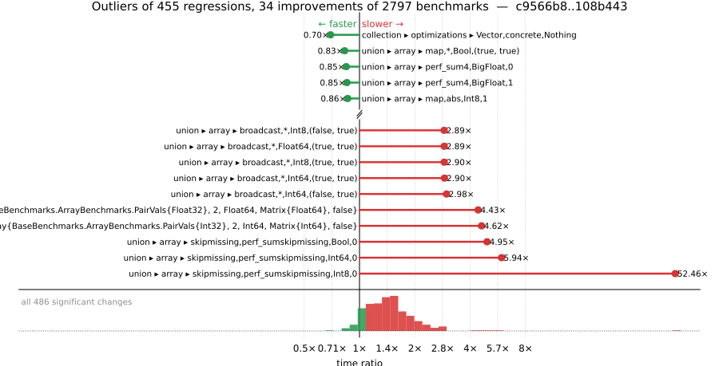

# Benchmark Report

## Summary

**2797** benchmarks were executed, **455** showed regressions, and **34** showed improvements.



## Job Properties

*Commits:* [JuliaLang/julia@108b443d54967dae9cc023b063ad837771442b96](https://github.com/JuliaLang/julia/commit/108b443d54967dae9cc023b063ad837771442b96) vs [JuliaLang/julia@c9566b81ae29e85dc970b7c79777e9c1304fc583](https://github.com/JuliaLang/julia/commit/c9566b81ae29e85dc970b7c79777e9c1304fc583)

*Comparison Diff:* [link](https://github.com/JuliaLang/julia/compare/c9566b81ae29e85dc970b7c79777e9c1304fc583...108b443d54967dae9cc023b063ad837771442b96)

*Triggered By:* [link](https://github.com/JuliaLang/julia/pull/50641#issuecomment-4938887324)

*Tag Predicate:* `"array" || ("collection" || ("micro" || "inference"))`

## Results

*Note: If Chrome is your browser, I strongly recommend installing the [Wide GitHub](https://chrome.google.com/webstore/detail/wide-github/kaalofacklcidaampbokdplbklpeldpj?hl=en)
extension, which makes the result table easier to read.*

Below is a table of this job's results, obtained by running the benchmarks found in
[JuliaCI/BaseBenchmarks.jl](https://github.com/JuliaCI/BaseBenchmarks.jl). The values
listed in the `ID` column have the structure `[parent_group, child_group, ..., key]`,
and can be used to index into the BaseBenchmarks suite to retrieve the corresponding
benchmarks.

The percentages accompanying time and memory values in the below table are noise tolerances. The "true"
time/memory value for a given benchmark is expected to fall within this percentage of the reported value.

A ratio greater than `1.0` denotes a possible regression (marked with :x:), while a ratio less
than `1.0` denotes a possible improvement (marked with :white_check_mark:). Only significant results - results
that indicate possible regressions or improvements - are shown below (thus, an empty table means that all
benchmark results remained invariant between builds).

| ID | time ratio | memory ratio |
|----|------------|--------------|
| `["array", "accumulate", ("accumulate", "Int")]` | 1.08 (5%) :x: | 1.00 (1%)  |
| `["array", "any/all", ("all", "BitArray")]` | 1.97 (5%) :x: | 1.00 (1%)  |
| `["array", "bool", "bitarray_true_fill!"]` | 0.89 (5%) :white_check_mark: | 1.00 (1%)  |
| `["array", "cat", ("catnd", 500)]` | 1.89 (5%) :x: | 1.00 (1%)  |
| `["array", "cat", ("catnd_setind", 5)]` | 1.53 (5%) :x: | 1.00 (1%)  |
| `["array", "cat", ("catnd_setind", 500)]` | 2.40 (5%) :x: | 1.00 (1%)  |
| `["array", "cat", ("hcat", 5)]` | 1.07 (5%) :x: | 1.00 (1%)  |
| `["array", "cat", ("hcat_setind", 5)]` | 2.02 (5%) :x: | 1.00 (1%)  |
| `["array", "cat", ("hcat_setind", 500)]` | 2.23 (5%) :x: | 1.00 (1%)  |
| `["array", "cat", ("hvcat", 5)]` | 1.64 (5%) :x: | 1.00 (1%)  |
| `["array", "cat", ("hvcat", 500)]` | 1.95 (5%) :x: | 1.00 (1%)  |
| `["array", "cat", ("hvcat_setind", 5)]` | 1.90 (5%) :x: | 1.00 (1%)  |
| `["array", "cat", ("hvcat_setind", 500)]` | 1.94 (5%) :x: | 1.00 (1%)  |
| `["array", "cat", ("vcat", 5)]` | 1.69 (5%) :x: | 1.00 (1%)  |
| `["array", "cat", ("vcat", 500)]` | 2.10 (5%) :x: | 1.00 (1%)  |
| `["array", "cat", ("vcat_setind", 5)]` | 1.77 (5%) :x: | 1.00 (1%)  |
| `["array", "cat", ("vcat_setind", 500)]` | 2.08 (5%) :x: | 1.00 (1%)  |
| `["array", "comprehension", ("collect", "StepRangeLen{Float64, Base.TwicePrecision{Float64}, Base.TwicePrecision{Float64}, Int64}")]` | 1.93 (5%) :x: | 1.00 (1%)  |
| `["array", "comprehension", ("comprehension_collect", "StepRangeLen{Float64, Base.TwicePrecision{Float64}, Base.TwicePrecision{Float64}, Int64}")]` | 1.20 (5%) :x: | 1.00 (1%)  |
| `["array", "equality", ("==", "UnitRange{Int64}")]` | 1.20 (5%) :x: | 1.00 (1%)  |
| `["array", "growth", ("append!", 8)]` | 1.06 (5%) :x: | 1.00 (1%)  |
| `["array", "growth", ("prerend!", 8)]` | 1.07 (5%) :x: | 1.00 (1%)  |
| `["array", "growth", ("push_single!", 256)]` | 0.94 (5%) :white_check_mark: | 1.00 (1%)  |
| `["array", "index", "2d"]` | 0.90 (5%) :white_check_mark: | 1.00 (1%)  |
| `["array", "index", "4d"]` | 1.07 (5%) :x: | 1.00 (1%)  |
| `["array", "index", ("sumcolon", "Base.ReinterpretArray{BaseBenchmarks.ArrayBenchmarks.PairVals{Float32}, 2, Float32, Matrix{Float32}, false}")]` | 1.59 (50%) :x: | 1.00 (1%)  |
| `["array", "index", ("sumcolon", "Base.ReinterpretArray{BaseBenchmarks.ArrayBenchmarks.PairVals{Int32}, 2, Int32, Matrix{Int32}, false}")]` | 1.58 (50%) :x: | 1.00 (1%)  |
| `["array", "index", ("sumcolon", "Base.ReinterpretArray{Float32, 2, Int32, Matrix{Int32}, false}")]` | 1.71 (50%) :x: | 1.00 (1%)  |
| `["array", "index", ("sumcolon", "BaseBenchmarks.ArrayBenchmarks.ArrayLF{Float32, 2}")]` | 1.12 (50%)  | 1.02 (1%) :x: |
| `["array", "index", ("sumcolon", "BaseBenchmarks.ArrayBenchmarks.ArrayLF{Int32, 2}")]` | 1.13 (50%)  | 1.02 (1%) :x: |
| `["array", "index", ("sumcolon", "BaseBenchmarks.ArrayBenchmarks.ArrayLSLS{Float32, 2}")]` | 1.11 (50%)  | 1.02 (1%) :x: |
| `["array", "index", ("sumcolon", "BaseBenchmarks.ArrayBenchmarks.ArrayLSLS{Int32, 2}")]` | 1.12 (50%)  | 1.02 (1%) :x: |
| `["array", "index", ("sumcolon", "Matrix{Float32}")]` | 1.13 (50%)  | 1.02 (1%) :x: |
| `["array", "index", ("sumcolon", "Matrix{Int32}")]` | 1.13 (50%)  | 1.02 (1%) :x: |
| `["array", "index", ("sumcolon", "SubArray{Float32, 2, Array{Float32, 3}, Tuple{Int64, Base.Slice{Base.OneTo{Int64}}, Base.Slice{Base.OneTo{Int64}}}, true}")]` | 1.02 (50%)  | 1.02 (1%) :x: |
| `["array", "index", ("sumcolon", "SubArray{Float32, 2, Base.ReshapedArray{Float32, 2, SubArray{Float32, 3, Array{Float32, 3}, Tuple{Base.Slice{Base.OneTo{Int64}}, Base.Slice{Base.OneTo{Int64}}, Base.Slice{Base.OneTo{Int64}}}, true}, Tuple{}}, Tuple{Base.Slice{Base.OneTo{Int64}}, UnitRange{Int64}}, true}")]` | 1.80 (50%) :x: | 1.66 (1%) :x: |
| `["array", "index", ("sumcolon", "SubArray{Float32, 2, BaseBenchmarks.ArrayBenchmarks.ArrayLS{Float32, 2}, Tuple{Base.Slice{Base.OneTo{Int64}}, Base.Slice{Base.OneTo{Int64}}}, false}")]` | 1.09 (50%)  | 1.02 (1%) :x: |
| `["array", "index", ("sumcolon", "SubArray{Float32, 2, BaseBenchmarks.ArrayBenchmarks.ArrayLS{Float32, 3}, Tuple{Int64, Base.Slice{Base.OneTo{Int64}}, Base.Slice{Base.OneTo{Int64}}}, false}")]` | 1.01 (50%)  | 1.02 (1%) :x: |
| `["array", "index", ("sumcolon", "SubArray{Float32, 2, Matrix{Float32}, Tuple{Base.Slice{Base.OneTo{Int64}}, Base.Slice{Base.OneTo{Int64}}}, true}")]` | 1.09 (50%)  | 1.02 (1%) :x: |
| `["array", "index", ("sumcolon", "SubArray{Float32, 2, Matrix{Float32}, Tuple{UnitRange{Int64}, UnitRange{Int64}}, false}")]` | 1.10 (50%)  | 1.02 (1%) :x: |
| `["array", "index", ("sumcolon", "SubArray{Int32, 2, Array{Int32, 3}, Tuple{Int64, Base.Slice{Base.OneTo{Int64}}, Base.Slice{Base.OneTo{Int64}}}, true}")]` | 1.05 (50%)  | 1.02 (1%) :x: |
| `["array", "index", ("sumcolon", "SubArray{Int32, 2, Base.ReshapedArray{Int32, 2, SubArray{Int32, 3, Array{Int32, 3}, Tuple{Base.Slice{Base.OneTo{Int64}}, Base.Slice{Base.OneTo{Int64}}, Base.Slice{Base.OneTo{Int64}}}, true}, Tuple{}}, Tuple{Base.Slice{Base.OneTo{Int64}}, UnitRange{Int64}}, true}")]` | 2.65 (50%) :x: | 1.66 (1%) :x: |
| `["array", "index", ("sumcolon", "SubArray{Int32, 2, BaseBenchmarks.ArrayBenchmarks.ArrayLS{Int32, 2}, Tuple{Base.Slice{Base.OneTo{Int64}}, Base.Slice{Base.OneTo{Int64}}}, false}")]` | 1.09 (50%)  | 1.02 (1%) :x: |
| `["array", "index", ("sumcolon", "SubArray{Int32, 2, BaseBenchmarks.ArrayBenchmarks.ArrayLS{Int32, 3}, Tuple{Int64, Base.Slice{Base.OneTo{Int64}}, Base.Slice{Base.OneTo{Int64}}}, false}")]` | 1.02 (50%)  | 1.02 (1%) :x: |
| `["array", "index", ("sumcolon", "SubArray{Int32, 2, Matrix{Int32}, Tuple{Base.Slice{Base.OneTo{Int64}}, Base.Slice{Base.OneTo{Int64}}}, true}")]` | 1.08 (50%)  | 1.02 (1%) :x: |
| `["array", "index", ("sumcolon", "SubArray{Int32, 2, Matrix{Int32}, Tuple{UnitRange{Int64}, UnitRange{Int64}}, false}")]` | 1.08 (50%)  | 1.02 (1%) :x: |
| `["array", "index", ("sumlogical", "100000:-1:1")]` | 2.65 (50%) :x: | 1.00 (1%)  |
| `["array", "index", ("sumlogical", "Base.ReinterpretArray{BaseBenchmarks.ArrayBenchmarks.PairVals{Float32}, 2, Float64, Matrix{Float64}, false}")]` | 4.43 (50%) :x: | 1.00 (1%)  |
| `["array", "index", ("sumlogical", "Base.ReinterpretArray{BaseBenchmarks.ArrayBenchmarks.PairVals{Int32}, 2, Int64, Matrix{Int64}, false}")]` | 4.62 (50%) :x: | 1.00 (1%)  |
| `["array", "index", ("sumlogical", "Base.ReinterpretArray{Float32, 2, Int32, Matrix{Int32}, false}")]` | 1.92 (50%) :x: | 1.00 (1%)  |
| `["array", "index", ("sumlogical", "BaseBenchmarks.ArrayBenchmarks.ArrayLF{Float32, 2}")]` | 2.04 (50%) :x: | 1.00 (1%)  |
| `["array", "index", ("sumlogical", "BaseBenchmarks.ArrayBenchmarks.ArrayLF{Int32, 2}")]` | 1.97 (50%) :x: | 1.00 (1%)  |
| `["array", "index", ("sumlogical", "BaseBenchmarks.ArrayBenchmarks.ArrayLSLS{Float32, 2}")]` | 1.96 (50%) :x: | 1.00 (1%)  |
| `["array", "index", ("sumlogical", "BaseBenchmarks.ArrayBenchmarks.ArrayLSLS{Int32, 2}")]` | 2.00 (50%) :x: | 1.00 (1%)  |
| `["array", "index", ("sumlogical", "BaseBenchmarks.ArrayBenchmarks.ArrayLS{Float32, 2}")]` | 1.97 (50%) :x: | 1.00 (1%)  |
| `["array", "index", ("sumlogical", "BaseBenchmarks.ArrayBenchmarks.ArrayLS{Int32, 2}")]` | 2.06 (50%) :x: | 1.00 (1%)  |
| `["array", "index", ("sumlogical", "BitMatrix")]` | 1.62 (50%) :x: | 1.00 (1%)  |
| `["array", "index", ("sumlogical", "Matrix{Float32}")]` | 2.01 (50%) :x: | 1.00 (1%)  |
| `["array", "index", ("sumlogical", "Matrix{Float64}")]` | 1.73 (50%) :x: | 1.00 (1%)  |
| `["array", "index", ("sumlogical", "Matrix{Int32}")]` | 1.98 (50%) :x: | 1.00 (1%)  |
| `["array", "index", ("sumlogical", "Matrix{Int64}")]` | 1.72 (50%) :x: | 1.00 (1%)  |
| `["array", "index", ("sumlogical", "SubArray{Float32, 2, BaseBenchmarks.ArrayBenchmarks.ArrayLS{Float32, 2}, Tuple{Base.Slice{Base.OneTo{Int64}}, Base.Slice{Base.OneTo{Int64}}}, false}")]` | 1.93 (50%) :x: | 1.00 (1%)  |
| `["array", "index", ("sumlogical", "SubArray{Float32, 2, BaseBenchmarks.ArrayBenchmarks.ArrayLS{Float32, 3}, Tuple{Int64, Base.Slice{Base.OneTo{Int64}}, Base.Slice{Base.OneTo{Int64}}}, false}")]` | 1.54 (50%) :x: | 1.00 (1%)  |
| `["array", "index", ("sumlogical", "SubArray{Float32, 2, Matrix{Float32}, Tuple{Base.Slice{Base.OneTo{Int64}}, Base.Slice{Base.OneTo{Int64}}}, true}")]` | 2.00 (50%) :x: | 1.00 (1%)  |
| `["array", "index", ("sumlogical", "SubArray{Float32, 2, Matrix{Float32}, Tuple{UnitRange{Int64}, UnitRange{Int64}}, false}")]` | 1.99 (50%) :x: | 1.00 (1%)  |
| `["array", "index", ("sumlogical", "SubArray{Int32, 2, Array{Int32, 3}, Tuple{Int64, Base.Slice{Base.OneTo{Int64}}, Base.Slice{Base.OneTo{Int64}}}, true}")]` | 1.63 (50%) :x: | 1.00 (1%)  |
| `["array", "index", ("sumlogical", "SubArray{Int32, 2, BaseBenchmarks.ArrayBenchmarks.ArrayLS{Int32, 2}, Tuple{Base.Slice{Base.OneTo{Int64}}, Base.Slice{Base.OneTo{Int64}}}, false}")]` | 1.93 (50%) :x: | 1.00 (1%)  |
| `["array", "index", ("sumlogical", "SubArray{Int32, 2, BaseBenchmarks.ArrayBenchmarks.ArrayLS{Int32, 3}, Tuple{Int64, Base.Slice{Base.OneTo{Int64}}, Base.Slice{Base.OneTo{Int64}}}, false}")]` | 1.53 (50%) :x: | 1.00 (1%)  |
| `["array", "index", ("sumlogical", "SubArray{Int32, 2, Matrix{Int32}, Tuple{Base.Slice{Base.OneTo{Int64}}, Base.Slice{Base.OneTo{Int64}}}, true}")]` | 2.01 (50%) :x: | 1.00 (1%)  |
| `["array", "index", ("sumlogical", "SubArray{Int32, 2, Matrix{Int32}, Tuple{UnitRange{Int64}, UnitRange{Int64}}, false}")]` | 1.92 (50%) :x: | 1.00 (1%)  |
| `["array", "index", ("sumlogical_view", "Base.ReinterpretArray{BaseBenchmarks.ArrayBenchmarks.PairVals{Float32}, 2, Float64, Matrix{Float64}, false}")]` | 1.54 (50%) :x: | 1.00 (1%)  |
| `["array", "index", ("sumlogical_view", "Base.ReinterpretArray{BaseBenchmarks.ArrayBenchmarks.PairVals{Int32}, 2, Int64, Matrix{Int64}, false}")]` | 1.53 (50%) :x: | 1.00 (1%)  |
| `["array", "index", ("sumlogical_view", "Base.ReinterpretArray{Float32, 2, Int32, Matrix{Int32}, false}")]` | 1.50 (50%) :x: | 1.00 (1%)  |
| `["array", "index", ("sumlogical_view", "BaseBenchmarks.ArrayBenchmarks.ArrayLF{Float32, 2}")]` | 1.52 (50%) :x: | 1.00 (1%)  |
| `["array", "index", ("sumlogical_view", "BaseBenchmarks.ArrayBenchmarks.ArrayLF{Int32, 2}")]` | 1.53 (50%) :x: | 1.00 (1%)  |
| `["array", "index", ("sumlogical_view", "BaseBenchmarks.ArrayBenchmarks.ArrayLSLS{Int32, 2}")]` | 1.51 (50%) :x: | 1.00 (1%)  |
| `["array", "index", ("sumlogical_view", "BaseBenchmarks.ArrayBenchmarks.ArrayLS{Float32, 2}")]` | 1.52 (50%) :x: | 1.00 (1%)  |
| `["array", "index", ("sumlogical_view", "BitMatrix")]` | 1.53 (50%) :x: | 1.00 (1%)  |
| `["array", "index", ("sumlogical_view", "Matrix{Float32}")]` | 1.54 (50%) :x: | 1.00 (1%)  |
| `["array", "index", ("sumlogical_view", "Matrix{Int32}")]` | 1.53 (50%) :x: | 1.00 (1%)  |
| `["array", "index", ("sumlogical_view", "SubArray{Float32, 2, Array{Float32, 3}, Tuple{Int64, Base.Slice{Base.OneTo{Int64}}, Base.Slice{Base.OneTo{Int64}}}, true}")]` | 1.52 (50%) :x: | 1.00 (1%)  |
| `["array", "index", ("sumlogical_view", "SubArray{Float32, 2, BaseBenchmarks.ArrayBenchmarks.ArrayLS{Float32, 2}, Tuple{Base.Slice{Base.OneTo{Int64}}, Base.Slice{Base.OneTo{Int64}}}, false}")]` | 1.52 (50%) :x: | 1.00 (1%)  |
| `["array", "index", ("sumlogical_view", "SubArray{Float32, 2, Matrix{Float32}, Tuple{Base.Slice{Base.OneTo{Int64}}, Base.Slice{Base.OneTo{Int64}}}, true}")]` | 1.53 (50%) :x: | 1.00 (1%)  |
| `["array", "index", ("sumlogical_view", "SubArray{Float32, 2, Matrix{Float32}, Tuple{UnitRange{Int64}, UnitRange{Int64}}, false}")]` | 1.99 (50%) :x: | 1.00 (1%)  |
| `["array", "index", ("sumlogical_view", "SubArray{Int32, 2, Matrix{Int32}, Tuple{Base.Slice{Base.OneTo{Int64}}, Base.Slice{Base.OneTo{Int64}}}, true}")]` | 1.53 (50%) :x: | 1.00 (1%)  |
| `["array", "index", ("sumlogical_view", "SubArray{Int32, 2, Matrix{Int32}, Tuple{UnitRange{Int64}, UnitRange{Int64}}, false}")]` | 1.96 (50%) :x: | 1.00 (1%)  |
| `["array", "index", ("sumrange", "Base.ReinterpretArray{BaseBenchmarks.ArrayBenchmarks.PairVals{Float32}, 2, Float32, Matrix{Float32}, false}")]` | 1.70 (50%) :x: | 1.00 (1%)  |
| `["array", "index", ("sumrange", "Base.ReinterpretArray{BaseBenchmarks.ArrayBenchmarks.PairVals{Float32}, 2, Float64, Matrix{Float64}, false}")]` | 1.56 (50%) :x: | 1.00 (1%)  |
| `["array", "index", ("sumrange", "Base.ReinterpretArray{BaseBenchmarks.ArrayBenchmarks.PairVals{Int32}, 2, Int32, Matrix{Int32}, false}")]` | 1.67 (50%) :x: | 1.00 (1%)  |
| `["array", "index", ("sumrange", "Base.ReinterpretArray{BaseBenchmarks.ArrayBenchmarks.PairVals{Int32}, 2, Int64, Matrix{Int64}, false}")]` | 1.55 (50%) :x: | 1.00 (1%)  |
| `["array", "index", ("sumrange", "Base.ReinterpretArray{Float32, 2, Int32, Matrix{Int32}, false}")]` | 2.10 (50%) :x: | 1.02 (1%) :x: |
| `["array", "index", ("sumrange", "BaseBenchmarks.ArrayBenchmarks.ArrayLF{Float32, 2}")]` | 1.11 (50%)  | 1.02 (1%) :x: |
| `["array", "index", ("sumrange", "BaseBenchmarks.ArrayBenchmarks.ArrayLF{Int32, 2}")]` | 1.10 (50%)  | 1.02 (1%) :x: |
| `["array", "index", ("sumrange", "BaseBenchmarks.ArrayBenchmarks.ArrayLSLS{Float32, 2}")]` | 1.11 (50%)  | 1.02 (1%) :x: |
| `["array", "index", ("sumrange", "BaseBenchmarks.ArrayBenchmarks.ArrayLSLS{Int32, 2}")]` | 1.12 (50%)  | 1.02 (1%) :x: |
| `["array", "index", ("sumrange", "BaseBenchmarks.ArrayBenchmarks.ArrayLS{Float32, 2}")]` | 1.10 (50%)  | 1.02 (1%) :x: |
| `["array", "index", ("sumrange", "BaseBenchmarks.ArrayBenchmarks.ArrayLS{Int32, 2}")]` | 1.08 (50%)  | 1.02 (1%) :x: |
| `["array", "index", ("sumrange", "Matrix{Float32}")]` | 1.10 (50%)  | 1.02 (1%) :x: |
| `["array", "index", ("sumrange", "Matrix{Int32}")]` | 1.13 (50%)  | 1.02 (1%) :x: |
| `["array", "index", ("sumrange", "SubArray{Float32, 2, Array{Float32, 3}, Tuple{Int64, Base.Slice{Base.OneTo{Int64}}, Base.Slice{Base.OneTo{Int64}}}, true}")]` | 1.13 (50%)  | 1.02 (1%) :x: |
| `["array", "index", ("sumrange", "SubArray{Float32, 2, Base.ReshapedArray{Float32, 2, SubArray{Float32, 3, Array{Float32, 3}, Tuple{Base.Slice{Base.OneTo{Int64}}, Base.Slice{Base.OneTo{Int64}}, Base.Slice{Base.OneTo{Int64}}}, true}, Tuple{}}, Tuple{Base.Slice{Base.OneTo{Int64}}, UnitRange{Int64}}, true}")]` | 2.43 (50%) :x: | 1.66 (1%) :x: |
| `["array", "index", ("sumrange", "SubArray{Float32, 2, BaseBenchmarks.ArrayBenchmarks.ArrayLS{Float32, 2}, Tuple{Base.Slice{Base.OneTo{Int64}}, Base.Slice{Base.OneTo{Int64}}}, false}")]` | 1.09 (50%)  | 1.02 (1%) :x: |
| `["array", "index", ("sumrange", "SubArray{Float32, 2, BaseBenchmarks.ArrayBenchmarks.ArrayLS{Float32, 3}, Tuple{Int64, Base.Slice{Base.OneTo{Int64}}, Base.Slice{Base.OneTo{Int64}}}, false}")]` | 1.03 (50%)  | 1.02 (1%) :x: |
| `["array", "index", ("sumrange", "SubArray{Float32, 2, Matrix{Float32}, Tuple{Base.Slice{Base.OneTo{Int64}}, Base.Slice{Base.OneTo{Int64}}}, true}")]` | 1.09 (50%)  | 1.02 (1%) :x: |
| `["array", "index", ("sumrange", "SubArray{Float32, 2, Matrix{Float32}, Tuple{UnitRange{Int64}, UnitRange{Int64}}, false}")]` | 1.12 (50%)  | 1.02 (1%) :x: |
| `["array", "index", ("sumrange", "SubArray{Int32, 2, Array{Int32, 3}, Tuple{Int64, Base.Slice{Base.OneTo{Int64}}, Base.Slice{Base.OneTo{Int64}}}, true}")]` | 1.04 (50%)  | 1.02 (1%) :x: |
| `["array", "index", ("sumrange", "SubArray{Int32, 2, Base.ReshapedArray{Int32, 2, SubArray{Int32, 3, Array{Int32, 3}, Tuple{Base.Slice{Base.OneTo{Int64}}, Base.Slice{Base.OneTo{Int64}}, Base.Slice{Base.OneTo{Int64}}}, true}, Tuple{}}, Tuple{Base.Slice{Base.OneTo{Int64}}, UnitRange{Int64}}, true}")]` | 2.53 (50%) :x: | 1.66 (1%) :x: |
| `["array", "index", ("sumrange", "SubArray{Int32, 2, BaseBenchmarks.ArrayBenchmarks.ArrayLS{Int32, 2}, Tuple{Base.Slice{Base.OneTo{Int64}}, Base.Slice{Base.OneTo{Int64}}}, false}")]` | 1.11 (50%)  | 1.02 (1%) :x: |
| `["array", "index", ("sumrange", "SubArray{Int32, 2, BaseBenchmarks.ArrayBenchmarks.ArrayLS{Int32, 3}, Tuple{Int64, Base.Slice{Base.OneTo{Int64}}, Base.Slice{Base.OneTo{Int64}}}, false}")]` | 1.04 (50%)  | 1.02 (1%) :x: |
| `["array", "index", ("sumrange", "SubArray{Int32, 2, Matrix{Int32}, Tuple{Base.Slice{Base.OneTo{Int64}}, Base.Slice{Base.OneTo{Int64}}}, true}")]` | 1.10 (50%)  | 1.02 (1%) :x: |
| `["array", "index", ("sumrange", "SubArray{Int32, 2, Matrix{Int32}, Tuple{UnitRange{Int64}, UnitRange{Int64}}, false}")]` | 1.13 (50%)  | 1.02 (1%) :x: |
| `["array", "index", ("sumvector_view", "SubArray{Float32, 2, Matrix{Float32}, Tuple{UnitRange{Int64}, UnitRange{Int64}}, false}")]` | 1.55 (50%) :x: | 1.50 (1%) :x: |
| `["array", "index", ("sumvector_view", "SubArray{Int32, 2, Matrix{Int32}, Tuple{UnitRange{Int64}, UnitRange{Int64}}, false}")]` | 1.50 (50%)  | 1.50 (1%) :x: |
| `["array", "setindex!", ("setindex!", 3)]` | 1.09 (5%) :x: | 1.00 (1%)  |
| `["array", "subarray", ("lucompletepivCopy!", 100)]` | 1.11 (5%) :x: | 1.00 (1%)  |
| `["array", "subarray", ("lucompletepivCopy!", 250)]` | 1.08 (5%) :x: | 1.00 (1%)  |
| `["array", "subarray", ("lucompletepivCopy!", 500)]` | 1.07 (5%) :x: | 1.00 (1%)  |
| `["broadcast", "dotop", ("Float64", "(1000, 1000)", 2)]` | 1.01 (5%)  | Inf (1%) :x: |
| `["broadcast", "dotop", ("Float64", "(1000000,)", 1)]` | 2.52 (5%) :x: | Inf (1%) :x: |
| `["broadcast", "dotop", ("Float64", "(1000000,)", 2)]` | 1.00 (5%)  | Inf (1%) :x: |
| `["broadcast", "fusion", ("Float64", "(1000, 1000)", 2)]` | 1.79 (5%) :x: | 1.00 (1%)  |
| `["broadcast", "fusion", ("Float64", "(1000, 1000)", 3)]` | 1.85 (5%) :x: | 1.00 (1%)  |
| `["broadcast", "sparse", ("(1000, 1000)", 2)]` | 1.08 (5%) :x: | 1.00 (1%)  |
| `["broadcast", "sparse", ("(10000000,)", 2)]` | 1.27 (5%) :x: | 1.00 (1%)  |
| `["broadcast", "typeargs", ("array", 10)]` | 1.34 (5%) :x: | 1.11 (1%) :x: |
| `["broadcast", "typeargs", ("array", 3)]` | 1.38 (5%) :x: | 1.20 (1%) :x: |
| `["broadcast", "typeargs", ("array", 5)]` | 1.37 (5%) :x: | 1.17 (1%) :x: |
| `["collection", "deletion", ("BitSet", "Int", "pop!")]` | 1.89 (25%) :x: | 1.00 (1%)  |
| `["collection", "deletion", ("Dict", "Int", "pop!")]` | 1.52 (25%) :x: | 1.00 (1%)  |
| `["collection", "deletion", ("Dict", "String", "pop!")]` | 1.72 (25%) :x: | 1.00 (1%)  |
| `["collection", "deletion", ("Set", "Any", "filter!")]` | 1.67 (25%) :x: | 1.00 (1%)  |
| `["collection", "deletion", ("Set", "Int", "filter!")]` | 2.02 (25%) :x: | 1.00 (1%)  |
| `["collection", "deletion", ("Set", "Int", "filter")]` | 1.74 (25%) :x: | 1.00 (1%)  |
| `["collection", "deletion", ("Set", "Int", "pop!")]` | 1.72 (25%) :x: | 1.00 (1%)  |
| `["collection", "deletion", ("Set", "String", "filter!")]` | 1.78 (25%) :x: | 1.00 (1%)  |
| `["collection", "deletion", ("Set", "String", "filter")]` | 1.55 (25%) :x: | 1.00 (1%)  |
| `["collection", "deletion", ("Set", "String", "pop!")]` | 1.73 (25%) :x: | 1.00 (1%)  |
| `["collection", "deletion", ("Vector", "Int", "filter!")]` | 2.37 (25%) :x: | 1.00 (1%)  |
| `["collection", "deletion", ("Vector", "Int", "filter")]` | 2.16 (25%) :x: | 1.00 (1%)  |
| `["collection", "deletion", ("Vector", "Int", "pop!")]` | 1.59 (25%) :x: | 1.00 (1%)  |
| `["collection", "deletion", ("Vector", "String", "filter!")]` | 1.26 (25%) :x: | 1.00 (1%)  |
| `["collection", "deletion", ("Vector", "String", "filter")]` | 1.28 (25%) :x: | 1.00 (1%)  |
| `["collection", "initialization", ("Dict", "Int", "iterator")]` | 1.42 (25%) :x: | 1.00 (1%)  |
| `["collection", "initialization", ("Dict", "Int", "loop")]` | 1.43 (25%) :x: | 1.00 (1%)  |
| `["collection", "initialization", ("Dict", "Int", "loop", "sizehint!")]` | 1.36 (25%) :x: | 1.00 (1%)  |
| `["collection", "initialization", ("Set", "Int", "iterator")]` | 1.44 (25%) :x: | 1.00 (1%)  |
| `["collection", "initialization", ("Set", "Int", "loop")]` | 1.53 (25%) :x: | 1.00 (1%)  |
| `["collection", "initialization", ("Set", "Int", "loop", "sizehint!")]` | 1.48 (25%) :x: | 1.00 (1%)  |
| `["collection", "iteration", ("Dict", "Any", "iterate second")]` | 1.32 (25%) :x: | 1.00 (1%)  |
| `["collection", "iteration", ("Dict", "Any", "iterate")]` | 1.33 (25%) :x: | 1.00 (1%)  |
| `["collection", "iteration", ("Dict", "Int", "iterate second")]` | 1.39 (25%) :x: | 1.00 (1%)  |
| `["collection", "iteration", ("Dict", "Int", "iterate")]` | 1.47 (25%) :x: | 1.00 (1%)  |
| `["collection", "iteration", ("Dict", "String", "iterate second")]` | 1.32 (25%) :x: | 1.00 (1%)  |
| `["collection", "iteration", ("Dict", "String", "iterate")]` | 1.28 (25%) :x: | 1.00 (1%)  |
| `["collection", "iteration", ("Set", "Int", "iterate second")]` | 1.61 (25%) :x: | 1.00 (1%)  |
| `["collection", "iteration", ("Set", "Int", "iterate")]` | 1.87 (25%) :x: | 1.00 (1%)  |
| `["collection", "iteration", ("Set", "String", "iterate second")]` | 1.55 (25%) :x: | 1.00 (1%)  |
| `["collection", "iteration", ("Set", "String", "iterate")]` | 1.50 (25%) :x: | 1.00 (1%)  |
| `["collection", "optimizations", ("Dict", "abstract", "Bool")]` | 1.47 (25%) :x: | 1.00 (1%)  |
| `["collection", "optimizations", ("Dict", "abstract", "Int8")]` | 1.47 (25%) :x: | 1.00 (1%)  |
| `["collection", "optimizations", ("Dict", "abstract", "Nothing")]` | 1.81 (25%) :x: | 1.00 (1%)  |
| `["collection", "optimizations", ("Dict", "abstract", "UInt16")]` | 1.36 (25%) :x: | 1.00 (1%)  |
| `["collection", "optimizations", ("Dict", "concrete", "Bool")]` | 1.47 (25%) :x: | 1.00 (1%)  |
| `["collection", "optimizations", ("Dict", "concrete", "Int8")]` | 1.48 (25%) :x: | 1.00 (1%)  |
| `["collection", "optimizations", ("Dict", "concrete", "Nothing")]` | 1.75 (25%) :x: | 1.00 (1%)  |
| `["collection", "optimizations", ("Dict", "concrete", "UInt16")]` | 1.36 (25%) :x: | 1.00 (1%)  |
| `["collection", "optimizations", ("Set", "abstract", "Bool")]` | 1.44 (25%) :x: | 1.00 (1%)  |
| `["collection", "optimizations", ("Set", "abstract", "Int8")]` | 1.50 (25%) :x: | 1.00 (1%)  |
| `["collection", "optimizations", ("Set", "abstract", "UInt16")]` | 1.32 (25%) :x: | 1.00 (1%)  |
| `["collection", "optimizations", ("Set", "concrete", "Bool")]` | 1.44 (25%) :x: | 1.00 (1%)  |
| `["collection", "optimizations", ("Set", "concrete", "Int8")]` | 1.50 (25%) :x: | 1.00 (1%)  |
| `["collection", "optimizations", ("Set", "concrete", "UInt16")]` | 1.32 (25%) :x: | 1.00 (1%)  |
| `["collection", "optimizations", ("Vector", "concrete", "Nothing")]` | 0.70 (25%) :white_check_mark: | 1.00 (1%)  |
| `["collection", "queries & updates", ("BitSet", "Int", "first")]` | 2.29 (25%) :x: | 1.00 (1%)  |
| `["collection", "queries & updates", ("Dict", "Int", "first")]` | 1.80 (25%) :x: | 1.00 (1%)  |
| `["collection", "queries & updates", ("Dict", "Int", "in", "true")]` | 1.30 (25%) :x: | 1.00 (1%)  |
| `["collection", "queries & updates", ("Dict", "Int", "pop!", "unspecified")]` | 1.39 (25%) :x: | 1.00 (1%)  |
| `["collection", "queries & updates", ("Dict", "Int", "push!", "new")]` | 1.34 (25%) :x: | 1.00 (1%)  |
| `["collection", "queries & updates", ("Dict", "Int", "push!", "overwrite")]` | 1.34 (25%) :x: | 1.00 (1%)  |
| `["collection", "queries & updates", ("Dict", "Int", "setindex!", "new")]` | 1.31 (25%) :x: | 1.00 (1%)  |
| `["collection", "queries & updates", ("Dict", "Int", "setindex!", "overwrite")]` | 1.31 (25%) :x: | 1.00 (1%)  |
| `["collection", "queries & updates", ("Set", "Int", "first")]` | 1.95 (25%) :x: | 1.00 (1%)  |
| `["collection", "queries & updates", ("Set", "Int", "in", "false")]` | 1.28 (25%) :x: | 1.00 (1%)  |
| `["collection", "queries & updates", ("Set", "Int", "pop!", "unspecified")]` | 1.41 (25%) :x: | 1.00 (1%)  |
| `["collection", "queries & updates", ("Set", "Int", "push!", "new")]` | 1.33 (25%) :x: | 1.00 (1%)  |
| `["collection", "queries & updates", ("Set", "Int", "push!", "overwrite")]` | 1.33 (25%) :x: | 1.00 (1%)  |
| `["collection", "queries & updates", ("Vector", "Int", "pop!", "unspecified")]` | 1.76 (25%) :x: | 1.00 (1%)  |
| `["collection", "set operations", ("BitSet", "Int", "<", "BitSet")]` | 1.58 (25%) :x: | 1.00 (1%)  |
| `["collection", "set operations", ("BitSet", "Int", "intersect!", "BitSet")]` | 1.40 (25%) :x: | 1.00 (1%)  |
| `["collection", "set operations", ("BitSet", "Int", "intersect", "Set")]` | 1.42 (25%) :x: | 1.00 (1%)  |
| `["collection", "set operations", ("BitSet", "Int", "intersect", "Set", "Set")]` | 1.55 (25%) :x: | 1.00 (1%)  |
| `["collection", "set operations", ("BitSet", "Int", "setdiff!", "BitSet")]` | 1.41 (25%) :x: | 1.00 (1%)  |
| `["collection", "set operations", ("BitSet", "Int", "setdiff!", "Set")]` | 2.05 (25%) :x: | 1.00 (1%)  |
| `["collection", "set operations", ("BitSet", "Int", "setdiff", "Set")]` | 1.70 (25%) :x: | 1.00 (1%)  |
| `["collection", "set operations", ("BitSet", "Int", "symdiff!", "BitSet")]` | 1.41 (25%) :x: | 1.00 (1%)  |
| `["collection", "set operations", ("BitSet", "Int", "symdiff!", "Set")]` | 1.35 (25%) :x: | 1.00 (1%)  |
| `["collection", "set operations", ("BitSet", "Int", "symdiff", "Set", "Set")]` | 1.26 (25%) :x: | 1.00 (1%)  |
| `["collection", "set operations", ("BitSet", "Int", "union!", "BitSet")]` | 1.36 (25%) :x: | 1.00 (1%)  |
| `["collection", "set operations", ("BitSet", "Int", "union!", "Set")]` | 1.73 (25%) :x: | 1.00 (1%)  |
| `["collection", "set operations", ("BitSet", "Int", "union", "Set")]` | 1.41 (25%) :x: | 1.00 (1%)  |
| `["collection", "set operations", ("BitSet", "Int", "union", "Set", "Set")]` | 1.55 (25%) :x: | 1.00 (1%)  |
| `["collection", "set operations", ("BitSet", "Int", "⊆", "BitSet")]` | 1.46 (25%) :x: | 1.00 (1%)  |
| `["collection", "set operations", ("BitSet", "Int", "⊆", "self")]` | 1.44 (25%) :x: | 1.00 (1%)  |
| `["collection", "set operations", ("Set", "Int", "==", "self")]` | 2.52 (25%) :x: | 1.00 (1%)  |
| `["collection", "set operations", ("Set", "Int", "intersect", "BitSet")]` | 1.45 (25%) :x: | 1.00 (1%)  |
| `["collection", "set operations", ("Set", "Int", "intersect", "BitSet", "BitSet")]` | 1.50 (25%) :x: | 1.00 (1%)  |
| `["collection", "set operations", ("Set", "Int", "intersect", "Set")]` | 1.40 (25%) :x: | 1.00 (1%)  |
| `["collection", "set operations", ("Set", "Int", "intersect", "Set", "Set")]` | 1.40 (25%) :x: | 1.00 (1%)  |
| `["collection", "set operations", ("Set", "Int", "intersect", "Vector")]` | 1.29 (25%) :x: | 1.00 (1%)  |
| `["collection", "set operations", ("Set", "Int", "intersect", "Vector", "Vector")]` | 1.35 (25%) :x: | 1.00 (1%)  |
| `["collection", "set operations", ("Set", "Int", "setdiff!", "BitSet")]` | 1.72 (25%) :x: | 1.00 (1%)  |
| `["collection", "set operations", ("Set", "Int", "setdiff!", "Set")]` | 1.57 (25%) :x: | 1.00 (1%)  |
| `["collection", "set operations", ("Set", "Int", "setdiff!", "Vector")]` | 1.31 (25%) :x: | 1.00 (1%)  |
| `["collection", "set operations", ("Set", "Int", "symdiff", "BitSet")]` | 1.68 (25%) :x: | 1.00 (1%)  |
| `["collection", "set operations", ("Set", "Int", "symdiff", "BitSet", "BitSet")]` | 1.68 (25%) :x: | 1.00 (1%)  |
| `["collection", "set operations", ("Set", "Int", "symdiff", "Set")]` | 1.71 (25%) :x: | 1.00 (1%)  |
| `["collection", "set operations", ("Set", "Int", "symdiff", "Set", "Set")]` | 1.70 (25%) :x: | 1.00 (1%)  |
| `["collection", "set operations", ("Set", "Int", "symdiff", "Vector")]` | 1.67 (25%) :x: | 1.00 (1%)  |
| `["collection", "set operations", ("Set", "Int", "symdiff", "Vector", "Vector")]` | 1.69 (25%) :x: | 1.00 (1%)  |
| `["collection", "set operations", ("Set", "Int", "union!", "BitSet")]` | 1.85 (25%) :x: | 1.00 (1%)  |
| `["collection", "set operations", ("Set", "Int", "union!", "Set")]` | 1.54 (25%) :x: | 1.00 (1%)  |
| `["collection", "set operations", ("Set", "Int", "union!", "Vector")]` | 1.41 (25%) :x: | 1.00 (1%)  |
| `["collection", "set operations", ("Set", "Int", "union", "BitSet")]` | 1.54 (25%) :x: | 1.00 (1%)  |
| `["collection", "set operations", ("Set", "Int", "union", "BitSet", "BitSet")]` | 1.54 (25%) :x: | 1.00 (1%)  |
| `["collection", "set operations", ("Set", "Int", "union", "Set")]` | 1.52 (25%) :x: | 1.00 (1%)  |
| `["collection", "set operations", ("Set", "Int", "union", "Set", "Set")]` | 1.52 (25%) :x: | 1.00 (1%)  |
| `["collection", "set operations", ("Set", "Int", "union", "Vector")]` | 1.51 (25%) :x: | 1.00 (1%)  |
| `["collection", "set operations", ("Set", "Int", "union", "Vector", "Vector")]` | 1.50 (25%) :x: | 1.00 (1%)  |
| `["collection", "set operations", ("Set", "Int", "⊆", "BitSet")]` | 1.31 (25%) :x: | 1.00 (1%)  |
| `["collection", "set operations", ("Set", "Int", "⊆", "self")]` | 2.68 (25%) :x: | 1.00 (1%)  |
| `["collection", "set operations", ("Vector", "Int", "intersect")]` | 1.39 (25%) :x: | 1.00 (1%)  |
| `["collection", "set operations", ("Vector", "Int", "intersect", "BitSet")]` | 1.55 (25%) :x: | 1.00 (1%)  |
| `["collection", "set operations", ("Vector", "Int", "intersect", "BitSet", "BitSet")]` | 1.56 (25%) :x: | 1.00 (1%)  |
| `["collection", "set operations", ("Vector", "Int", "intersect", "Set")]` | 1.55 (25%) :x: | 1.00 (1%)  |
| `["collection", "set operations", ("Vector", "Int", "intersect", "Set", "Set")]` | 1.56 (25%) :x: | 1.00 (1%)  |
| `["collection", "set operations", ("Vector", "Int", "intersect", "Vector")]` | 1.57 (25%) :x: | 1.00 (1%)  |
| `["collection", "set operations", ("Vector", "Int", "intersect", "Vector", "Vector")]` | 1.58 (25%) :x: | 1.00 (1%)  |
| `["collection", "set operations", ("Vector", "Int", "setdiff", "Set")]` | 1.27 (25%) :x: | 1.00 (1%)  |
| `["collection", "set operations", ("Vector", "Int", "setdiff", "Vector")]` | 1.27 (25%) :x: | 1.00 (1%)  |
| `["collection", "set operations", ("Vector", "Int", "symdiff")]` | 1.35 (25%) :x: | 1.00 (1%)  |
| `["collection", "set operations", ("Vector", "Int", "symdiff", "BitSet")]` | 1.33 (25%) :x: | 1.00 (1%)  |
| `["collection", "set operations", ("Vector", "Int", "symdiff", "BitSet", "BitSet")]` | 1.34 (25%) :x: | 1.00 (1%)  |
| `["collection", "set operations", ("Vector", "Int", "symdiff", "Set")]` | 1.33 (25%) :x: | 1.00 (1%)  |
| `["collection", "set operations", ("Vector", "Int", "symdiff", "Set", "Set")]` | 1.46 (25%) :x: | 1.00 (1%)  |
| `["collection", "set operations", ("Vector", "Int", "symdiff", "Vector")]` | 1.32 (25%) :x: | 1.00 (1%)  |
| `["collection", "set operations", ("Vector", "Int", "symdiff", "Vector", "Vector")]` | 1.31 (25%) :x: | 1.00 (1%)  |
| `["collection", "set operations", ("Vector", "Int", "union")]` | 1.38 (25%) :x: | 1.00 (1%)  |
| `["collection", "set operations", ("Vector", "Int", "union", "BitSet")]` | 1.39 (25%) :x: | 1.00 (1%)  |
| `["collection", "set operations", ("Vector", "Int", "union", "BitSet", "BitSet")]` | 1.42 (25%) :x: | 1.00 (1%)  |
| `["collection", "set operations", ("Vector", "Int", "union", "Set")]` | 1.38 (25%) :x: | 1.00 (1%)  |
| `["collection", "set operations", ("Vector", "Int", "union", "Set", "Set")]` | 1.41 (25%) :x: | 1.00 (1%)  |
| `["collection", "set operations", ("Vector", "Int", "union", "Vector")]` | 1.37 (25%) :x: | 1.00 (1%)  |
| `["collection", "set operations", ("Vector", "Int", "union", "Vector", "Vector")]` | 1.39 (25%) :x: | 1.00 (1%)  |
| `["collection", "set operations", ("empty", "Int", "<", "BitSet")]` | 1.41 (25%) :x: | 1.00 (1%)  |
| `["collection", "set operations", ("empty", "Int", "<", "Set")]` | 1.30 (25%) :x: | 1.00 (1%)  |
| `["collection", "set operations", ("empty", "Int", "⊆", "BitSet")]` | 1.31 (25%) :x: | 1.00 (1%)  |
| `["collection", "set operations", ("empty", "Int", "⊆", "Set")]` | 1.37 (25%) :x: | 1.00 (1%)  |
| `["inference", "abstract interpretation", "Base.init_stdio(::Ptr{Cvoid})"]` | 1.02 (5%)  | 0.99 (1%) :white_check_mark: |
| `["inference", "abstract interpretation", "REPL.REPLCompletions.completions"]` | 1.02 (5%)  | 0.99 (1%) :white_check_mark: |
| `["inference", "abstract interpretation", "broadcasting"]` | 1.02 (5%)  | 0.98 (1%) :white_check_mark: |
| `["inference", "abstract interpretation", "many_const_calls"]` | 1.02 (5%)  | 0.99 (1%) :white_check_mark: |
| `["inference", "abstract interpretation", "many_global_refs"]` | 1.07 (5%) :x: | 1.00 (1%)  |
| `["inference", "abstract interpretation", "many_invoke_calls"]` | 1.04 (5%)  | 0.98 (1%) :white_check_mark: |
| `["inference", "abstract interpretation", "many_local_vars"]` | 1.06 (5%) :x: | 0.98 (1%) :white_check_mark: |
| `["inference", "abstract interpretation", "many_method_matches"]` | 1.11 (5%) :x: | 0.98 (1%) :white_check_mark: |
| `["inference", "abstract interpretation", "many_opaque_closures"]` | 1.06 (5%) :x: | 0.99 (1%) :white_check_mark: |
| `["inference", "abstract interpretation", "println(::QuoteNode)"]` | 1.01 (5%)  | 0.98 (1%) :white_check_mark: |
| `["inference", "abstract interpretation", "rand(Float64)"]` | 1.03 (5%)  | 0.98 (1%) :white_check_mark: |
| `["inference", "abstract interpretation", "sin(42)"]` | 1.03 (5%)  | 0.99 (1%) :white_check_mark: |
| `["inference", "allinference", "REPL.REPLCompletions.completions"]` | 1.02 (5%)  | 0.98 (1%) :white_check_mark: |
| `["inference", "allinference", "broadcasting"]` | 1.00 (5%)  | 0.98 (1%) :white_check_mark: |
| `["inference", "allinference", "many_global_refs"]` | 1.07 (5%) :x: | 1.00 (1%)  |
| `["inference", "allinference", "many_invoke_calls"]` | 1.03 (5%)  | 1.01 (1%) :x: |
| `["inference", "optimization", "broadcasting"]` | 1.15 (5%) :x: | 1.20 (1%) :x: |
| `["inference", "optimization", "many_global_refs"]` | 1.09 (5%) :x: | 1.00 (1%)  |
| `["inference", "optimization", "many_local_vars"]` | 1.09 (5%) :x: | 1.01 (1%)  |
| `["linalg", "arithmetic", ("cumsum!", "Int32", 1024)]` | 1.54 (45%) :x: | 1.00 (1%)  |
| `["linalg", "arithmetic", ("cumsum!", "Int32", 256)]` | 1.50 (45%) :x: | 1.00 (1%)  |
| `["linalg", "small exp #29116"]` | 1.08 (5%) :x: | 1.00 (1%)  |
| `["micro", "printfd"]` | 1.06 (5%) :x: | 1.00 (1%)  |
| `["micro", "randmatstat"]` | 1.05 (5%) :x: | 1.00 (1%)  |
| `["misc", "repeat", (200, 24, 1)]` | 1.31 (5%) :x: | 1.00 (1%)  |
| `["problem", "laplacian", "laplace_iter_sub"]` | 1.45 (5%) :x: | 1.00 (1%)  |
| `["problem", "laplacian", "laplace_iter_vec"]` | 1.64 (5%) :x: | 1.00 (1%)  |
| `["problem", "laplacian", "laplace_sparse_matvec"]` | 1.06 (5%) :x: | 1.00 (1%)  |
| `["simd", ("CartesianPartition", "manual_partition!", "Float32", 2, 64)]` | 1.37 (20%) :x: | 1.00 (1%)  |
| `["simd", ("CartesianPartition", "manual_partition!", "Float32", 3, 32)]` | 1.24 (20%) :x: | 1.00 (1%)  |
| `["simd", ("CartesianPartition", "manual_partition!", "Float32", 3, 64)]` | 1.44 (20%) :x: | 1.00 (1%)  |
| `["simd", ("CartesianPartition", "manual_partition!", "Float32", 4, 64)]` | 1.21 (20%) :x: | 1.00 (1%)  |
| `["simd", ("CartesianPartition", "manual_partition!", "Float64", 2, 64)]` | 1.24 (20%) :x: | 1.00 (1%)  |
| `["simd", ("CartesianPartition", "manual_partition!", "Float64", 3, 32)]` | 1.31 (20%) :x: | 1.00 (1%)  |
| `["simd", ("CartesianPartition", "manual_partition!", "Float64", 3, 64)]` | 1.30 (20%) :x: | 1.00 (1%)  |
| `["simd", ("CartesianPartition", "manual_partition!", "Int32", 2, 31)]` | 1.22 (20%) :x: | 1.00 (1%)  |
| `["simd", ("CartesianPartition", "manual_partition!", "Int32", 2, 63)]` | 1.25 (20%) :x: | 1.00 (1%)  |
| `["simd", ("CartesianPartition", "manual_partition!", "Int32", 2, 64)]` | 1.33 (20%) :x: | 1.00 (1%)  |
| `["simd", ("CartesianPartition", "manual_partition!", "Int32", 3, 31)]` | 1.21 (20%) :x: | 1.00 (1%)  |
| `["simd", ("CartesianPartition", "manual_partition!", "Int32", 3, 32)]` | 1.23 (20%) :x: | 1.00 (1%)  |
| `["simd", ("CartesianPartition", "manual_partition!", "Int32", 3, 63)]` | 1.25 (20%) :x: | 1.00 (1%)  |
| `["simd", ("CartesianPartition", "manual_partition!", "Int32", 3, 64)]` | 1.41 (20%) :x: | 1.00 (1%)  |
| `["simd", ("CartesianPartition", "manual_partition!", "Int64", 3, 32)]` | 1.26 (20%) :x: | 1.00 (1%)  |
| `["simd", ("CartesianPartition", "manual_partition!", "Int64", 3, 63)]` | 1.25 (20%) :x: | 1.00 (1%)  |
| `["simd", ("CartesianPartition", "manual_partition!", "Int64", 3, 64)]` | 1.36 (20%) :x: | 1.00 (1%)  |
| `["simd", ("Linear", "auto_conditional_loop!", "Int64", 4096)]` | 1.25 (20%) :x: | 1.00 (1%)  |
| `["sparse", "constructors", ("IJV", 1000)]` | 1.06 (5%) :x: | 1.00 (1%)  |
| `["sparse", "constructors", ("IV", 10)]` | 1.11 (5%) :x: | 1.00 (1%)  |
| `["sparse", "constructors", ("IV", 100)]` | 1.25 (5%) :x: | 1.00 (1%)  |
| `["sparse", "constructors", ("IV", 1000)]` | 1.29 (5%) :x: | 1.00 (1%)  |
| `["sparse", "index", ("spmat", "col", "OneTo", 10)]` | 1.36 (30%) :x: | 1.00 (1%)  |
| `["sparse", "index", ("spmat", "col", "OneTo", 100)]` | 1.38 (30%) :x: | 1.00 (1%)  |
| `["sparse", "index", ("spmat", "col", "range", 10)]` | 1.38 (30%) :x: | 1.00 (1%)  |
| `["sparse", "index", ("spmat", "col", "range", 100)]` | 1.39 (30%) :x: | 1.00 (1%)  |
| `["sparse", "index", ("spmat", "integer", 10)]` | 2.43 (30%) :x: | 1.00 (1%)  |
| `["sparse", "index", ("spmat", "integer", 100)]` | 2.43 (30%) :x: | 1.00 (1%)  |
| `["sparse", "index", ("spmat", "integer", 1000)]` | 2.32 (30%) :x: | 1.00 (1%)  |
| `["sparse", "index", ("spmat", "row", "OneTo", 10)]` | 1.44 (30%) :x: | 1.00 (1%)  |
| `["sparse", "index", ("spmat", "row", "OneTo", 100)]` | 2.20 (30%) :x: | 1.00 (1%)  |
| `["sparse", "index", ("spmat", "row", "OneTo", 1000)]` | 1.75 (30%) :x: | 1.00 (1%)  |
| `["sparse", "index", ("spmat", "row", "array", 10)]` | 1.55 (30%) :x: | 1.00 (1%)  |
| `["sparse", "index", ("spmat", "row", "array", 100)]` | 2.27 (30%) :x: | 1.00 (1%)  |
| `["sparse", "index", ("spmat", "row", "array", 1000)]` | 1.78 (30%) :x: | 1.00 (1%)  |
| `["sparse", "index", ("spmat", "row", "logical", 100)]` | 1.88 (30%) :x: | 1.00 (1%)  |
| `["sparse", "index", ("spmat", "row", "logical", 1000)]` | 2.21 (30%) :x: | 1.00 (1%)  |
| `["sparse", "index", ("spmat", "row", "range", 10)]` | 1.47 (30%) :x: | 1.00 (1%)  |
| `["sparse", "index", ("spmat", "row", "range", 100)]` | 2.24 (30%) :x: | 1.00 (1%)  |
| `["sparse", "index", ("spmat", "row", "range", 1000)]` | 1.73 (30%) :x: | 1.00 (1%)  |
| `["sparse", "index", ("spmat", "splogical", 1000)]` | 1.55 (30%) :x: | 1.00 (1%)  |
| `["sparse", "index", ("spvec", "integer", 1000)]` | 1.88 (30%) :x: | 1.00 (1%)  |
| `["sparse", "index", ("spvec", "integer", 10000)]` | 1.93 (30%) :x: | 1.00 (1%)  |
| `["sparse", "index", ("spvec", "integer", 100000)]` | 1.91 (30%) :x: | 1.00 (1%)  |
| `["sparse", "index", ("spvec", "logical", 1000)]` | 1.53 (30%) :x: | 1.00 (1%)  |
| `["union", "array", ("broadcast", "*", "BigInt", "(false, true)")]` | 1.05 (5%) :x: | 1.00 (1%)  |
| `["union", "array", ("broadcast", "*", "Bool", "(false, false)")]` | 1.67 (5%) :x: | 1.00 (1%)  |
| `["union", "array", ("broadcast", "*", "Bool", "(false, true)")]` | 2.73 (5%) :x: | 1.00 (1%)  |
| `["union", "array", ("broadcast", "*", "Bool", "(true, true)")]` | 2.70 (5%) :x: | 1.00 (1%)  |
| `["union", "array", ("broadcast", "*", "ComplexF64", "(false, false)")]` | 1.83 (5%) :x: | 1.00 (1%)  |
| `["union", "array", ("broadcast", "*", "ComplexF64", "(false, true)")]` | 2.27 (5%) :x: | 1.00 (1%)  |
| `["union", "array", ("broadcast", "*", "ComplexF64", "(true, true)")]` | 2.24 (5%) :x: | 1.00 (1%)  |
| `["union", "array", ("broadcast", "*", "Float32", "(false, false)")]` | 2.21 (5%) :x: | 1.00 (1%)  |
| `["union", "array", ("broadcast", "*", "Float32", "(false, true)")]` | 2.84 (5%) :x: | 1.00 (1%)  |
| `["union", "array", ("broadcast", "*", "Float32", "(true, true)")]` | 2.82 (5%) :x: | 1.00 (1%)  |
| `["union", "array", ("broadcast", "*", "Float64", "(false, false)")]` | 2.18 (5%) :x: | 1.00 (1%)  |
| `["union", "array", ("broadcast", "*", "Float64", "(false, true)")]` | 2.81 (5%) :x: | 1.00 (1%)  |
| `["union", "array", ("broadcast", "*", "Float64", "(true, true)")]` | 2.89 (5%) :x: | 1.00 (1%)  |
| `["union", "array", ("broadcast", "*", "Int64", "(false, false)")]` | 1.40 (5%) :x: | 1.00 (1%)  |
| `["union", "array", ("broadcast", "*", "Int64", "(false, true)")]` | 2.98 (5%) :x: | 1.00 (1%)  |
| `["union", "array", ("broadcast", "*", "Int64", "(true, true)")]` | 2.90 (5%) :x: | 1.00 (1%)  |
| `["union", "array", ("broadcast", "*", "Int8", "(false, false)")]` | 1.44 (5%) :x: | 1.00 (1%)  |
| `["union", "array", ("broadcast", "*", "Int8", "(false, true)")]` | 2.89 (5%) :x: | 1.00 (1%)  |
| `["union", "array", ("broadcast", "*", "Int8", "(true, true)")]` | 2.90 (5%) :x: | 1.00 (1%)  |
| `["union", "array", ("broadcast", "abs", "Bool", 1)]` | 2.05 (5%) :x: | 1.00 (1%)  |
| `["union", "array", ("broadcast", "abs", "Float32", 0)]` | 1.85 (5%) :x: | 1.00 (1%)  |
| `["union", "array", ("broadcast", "abs", "Float32", 1)]` | 1.59 (5%) :x: | 1.00 (1%)  |
| `["union", "array", ("broadcast", "abs", "Float64", 0)]` | 1.58 (5%) :x: | 1.00 (1%)  |
| `["union", "array", ("broadcast", "abs", "Float64", 1)]` | 1.22 (5%) :x: | 1.00 (1%)  |
| `["union", "array", ("broadcast", "abs", "Int64", 0)]` | 1.59 (5%) :x: | 1.00 (1%)  |
| `["union", "array", ("broadcast", "abs", "Int64", 1)]` | 1.35 (5%) :x: | 1.00 (1%)  |
| `["union", "array", ("broadcast", "abs", "Int8", 0)]` | 1.70 (5%) :x: | 1.00 (1%)  |
| `["union", "array", ("broadcast", "abs", "Int8", 1)]` | 1.69 (5%) :x: | 1.00 (1%)  |
| `["union", "array", ("broadcast", "identity", "BigFloat", 1)]` | 1.06 (5%) :x: | 1.00 (1%)  |
| `["union", "array", ("broadcast", "identity", "BigInt", 1)]` | 1.35 (5%) :x: | 1.00 (1%)  |
| `["union", "array", ("broadcast", "identity", "Bool", 1)]` | 1.99 (5%) :x: | 1.00 (1%)  |
| `["union", "array", ("broadcast", "identity", "ComplexF64", 1)]` | 1.06 (5%) :x: | 1.00 (1%)  |
| `["union", "array", ("broadcast", "identity", "Float32", 0)]` | 1.30 (5%) :x: | 1.00 (1%)  |
| `["union", "array", ("broadcast", "identity", "Float32", 1)]` | 1.83 (5%) :x: | 1.00 (1%)  |
| `["union", "array", ("broadcast", "identity", "Float64", 0)]` | 1.14 (5%) :x: | 1.00 (1%)  |
| `["union", "array", ("broadcast", "identity", "Float64", 1)]` | 1.63 (5%) :x: | 1.00 (1%)  |
| `["union", "array", ("broadcast", "identity", "Int64", 0)]` | 1.16 (5%) :x: | 1.00 (1%)  |
| `["union", "array", ("broadcast", "identity", "Int64", 1)]` | 1.68 (5%) :x: | 1.00 (1%)  |
| `["union", "array", ("broadcast", "identity", "Int8", 0)]` | 1.21 (5%) :x: | 1.00 (1%)  |
| `["union", "array", ("broadcast", "identity", "Int8", 1)]` | 2.49 (5%) :x: | 1.00 (1%)  |
| `["union", "array", ("collect", "all", "BigFloat", 1)]` | 1.08 (5%) :x: | 1.00 (1%)  |
| `["union", "array", ("collect", "all", "BigInt", 0)]` | 1.10 (5%) :x: | 1.00 (1%)  |
| `["union", "array", ("collect", "all", "BigInt", 1)]` | 1.17 (5%) :x: | 1.00 (1%)  |
| `["union", "array", ("collect", "all", "Bool", 0)]` | 1.49 (5%) :x: | 1.00 (1%)  |
| `["union", "array", ("collect", "all", "Bool", 1)]` | 1.20 (5%) :x: | 1.00 (1%)  |
| `["union", "array", ("collect", "all", "ComplexF64", 1)]` | 1.06 (5%) :x: | 1.00 (1%)  |
| `["union", "array", ("collect", "all", "Float32", 0)]` | 1.20 (5%) :x: | 1.00 (1%)  |
| `["union", "array", ("collect", "all", "Float32", 1)]` | 1.51 (5%) :x: | 1.00 (1%)  |
| `["union", "array", ("collect", "all", "Float64", 0)]` | 1.13 (5%) :x: | 1.00 (1%)  |
| `["union", "array", ("collect", "all", "Float64", 1)]` | 1.38 (5%) :x: | 1.00 (1%)  |
| `["union", "array", ("collect", "all", "Int64", 0)]` | 1.11 (5%) :x: | 1.00 (1%)  |
| `["union", "array", ("collect", "all", "Int64", 1)]` | 1.38 (5%) :x: | 1.00 (1%)  |
| `["union", "array", ("collect", "all", "Int8", 0)]` | 1.49 (5%) :x: | 1.00 (1%)  |
| `["union", "array", ("collect", "all", "Int8", 1)]` | 1.39 (5%) :x: | 1.00 (1%)  |
| `["union", "array", ("map", "*", "Bool", "(false, false)")]` | 1.66 (5%) :x: | 1.00 (1%)  |
| `["union", "array", ("map", "*", "Bool", "(false, true)")]` | 0.87 (5%) :white_check_mark: | 1.00 (1%)  |
| `["union", "array", ("map", "*", "Bool", "(true, true)")]` | 0.83 (5%) :white_check_mark: | 1.00 (1%)  |
| `["union", "array", ("map", "*", "ComplexF64", "(false, false)")]` | 1.17 (5%) :x: | 1.00 (1%)  |
| `["union", "array", ("map", "*", "ComplexF64", "(false, true)")]` | 0.93 (5%) :white_check_mark: | 1.00 (1%)  |
| `["union", "array", ("map", "*", "ComplexF64", "(true, true)")]` | 0.93 (5%) :white_check_mark: | 1.00 (1%)  |
| `["union", "array", ("map", "*", "Float32", "(false, false)")]` | 1.53 (5%) :x: | 1.00 (1%)  |
| `["union", "array", ("map", "*", "Float32", "(true, true)")]` | 0.90 (5%) :white_check_mark: | 1.00 (1%)  |
| `["union", "array", ("map", "*", "Float64", "(false, false)")]` | 1.54 (5%) :x: | 1.00 (1%)  |
| `["union", "array", ("map", "*", "Int64", "(false, false)")]` | 1.66 (5%) :x: | 1.00 (1%)  |
| `["union", "array", ("map", "*", "Int64", "(false, true)")]` | 0.89 (5%) :white_check_mark: | 1.00 (1%)  |
| `["union", "array", ("map", "*", "Int64", "(true, true)")]` | 0.93 (5%) :white_check_mark: | 1.00 (1%)  |
| `["union", "array", ("map", "*", "Int8", "(false, false)")]` | 1.53 (5%) :x: | 1.00 (1%)  |
| `["union", "array", ("map", "*", "Int8", "(true, true)")]` | 0.88 (5%) :white_check_mark: | 1.00 (1%)  |
| `["union", "array", ("map", "abs", "BigFloat", 0)]` | 1.06 (5%) :x: | 1.00 (1%)  |
| `["union", "array", ("map", "abs", "Bool", 0)]` | 1.49 (5%) :x: | 1.00 (1%)  |
| `["union", "array", ("map", "abs", "Bool", 1)]` | 1.33 (5%) :x: | 1.00 (1%)  |
| `["union", "array", ("map", "abs", "ComplexF64", 0)]` | 1.07 (5%) :x: | 1.00 (1%)  |
| `["union", "array", ("map", "abs", "ComplexF64", 1)]` | 1.13 (5%) :x: | 1.00 (1%)  |
| `["union", "array", ("map", "abs", "Float32", 0)]` | 1.24 (5%) :x: | 1.00 (1%)  |
| `["union", "array", ("map", "abs", "Float32", 1)]` | 1.13 (5%) :x: | 1.00 (1%)  |
| `["union", "array", ("map", "abs", "Float64", 0)]` | 1.05 (5%) :x: | 1.00 (1%)  |
| `["union", "array", ("map", "abs", "Int64", 0)]` | 1.23 (5%) :x: | 1.00 (1%)  |
| `["union", "array", ("map", "abs", "Int64", 1)]` | 1.13 (5%) :x: | 1.00 (1%)  |
| `["union", "array", ("map", "abs", "Int8", 0)]` | 1.34 (5%) :x: | 1.00 (1%)  |
| `["union", "array", ("map", "abs", "Int8", 1)]` | 0.86 (5%) :white_check_mark: | 1.00 (1%)  |
| `["union", "array", ("map", "identity", "BigFloat", 1)]` | 1.09 (5%) :x: | 1.00 (1%)  |
| `["union", "array", ("map", "identity", "BigInt", 0)]` | 1.11 (5%) :x: | 1.00 (1%)  |
| `["union", "array", ("map", "identity", "BigInt", 1)]` | 1.18 (5%) :x: | 1.00 (1%)  |
| `["union", "array", ("map", "identity", "Bool", 0)]` | 1.49 (5%) :x: | 1.00 (1%)  |
| `["union", "array", ("map", "identity", "Bool", 1)]` | 1.20 (5%) :x: | 1.00 (1%)  |
| `["union", "array", ("map", "identity", "Float32", 0)]` | 1.20 (5%) :x: | 1.00 (1%)  |
| `["union", "array", ("map", "identity", "Float32", 1)]` | 1.50 (5%) :x: | 1.00 (1%)  |
| `["union", "array", ("map", "identity", "Float64", 0)]` | 1.13 (5%) :x: | 1.00 (1%)  |
| `["union", "array", ("map", "identity", "Float64", 1)]` | 1.37 (5%) :x: | 1.00 (1%)  |
| `["union", "array", ("map", "identity", "Int64", 0)]` | 1.11 (5%) :x: | 1.00 (1%)  |
| `["union", "array", ("map", "identity", "Int64", 1)]` | 1.38 (5%) :x: | 1.00 (1%)  |
| `["union", "array", ("map", "identity", "Int8", 0)]` | 1.49 (5%) :x: | 1.00 (1%)  |
| `["union", "array", ("map", "identity", "Int8", 1)]` | 1.39 (5%) :x: | 1.00 (1%)  |
| `["union", "array", ("perf_binaryop", "*", "Bool", "(true, true)")]` | 1.10 (5%) :x: | 1.00 (1%)  |
| `["union", "array", ("perf_binaryop", "*", "ComplexF64", "(false, true)")]` | 0.93 (5%) :white_check_mark: | 1.00 (1%)  |
| `["union", "array", ("perf_binaryop", "*", "Float64", "(true, true)")]` | 0.95 (5%) :white_check_mark: | 1.00 (1%)  |
| `["union", "array", ("perf_binaryop", "*", "Int8", "(false, true)")]` | 0.93 (5%) :white_check_mark: | 1.00 (1%)  |
| `["union", "array", ("perf_binaryop", "*", "Int8", "(true, true)")]` | 1.21 (5%) :x: | 1.00 (1%)  |
| `["union", "array", ("perf_simplecopy", "BigInt", 1)]` | 0.95 (5%) :white_check_mark: | 1.00 (1%)  |
| `["union", "array", ("perf_simplecopy", "Int8", 1)]` | 0.92 (5%) :white_check_mark: | 1.00 (1%)  |
| `["union", "array", ("perf_sum2", "BigFloat", 0)]` | 1.06 (5%) :x: | 1.00 (1%)  |
| `["union", "array", ("perf_sum2", "BigFloat", 1)]` | 1.05 (5%) :x: | 1.00 (1%)  |
| `["union", "array", ("perf_sum4", "BigFloat", 0)]` | 0.85 (5%) :white_check_mark: | 0.92 (1%) :white_check_mark: |
| `["union", "array", ("perf_sum4", "BigFloat", 1)]` | 0.85 (5%) :white_check_mark: | 0.92 (1%) :white_check_mark: |
| `["union", "array", ("skipmissing", "eachindex", "Union{Missing, Bool}", 1)]` | 1.29 (5%) :x: | 1.00 (1%)  |
| `["union", "array", ("skipmissing", "eachindex", "Union{Missing, ComplexF64}", 1)]` | 1.23 (5%) :x: | 1.00 (1%)  |
| `["union", "array", ("skipmissing", "eachindex", "Union{Missing, Float32}", 1)]` | 1.27 (5%) :x: | 1.00 (1%)  |
| `["union", "array", ("skipmissing", "eachindex", "Union{Missing, Float64}", 1)]` | 1.25 (5%) :x: | 1.00 (1%)  |
| `["union", "array", ("skipmissing", "eachindex", "Union{Missing, Int64}", 1)]` | 1.25 (5%) :x: | 1.00 (1%)  |
| `["union", "array", ("skipmissing", "eachindex", "Union{Missing, Int8}", 1)]` | 1.31 (5%) :x: | 1.00 (1%)  |
| `["union", "array", ("skipmissing", "filter", "Union{Missing, Bool}", 1)]` | 1.11 (5%) :x: | 1.00 (1%)  |
| `["union", "array", ("skipmissing", "filter", "Union{Missing, Float64}", 1)]` | 1.13 (5%) :x: | 1.00 (1%)  |
| `["union", "array", ("skipmissing", "keys", "Union{Missing, Bool}", 1)]` | 1.26 (5%) :x: | 1.00 (1%)  |
| `["union", "array", ("skipmissing", "keys", "Union{Missing, ComplexF64}", 1)]` | 1.26 (5%) :x: | 1.00 (1%)  |
| `["union", "array", ("skipmissing", "keys", "Union{Missing, Float32}", 1)]` | 1.26 (5%) :x: | 1.00 (1%)  |
| `["union", "array", ("skipmissing", "keys", "Union{Missing, Float64}", 1)]` | 1.24 (5%) :x: | 1.00 (1%)  |
| `["union", "array", ("skipmissing", "keys", "Union{Missing, Int64}", 1)]` | 1.27 (5%) :x: | 1.00 (1%)  |
| `["union", "array", ("skipmissing", "keys", "Union{Missing, Int8}", 1)]` | 1.28 (5%) :x: | 1.00 (1%)  |
| `["union", "array", ("skipmissing", "perf_sumskipmissing", "Bool", 0)]` | 4.95 (5%) :x: | 1.00 (1%)  |
| `["union", "array", ("skipmissing", "perf_sumskipmissing", "Int64", 0)]` | 5.94 (5%) :x: | 1.00 (1%)  |
| `["union", "array", ("skipmissing", "perf_sumskipmissing", "Int8", 0)]` | 52.46 (5%) :x: | 1.00 (1%)  |
| `["union", "array", ("skipmissing", "perf_sumskipmissing", "Union{Missing, Bool}", 1)]` | 1.76 (5%) :x: | 1.00 (1%)  |
| `["union", "array", ("skipmissing", "perf_sumskipmissing", "Union{Missing, ComplexF64}", 1)]` | 1.82 (5%) :x: | 1.00 (1%)  |
| `["union", "array", ("skipmissing", "perf_sumskipmissing", "Union{Missing, Float32}", 1)]` | 1.94 (5%) :x: | 1.00 (1%)  |
| `["union", "array", ("skipmissing", "perf_sumskipmissing", "Union{Missing, Float64}", 1)]` | 1.91 (5%) :x: | 1.00 (1%)  |
| `["union", "array", ("skipmissing", "perf_sumskipmissing", "Union{Missing, Int64}", 1)]` | 1.98 (5%) :x: | 1.00 (1%)  |
| `["union", "array", ("skipmissing", "perf_sumskipmissing", "Union{Missing, Int8}", 1)]` | 2.07 (5%) :x: | 1.00 (1%)  |
| `["union", "array", ("skipmissing", "perf_sumskipmissing", "Union{Nothing, BigFloat}", 0)]` | 1.05 (5%) :x: | 1.00 (1%)  |
| `["union", "array", ("skipmissing", "perf_sumskipmissing", "Union{Nothing, Bool}", 0)]` | 1.98 (5%) :x: | 1.00 (1%)  |
| `["union", "array", ("skipmissing", "perf_sumskipmissing", "Union{Nothing, ComplexF64}", 0)]` | 1.45 (5%) :x: | 1.00 (1%)  |
| `["union", "array", ("skipmissing", "perf_sumskipmissing", "Union{Nothing, Float32}", 0)]` | 1.11 (5%) :x: | 1.00 (1%)  |
| `["union", "array", ("skipmissing", "perf_sumskipmissing", "Union{Nothing, Float64}", 0)]` | 1.11 (5%) :x: | 1.00 (1%)  |
| `["union", "array", ("skipmissing", "perf_sumskipmissing", "Union{Nothing, Int64}", 0)]` | 1.55 (5%) :x: | 1.00 (1%)  |
| `["union", "array", ("skipmissing", "perf_sumskipmissing", "Union{Nothing, Int8}", 0)]` | 2.07 (5%) :x: | 1.00 (1%)  |
| `["union", "array", ("skipmissing", "sum", "Bool", 0)]` | 0.89 (5%) :white_check_mark: | 1.00 (1%)  |
| `["union", "array", ("skipmissing", "sum", "Union{Missing, Bool}", 1)]` | 1.06 (5%) :x: | 1.00 (1%)  |
| `["union", "array", ("skipmissing", "sum", "Union{Missing, Int64}", 1)]` | 1.11 (5%) :x: | 1.00 (1%)  |
| `["union", "array", ("skipmissing", "sum", "Union{Missing, Int8}", 1)]` | 1.10 (5%) :x: | 1.00 (1%)  |
| `["union", "array", ("skipmissing", "sum", "Union{Nothing, BigFloat}", 0)]` | 1.06 (5%) :x: | 1.00 (1%)  |
| `["union", "array", ("skipmissing", "sum", "Union{Nothing, Bool}", 0)]` | 1.63 (5%) :x: | 1.00 (1%)  |
| `["union", "array", ("skipmissing", "sum", "Union{Nothing, Int64}", 0)]` | 1.15 (5%) :x: | 1.00 (1%)  |
| `["union", "array", ("skipmissing", "sum", "Union{Nothing, Int8}", 0)]` | 1.49 (5%) :x: | 1.00 (1%)  |
| `["union", "array", ("sort", "Float32", 0)]` | 1.67 (5%) :x: | 1.00 (1%)  |
| `["union", "array", ("sort", "Float64", 0)]` | 1.21 (5%) :x: | 1.00 (1%)  |
| `["union", "array", ("sort", "Int64", 0)]` | 1.19 (5%) :x: | 1.00 (1%)  |
| `["union", "array", ("sort", "Int8", 0)]` | 2.13 (5%) :x: | 1.00 (1%)  |
| `["union", "array", ("sort", "Union{Missing, Bool}", 1)]` | 1.63 (5%) :x: | 1.00 (1%)  |
| `["union", "array", ("sort", "Union{Missing, Float32}", 1)]` | 1.57 (5%) :x: | 1.00 (1%)  |
| `["union", "array", ("sort", "Union{Missing, Float64}", 1)]` | 1.26 (5%) :x: | 1.00 (1%)  |
| `["union", "array", ("sort", "Union{Missing, Int64}", 1)]` | 1.24 (5%) :x: | 1.00 (1%)  |
| `["union", "array", ("sort", "Union{Missing, Int8}", 1)]` | 1.35 (5%) :x: | 1.00 (1%)  |
| `["union", "array", ("sort", "Union{Nothing, Bool}", 0)]` | 1.29 (5%) :x: | 1.00 (1%)  |
| `["union", "array", ("sort", "Union{Nothing, Float32}", 0)]` | 1.58 (5%) :x: | 1.00 (1%)  |
| `["union", "array", ("sort", "Union{Nothing, Float64}", 0)]` | 1.64 (5%) :x: | 1.00 (1%)  |
| `["union", "array", ("sort", "Union{Nothing, Int64}", 0)]` | 1.37 (5%) :x: | 1.00 (1%)  |
| `["union", "array", ("sort", "Union{Nothing, Int8}", 0)]` | 1.35 (5%) :x: | 1.00 (1%)  |

## Benchmark Group List

Here's a list of all the benchmark groups executed by this job:

- `["array", "accumulate"]`
- `["array", "any/all"]`
- `["array", "bool"]`
- `["array", "cat"]`
- `["array", "comprehension"]`
- `["array", "convert"]`
- `["array", "equality"]`
- `["array", "growth"]`
- `["array", "index"]`
- `["array", "reductions"]`
- `["array", "reverse"]`
- `["array", "setindex!"]`
- `["array", "subarray"]`
- `["broadcast", "dotop"]`
- `["broadcast", "fusion"]`
- `["broadcast", "sparse"]`
- `["broadcast", "typeargs"]`
- `["collection", "deletion"]`
- `["collection", "initialization"]`
- `["collection", "iteration"]`
- `["collection", "optimizations"]`
- `["collection", "queries & updates"]`
- `["collection", "set operations"]`
- `["inference", "abstract interpretation"]`
- `["inference", "allinference"]`
- `["inference", "optimization"]`
- `["io", "array_limit"]`
- `["linalg", "arithmetic"]`
- `["linalg", "blas"]`
- `["linalg", "factorization"]`
- `["linalg"]`
- `["micro"]`
- `["misc", "julia"]`
- `["misc", "repeat"]`
- `["misc", "splatting"]`
- `["problem", "laplacian"]`
- `["simd"]`
- `["sparse", "arithmetic"]`
- `["sparse", "constructors"]`
- `["sparse", "index"]`
- `["sparse", "matmul"]`
- `["sparse", "sparse matvec"]`
- `["sparse", "sparse solves"]`
- `["sparse", "transpose"]`
- `["union", "array"]`

## Version Info

#### Primary Build

```
Julia Version 1.14.0-DEV.2621
Build Info:
  Commit 108b443d54 (2026-07-10 18:54 UTC)
  GC: Built with stock GC
  Sysimage: native (x86_64-linux-gnu)
Platform Info:
  OS: Linux (x86_64-unknown-linux-gnu)
      Ubuntu 22.04.5 LTS
  uname: Linux 5.15.0-174-generic #184-Ubuntu SMP Fri Mar 13 18:41:50 UTC 2026 x86_64 x86_64
  CPU: Intel(R) Xeon(R) CPU E3-1241 v3 @ 3.50GHz (haswell):
              speed         user         nice          sys         idle          irq
       #1  3500 MHz      51853 s         37 s      17515 s    8469763 s          0 s  
       #2  3500 MHz     349970 s         24 s      19370 s    8172573 s          0 s  
       #3  3500 MHz      47633 s         27 s      11966 s    8451928 s          0 s  
       #4  3500 MHz      43961 s         36 s      13791 s    8474367 s          0 s  
  Memory: 31.301372528076172 GiB (24484.265625 MiB free)
  Uptime: 8.55108122e6 sec
  Load Avg:  1.0  1.03  1.0
  WORD_SIZE: 64
  LLVM: libLLVM-21.1.8 (ORCJIT, haswell)
Threads: 1 default, 1 interactive, 1 GC (on 4 virtual cores)

```

#### Comparison Build

```
Julia Version 1.14.0-DEV.2632
Build Info:
  Commit c9566b81ae (2026-07-10 19:38 UTC)
  GC: Built with stock GC
  Sysimage: native (x86_64-linux-gnu)
Platform Info:
  OS: Linux (x86_64-unknown-linux-gnu)
      Ubuntu 22.04.5 LTS
  uname: Linux 5.15.0-174-generic #184-Ubuntu SMP Fri Mar 13 18:41:50 UTC 2026 x86_64 x86_64
  CPU: Intel(R) Xeon(R) CPU E3-1241 v3 @ 3.50GHz (haswell):
              speed         user         nice          sys         idle          irq
       #1  3500 MHz      51959 s         37 s      17661 s    8479413 s          0 s  
       #2  3500 MHz     359369 s         24 s      19856 s    8172632 s          0 s  
       #3  3500 MHz      47681 s         27 s      11969 s    8461801 s          0 s  
       #4  3500 MHz      43974 s         36 s      13793 s    8484285 s          0 s  
  Memory: 31.301372528076172 GiB (24437.828125 MiB free)
  Uptime: 8.56102558e6 sec
  Load Avg:  1.0  1.0  1.0
  WORD_SIZE: 64
  LLVM: libLLVM-21.1.8 (ORCJIT, haswell)
Threads: 1 default, 1 interactive, 1 GC (on 4 virtual cores)

```

#### Nanosoldier
Nanosoldier commit: [`68f7ae1`](https://github.com/JuliaCI/Nanosoldier.jl/commit/68f7ae1308b5151b0b33c1cae9898f5c79df4f47)
