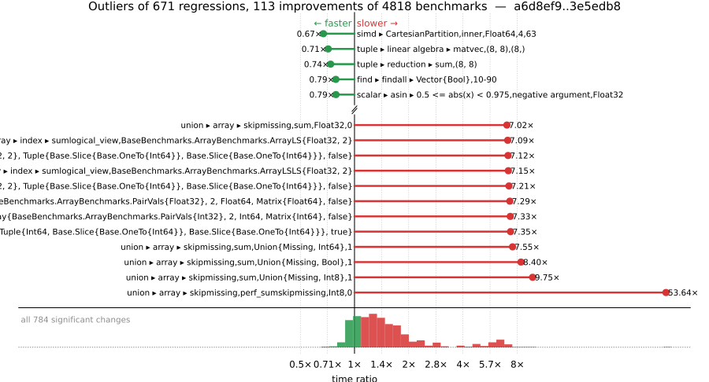

# Benchmark Report

## Summary

**4818** benchmarks were executed, **671** showed regressions, and **113** showed improvements.



## Job Properties

*Commits:* [JuliaLang/julia@3e5edb8aea7df319ace57551b8f0fa701a35f518](https://github.com/JuliaLang/julia/commit/3e5edb8aea7df319ace57551b8f0fa701a35f518) vs [JuliaLang/julia@a6d8ef919d0061c3c60294896d739f5e9a1eeaf7](https://github.com/JuliaLang/julia/commit/a6d8ef919d0061c3c60294896d739f5e9a1eeaf7)

*Comparison Diff:* [link](https://github.com/JuliaLang/julia/compare/a6d8ef919d0061c3c60294896d739f5e9a1eeaf7...3e5edb8aea7df319ace57551b8f0fa701a35f518)

*Triggered By:* [link](https://github.com/JuliaLang/julia/pull/50641#issuecomment-4932661399)

*Tag Predicate:* `ALL`

## Results

*Note: If Chrome is your browser, I strongly recommend installing the [Wide GitHub](https://chrome.google.com/webstore/detail/wide-github/kaalofacklcidaampbokdplbklpeldpj?hl=en)
extension, which makes the result table easier to read.*

Below is a table of this job's results, obtained by running the benchmarks found in
[JuliaCI/BaseBenchmarks.jl](https://github.com/JuliaCI/BaseBenchmarks.jl). The values
listed in the `ID` column have the structure `[parent_group, child_group, ..., key]`,
and can be used to index into the BaseBenchmarks suite to retrieve the corresponding
benchmarks.

The percentages accompanying time and memory values in the below table are noise tolerances. The "true"
time/memory value for a given benchmark is expected to fall within this percentage of the reported value.

A ratio greater than `1.0` denotes a possible regression (marked with :x:), while a ratio less
than `1.0` denotes a possible improvement (marked with :white_check_mark:). Only significant results - results
that indicate possible regressions or improvements - are shown below (thus, an empty table means that all
benchmark results remained invariant between builds).

| ID | time ratio | memory ratio |
|----|------------|--------------|
| `["alloc", "strings"]` | 1.10 (5%) :x: | 1.00 (1%)  |
| `["alloc", "structs"]` | 1.09 (5%) :x: | 1.00 (1%)  |
| `["array", "accumulate", ("accumulate", "Int")]` | 1.09 (5%) :x: | 1.00 (1%)  |
| `["array", "accumulate", ("cumsum", "Int")]` | 1.05 (5%) :x: | 1.00 (1%)  |
| `["array", "any/all", ("all", "BitArray")]` | 1.97 (5%) :x: | 1.00 (1%)  |
| `["array", "any/all", ("all", "Vector{Float32}")]` | 1.16 (5%) :x: | 1.00 (1%)  |
| `["array", "cat", ("catnd", 500)]` | 1.89 (5%) :x: | 1.00 (1%)  |
| `["array", "cat", ("catnd_setind", 5)]` | 1.52 (5%) :x: | 1.00 (1%)  |
| `["array", "cat", ("catnd_setind", 500)]` | 2.39 (5%) :x: | 1.00 (1%)  |
| `["array", "cat", ("hcat_setind", 5)]` | 2.00 (5%) :x: | 1.00 (1%)  |
| `["array", "cat", ("hcat_setind", 500)]` | 2.42 (5%) :x: | 1.00 (1%)  |
| `["array", "cat", ("hvcat", 5)]` | 1.62 (5%) :x: | 1.00 (1%)  |
| `["array", "cat", ("hvcat", 500)]` | 1.92 (5%) :x: | 1.00 (1%)  |
| `["array", "cat", ("hvcat_setind", 5)]` | 1.90 (5%) :x: | 1.00 (1%)  |
| `["array", "cat", ("hvcat_setind", 500)]` | 1.91 (5%) :x: | 1.00 (1%)  |
| `["array", "cat", ("vcat", 5)]` | 1.75 (5%) :x: | 1.00 (1%)  |
| `["array", "cat", ("vcat", 500)]` | 1.99 (5%) :x: | 1.00 (1%)  |
| `["array", "cat", ("vcat_setind", 5)]` | 1.75 (5%) :x: | 1.00 (1%)  |
| `["array", "cat", ("vcat_setind", 500)]` | 1.99 (5%) :x: | 1.00 (1%)  |
| `["array", "comprehension", ("collect", "StepRangeLen{Float64, Base.TwicePrecision{Float64}, Base.TwicePrecision{Float64}, Int64}")]` | 1.95 (5%) :x: | 1.00 (1%)  |
| `["array", "comprehension", ("comprehension_collect", "StepRangeLen{Float64, Base.TwicePrecision{Float64}, Base.TwicePrecision{Float64}, Int64}")]` | 1.20 (5%) :x: | 1.00 (1%)  |
| `["array", "equality", ("isequal", "UnitRange{Int64}")]` | 1.09 (5%) :x: | 1.00 (1%)  |
| `["array", "growth", ("prerend!", 8)]` | 1.08 (5%) :x: | 1.00 (1%)  |
| `["array", "growth", ("push_single!", 8)]` | 1.06 (5%) :x: | 1.00 (1%)  |
| `["array", "index", "4d"]` | 1.07 (5%) :x: | 1.00 (1%)  |
| `["array", "index", ("sum", "3darray")]` | 6.18 (50%) :x: | 1.00 (1%)  |
| `["array", "index", ("sumcolon", "Base.ReinterpretArray{BaseBenchmarks.ArrayBenchmarks.PairVals{Float32}, 2, Float32, Matrix{Float32}, false}")]` | 1.61 (50%) :x: | 1.00 (1%)  |
| `["array", "index", ("sumcolon", "Base.ReinterpretArray{BaseBenchmarks.ArrayBenchmarks.PairVals{Int32}, 2, Int32, Matrix{Int32}, false}")]` | 1.60 (50%) :x: | 1.00 (1%)  |
| `["array", "index", ("sumcolon", "Base.ReinterpretArray{Float32, 2, Int32, Matrix{Int32}, false}")]` | 1.77 (50%) :x: | 1.00 (1%)  |
| `["array", "index", ("sumcolon", "BaseBenchmarks.ArrayBenchmarks.ArrayLF{Float32, 2}")]` | 1.11 (50%)  | 1.02 (1%) :x: |
| `["array", "index", ("sumcolon", "BaseBenchmarks.ArrayBenchmarks.ArrayLF{Int32, 2}")]` | 1.10 (50%)  | 1.02 (1%) :x: |
| `["array", "index", ("sumcolon", "BaseBenchmarks.ArrayBenchmarks.ArrayLSLS{Float32, 2}")]` | 1.08 (50%)  | 1.02 (1%) :x: |
| `["array", "index", ("sumcolon", "BaseBenchmarks.ArrayBenchmarks.ArrayLSLS{Int32, 2}")]` | 1.10 (50%)  | 1.02 (1%) :x: |
| `["array", "index", ("sumcolon", "Matrix{Float32}")]` | 1.12 (50%)  | 1.02 (1%) :x: |
| `["array", "index", ("sumcolon", "Matrix{Int32}")]` | 1.11 (50%)  | 1.02 (1%) :x: |
| `["array", "index", ("sumcolon", "SubArray{Float32, 2, Array{Float32, 3}, Tuple{Int64, Base.Slice{Base.OneTo{Int64}}, Base.Slice{Base.OneTo{Int64}}}, true}")]` | 1.08 (50%)  | 1.02 (1%) :x: |
| `["array", "index", ("sumcolon", "SubArray{Float32, 2, Base.ReshapedArray{Float32, 2, SubArray{Float32, 3, Array{Float32, 3}, Tuple{Base.Slice{Base.OneTo{Int64}}, Base.Slice{Base.OneTo{Int64}}, Base.Slice{Base.OneTo{Int64}}}, true}, Tuple{}}, Tuple{Base.Slice{Base.OneTo{Int64}}, UnitRange{Int64}}, true}")]` | 2.36 (50%) :x: | 1.66 (1%) :x: |
| `["array", "index", ("sumcolon", "SubArray{Float32, 2, BaseBenchmarks.ArrayBenchmarks.ArrayLS{Float32, 2}, Tuple{Base.Slice{Base.OneTo{Int64}}, Base.Slice{Base.OneTo{Int64}}}, false}")]` | 1.09 (50%)  | 1.02 (1%) :x: |
| `["array", "index", ("sumcolon", "SubArray{Float32, 2, BaseBenchmarks.ArrayBenchmarks.ArrayLS{Float32, 3}, Tuple{Int64, Base.Slice{Base.OneTo{Int64}}, Base.Slice{Base.OneTo{Int64}}}, false}")]` | 1.09 (50%)  | 1.02 (1%) :x: |
| `["array", "index", ("sumcolon", "SubArray{Float32, 2, Matrix{Float32}, Tuple{Base.Slice{Base.OneTo{Int64}}, Base.Slice{Base.OneTo{Int64}}}, true}")]` | 1.11 (50%)  | 1.02 (1%) :x: |
| `["array", "index", ("sumcolon", "SubArray{Float32, 2, Matrix{Float32}, Tuple{UnitRange{Int64}, UnitRange{Int64}}, false}")]` | 1.08 (50%)  | 1.02 (1%) :x: |
| `["array", "index", ("sumcolon", "SubArray{Int32, 2, Array{Int32, 3}, Tuple{Int64, Base.Slice{Base.OneTo{Int64}}, Base.Slice{Base.OneTo{Int64}}}, true}")]` | 1.08 (50%)  | 1.02 (1%) :x: |
| `["array", "index", ("sumcolon", "SubArray{Int32, 2, Base.ReshapedArray{Int32, 2, SubArray{Int32, 3, Array{Int32, 3}, Tuple{Base.Slice{Base.OneTo{Int64}}, Base.Slice{Base.OneTo{Int64}}, Base.Slice{Base.OneTo{Int64}}}, true}, Tuple{}}, Tuple{Base.Slice{Base.OneTo{Int64}}, UnitRange{Int64}}, true}")]` | 2.24 (50%) :x: | 1.66 (1%) :x: |
| `["array", "index", ("sumcolon", "SubArray{Int32, 2, BaseBenchmarks.ArrayBenchmarks.ArrayLS{Int32, 2}, Tuple{Base.Slice{Base.OneTo{Int64}}, Base.Slice{Base.OneTo{Int64}}}, false}")]` | 1.09 (50%)  | 1.02 (1%) :x: |
| `["array", "index", ("sumcolon", "SubArray{Int32, 2, BaseBenchmarks.ArrayBenchmarks.ArrayLS{Int32, 3}, Tuple{Int64, Base.Slice{Base.OneTo{Int64}}, Base.Slice{Base.OneTo{Int64}}}, false}")]` | 1.10 (50%)  | 1.02 (1%) :x: |
| `["array", "index", ("sumcolon", "SubArray{Int32, 2, Matrix{Int32}, Tuple{Base.Slice{Base.OneTo{Int64}}, Base.Slice{Base.OneTo{Int64}}}, true}")]` | 1.10 (50%)  | 1.02 (1%) :x: |
| `["array", "index", ("sumcolon", "SubArray{Int32, 2, Matrix{Int32}, Tuple{UnitRange{Int64}, UnitRange{Int64}}, false}")]` | 1.09 (50%)  | 1.02 (1%) :x: |
| `["array", "index", ("sumlogical", "1.0:0.00010001000100010001:2.0")]` | 2.83 (50%) :x: | 1.00 (1%)  |
| `["array", "index", ("sumlogical", "1.0:1.0:100000.0")]` | 2.76 (50%) :x: | 1.00 (1%)  |
| `["array", "index", ("sumlogical", "100000:-1:1")]` | 2.59 (50%) :x: | 1.00 (1%)  |
| `["array", "index", ("sumlogical", "1:100000")]` | 4.58 (50%) :x: | 1.00 (1%)  |
| `["array", "index", ("sumlogical", "Base.ReinterpretArray{BaseBenchmarks.ArrayBenchmarks.PairVals{Float32}, 2, Float32, Matrix{Float32}, false}")]` | 2.80 (50%) :x: | 1.00 (1%)  |
| `["array", "index", ("sumlogical", "Base.ReinterpretArray{BaseBenchmarks.ArrayBenchmarks.PairVals{Float32}, 2, Float64, Matrix{Float64}, false}")]` | 4.47 (50%) :x: | 1.00 (1%)  |
| `["array", "index", ("sumlogical", "Base.ReinterpretArray{BaseBenchmarks.ArrayBenchmarks.PairVals{Int32}, 2, Int32, Matrix{Int32}, false}")]` | 2.82 (50%) :x: | 1.00 (1%)  |
| `["array", "index", ("sumlogical", "Base.ReinterpretArray{BaseBenchmarks.ArrayBenchmarks.PairVals{Int32}, 2, Int64, Matrix{Int64}, false}")]` | 5.35 (50%) :x: | 1.00 (1%)  |
| `["array", "index", ("sumlogical", "Base.ReinterpretArray{Float32, 2, Int32, Matrix{Int32}, false}")]` | 5.69 (50%) :x: | 1.00 (1%)  |
| `["array", "index", ("sumlogical", "BaseBenchmarks.ArrayBenchmarks.ArrayLF{Float32, 2}")]` | 6.18 (50%) :x: | 1.00 (1%)  |
| `["array", "index", ("sumlogical", "BaseBenchmarks.ArrayBenchmarks.ArrayLF{Int32, 2}")]` | 6.14 (50%) :x: | 1.00 (1%)  |
| `["array", "index", ("sumlogical", "BaseBenchmarks.ArrayBenchmarks.ArrayLSLS{Float32, 2}")]` | 6.10 (50%) :x: | 1.00 (1%)  |
| `["array", "index", ("sumlogical", "BaseBenchmarks.ArrayBenchmarks.ArrayLSLS{Int32, 2}")]` | 6.49 (50%) :x: | 1.00 (1%)  |
| `["array", "index", ("sumlogical", "BaseBenchmarks.ArrayBenchmarks.ArrayLS{Float32, 2}")]` | 6.71 (50%) :x: | 1.00 (1%)  |
| `["array", "index", ("sumlogical", "BaseBenchmarks.ArrayBenchmarks.ArrayLS{Int32, 2}")]` | 6.18 (50%) :x: | 1.00 (1%)  |
| `["array", "index", ("sumlogical", "BitMatrix")]` | 1.62 (50%) :x: | 1.00 (1%)  |
| `["array", "index", ("sumlogical", "Matrix{Float32}")]` | 6.31 (50%) :x: | 1.00 (1%)  |
| `["array", "index", ("sumlogical", "Matrix{Float64}")]` | 5.27 (50%) :x: | 1.00 (1%)  |
| `["array", "index", ("sumlogical", "Matrix{Int32}")]` | 6.25 (50%) :x: | 1.00 (1%)  |
| `["array", "index", ("sumlogical", "Matrix{Int64}")]` | 4.89 (50%) :x: | 1.00 (1%)  |
| `["array", "index", ("sumlogical", "SubArray{Float32, 2, Array{Float32, 3}, Tuple{Int64, Base.Slice{Base.OneTo{Int64}}, Base.Slice{Base.OneTo{Int64}}}, true}")]` | 3.87 (50%) :x: | 1.00 (1%)  |
| `["array", "index", ("sumlogical", "SubArray{Float32, 2, BaseBenchmarks.ArrayBenchmarks.ArrayLS{Float32, 2}, Tuple{Base.Slice{Base.OneTo{Int64}}, Base.Slice{Base.OneTo{Int64}}}, false}")]` | 6.31 (50%) :x: | 1.00 (1%)  |
| `["array", "index", ("sumlogical", "SubArray{Float32, 2, BaseBenchmarks.ArrayBenchmarks.ArrayLS{Float32, 3}, Tuple{Int64, Base.Slice{Base.OneTo{Int64}}, Base.Slice{Base.OneTo{Int64}}}, false}")]` | 3.81 (50%) :x: | 1.00 (1%)  |
| `["array", "index", ("sumlogical", "SubArray{Float32, 2, Matrix{Float32}, Tuple{Base.Slice{Base.OneTo{Int64}}, Base.Slice{Base.OneTo{Int64}}}, true}")]` | 6.45 (50%) :x: | 1.00 (1%)  |
| `["array", "index", ("sumlogical", "SubArray{Float32, 2, Matrix{Float32}, Tuple{UnitRange{Int64}, UnitRange{Int64}}, false}")]` | 6.39 (50%) :x: | 1.00 (1%)  |
| `["array", "index", ("sumlogical", "SubArray{Int32, 2, Array{Int32, 3}, Tuple{Int64, Base.Slice{Base.OneTo{Int64}}, Base.Slice{Base.OneTo{Int64}}}, true}")]` | 3.81 (50%) :x: | 1.00 (1%)  |
| `["array", "index", ("sumlogical", "SubArray{Int32, 2, BaseBenchmarks.ArrayBenchmarks.ArrayLS{Int32, 2}, Tuple{Base.Slice{Base.OneTo{Int64}}, Base.Slice{Base.OneTo{Int64}}}, false}")]` | 5.89 (50%) :x: | 1.00 (1%)  |
| `["array", "index", ("sumlogical", "SubArray{Int32, 2, BaseBenchmarks.ArrayBenchmarks.ArrayLS{Int32, 3}, Tuple{Int64, Base.Slice{Base.OneTo{Int64}}, Base.Slice{Base.OneTo{Int64}}}, false}")]` | 3.84 (50%) :x: | 1.00 (1%)  |
| `["array", "index", ("sumlogical", "SubArray{Int32, 2, Matrix{Int32}, Tuple{Base.Slice{Base.OneTo{Int64}}, Base.Slice{Base.OneTo{Int64}}}, true}")]` | 6.32 (50%) :x: | 1.00 (1%)  |
| `["array", "index", ("sumlogical", "SubArray{Int32, 2, Matrix{Int32}, Tuple{UnitRange{Int64}, UnitRange{Int64}}, false}")]` | 6.37 (50%) :x: | 1.00 (1%)  |
| `["array", "index", ("sumlogical_view", "1.0:0.00010001000100010001:2.0")]` | 4.48 (50%) :x: | 1.00 (1%)  |
| `["array", "index", ("sumlogical_view", "1.0:1.0:100000.0")]` | 4.61 (50%) :x: | 1.00 (1%)  |
| `["array", "index", ("sumlogical_view", "100000:-1:1")]` | 4.60 (50%) :x: | 1.00 (1%)  |
| `["array", "index", ("sumlogical_view", "1:100000")]` | 4.65 (50%) :x: | 1.00 (1%)  |
| `["array", "index", ("sumlogical_view", "Base.ReinterpretArray{BaseBenchmarks.ArrayBenchmarks.PairVals{Float32}, 2, Float32, Matrix{Float32}, false}")]` | 5.44 (50%) :x: | 1.00 (1%)  |
| `["array", "index", ("sumlogical_view", "Base.ReinterpretArray{BaseBenchmarks.ArrayBenchmarks.PairVals{Float32}, 2, Float64, Matrix{Float64}, false}")]` | 7.29 (50%) :x: | 1.00 (1%)  |
| `["array", "index", ("sumlogical_view", "Base.ReinterpretArray{BaseBenchmarks.ArrayBenchmarks.PairVals{Int32}, 2, Int32, Matrix{Int32}, false}")]` | 5.93 (50%) :x: | 1.00 (1%)  |
| `["array", "index", ("sumlogical_view", "Base.ReinterpretArray{BaseBenchmarks.ArrayBenchmarks.PairVals{Int32}, 2, Int64, Matrix{Int64}, false}")]` | 7.33 (50%) :x: | 1.00 (1%)  |
| `["array", "index", ("sumlogical_view", "Base.ReinterpretArray{Float32, 2, Int32, Matrix{Int32}, false}")]` | 6.10 (50%) :x: | 1.00 (1%)  |
| `["array", "index", ("sumlogical_view", "BaseBenchmarks.ArrayBenchmarks.ArrayLF{Float32, 2}")]` | 5.87 (50%) :x: | 1.00 (1%)  |
| `["array", "index", ("sumlogical_view", "BaseBenchmarks.ArrayBenchmarks.ArrayLF{Int32, 2}")]` | 5.81 (50%) :x: | 1.00 (1%)  |
| `["array", "index", ("sumlogical_view", "BaseBenchmarks.ArrayBenchmarks.ArrayLSLS{Float32, 2}")]` | 7.15 (50%) :x: | 1.00 (1%)  |
| `["array", "index", ("sumlogical_view", "BaseBenchmarks.ArrayBenchmarks.ArrayLSLS{Int32, 2}")]` | 5.79 (50%) :x: | 1.00 (1%)  |
| `["array", "index", ("sumlogical_view", "BaseBenchmarks.ArrayBenchmarks.ArrayLS{Float32, 2}")]` | 7.09 (50%) :x: | 1.00 (1%)  |
| `["array", "index", ("sumlogical_view", "BaseBenchmarks.ArrayBenchmarks.ArrayLS{Int32, 2}")]` | 5.88 (50%) :x: | 1.00 (1%)  |
| `["array", "index", ("sumlogical_view", "BitMatrix")]` | 6.13 (50%) :x: | 1.00 (1%)  |
| `["array", "index", ("sumlogical_view", "Matrix{Float32}")]` | 6.38 (50%) :x: | 1.00 (1%)  |
| `["array", "index", ("sumlogical_view", "Matrix{Float64}")]` | 6.15 (50%) :x: | 1.00 (1%)  |
| `["array", "index", ("sumlogical_view", "Matrix{Int32}")]` | 6.25 (50%) :x: | 1.00 (1%)  |
| `["array", "index", ("sumlogical_view", "Matrix{Int64}")]` | 6.19 (50%) :x: | 1.00 (1%)  |
| `["array", "index", ("sumlogical_view", "SubArray{Float32, 2, Array{Float32, 3}, Tuple{Int64, Base.Slice{Base.OneTo{Int64}}, Base.Slice{Base.OneTo{Int64}}}, true}")]` | 7.35 (50%) :x: | 1.00 (1%)  |
| `["array", "index", ("sumlogical_view", "SubArray{Float32, 2, BaseBenchmarks.ArrayBenchmarks.ArrayLS{Float32, 2}, Tuple{Base.Slice{Base.OneTo{Int64}}, Base.Slice{Base.OneTo{Int64}}}, false}")]` | 7.12 (50%) :x: | 1.00 (1%)  |
| `["array", "index", ("sumlogical_view", "SubArray{Float32, 2, BaseBenchmarks.ArrayBenchmarks.ArrayLS{Float32, 3}, Tuple{Int64, Base.Slice{Base.OneTo{Int64}}, Base.Slice{Base.OneTo{Int64}}}, false}")]` | 5.75 (50%) :x: | 1.00 (1%)  |
| `["array", "index", ("sumlogical_view", "SubArray{Float32, 2, Matrix{Float32}, Tuple{Base.Slice{Base.OneTo{Int64}}, Base.Slice{Base.OneTo{Int64}}}, true}")]` | 6.26 (50%) :x: | 1.00 (1%)  |
| `["array", "index", ("sumlogical_view", "SubArray{Float32, 2, Matrix{Float32}, Tuple{UnitRange{Int64}, UnitRange{Int64}}, false}")]` | 6.16 (50%) :x: | 1.00 (1%)  |
| `["array", "index", ("sumlogical_view", "SubArray{Int32, 2, Array{Int32, 3}, Tuple{Int64, Base.Slice{Base.OneTo{Int64}}, Base.Slice{Base.OneTo{Int64}}}, true}")]` | 6.02 (50%) :x: | 1.00 (1%)  |
| `["array", "index", ("sumlogical_view", "SubArray{Int32, 2, BaseBenchmarks.ArrayBenchmarks.ArrayLS{Int32, 2}, Tuple{Base.Slice{Base.OneTo{Int64}}, Base.Slice{Base.OneTo{Int64}}}, false}")]` | 7.21 (50%) :x: | 1.00 (1%)  |
| `["array", "index", ("sumlogical_view", "SubArray{Int32, 2, BaseBenchmarks.ArrayBenchmarks.ArrayLS{Int32, 3}, Tuple{Int64, Base.Slice{Base.OneTo{Int64}}, Base.Slice{Base.OneTo{Int64}}}, false}")]` | 6.97 (50%) :x: | 1.00 (1%)  |
| `["array", "index", ("sumlogical_view", "SubArray{Int32, 2, Matrix{Int32}, Tuple{Base.Slice{Base.OneTo{Int64}}, Base.Slice{Base.OneTo{Int64}}}, true}")]` | 6.25 (50%) :x: | 1.00 (1%)  |
| `["array", "index", ("sumlogical_view", "SubArray{Int32, 2, Matrix{Int32}, Tuple{UnitRange{Int64}, UnitRange{Int64}}, false}")]` | 6.10 (50%) :x: | 1.00 (1%)  |
| `["array", "index", ("sumrange", "Base.ReinterpretArray{BaseBenchmarks.ArrayBenchmarks.PairVals{Float32}, 2, Float32, Matrix{Float32}, false}")]` | 1.74 (50%) :x: | 1.00 (1%)  |
| `["array", "index", ("sumrange", "Base.ReinterpretArray{BaseBenchmarks.ArrayBenchmarks.PairVals{Float32}, 2, Float64, Matrix{Float64}, false}")]` | 1.57 (50%) :x: | 1.00 (1%)  |
| `["array", "index", ("sumrange", "Base.ReinterpretArray{BaseBenchmarks.ArrayBenchmarks.PairVals{Int32}, 2, Int32, Matrix{Int32}, false}")]` | 1.70 (50%) :x: | 1.00 (1%)  |
| `["array", "index", ("sumrange", "Base.ReinterpretArray{BaseBenchmarks.ArrayBenchmarks.PairVals{Int32}, 2, Int64, Matrix{Int64}, false}")]` | 1.60 (50%) :x: | 1.00 (1%)  |
| `["array", "index", ("sumrange", "Base.ReinterpretArray{Float32, 2, Int32, Matrix{Int32}, false}")]` | 2.20 (50%) :x: | 1.02 (1%) :x: |
| `["array", "index", ("sumrange", "BaseBenchmarks.ArrayBenchmarks.ArrayLF{Float32, 2}")]` | 1.12 (50%)  | 1.02 (1%) :x: |
| `["array", "index", ("sumrange", "BaseBenchmarks.ArrayBenchmarks.ArrayLF{Int32, 2}")]` | 1.06 (50%)  | 1.02 (1%) :x: |
| `["array", "index", ("sumrange", "BaseBenchmarks.ArrayBenchmarks.ArrayLSLS{Float32, 2}")]` | 1.13 (50%)  | 1.02 (1%) :x: |
| `["array", "index", ("sumrange", "BaseBenchmarks.ArrayBenchmarks.ArrayLSLS{Int32, 2}")]` | 1.12 (50%)  | 1.02 (1%) :x: |
| `["array", "index", ("sumrange", "BaseBenchmarks.ArrayBenchmarks.ArrayLS{Float32, 2}")]` | 1.13 (50%)  | 1.02 (1%) :x: |
| `["array", "index", ("sumrange", "BaseBenchmarks.ArrayBenchmarks.ArrayLS{Int32, 2}")]` | 1.13 (50%)  | 1.02 (1%) :x: |
| `["array", "index", ("sumrange", "Matrix{Float32}")]` | 1.11 (50%)  | 1.02 (1%) :x: |
| `["array", "index", ("sumrange", "Matrix{Int32}")]` | 1.08 (50%)  | 1.02 (1%) :x: |
| `["array", "index", ("sumrange", "SubArray{Float32, 2, Array{Float32, 3}, Tuple{Int64, Base.Slice{Base.OneTo{Int64}}, Base.Slice{Base.OneTo{Int64}}}, true}")]` | 1.10 (50%)  | 1.02 (1%) :x: |
| `["array", "index", ("sumrange", "SubArray{Float32, 2, Base.ReshapedArray{Float32, 2, SubArray{Float32, 3, Array{Float32, 3}, Tuple{Base.Slice{Base.OneTo{Int64}}, Base.Slice{Base.OneTo{Int64}}, Base.Slice{Base.OneTo{Int64}}}, true}, Tuple{}}, Tuple{Base.Slice{Base.OneTo{Int64}}, UnitRange{Int64}}, true}")]` | 2.45 (50%) :x: | 1.66 (1%) :x: |
| `["array", "index", ("sumrange", "SubArray{Float32, 2, BaseBenchmarks.ArrayBenchmarks.ArrayLS{Float32, 2}, Tuple{Base.Slice{Base.OneTo{Int64}}, Base.Slice{Base.OneTo{Int64}}}, false}")]` | 1.09 (50%)  | 1.02 (1%) :x: |
| `["array", "index", ("sumrange", "SubArray{Float32, 2, BaseBenchmarks.ArrayBenchmarks.ArrayLS{Float32, 3}, Tuple{Int64, Base.Slice{Base.OneTo{Int64}}, Base.Slice{Base.OneTo{Int64}}}, false}")]` | 1.08 (50%)  | 1.02 (1%) :x: |
| `["array", "index", ("sumrange", "SubArray{Float32, 2, Matrix{Float32}, Tuple{Base.Slice{Base.OneTo{Int64}}, Base.Slice{Base.OneTo{Int64}}}, true}")]` | 1.11 (50%)  | 1.02 (1%) :x: |
| `["array", "index", ("sumrange", "SubArray{Float32, 2, Matrix{Float32}, Tuple{UnitRange{Int64}, UnitRange{Int64}}, false}")]` | 1.15 (50%)  | 1.02 (1%) :x: |
| `["array", "index", ("sumrange", "SubArray{Int32, 2, Array{Int32, 3}, Tuple{Int64, Base.Slice{Base.OneTo{Int64}}, Base.Slice{Base.OneTo{Int64}}}, true}")]` | 1.08 (50%)  | 1.02 (1%) :x: |
| `["array", "index", ("sumrange", "SubArray{Int32, 2, Base.ReshapedArray{Int32, 2, SubArray{Int32, 3, Array{Int32, 3}, Tuple{Base.Slice{Base.OneTo{Int64}}, Base.Slice{Base.OneTo{Int64}}, Base.Slice{Base.OneTo{Int64}}}, true}, Tuple{}}, Tuple{Base.Slice{Base.OneTo{Int64}}, UnitRange{Int64}}, true}")]` | 2.73 (50%) :x: | 1.66 (1%) :x: |
| `["array", "index", ("sumrange", "SubArray{Int32, 2, BaseBenchmarks.ArrayBenchmarks.ArrayLS{Int32, 2}, Tuple{Base.Slice{Base.OneTo{Int64}}, Base.Slice{Base.OneTo{Int64}}}, false}")]` | 1.09 (50%)  | 1.02 (1%) :x: |
| `["array", "index", ("sumrange", "SubArray{Int32, 2, BaseBenchmarks.ArrayBenchmarks.ArrayLS{Int32, 3}, Tuple{Int64, Base.Slice{Base.OneTo{Int64}}, Base.Slice{Base.OneTo{Int64}}}, false}")]` | 1.10 (50%)  | 1.02 (1%) :x: |
| `["array", "index", ("sumrange", "SubArray{Int32, 2, Matrix{Int32}, Tuple{Base.Slice{Base.OneTo{Int64}}, Base.Slice{Base.OneTo{Int64}}}, true}")]` | 1.12 (50%)  | 1.02 (1%) :x: |
| `["array", "index", ("sumrange", "SubArray{Int32, 2, Matrix{Int32}, Tuple{UnitRange{Int64}, UnitRange{Int64}}, false}")]` | 1.10 (50%)  | 1.02 (1%) :x: |
| `["array", "index", ("sumvector_view", "SubArray{Float32, 2, Matrix{Float32}, Tuple{UnitRange{Int64}, UnitRange{Int64}}, false}")]` | 1.52 (50%) :x: | 1.50 (1%) :x: |
| `["array", "index", ("sumvector_view", "SubArray{Int32, 2, Matrix{Int32}, Tuple{UnitRange{Int64}, UnitRange{Int64}}, false}")]` | 1.48 (50%)  | 1.50 (1%) :x: |
| `["array", "reductions", ("maxabs", "Float64")]` | 1.81 (5%) :x: | 1.00 (1%)  |
| `["array", "reductions", ("maxabs", "Int64")]` | 2.41 (5%) :x: | 1.00 (1%)  |
| `["array", "reductions", ("mean", "Float64")]` | 5.96 (5%) :x: | 1.00 (1%)  |
| `["array", "reductions", ("mean", "Int64")]` | 2.19 (5%) :x: | 1.00 (1%)  |
| `["array", "reductions", ("norm", "Int64")]` | 1.26 (5%) :x: | 1.00 (1%)  |
| `["array", "reductions", ("norm1", "Int64")]` | 2.19 (5%) :x: | 1.00 (1%)  |
| `["array", "reductions", ("norminf", "Float64")]` | 1.80 (5%) :x: | 1.00 (1%)  |
| `["array", "reductions", ("norminf", "Int64")]` | 1.53 (5%) :x: | 1.00 (1%)  |
| `["array", "reductions", ("sum", "Float64")]` | 6.21 (5%) :x: | 1.00 (1%)  |
| `["array", "reductions", ("sum", "Int64")]` | 6.60 (5%) :x: | 1.00 (1%)  |
| `["array", "reductions", ("sumabs", "Float64")]` | 5.76 (5%) :x: | 1.00 (1%)  |
| `["array", "reductions", ("sumabs", "Int64")]` | 3.78 (5%) :x: | 1.00 (1%)  |
| `["array", "reductions", ("sumabs2", "Float64")]` | 4.93 (5%) :x: | 1.00 (1%)  |
| `["array", "reductions", ("sumabs2", "Int64")]` | 2.47 (5%) :x: | 1.00 (1%)  |
| `["array", "setindex!", ("setindex!", 1)]` | 0.93 (5%) :white_check_mark: | 1.00 (1%)  |
| `["array", "setindex!", ("setindex!", 2)]` | 0.93 (5%) :white_check_mark: | 1.00 (1%)  |
| `["array", "setindex!", ("setindex!", 3)]` | 0.88 (5%) :white_check_mark: | 1.00 (1%)  |
| `["array", "setindex!", ("setindex!", 4)]` | 0.90 (5%) :white_check_mark: | 1.00 (1%)  |
| `["array", "setindex!", ("setindex!", 5)]` | 0.88 (5%) :white_check_mark: | 1.00 (1%)  |
| `["array", "subarray", ("lucompletepivCopy!", 100)]` | 1.10 (5%) :x: | 1.00 (1%)  |
| `["array", "subarray", ("lucompletepivCopy!", 1000)]` | 1.07 (5%) :x: | 1.00 (1%)  |
| `["array", "subarray", ("lucompletepivCopy!", 250)]` | 1.08 (5%) :x: | 1.00 (1%)  |
| `["array", "subarray", ("lucompletepivCopy!", 500)]` | 1.07 (5%) :x: | 1.00 (1%)  |
| `["broadcast", "dotop", ("Float64", "(1000, 1000)", 2)]` | 0.98 (5%)  | Inf (1%) :x: |
| `["broadcast", "dotop", ("Float64", "(1000000,)", 1)]` | 2.53 (5%) :x: | Inf (1%) :x: |
| `["broadcast", "dotop", ("Float64", "(1000000,)", 2)]` | 1.00 (5%)  | Inf (1%) :x: |
| `["broadcast", "fusion", ("Float64", "(1000, 1000)", 2)]` | 1.78 (5%) :x: | 1.00 (1%)  |
| `["broadcast", "fusion", ("Float64", "(1000, 1000)", 3)]` | 1.85 (5%) :x: | 1.00 (1%)  |
| `["broadcast", "mix_scalar_tuple", (10, "tup_tup")]` | 0.84 (5%) :white_check_mark: | 1.00 (1%)  |
| `["broadcast", "sparse", ("(1000, 1000)", 2)]` | 1.10 (5%) :x: | 1.00 (1%)  |
| `["broadcast", "sparse", ("(10000000,)", 2)]` | 1.26 (5%) :x: | 1.00 (1%)  |
| `["collection", "deletion", ("BitSet", "Int", "pop!")]` | 1.72 (25%) :x: | 1.00 (1%)  |
| `["collection", "deletion", ("Dict", "Int", "pop!")]` | 1.51 (25%) :x: | 1.00 (1%)  |
| `["collection", "deletion", ("Dict", "String", "pop!")]` | 1.69 (25%) :x: | 1.00 (1%)  |
| `["collection", "deletion", ("Set", "Any", "filter!")]` | 1.67 (25%) :x: | 1.00 (1%)  |
| `["collection", "deletion", ("Set", "Int", "filter!")]` | 1.97 (25%) :x: | 1.00 (1%)  |
| `["collection", "deletion", ("Set", "Int", "filter")]` | 1.96 (25%) :x: | 1.00 (1%)  |
| `["collection", "deletion", ("Set", "Int", "pop!")]` | 1.73 (25%) :x: | 1.00 (1%)  |
| `["collection", "deletion", ("Set", "String", "filter!")]` | 1.75 (25%) :x: | 1.00 (1%)  |
| `["collection", "deletion", ("Set", "String", "filter")]` | 1.31 (25%) :x: | 1.00 (1%)  |
| `["collection", "deletion", ("Set", "String", "pop!")]` | 1.58 (25%) :x: | 1.00 (1%)  |
| `["collection", "deletion", ("Vector", "Any", "filter!")]` | 1.30 (25%) :x: | 1.00 (1%)  |
| `["collection", "deletion", ("Vector", "Any", "filter")]` | 1.27 (25%) :x: | 1.00 (1%)  |
| `["collection", "deletion", ("Vector", "Any", "pop!")]` | 1.25 (25%) :x: | 1.00 (1%)  |
| `["collection", "deletion", ("Vector", "Int", "filter!")]` | 2.34 (25%) :x: | 1.00 (1%)  |
| `["collection", "deletion", ("Vector", "Int", "filter")]` | 1.94 (25%) :x: | 1.00 (1%)  |
| `["collection", "deletion", ("Vector", "Int", "pop!")]` | 1.38 (25%) :x: | 1.00 (1%)  |
| `["collection", "deletion", ("Vector", "String", "filter")]` | 1.28 (25%) :x: | 1.00 (1%)  |
| `["collection", "deletion", ("Vector", "String", "pop!")]` | 1.25 (25%) :x: | 1.00 (1%)  |
| `["collection", "initialization", ("Dict", "Int", "iterator")]` | 1.42 (25%) :x: | 1.00 (1%)  |
| `["collection", "initialization", ("Dict", "Int", "loop")]` | 1.48 (25%) :x: | 1.00 (1%)  |
| `["collection", "initialization", ("Dict", "Int", "loop", "sizehint!")]` | 1.41 (25%) :x: | 1.00 (1%)  |
| `["collection", "initialization", ("Set", "Int", "iterator")]` | 1.43 (25%) :x: | 1.00 (1%)  |
| `["collection", "initialization", ("Set", "Int", "loop")]` | 1.55 (25%) :x: | 1.00 (1%)  |
| `["collection", "initialization", ("Set", "Int", "loop", "sizehint!")]` | 1.52 (25%) :x: | 1.00 (1%)  |
| `["collection", "iteration", ("Dict", "Any", "iterate second")]` | 1.32 (25%) :x: | 1.00 (1%)  |
| `["collection", "iteration", ("Dict", "Any", "iterate")]` | 1.37 (25%) :x: | 1.00 (1%)  |
| `["collection", "iteration", ("Dict", "Int", "iterate second")]` | 1.30 (25%) :x: | 1.00 (1%)  |
| `["collection", "iteration", ("Dict", "Int", "iterate")]` | 1.37 (25%) :x: | 1.00 (1%)  |
| `["collection", "iteration", ("Dict", "String", "iterate second")]` | 1.36 (25%) :x: | 1.00 (1%)  |
| `["collection", "iteration", ("Dict", "String", "iterate")]` | 1.32 (25%) :x: | 1.00 (1%)  |
| `["collection", "iteration", ("Set", "Int", "iterate second")]` | 1.67 (25%) :x: | 1.00 (1%)  |
| `["collection", "iteration", ("Set", "Int", "iterate")]` | 1.85 (25%) :x: | 1.00 (1%)  |
| `["collection", "iteration", ("Set", "String", "iterate second")]` | 1.49 (25%) :x: | 1.00 (1%)  |
| `["collection", "iteration", ("Set", "String", "iterate")]` | 1.55 (25%) :x: | 1.00 (1%)  |
| `["collection", "optimizations", ("Dict", "abstract", "Bool")]` | 1.46 (25%) :x: | 1.00 (1%)  |
| `["collection", "optimizations", ("Dict", "abstract", "Int8")]` | 1.48 (25%) :x: | 1.00 (1%)  |
| `["collection", "optimizations", ("Dict", "abstract", "Nothing")]` | 1.79 (25%) :x: | 1.00 (1%)  |
| `["collection", "optimizations", ("Dict", "abstract", "UInt16")]` | 1.36 (25%) :x: | 1.00 (1%)  |
| `["collection", "optimizations", ("Dict", "concrete", "Bool")]` | 1.46 (25%) :x: | 1.00 (1%)  |
| `["collection", "optimizations", ("Dict", "concrete", "Int8")]` | 1.48 (25%) :x: | 1.00 (1%)  |
| `["collection", "optimizations", ("Dict", "concrete", "Nothing")]` | 1.80 (25%) :x: | 1.00 (1%)  |
| `["collection", "optimizations", ("Dict", "concrete", "UInt16")]` | 1.37 (25%) :x: | 1.00 (1%)  |
| `["collection", "optimizations", ("Set", "abstract", "Bool")]` | 1.43 (25%) :x: | 1.00 (1%)  |
| `["collection", "optimizations", ("Set", "abstract", "Int8")]` | 1.49 (25%) :x: | 1.00 (1%)  |
| `["collection", "optimizations", ("Set", "abstract", "UInt16")]` | 1.32 (25%) :x: | 1.00 (1%)  |
| `["collection", "optimizations", ("Set", "concrete", "Bool")]` | 1.43 (25%) :x: | 1.00 (1%)  |
| `["collection", "optimizations", ("Set", "concrete", "Int8")]` | 1.49 (25%) :x: | 1.00 (1%)  |
| `["collection", "optimizations", ("Set", "concrete", "UInt16")]` | 1.33 (25%) :x: | 1.00 (1%)  |
| `["collection", "queries & updates", ("BitSet", "Int", "first")]` | 2.25 (25%) :x: | 1.00 (1%)  |
| `["collection", "queries & updates", ("Dict", "Int", "first")]` | 1.76 (25%) :x: | 1.00 (1%)  |
| `["collection", "queries & updates", ("Dict", "Int", "in", "false")]` | 1.28 (25%) :x: | 1.00 (1%)  |
| `["collection", "queries & updates", ("Dict", "Int", "in", "true")]` | 1.30 (25%) :x: | 1.00 (1%)  |
| `["collection", "queries & updates", ("Dict", "Int", "pop!", "unspecified")]` | 1.40 (25%) :x: | 1.00 (1%)  |
| `["collection", "queries & updates", ("Dict", "Int", "push!", "new")]` | 1.33 (25%) :x: | 1.00 (1%)  |
| `["collection", "queries & updates", ("Dict", "Int", "push!", "overwrite")]` | 1.33 (25%) :x: | 1.00 (1%)  |
| `["collection", "queries & updates", ("Dict", "Int", "setindex!", "new")]` | 1.33 (25%) :x: | 1.00 (1%)  |
| `["collection", "queries & updates", ("Dict", "Int", "setindex!", "overwrite")]` | 1.32 (25%) :x: | 1.00 (1%)  |
| `["collection", "queries & updates", ("Set", "Int", "first")]` | 1.80 (25%) :x: | 1.00 (1%)  |
| `["collection", "queries & updates", ("Set", "Int", "pop!", "unspecified")]` | 1.45 (25%) :x: | 1.00 (1%)  |
| `["collection", "queries & updates", ("Set", "Int", "push!", "new")]` | 1.34 (25%) :x: | 1.00 (1%)  |
| `["collection", "queries & updates", ("Set", "Int", "push!", "overwrite")]` | 1.34 (25%) :x: | 1.00 (1%)  |
| `["collection", "queries & updates", ("Vector", "Int", "pop!", "unspecified")]` | 1.64 (25%) :x: | 1.00 (1%)  |
| `["collection", "set operations", ("BitSet", "Int", "<", "BitSet")]` | 1.46 (25%) :x: | 1.00 (1%)  |
| `["collection", "set operations", ("BitSet", "Int", "intersect!", "BitSet")]` | 1.40 (25%) :x: | 1.00 (1%)  |
| `["collection", "set operations", ("BitSet", "Int", "intersect", "Set")]` | 1.45 (25%) :x: | 1.00 (1%)  |
| `["collection", "set operations", ("BitSet", "Int", "intersect", "Set", "Set")]` | 1.58 (25%) :x: | 1.00 (1%)  |
| `["collection", "set operations", ("BitSet", "Int", "setdiff!", "BitSet")]` | 1.39 (25%) :x: | 1.00 (1%)  |
| `["collection", "set operations", ("BitSet", "Int", "setdiff!", "Set")]` | 2.11 (25%) :x: | 1.00 (1%)  |
| `["collection", "set operations", ("BitSet", "Int", "setdiff", "Set")]` | 1.70 (25%) :x: | 1.00 (1%)  |
| `["collection", "set operations", ("BitSet", "Int", "symdiff!", "BitSet")]` | 1.37 (25%) :x: | 1.00 (1%)  |
| `["collection", "set operations", ("BitSet", "Int", "symdiff!", "Set")]` | 1.35 (25%) :x: | 1.00 (1%)  |
| `["collection", "set operations", ("BitSet", "Int", "symdiff", "Set", "Set")]` | 1.27 (25%) :x: | 1.00 (1%)  |
| `["collection", "set operations", ("BitSet", "Int", "union!", "BitSet")]` | 1.35 (25%) :x: | 1.00 (1%)  |
| `["collection", "set operations", ("BitSet", "Int", "union!", "Set")]` | 1.78 (25%) :x: | 1.00 (1%)  |
| `["collection", "set operations", ("BitSet", "Int", "union", "Set")]` | 1.38 (25%) :x: | 1.00 (1%)  |
| `["collection", "set operations", ("BitSet", "Int", "union", "Set", "Set")]` | 1.57 (25%) :x: | 1.00 (1%)  |
| `["collection", "set operations", ("BitSet", "Int", "⊆", "self")]` | 1.33 (25%) :x: | 1.00 (1%)  |
| `["collection", "set operations", ("Set", "Int", "==", "self")]` | 2.34 (25%) :x: | 1.00 (1%)  |
| `["collection", "set operations", ("Set", "Int", "intersect", "BitSet")]` | 1.47 (25%) :x: | 1.00 (1%)  |
| `["collection", "set operations", ("Set", "Int", "intersect", "BitSet", "BitSet")]` | 1.47 (25%) :x: | 1.00 (1%)  |
| `["collection", "set operations", ("Set", "Int", "intersect", "Set")]` | 1.43 (25%) :x: | 1.00 (1%)  |
| `["collection", "set operations", ("Set", "Int", "intersect", "Set", "Set")]` | 1.49 (25%) :x: | 1.00 (1%)  |
| `["collection", "set operations", ("Set", "Int", "intersect", "Vector")]` | 1.27 (25%) :x: | 1.00 (1%)  |
| `["collection", "set operations", ("Set", "Int", "intersect", "Vector", "Vector")]` | 1.38 (25%) :x: | 1.00 (1%)  |
| `["collection", "set operations", ("Set", "Int", "setdiff!", "BitSet")]` | 1.63 (25%) :x: | 1.00 (1%)  |
| `["collection", "set operations", ("Set", "Int", "setdiff!", "Set")]` | 1.52 (25%) :x: | 1.00 (1%)  |
| `["collection", "set operations", ("Set", "Int", "symdiff", "BitSet")]` | 1.70 (25%) :x: | 1.00 (1%)  |
| `["collection", "set operations", ("Set", "Int", "symdiff", "BitSet", "BitSet")]` | 1.69 (25%) :x: | 1.00 (1%)  |
| `["collection", "set operations", ("Set", "Int", "symdiff", "Set")]` | 1.71 (25%) :x: | 1.00 (1%)  |
| `["collection", "set operations", ("Set", "Int", "symdiff", "Set", "Set")]` | 1.72 (25%) :x: | 1.00 (1%)  |
| `["collection", "set operations", ("Set", "Int", "symdiff", "Vector")]` | 1.71 (25%) :x: | 1.00 (1%)  |
| `["collection", "set operations", ("Set", "Int", "symdiff", "Vector", "Vector")]` | 1.72 (25%) :x: | 1.00 (1%)  |
| `["collection", "set operations", ("Set", "Int", "union!", "BitSet")]` | 1.82 (25%) :x: | 1.00 (1%)  |
| `["collection", "set operations", ("Set", "Int", "union!", "Set")]` | 1.61 (25%) :x: | 1.00 (1%)  |
| `["collection", "set operations", ("Set", "Int", "union!", "Vector")]` | 1.52 (25%) :x: | 1.00 (1%)  |
| `["collection", "set operations", ("Set", "Int", "union", "BitSet")]` | 1.67 (25%) :x: | 1.00 (1%)  |
| `["collection", "set operations", ("Set", "Int", "union", "BitSet", "BitSet")]` | 1.69 (25%) :x: | 1.00 (1%)  |
| `["collection", "set operations", ("Set", "Int", "union", "Set")]` | 1.70 (25%) :x: | 1.00 (1%)  |
| `["collection", "set operations", ("Set", "Int", "union", "Set", "Set")]` | 1.71 (25%) :x: | 1.00 (1%)  |
| `["collection", "set operations", ("Set", "Int", "union", "Vector")]` | 1.68 (25%) :x: | 1.00 (1%)  |
| `["collection", "set operations", ("Set", "Int", "union", "Vector", "Vector")]` | 1.67 (25%) :x: | 1.00 (1%)  |
| `["collection", "set operations", ("Set", "Int", "⊆", "self")]` | 2.33 (25%) :x: | 1.00 (1%)  |
| `["collection", "set operations", ("Vector", "Int", "intersect")]` | 1.38 (25%) :x: | 1.00 (1%)  |
| `["collection", "set operations", ("Vector", "Int", "intersect", "BitSet")]` | 1.72 (25%) :x: | 1.00 (1%)  |
| `["collection", "set operations", ("Vector", "Int", "intersect", "BitSet", "BitSet")]` | 1.73 (25%) :x: | 1.00 (1%)  |
| `["collection", "set operations", ("Vector", "Int", "intersect", "Set")]` | 1.73 (25%) :x: | 1.00 (1%)  |
| `["collection", "set operations", ("Vector", "Int", "intersect", "Set", "Set")]` | 1.74 (25%) :x: | 1.00 (1%)  |
| `["collection", "set operations", ("Vector", "Int", "intersect", "Vector")]` | 1.73 (25%) :x: | 1.00 (1%)  |
| `["collection", "set operations", ("Vector", "Int", "intersect", "Vector", "Vector")]` | 1.75 (25%) :x: | 1.00 (1%)  |
| `["collection", "set operations", ("Vector", "Int", "symdiff")]` | 1.35 (25%) :x: | 1.00 (1%)  |
| `["collection", "set operations", ("Vector", "Int", "symdiff", "BitSet")]` | 1.37 (25%) :x: | 1.00 (1%)  |
| `["collection", "set operations", ("Vector", "Int", "symdiff", "BitSet", "BitSet")]` | 1.35 (25%) :x: | 1.00 (1%)  |
| `["collection", "set operations", ("Vector", "Int", "symdiff", "Set")]` | 1.37 (25%) :x: | 1.00 (1%)  |
| `["collection", "set operations", ("Vector", "Int", "symdiff", "Set", "Set")]` | 1.34 (25%) :x: | 1.00 (1%)  |
| `["collection", "set operations", ("Vector", "Int", "symdiff", "Vector")]` | 1.35 (25%) :x: | 1.00 (1%)  |
| `["collection", "set operations", ("Vector", "Int", "symdiff", "Vector", "Vector")]` | 1.34 (25%) :x: | 1.00 (1%)  |
| `["collection", "set operations", ("Vector", "Int", "union")]` | 1.41 (25%) :x: | 1.00 (1%)  |
| `["collection", "set operations", ("Vector", "Int", "union", "BitSet")]` | 1.38 (25%) :x: | 1.00 (1%)  |
| `["collection", "set operations", ("Vector", "Int", "union", "BitSet", "BitSet")]` | 1.39 (25%) :x: | 1.00 (1%)  |
| `["collection", "set operations", ("Vector", "Int", "union", "Set")]` | 1.41 (25%) :x: | 1.00 (1%)  |
| `["collection", "set operations", ("Vector", "Int", "union", "Set", "Set")]` | 1.40 (25%) :x: | 1.00 (1%)  |
| `["collection", "set operations", ("Vector", "Int", "union", "Vector")]` | 1.40 (25%) :x: | 1.00 (1%)  |
| `["collection", "set operations", ("Vector", "Int", "union", "Vector", "Vector")]` | 1.37 (25%) :x: | 1.00 (1%)  |
| `["collection", "set operations", ("empty", "Int", "<", "BitSet")]` | 1.34 (25%) :x: | 1.00 (1%)  |
| `["collection", "set operations", ("empty", "Int", "<", "Set")]` | 1.37 (25%) :x: | 1.00 (1%)  |
| `["collection", "set operations", ("empty", "Int", "⊆", "Set")]` | 1.31 (25%) :x: | 1.00 (1%)  |
| `["dates", "parse", ("Date", "DateFormat")]` | 1.05 (5%) :x: | 1.00 (1%)  |
| `["dates", "parse", ("Date", "ISODateFormat")]` | 1.06 (5%) :x: | 1.00 (1%)  |
| `["dates", "parse", ("DateTime", "DateFormat")]` | 1.08 (5%) :x: | 1.00 (1%)  |
| `["dates", "parse", ("DateTime", "RFC1123Format", "Lowercase")]` | 1.06 (5%) :x: | 1.00 (1%)  |
| `["dates", "parse", ("DateTime", "RFC1123Format", "Mixedcase")]` | 1.07 (5%) :x: | 1.00 (1%)  |
| `["dates", "parse", ("DateTime", "RFC1123Format", "Titlecase")]` | 1.05 (5%) :x: | 1.00 (1%)  |
| `["dates", "string", "DateTime"]` | 1.10 (5%) :x: | 1.00 (1%)  |
| `["find", "findall", ("> q0.5", "Vector{Bool}")]` | 1.39 (5%) :x: | 1.00 (1%)  |
| `["find", "findall", ("> q0.5", "Vector{Float32}")]` | 1.58 (5%) :x: | 1.00 (1%)  |
| `["find", "findall", ("> q0.5", "Vector{Float64}")]` | 1.48 (5%) :x: | 1.00 (1%)  |
| `["find", "findall", ("> q0.5", "Vector{Int64}")]` | 1.19 (5%) :x: | 1.00 (1%)  |
| `["find", "findall", ("> q0.5", "Vector{Int8}")]` | 1.34 (5%) :x: | 1.00 (1%)  |
| `["find", "findall", ("> q0.5", "Vector{UInt64}")]` | 1.15 (5%) :x: | 1.00 (1%)  |
| `["find", "findall", ("> q0.5", "Vector{UInt8}")]` | 1.33 (5%) :x: | 1.00 (1%)  |
| `["find", "findall", ("> q0.8", "Vector{Bool}")]` | 1.26 (5%) :x: | 1.00 (1%)  |
| `["find", "findall", ("> q0.8", "Vector{Float32}")]` | 1.66 (5%) :x: | 1.00 (1%)  |
| `["find", "findall", ("> q0.8", "Vector{Float64}")]` | 1.57 (5%) :x: | 1.00 (1%)  |
| `["find", "findall", ("> q0.8", "Vector{Int64}")]` | 1.15 (5%) :x: | 1.00 (1%)  |
| `["find", "findall", ("> q0.8", "Vector{Int8}")]` | 1.30 (5%) :x: | 1.00 (1%)  |
| `["find", "findall", ("> q0.8", "Vector{UInt64}")]` | 1.10 (5%) :x: | 1.00 (1%)  |
| `["find", "findall", ("> q0.8", "Vector{UInt8}")]` | 1.33 (5%) :x: | 1.00 (1%)  |
| `["find", "findall", ("> q0.95", "Vector{Bool}")]` | 1.26 (5%) :x: | 1.00 (1%)  |
| `["find", "findall", ("> q0.95", "Vector{Float32}")]` | 1.65 (5%) :x: | 1.00 (1%)  |
| `["find", "findall", ("> q0.95", "Vector{Float64}")]` | 1.52 (5%) :x: | 1.00 (1%)  |
| `["find", "findall", ("> q0.95", "Vector{Int64}")]` | 1.10 (5%) :x: | 1.00 (1%)  |
| `["find", "findall", ("> q0.95", "Vector{Int8}")]` | 1.22 (5%) :x: | 1.00 (1%)  |
| `["find", "findall", ("> q0.95", "Vector{UInt64}")]` | 1.07 (5%) :x: | 1.00 (1%)  |
| `["find", "findall", ("> q0.95", "Vector{UInt8}")]` | 1.22 (5%) :x: | 1.00 (1%)  |
| `["find", "findall", ("> q0.99", "Vector{Bool}")]` | 1.26 (5%) :x: | 1.00 (1%)  |
| `["find", "findall", ("> q0.99", "Vector{Float32}")]` | 1.60 (5%) :x: | 1.00 (1%)  |
| `["find", "findall", ("> q0.99", "Vector{Float64}")]` | 1.47 (5%) :x: | 1.00 (1%)  |
| `["find", "findall", ("> q0.99", "Vector{Int64}")]` | 1.08 (5%) :x: | 1.00 (1%)  |
| `["find", "findall", ("> q0.99", "Vector{Int8}")]` | 1.18 (5%) :x: | 1.00 (1%)  |
| `["find", "findall", ("> q0.99", "Vector{UInt64}")]` | 1.05 (5%) :x: | 1.00 (1%)  |
| `["find", "findall", ("> q0.99", "Vector{UInt8}")]` | 1.17 (5%) :x: | 1.00 (1%)  |
| `["find", "findall", ("BitVector", "10-90")]` | 1.30 (5%) :x: | 1.00 (1%)  |
| `["find", "findall", ("BitVector", "50-50")]` | 1.44 (5%) :x: | 1.00 (1%)  |
| `["find", "findall", ("BitVector", "90-10")]` | 1.34 (5%) :x: | 1.00 (1%)  |
| `["find", "findall", ("Vector{Bool}", "10-90")]` | 0.79 (5%) :white_check_mark: | 1.00 (1%)  |
| `["find", "findall", ("Vector{Bool}", "90-10")]` | 0.94 (5%) :white_check_mark: | 1.00 (1%)  |
| `["find", "findall", ("ispos", "Vector{Bool}")]` | 1.55 (5%) :x: | 1.00 (1%)  |
| `["find", "findall", ("ispos", "Vector{Float32}")]` | 1.65 (5%) :x: | 1.00 (1%)  |
| `["find", "findall", ("ispos", "Vector{Float64}")]` | 1.62 (5%) :x: | 1.00 (1%)  |
| `["find", "findall", ("ispos", "Vector{Int64}")]` | 1.63 (5%) :x: | 1.00 (1%)  |
| `["find", "findall", ("ispos", "Vector{Int8}")]` | 1.56 (5%) :x: | 1.00 (1%)  |
| `["find", "findall", ("ispos", "Vector{UInt64}")]` | 1.62 (5%) :x: | 1.00 (1%)  |
| `["find", "findall", ("ispos", "Vector{UInt8}")]` | 1.44 (5%) :x: | 1.00 (1%)  |
| `["find", "findnext", ("BitVector", "10-90")]` | 1.72 (5%) :x: | 1.00 (1%)  |
| `["find", "findnext", ("BitVector", "50-50")]` | 1.60 (5%) :x: | 1.00 (1%)  |
| `["find", "findnext", ("BitVector", "90-10")]` | 1.60 (5%) :x: | 1.00 (1%)  |
| `["find", "findnext", ("ispos", "Vector{Bool}")]` | 1.07 (5%) :x: | 1.00 (1%)  |
| `["find", "findnext", ("ispos", "Vector{Int8}")]` | 1.06 (5%) :x: | 1.00 (1%)  |
| `["find", "findnext", ("ispos", "Vector{UInt64}")]` | 1.08 (5%) :x: | 1.00 (1%)  |
| `["find", "findnext", ("ispos", "Vector{UInt8}")]` | 0.92 (5%) :white_check_mark: | 1.00 (1%)  |
| `["find", "findprev", ("ispos", "Vector{Bool}")]` | 1.06 (5%) :x: | 1.00 (1%)  |
| `["find", "findprev", ("ispos", "Vector{Float64}")]` | 1.10 (5%) :x: | 1.00 (1%)  |
| `["find", "findprev", ("ispos", "Vector{Int8}")]` | 1.08 (5%) :x: | 1.00 (1%)  |
| `["inference", "abstract interpretation", "Base.init_stdio(::Ptr{Cvoid})"]` | 0.99 (5%)  | 0.99 (1%) :white_check_mark: |
| `["inference", "abstract interpretation", "REPL.REPLCompletions.completions"]` | 0.99 (5%)  | 0.99 (1%) :white_check_mark: |
| `["inference", "abstract interpretation", "broadcasting"]` | 0.97 (5%)  | 0.98 (1%) :white_check_mark: |
| `["inference", "abstract interpretation", "many_const_calls"]` | 1.01 (5%)  | 0.99 (1%) :white_check_mark: |
| `["inference", "abstract interpretation", "many_invoke_calls"]` | 1.00 (5%)  | 0.98 (1%) :white_check_mark: |
| `["inference", "abstract interpretation", "many_local_vars"]` | 1.02 (5%)  | 0.98 (1%) :white_check_mark: |
| `["inference", "abstract interpretation", "many_method_matches"]` | 0.99 (5%)  | 0.98 (1%) :white_check_mark: |
| `["inference", "abstract interpretation", "many_opaque_closures"]` | 0.98 (5%)  | 0.99 (1%) :white_check_mark: |
| `["inference", "abstract interpretation", "println(::QuoteNode)"]` | 0.99 (5%)  | 0.98 (1%) :white_check_mark: |
| `["inference", "abstract interpretation", "rand(Float64)"]` | 0.99 (5%)  | 0.98 (1%) :white_check_mark: |
| `["inference", "allinference", "REPL.REPLCompletions.completions"]` | 0.99 (5%)  | 0.98 (1%) :white_check_mark: |
| `["inference", "allinference", "broadcasting"]` | 0.97 (5%)  | 0.98 (1%) :white_check_mark: |
| `["inference", "allinference", "many_invoke_calls"]` | 1.00 (5%)  | 1.01 (1%) :x: |
| `["inference", "optimization", "broadcasting"]` | 1.13 (5%) :x: | 1.20 (1%) :x: |
| `["io", "read", "read"]` | 2.28 (5%) :x: | 1.00 (1%)  |
| `["io", "serialization", ("deserialize", "Vector{String}")]` | 1.08 (5%) :x: | 1.00 (1%)  |
| `["io", "serialization", ("serialize", "Matrix{Float64}")]` | 1.18 (5%) :x: | 1.00 (1%)  |
| `["io", "serialization", ("serialize", "Vector{String}")]` | 1.11 (5%) :x: | 1.00 (1%)  |
| `["io", "skipchars"]` | 0.94 (5%) :white_check_mark: | 1.00 (1%)  |
| `["micro", "fib"]` | 0.95 (5%) :white_check_mark: | 1.00 (1%)  |
| `["micro", "printfd"]` | 1.05 (5%) :x: | 1.00 (1%)  |
| `["misc", "23042", "Float32"]` | 1.48 (5%) :x: | 1.00 (1%)  |
| `["misc", "afoldl", "Int"]` | 0.93 (5%) :white_check_mark: | 1.00 (1%)  |
| `["misc", "allocation elision view", "conditional"]` | 1.14 (5%) :x: | 1.00 (1%)  |
| `["misc", "allocation elision view", "no conditional"]` | 1.15 (5%) :x: | 1.00 (1%)  |
| `["misc", "bitshift", ("Int", "Int")]` | 1.08 (5%) :x: | 1.00 (1%)  |
| `["misc", "bitshift", ("UInt", "UInt")]` | 0.85 (5%) :white_check_mark: | 1.00 (1%)  |
| `["misc", "bitshift", ("UInt32", "UInt32")]` | 0.84 (5%) :white_check_mark: | 1.00 (1%)  |
| `["misc", "iterators", "zip(1:1, 1:1, 1:1, 1:1)"]` | 1.23 (5%) :x: | 1.00 (1%)  |
| `["misc", "parse", "Float64"]` | 1.06 (5%) :x: | 1.00 (1%)  |
| `["misc", "perf highdim generator"]` | 2.18 (5%) :x: | 1.00 (1%)  |
| `["misc", "repeat", (200, 24, 1)]` | 1.93 (5%) :x: | 1.00 (1%)  |
| `["problem", "grigoriadis khachiyan", "grigoriadis_khachiyan"]` | 1.19 (5%) :x: | 1.00 (1%)  |
| `["problem", "imdb", "centrality"]` | 1.09 (5%) :x: | 1.00 (1%)  |
| `["problem", "laplacian", "laplace_iter_sub"]` | 1.45 (5%) :x: | 1.00 (1%)  |
| `["problem", "laplacian", "laplace_iter_vec"]` | 1.65 (5%) :x: | 1.00 (1%)  |
| `["problem", "laplacian", "laplace_sparse_matvec"]` | 1.07 (5%) :x: | 1.00 (1%)  |
| `["problem", "seismic", ("seismic", "Float32")]` | 3.33 (5%) :x: | 1.00 (1%)  |
| `["problem", "seismic", ("seismic", "Float64")]` | 1.87 (5%) :x: | 1.00 (1%)  |
| `["problem", "spellcheck", "spellcheck"]` | 1.08 (5%) :x: | 1.00 (1%)  |
| `["random", "collections", ("rand", "ImplicitRNG", "large BitSet")]` | 1.35 (25%) :x: | 1.00 (1%)  |
| `["random", "collections", ("rand", "ImplicitRNG", "small BitSet")]` | 1.34 (25%) :x: | 1.00 (1%)  |
| `["random", "collections", ("rand", "MersenneTwister", "large BitSet")]` | 1.31 (25%) :x: | 1.00 (1%)  |
| `["random", "collections", ("rand", "MersenneTwister", "small BitSet")]` | 1.31 (25%) :x: | 1.00 (1%)  |
| `["scalar", "acos", ("0.5 <= abs(x) < 1", "negative argument", "Float32")]` | 1.05 (5%) :x: | 1.00 (1%)  |
| `["scalar", "acos", ("one", "negative argument", "Float64")]` | 0.95 (5%) :white_check_mark: | 1.00 (1%)  |
| `["scalar", "acos", ("one", "positive argument", "Float64")]` | 0.95 (5%) :white_check_mark: | 1.00 (1%)  |
| `["scalar", "acos", ("small", "negative argument", "Float64")]` | 1.18 (5%) :x: | 1.00 (1%)  |
| `["scalar", "acos", ("small", "positive argument", "Float64")]` | 1.17 (5%) :x: | 1.00 (1%)  |
| `["scalar", "acos", ("zero", "Float64")]` | 1.18 (5%) :x: | 1.00 (1%)  |
| `["scalar", "acosh", ("one", "Float32")]` | 1.06 (5%) :x: | 1.00 (1%)  |
| `["scalar", "asin", ("0.5 <= abs(x) < 0.975", "negative argument", "Float32")]` | 0.79 (5%) :white_check_mark: | 1.00 (1%)  |
| `["scalar", "asin", ("small", "negative argument", "Float64")]` | 1.06 (5%) :x: | 1.00 (1%)  |
| `["scalar", "asin", ("small", "positive argument", "Float64")]` | 1.06 (5%) :x: | 1.00 (1%)  |
| `["scalar", "asin", ("zero", "Float64")]` | 1.06 (5%) :x: | 1.00 (1%)  |
| `["scalar", "asinh", ("very small", "negative argument", "Float32")]` | 0.90 (5%) :white_check_mark: | 1.00 (1%)  |
| `["scalar", "asinh", ("very small", "negative argument", "Float64")]` | 1.05 (5%) :x: | 1.00 (1%)  |
| `["scalar", "asinh", ("very small", "positive argument", "Float32")]` | 0.90 (5%) :white_check_mark: | 1.00 (1%)  |
| `["scalar", "asinh", ("very small", "positive argument", "Float64")]` | 1.05 (5%) :x: | 1.00 (1%)  |
| `["scalar", "asinh", ("zero", "Float32")]` | 0.90 (5%) :white_check_mark: | 1.00 (1%)  |
| `["scalar", "asinh", ("zero", "Float64")]` | 1.06 (5%) :x: | 1.00 (1%)  |
| `["scalar", "atan", ("very small", "positive argument", "Float64")]` | 0.89 (5%) :white_check_mark: | 1.00 (1%)  |
| `["scalar", "atan2", ("abs(y/x) high", "y positive", "x negative", "Float64")]` | 1.06 (5%) :x: | 1.00 (1%)  |
| `["scalar", "atan2", ("x one", "Float32")]` | 1.43 (5%) :x: | 1.00 (1%)  |
| `["scalar", "atan2", ("x one", "Float64")]` | 0.94 (5%) :white_check_mark: | 1.00 (1%)  |
| `["scalar", "atanh", ("very small", "negative argument", "Float64")]` | 1.06 (5%) :x: | 1.00 (1%)  |
| `["scalar", "cos", ("argument reduction (easy) abs(x) < 2π/4", "positive argument", "Float32", "sin_kernel")]` | 1.07 (5%) :x: | 1.00 (1%)  |
| `["scalar", "cos", ("argument reduction (easy) abs(x) < 2π/4", "positive argument", "Float64", "sin_kernel")]` | 1.07 (5%) :x: | 1.00 (1%)  |
| `["scalar", "cos", ("argument reduction (easy) abs(x) < 3π/4", "positive argument", "Float32", "sin_kernel")]` | 1.07 (5%) :x: | 1.00 (1%)  |
| `["scalar", "cos", ("argument reduction (easy) abs(x) < 3π/4", "positive argument", "Float64", "sin_kernel")]` | 1.07 (5%) :x: | 1.00 (1%)  |
| `["scalar", "cos", ("argument reduction (paynehanek) abs(x) > 2.0^20*π/2", "negative argument", "Float32", "sin_kernel")]` | 1.06 (5%) :x: | 1.00 (1%)  |
| `["scalar", "cos", ("argument reduction (paynehanek) abs(x) > 2.0^20*π/2", "positive argument", "Float32", "sin_kernel")]` | 1.06 (5%) :x: | 1.00 (1%)  |
| `["scalar", "cos", ("argument reduction (paynehanek) abs(x) > 2.0^20*π/2", "positive argument", "Float64", "cos_kernel")]` | 1.05 (5%) :x: | 1.00 (1%)  |
| `["scalar", "cos", ("no reduction", "zero", "Float32")]` | 0.95 (5%) :white_check_mark: | 1.00 (1%)  |
| `["scalar", "cos", ("no reduction", "zero", "Float64")]` | 0.95 (5%) :white_check_mark: | 1.00 (1%)  |
| `["scalar", "exp2", ("2pow127", "negative argument", "Float32")]` | 0.94 (5%) :white_check_mark: | 1.00 (1%)  |
| `["scalar", "mod2pi", ("argument reduction (easy) abs(x) < 2.0^20π/4", "negative argument", "Float64")]` | 1.07 (5%) :x: | 1.00 (1%)  |
| `["scalar", "mod2pi", ("argument reduction (easy) abs(x) < 2.0^20π/4", "positive argument", "Float64")]` | 1.07 (5%) :x: | 1.00 (1%)  |
| `["scalar", "mod2pi", ("argument reduction (easy) abs(x) > 2.0^20*π/2", "negative argument", "Float64")]` | 1.13 (5%) :x: | 1.00 (1%)  |
| `["scalar", "mod2pi", ("argument reduction (easy) abs(x) > 2.0^20*π/2", "positive argument", "Float64")]` | 1.06 (5%) :x: | 1.00 (1%)  |
| `["scalar", "rem_pio2", ("argument reduction (easy) abs(x) < 2π/4", "positive argument", "Float64")]` | 1.05 (5%) :x: | 1.00 (1%)  |
| `["scalar", "rem_pio2", ("argument reduction (easy) abs(x) < 3π/4", "positive argument", "Float64")]` | 1.05 (5%) :x: | 1.00 (1%)  |
| `["scalar", "rem_pio2", ("argument reduction (easy) abs(x) < 4π/4", "negative argument", "Float64")]` | 0.94 (5%) :white_check_mark: | 1.00 (1%)  |
| `["scalar", "rem_pio2", ("argument reduction (easy) abs(x) < 4π/4", "positive argument", "Float64")]` | 1.11 (5%) :x: | 1.00 (1%)  |
| `["scalar", "rem_pio2", ("argument reduction (easy) abs(x) < 5π/4", "negative argument", "Float64")]` | 0.95 (5%) :white_check_mark: | 1.00 (1%)  |
| `["scalar", "rem_pio2", ("argument reduction (easy) abs(x) < 5π/4", "positive argument", "Float64")]` | 1.11 (5%) :x: | 1.00 (1%)  |
| `["scalar", "rem_pio2", ("argument reduction (easy) abs(x) < 8π/4", "negative argument", "Float64")]` | 0.95 (5%) :white_check_mark: | 1.00 (1%)  |
| `["scalar", "rem_pio2", ("argument reduction (easy) abs(x) < 8π/4", "positive argument", "Float64")]` | 0.95 (5%) :white_check_mark: | 1.00 (1%)  |
| `["scalar", "rem_pio2", ("argument reduction (easy) abs(x) < 9π/4", "negative argument", "Float64")]` | 0.95 (5%) :white_check_mark: | 1.00 (1%)  |
| `["scalar", "rem_pio2", ("argument reduction (easy) abs(x) < 9π/4", "positive argument", "Float64")]` | 0.95 (5%) :white_check_mark: | 1.00 (1%)  |
| `["scalar", "sin", ("argument reduction (easy) abs(x) < 4π/4", "negative argument", "Float64", "sin_kernel")]` | 0.94 (5%) :white_check_mark: | 1.00 (1%)  |
| `["scalar", "sin", ("argument reduction (easy) abs(x) < 5π/4", "negative argument", "Float64", "sin_kernel")]` | 0.94 (5%) :white_check_mark: | 1.00 (1%)  |
| `["scalar", "sin", ("argument reduction (easy) abs(x) < 6π/4", "negative argument", "Float64", "cos_kernel")]` | 1.07 (5%) :x: | 1.00 (1%)  |
| `["scalar", "sin", ("argument reduction (easy) abs(x) < 6π/4", "positive argument", "Float64", "cos_kernel")]` | 1.07 (5%) :x: | 1.00 (1%)  |
| `["scalar", "sin", ("argument reduction (easy) abs(x) < 7π/4", "negative argument", "Float64", "sin_kernel")]` | 1.07 (5%) :x: | 1.00 (1%)  |
| `["scalar", "sin", ("argument reduction (easy) abs(x) < 7π/4", "positive argument", "Float64", "sin_kernel")]` | 1.07 (5%) :x: | 1.00 (1%)  |
| `["scalar", "sin", ("argument reduction (paynehanek) abs(x) > 2.0^20*π/2", "negative argument", "Float64", "cos_kernel")]` | 1.06 (5%) :x: | 1.00 (1%)  |
| `["scalar", "sin", ("argument reduction (paynehanek) abs(x) > 2.0^20*π/2", "positive argument", "Float64", "cos_kernel")]` | 1.06 (5%) :x: | 1.00 (1%)  |
| `["scalar", "sin", ("no reduction", "zero", "Float32")]` | 1.06 (5%) :x: | 1.00 (1%)  |
| `["scalar", "sin", ("no reduction", "zero", "Float64")]` | 1.05 (5%) :x: | 1.00 (1%)  |
| `["scalar", "sincos", ("argument reduction (easy) abs(x) < 2.0^20π/4", "negative argument", "Float64")]` | 0.92 (5%) :white_check_mark: | 1.00 (1%)  |
| `["scalar", "sincos", ("argument reduction (easy) abs(x) < 2.0^20π/4", "positive argument", "Float64")]` | 0.92 (5%) :white_check_mark: | 1.00 (1%)  |
| `["scalar", "sincos", ("argument reduction (hard) abs(x) < 2π/4", "negative argument", "Float32")]` | 0.92 (5%) :white_check_mark: | 1.00 (1%)  |
| `["scalar", "sincos", ("argument reduction (hard) abs(x) < 2π/4", "negative argument", "Float64")]` | 0.92 (5%) :white_check_mark: | 1.00 (1%)  |
| `["scalar", "sincos", ("argument reduction (hard) abs(x) < 2π/4", "positive argument", "Float32")]` | 0.92 (5%) :white_check_mark: | 1.00 (1%)  |
| `["scalar", "sincos", ("argument reduction (hard) abs(x) < 2π/4", "positive argument", "Float64")]` | 0.92 (5%) :white_check_mark: | 1.00 (1%)  |
| `["scalar", "sincos", ("argument reduction (hard) abs(x) < 4π/4", "negative argument", "Float64")]` | 0.93 (5%) :white_check_mark: | 1.00 (1%)  |
| `["scalar", "sincos", ("argument reduction (hard) abs(x) < 4π/4", "positive argument", "Float64")]` | 0.93 (5%) :white_check_mark: | 1.00 (1%)  |
| `["scalar", "sincos", ("argument reduction (hard) abs(x) < 6π/4", "negative argument", "Float32")]` | 0.92 (5%) :white_check_mark: | 1.00 (1%)  |
| `["scalar", "sincos", ("argument reduction (hard) abs(x) < 6π/4", "negative argument", "Float64")]` | 0.92 (5%) :white_check_mark: | 1.00 (1%)  |
| `["scalar", "sincos", ("argument reduction (hard) abs(x) < 6π/4", "positive argument", "Float32")]` | 0.92 (5%) :white_check_mark: | 1.00 (1%)  |
| `["scalar", "sincos", ("argument reduction (hard) abs(x) < 6π/4", "positive argument", "Float64")]` | 0.92 (5%) :white_check_mark: | 1.00 (1%)  |
| `["scalar", "sincos", ("argument reduction (hard) abs(x) < 8π/4", "negative argument", "Float32")]` | 0.91 (5%) :white_check_mark: | 1.00 (1%)  |
| `["scalar", "sincos", ("argument reduction (hard) abs(x) < 8π/4", "negative argument", "Float64")]` | 0.91 (5%) :white_check_mark: | 1.00 (1%)  |
| `["scalar", "sincos", ("argument reduction (hard) abs(x) < 8π/4", "positive argument", "Float32")]` | 0.90 (5%) :white_check_mark: | 1.00 (1%)  |
| `["scalar", "sincos", ("argument reduction (hard) abs(x) < 8π/4", "positive argument", "Float64")]` | 0.90 (5%) :white_check_mark: | 1.00 (1%)  |
| `["scalar", "sinh", ("0 <= abs(x) < 2f-12", "negative argument", "Float32")]` | 0.93 (5%) :white_check_mark: | 1.00 (1%)  |
| `["scalar", "sinh", ("0 <= abs(x) < 2f-12", "positive argument", "Float32")]` | 0.93 (5%) :white_check_mark: | 1.00 (1%)  |
| `["scalar", "sinh", ("very large", "negative argument", "Float32")]` | 1.14 (5%) :x: | 1.00 (1%)  |
| `["scalar", "sinh", ("very large", "negative argument", "Float64")]` | 0.91 (5%) :white_check_mark: | 1.00 (1%)  |
| `["scalar", "sinh", ("very large", "positive argument", "Float32")]` | 1.14 (5%) :x: | 1.00 (1%)  |
| `["scalar", "sinh", ("very large", "positive argument", "Float64")]` | 0.92 (5%) :white_check_mark: | 1.00 (1%)  |
| `["scalar", "sinh", ("zero", "Float32")]` | 0.93 (5%) :white_check_mark: | 1.00 (1%)  |
| `["scalar", "tan", ("large", "positive argument", "Float32")]` | 1.07 (5%) :x: | 1.00 (1%)  |
| `["scalar", "tan", ("large", "positive argument", "Float64")]` | 0.94 (5%) :white_check_mark: | 1.00 (1%)  |
| `["scalar", "tan", ("medium", "negative argument", "Float32")]` | 0.83 (5%) :white_check_mark: | 1.00 (1%)  |
| `["scalar", "tan", ("medium", "positive argument", "Float32")]` | 1.27 (5%) :x: | 1.00 (1%)  |
| `["scalar", "tan", ("small", "negative argument", "Float32")]` | 0.95 (5%) :white_check_mark: | 1.00 (1%)  |
| `["scalar", "tan", ("small", "positive argument", "Float32")]` | 0.95 (5%) :white_check_mark: | 1.00 (1%)  |
| `["scalar", "tan", ("very small", "negative argument", "Float32")]` | 0.95 (5%) :white_check_mark: | 1.00 (1%)  |
| `["scalar", "tan", ("very small", "positive argument", "Float32")]` | 0.95 (5%) :white_check_mark: | 1.00 (1%)  |
| `["scalar", "tan", ("zero", "Float32")]` | 0.95 (5%) :white_check_mark: | 1.00 (1%)  |
| `["shootout", "k_nucleotide"]` | 1.06 (5%) :x: | 1.00 (1%)  |
| `["shootout", "meteor_contest"]` | 0.95 (5%) :white_check_mark: | 1.00 (1%)  |
| `["shootout", "nbody_vec"]` | 1.17 (5%) :x: | 1.00 (1%)  |
| `["simd", ("CartesianPartition", "inner", "Float64", 4, 63)]` | 0.67 (20%) :white_check_mark: | 1.00 (1%)  |
| `["simd", ("CartesianPartition", "manual_partition!", "Float32", 2, 64)]` | 1.36 (20%) :x: | 1.00 (1%)  |
| `["simd", ("CartesianPartition", "manual_partition!", "Float32", 3, 32)]` | 1.24 (20%) :x: | 1.00 (1%)  |
| `["simd", ("CartesianPartition", "manual_partition!", "Float32", 3, 64)]` | 1.40 (20%) :x: | 1.00 (1%)  |
| `["simd", ("CartesianPartition", "manual_partition!", "Float32", 4, 64)]` | 1.20 (20%) :x: | 1.00 (1%)  |
| `["simd", ("CartesianPartition", "manual_partition!", "Float64", 2, 64)]` | 1.24 (20%) :x: | 1.00 (1%)  |
| `["simd", ("CartesianPartition", "manual_partition!", "Float64", 3, 32)]` | 1.30 (20%) :x: | 1.00 (1%)  |
| `["simd", ("CartesianPartition", "manual_partition!", "Float64", 3, 64)]` | 1.31 (20%) :x: | 1.00 (1%)  |
| `["simd", ("CartesianPartition", "manual_partition!", "Int32", 2, 31)]` | 1.21 (20%) :x: | 1.00 (1%)  |
| `["simd", ("CartesianPartition", "manual_partition!", "Int32", 2, 32)]` | 1.26 (20%) :x: | 1.00 (1%)  |
| `["simd", ("CartesianPartition", "manual_partition!", "Int32", 2, 63)]` | 1.28 (20%) :x: | 1.00 (1%)  |
| `["simd", ("CartesianPartition", "manual_partition!", "Int32", 2, 64)]` | 1.34 (20%) :x: | 1.00 (1%)  |
| `["simd", ("CartesianPartition", "manual_partition!", "Int32", 3, 32)]` | 1.30 (20%) :x: | 1.00 (1%)  |
| `["simd", ("CartesianPartition", "manual_partition!", "Int32", 3, 63)]` | 1.22 (20%) :x: | 1.00 (1%)  |
| `["simd", ("CartesianPartition", "manual_partition!", "Int32", 3, 64)]` | 1.41 (20%) :x: | 1.00 (1%)  |
| `["simd", ("CartesianPartition", "manual_partition!", "Int64", 2, 63)]` | 1.21 (20%) :x: | 1.00 (1%)  |
| `["simd", ("CartesianPartition", "manual_partition!", "Int64", 2, 64)]` | 1.24 (20%) :x: | 1.00 (1%)  |
| `["simd", ("CartesianPartition", "manual_partition!", "Int64", 3, 32)]` | 1.26 (20%) :x: | 1.00 (1%)  |
| `["simd", ("CartesianPartition", "manual_partition!", "Int64", 3, 63)]` | 1.24 (20%) :x: | 1.00 (1%)  |
| `["simd", ("CartesianPartition", "manual_partition!", "Int64", 3, 64)]` | 1.35 (20%) :x: | 1.00 (1%)  |
| `["sort", "insertionsort", "sort forwards"]` | 1.29 (20%) :x: | 1.00 (1%)  |
| `["sort", "insertionsort", "sort! reverse"]` | 1.37 (20%) :x: | 1.00 (1%)  |
| `["sort", "insertionsort", "sortperm forwards"]` | 1.54 (20%) :x: | 1.00 (1%)  |
| `["sort", "insertionsort", "sortperm! reverse"]` | 1.50 (20%) :x: | 1.00 (1%)  |
| `["sort", "issues", "Float16"]` | 1.68 (20%) :x: | 1.00 (1%)  |
| `["sort", "issues", "inplace sorting of a view"]` | 2.17 (20%) :x: | 1.00 (1%)  |
| `["sort", "issues", "partialsort!(rand(10_000), 1:3, rev=true)"]` | 1.16 (20%)  | 0.97 (1%) :white_check_mark: |
| `["sort", "issues", "sortperm on a view (Float64)"]` | 1.29 (20%) :x: | 1.00 (1%)  |
| `["sort", "issues", "sortperm on a view (Int)"]` | 1.30 (20%) :x: | 1.00 (1%)  |
| `["sort", "issues", "sortperm(collect(1000000:-1:1))"]` | 1.73 (20%) :x: | 1.00 (1%)  |
| `["sort", "issues", "sortperm(rand(10^5))"]` | 1.23 (20%) :x: | 1.00 (1%)  |
| `["sort", "length = 10", "Float64 unions with missing"]` | 1.27 (20%) :x: | 1.00 (1%)  |
| `["sort", "length = 10", "all same"]` | 1.31 (20%) :x: | 1.00 (1%)  |
| `["sort", "length = 10", "sort!(fill(missing, length), rev=true)"]` | 1.88 (20%) :x: | 1.00 (1%)  |
| `["sort", "length = 10", "sortperm(rand(length))"]` | 1.24 (20%) :x: | 1.00 (1%)  |
| `["sort", "length = 100", "Float64 unions with missing"]` | 1.25 (20%) :x: | 1.00 (1%)  |
| `["sort", "length = 100", "Int unions with missing"]` | 1.33 (20%) :x: | 1.00 (1%)  |
| `["sort", "length = 100", "all same"]` | 1.89 (20%) :x: | 1.00 (1%)  |
| `["sort", "length = 100", "ascending"]` | 1.89 (20%) :x: | 1.00 (1%)  |
| `["sort", "length = 100", "descending"]` | 1.77 (20%) :x: | 1.00 (1%)  |
| `["sort", "length = 100", "sort!(fill(missing, length))"]` | 1.22 (20%) :x: | 1.00 (1%)  |
| `["sort", "length = 100", "sort!(fill(missing, length), rev=true)"]` | 1.63 (20%) :x: | 1.00 (1%)  |
| `["sort", "length = 100", "sortperm(rand(length))"]` | 1.29 (20%) :x: | 1.00 (1%)  |
| `["sort", "length = 1000", "Float64 unions with missing"]` | 1.74 (20%) :x: | 1.00 (1%)  |
| `["sort", "length = 1000", "Int unions with missing"]` | 1.59 (20%) :x: | 1.00 (1%)  |
| `["sort", "length = 1000", "all same"]` | 2.16 (20%) :x: | 1.00 (1%)  |
| `["sort", "length = 1000", "ascending"]` | 2.16 (20%) :x: | 1.00 (1%)  |
| `["sort", "length = 1000", "descending"]` | 1.72 (20%) :x: | 1.00 (1%)  |
| `["sort", "length = 1000", "sort!(fill(missing, length))"]` | 1.71 (20%) :x: | 1.00 (1%)  |
| `["sort", "length = 1000", "sort!(fill(missing, length), rev=true)"]` | 1.50 (20%) :x: | 1.00 (1%)  |
| `["sort", "length = 1000", "sort!(rand(2n, 2n, n); dims=1)"]` | 1.26 (20%) :x: | 1.00 (1%)  |
| `["sort", "length = 1000", "sort!(rand(2n, 2n, n); dims=2)"]` | 1.37 (20%) :x: | 1.00 (1%)  |
| `["sort", "length = 1000", "sort!(rand(2n, 2n, n); dims=3)"]` | 1.20 (20%) :x: | 1.00 (1%)  |
| `["sort", "length = 1000", "sort!(rand(Int, length))"]` | 2.13 (20%) :x: | 1.00 (1%)  |
| `["sort", "length = 1000", "sort(rand(2n, 2n, n); dims=1)"]` | 1.29 (20%) :x: | 1.00 (1%)  |
| `["sort", "length = 1000", "sort(rand(2n, 2n, n); dims=2)"]` | 1.36 (20%) :x: | 1.00 (1%)  |
| `["sort", "length = 1000", "sort(rand(2n, 2n, n); dims=3)"]` | 1.21 (20%) :x: | 1.00 (1%)  |
| `["sort", "length = 1000", "sort(randn(length))"]` | 1.80 (20%) :x: | 1.00 (1%)  |
| `["sort", "length = 1000", "sortperm(rand(length))"]` | 1.31 (20%) :x: | 1.00 (1%)  |
| `["sort", "length = 10000", "Float64 unions with missing"]` | 1.24 (20%) :x: | 1.00 (1%)  |
| `["sort", "length = 10000", "Int unions with missing"]` | 1.24 (20%) :x: | 1.00 (1%)  |
| `["sort", "length = 10000", "all same"]` | 1.99 (20%) :x: | 1.00 (1%)  |
| `["sort", "length = 10000", "ascending"]` | 1.99 (20%) :x: | 1.00 (1%)  |
| `["sort", "length = 10000", "descending"]` | 1.80 (20%) :x: | 1.00 (1%)  |
| `["sort", "length = 10000", "sort!(fill(missing, length))"]` | 1.84 (20%) :x: | 1.00 (1%)  |
| `["sort", "length = 10000", "sort!(fill(missing, length), rev=true)"]` | 1.50 (20%) :x: | 1.00 (1%)  |
| `["sort", "length = 10000", "sort!(rand(2n, 2n, n); dims=2)"]` | 1.34 (20%) :x: | 1.00 (1%)  |
| `["sort", "length = 10000", "sort!(rand(2n, 2n, n); dims=3)"]` | 1.35 (20%) :x: | 1.00 (1%)  |
| `["sort", "length = 10000", "sort(rand(2n, 2n, n); dims=1)"]` | 1.21 (20%) :x: | 1.00 (1%)  |
| `["sort", "length = 10000", "sort(rand(2n, 2n, n); dims=2)"]` | 1.30 (20%) :x: | 1.00 (1%)  |
| `["sort", "length = 10000", "sort(rand(2n, 2n, n); dims=3)"]` | 1.35 (20%) :x: | 1.00 (1%)  |
| `["sort", "length = 10000", "sort(randn(length))"]` | 1.21 (20%) :x: | 1.00 (1%)  |
| `["sort", "length = 10000", "sortperm(rand(length))"]` | 1.27 (20%) :x: | 1.00 (1%)  |
| `["sort", "length = 3", "sort!(fill(missing, length), rev=true)"]` | 1.91 (20%) :x: | 1.00 (1%)  |
| `["sort", "length = 30", "Float64 unions with missing"]` | 1.32 (20%) :x: | 1.00 (1%)  |
| `["sort", "length = 30", "Int unions with missing"]` | 1.38 (20%) :x: | 1.00 (1%)  |
| `["sort", "length = 30", "all same"]` | 1.70 (20%) :x: | 1.00 (1%)  |
| `["sort", "length = 30", "ascending"]` | 1.71 (20%) :x: | 1.00 (1%)  |
| `["sort", "length = 30", "descending"]` | 1.62 (20%) :x: | 1.00 (1%)  |
| `["sort", "length = 30", "sort!(fill(missing, length), rev=true)"]` | 1.89 (20%) :x: | 1.00 (1%)  |
| `["sort", "length = 30", "sort(randn(length))"]` | 1.23 (20%) :x: | 1.00 (1%)  |
| `["sort", "length = 30", "sortperm(rand(length))"]` | 1.36 (20%) :x: | 1.00 (1%)  |
| `["sort", "mergesort", "sortperm forwards"]` | 1.30 (20%) :x: | 1.00 (1%)  |
| `["sort", "mergesort", "sortperm! reverse"]` | 1.31 (20%) :x: | 1.00 (1%)  |
| `["sort", "quicksort", "sortperm forwards"]` | 1.21 (20%) :x: | 1.00 (1%)  |
| `["sparse", "constructors", ("IV", 100)]` | 1.16 (5%) :x: | 1.00 (1%)  |
| `["sparse", "constructors", ("IV", 1000)]` | 1.28 (5%) :x: | 1.00 (1%)  |
| `["sparse", "constructors", ("Tridiagonal", 10)]` | 0.91 (5%) :white_check_mark: | 1.00 (1%)  |
| `["sparse", "constructors", ("Tridiagonal", 100)]` | 0.94 (5%) :white_check_mark: | 1.00 (1%)  |
| `["sparse", "index", ("spmat", "col", "OneTo", 10)]` | 1.35 (30%) :x: | 1.00 (1%)  |
| `["sparse", "index", ("spmat", "col", "OneTo", 100)]` | 1.36 (30%) :x: | 1.00 (1%)  |
| `["sparse", "index", ("spmat", "col", "array", 100)]` | 1.32 (30%) :x: | 1.00 (1%)  |
| `["sparse", "index", ("spmat", "col", "range", 10)]` | 1.37 (30%) :x: | 1.00 (1%)  |
| `["sparse", "index", ("spmat", "col", "range", 100)]` | 1.36 (30%) :x: | 1.00 (1%)  |
| `["sparse", "index", ("spmat", "integer", 10)]` | 2.44 (30%) :x: | 1.00 (1%)  |
| `["sparse", "index", ("spmat", "integer", 100)]` | 2.45 (30%) :x: | 1.00 (1%)  |
| `["sparse", "index", ("spmat", "integer", 1000)]` | 2.35 (30%) :x: | 1.00 (1%)  |
| `["sparse", "index", ("spmat", "row", "OneTo", 10)]` | 1.42 (30%) :x: | 1.00 (1%)  |
| `["sparse", "index", ("spmat", "row", "OneTo", 100)]` | 2.18 (30%) :x: | 1.00 (1%)  |
| `["sparse", "index", ("spmat", "row", "OneTo", 1000)]` | 1.71 (30%) :x: | 1.00 (1%)  |
| `["sparse", "index", ("spmat", "row", "array", 10)]` | 1.54 (30%) :x: | 1.00 (1%)  |
| `["sparse", "index", ("spmat", "row", "array", 100)]` | 2.27 (30%) :x: | 1.00 (1%)  |
| `["sparse", "index", ("spmat", "row", "array", 1000)]` | 1.80 (30%) :x: | 1.00 (1%)  |
| `["sparse", "index", ("spmat", "row", "logical", 100)]` | 1.93 (30%) :x: | 1.00 (1%)  |
| `["sparse", "index", ("spmat", "row", "logical", 1000)]` | 2.06 (30%) :x: | 1.00 (1%)  |
| `["sparse", "index", ("spmat", "row", "range", 10)]` | 1.46 (30%) :x: | 1.00 (1%)  |
| `["sparse", "index", ("spmat", "row", "range", 100)]` | 2.27 (30%) :x: | 1.00 (1%)  |
| `["sparse", "index", ("spmat", "row", "range", 1000)]` | 1.94 (30%) :x: | 1.00 (1%)  |
| `["sparse", "index", ("spmat", "splogical", 100)]` | 1.31 (30%) :x: | 1.00 (1%)  |
| `["sparse", "index", ("spmat", "splogical", 1000)]` | 1.55 (30%) :x: | 1.00 (1%)  |
| `["sparse", "index", ("spvec", "integer", 1000)]` | 1.75 (30%) :x: | 1.00 (1%)  |
| `["sparse", "index", ("spvec", "integer", 10000)]` | 1.80 (30%) :x: | 1.00 (1%)  |
| `["sparse", "index", ("spvec", "integer", 100000)]` | 1.85 (30%) :x: | 1.00 (1%)  |
| `["sparse", "index", ("spvec", "logical", 1000)]` | 1.57 (30%) :x: | 1.00 (1%)  |
| `["string", "readuntil", "target length 1000"]` | 1.11 (5%) :x: | 1.00 (1%)  |
| `["string", "readuntil", "target length 2"]` | 1.07 (5%) :x: | 1.00 (1%)  |
| `["string", "readuntil", "target length 50000"]` | 1.11 (5%) :x: | 1.00 (1%)  |
| `["string", "repeat", "repeat char 1"]` | 0.92 (5%) :white_check_mark: | 1.00 (1%)  |
| `["string", "replace"]` | 1.20 (5%) :x: | 1.00 (1%)  |
| `["tuple", "linear algebra", ("matmat", "(2, 2)", "(2, 2)")]` | 0.91 (5%) :white_check_mark: | 1.00 (1%)  |
| `["tuple", "linear algebra", ("matvec", "(16, 16)", "(16,)")]` | 1.07 (5%) :x: | 1.00 (1%)  |
| `["tuple", "linear algebra", ("matvec", "(8, 8)", "(8,)")]` | 0.71 (5%) :white_check_mark: | 1.00 (1%)  |
| `["tuple", "misc", "11899"]` | 0.91 (5%) :white_check_mark: | 1.00 (1%)  |
| `["tuple", "misc", "longtuple"]` | 0.89 (5%) :white_check_mark: | 1.00 (1%)  |
| `["tuple", "reduction", ("sum", "(2,)")]` | 1.07 (5%) :x: | 1.00 (1%)  |
| `["tuple", "reduction", ("sum", "(8, 8)")]` | 0.74 (5%) :white_check_mark: | 1.00 (1%)  |
| `["tuple", "reduction", ("sumabs", "(2, 2)")]` | 0.94 (5%) :white_check_mark: | 1.00 (1%)  |
| `["tuple", "reduction", ("sumabs", "(4,)")]` | 0.94 (5%) :white_check_mark: | 1.00 (1%)  |
| `["union", "array", ("broadcast", "*", "Bool", "(false, false)")]` | 1.67 (5%) :x: | 1.00 (1%)  |
| `["union", "array", ("broadcast", "*", "Bool", "(false, true)")]` | 2.90 (5%) :x: | 1.00 (1%)  |
| `["union", "array", ("broadcast", "*", "Bool", "(true, true)")]` | 2.87 (5%) :x: | 1.00 (1%)  |
| `["union", "array", ("broadcast", "*", "ComplexF64", "(false, false)")]` | 1.85 (5%) :x: | 1.00 (1%)  |
| `["union", "array", ("broadcast", "*", "ComplexF64", "(false, true)")]` | 2.00 (5%) :x: | 1.00 (1%)  |
| `["union", "array", ("broadcast", "*", "ComplexF64", "(true, true)")]` | 2.27 (5%) :x: | 1.00 (1%)  |
| `["union", "array", ("broadcast", "*", "Float32", "(false, false)")]` | 2.22 (5%) :x: | 1.00 (1%)  |
| `["union", "array", ("broadcast", "*", "Float32", "(false, true)")]` | 3.09 (5%) :x: | 1.00 (1%)  |
| `["union", "array", ("broadcast", "*", "Float32", "(true, true)")]` | 3.32 (5%) :x: | 1.00 (1%)  |
| `["union", "array", ("broadcast", "*", "Float64", "(false, false)")]` | 2.17 (5%) :x: | 1.00 (1%)  |
| `["union", "array", ("broadcast", "*", "Float64", "(false, true)")]` | 2.83 (5%) :x: | 1.00 (1%)  |
| `["union", "array", ("broadcast", "*", "Float64", "(true, true)")]` | 2.96 (5%) :x: | 1.00 (1%)  |
| `["union", "array", ("broadcast", "*", "Int64", "(false, false)")]` | 1.40 (5%) :x: | 1.00 (1%)  |
| `["union", "array", ("broadcast", "*", "Int64", "(false, true)")]` | 2.99 (5%) :x: | 1.00 (1%)  |
| `["union", "array", ("broadcast", "*", "Int64", "(true, true)")]` | 2.88 (5%) :x: | 1.00 (1%)  |
| `["union", "array", ("broadcast", "*", "Int8", "(false, false)")]` | 1.44 (5%) :x: | 1.00 (1%)  |
| `["union", "array", ("broadcast", "*", "Int8", "(false, true)")]` | 2.86 (5%) :x: | 1.00 (1%)  |
| `["union", "array", ("broadcast", "*", "Int8", "(true, true)")]` | 2.71 (5%) :x: | 1.00 (1%)  |
| `["union", "array", ("broadcast", "abs", "Bool", 1)]` | 2.35 (5%) :x: | 1.00 (1%)  |
| `["union", "array", ("broadcast", "abs", "Float32", 0)]` | 1.85 (5%) :x: | 1.00 (1%)  |
| `["union", "array", ("broadcast", "abs", "Float32", 1)]` | 1.63 (5%) :x: | 1.00 (1%)  |
| `["union", "array", ("broadcast", "abs", "Float64", 0)]` | 1.56 (5%) :x: | 1.00 (1%)  |
| `["union", "array", ("broadcast", "abs", "Float64", 1)]` | 1.27 (5%) :x: | 1.00 (1%)  |
| `["union", "array", ("broadcast", "abs", "Int64", 0)]` | 1.62 (5%) :x: | 1.00 (1%)  |
| `["union", "array", ("broadcast", "abs", "Int64", 1)]` | 1.45 (5%) :x: | 1.00 (1%)  |
| `["union", "array", ("broadcast", "abs", "Int8", 0)]` | 1.69 (5%) :x: | 1.00 (1%)  |
| `["union", "array", ("broadcast", "abs", "Int8", 1)]` | 1.39 (5%) :x: | 1.00 (1%)  |
| `["union", "array", ("broadcast", "identity", "BigFloat", 1)]` | 1.05 (5%) :x: | 1.00 (1%)  |
| `["union", "array", ("broadcast", "identity", "BigInt", 1)]` | 1.33 (5%) :x: | 1.00 (1%)  |
| `["union", "array", ("broadcast", "identity", "Bool", 1)]` | 2.10 (5%) :x: | 1.00 (1%)  |
| `["union", "array", ("broadcast", "identity", "ComplexF64", 1)]` | 1.15 (5%) :x: | 1.00 (1%)  |
| `["union", "array", ("broadcast", "identity", "Float32", 0)]` | 1.28 (5%) :x: | 1.00 (1%)  |
| `["union", "array", ("broadcast", "identity", "Float32", 1)]` | 1.91 (5%) :x: | 1.00 (1%)  |
| `["union", "array", ("broadcast", "identity", "Float64", 0)]` | 1.16 (5%) :x: | 1.00 (1%)  |
| `["union", "array", ("broadcast", "identity", "Float64", 1)]` | 1.62 (5%) :x: | 1.00 (1%)  |
| `["union", "array", ("broadcast", "identity", "Int64", 0)]` | 1.20 (5%) :x: | 1.00 (1%)  |
| `["union", "array", ("broadcast", "identity", "Int64", 1)]` | 1.60 (5%) :x: | 1.00 (1%)  |
| `["union", "array", ("broadcast", "identity", "Int8", 0)]` | 1.28 (5%) :x: | 1.00 (1%)  |
| `["union", "array", ("broadcast", "identity", "Int8", 1)]` | 2.32 (5%) :x: | 1.00 (1%)  |
| `["union", "array", ("collect", "all", "BigFloat", 1)]` | 1.09 (5%) :x: | 1.00 (1%)  |
| `["union", "array", ("collect", "all", "BigInt", 0)]` | 1.11 (5%) :x: | 1.00 (1%)  |
| `["union", "array", ("collect", "all", "BigInt", 1)]` | 1.05 (5%) :x: | 1.00 (1%)  |
| `["union", "array", ("collect", "all", "Bool", 0)]` | 1.49 (5%) :x: | 1.00 (1%)  |
| `["union", "array", ("collect", "all", "Bool", 1)]` | 1.34 (5%) :x: | 1.00 (1%)  |
| `["union", "array", ("collect", "all", "ComplexF64", 1)]` | 1.09 (5%) :x: | 1.00 (1%)  |
| `["union", "array", ("collect", "all", "Float32", 0)]` | 1.24 (5%) :x: | 1.00 (1%)  |
| `["union", "array", ("collect", "all", "Float32", 1)]` | 1.60 (5%) :x: | 1.00 (1%)  |
| `["union", "array", ("collect", "all", "Float64", 0)]` | 1.12 (5%) :x: | 1.00 (1%)  |
| `["union", "array", ("collect", "all", "Float64", 1)]` | 1.14 (5%) :x: | 1.00 (1%)  |
| `["union", "array", ("collect", "all", "Int64", 0)]` | 1.15 (5%) :x: | 1.00 (1%)  |
| `["union", "array", ("collect", "all", "Int64", 1)]` | 1.32 (5%) :x: | 1.00 (1%)  |
| `["union", "array", ("collect", "all", "Int8", 0)]` | 1.49 (5%) :x: | 1.00 (1%)  |
| `["union", "array", ("collect", "all", "Int8", 1)]` | 1.17 (5%) :x: | 1.00 (1%)  |
| `["union", "array", ("map", "*", "Bool", "(false, false)")]` | 1.66 (5%) :x: | 1.00 (1%)  |
| `["union", "array", ("map", "*", "Bool", "(false, true)")]` | 0.91 (5%) :white_check_mark: | 1.00 (1%)  |
| `["union", "array", ("map", "*", "Bool", "(true, true)")]` | 0.88 (5%) :white_check_mark: | 1.00 (1%)  |
| `["union", "array", ("map", "*", "ComplexF64", "(false, false)")]` | 1.17 (5%) :x: | 1.00 (1%)  |
| `["union", "array", ("map", "*", "Float32", "(false, false)")]` | 1.53 (5%) :x: | 1.00 (1%)  |
| `["union", "array", ("map", "*", "Float32", "(false, true)")]` | 1.11 (5%) :x: | 1.00 (1%)  |
| `["union", "array", ("map", "*", "Float32", "(true, true)")]` | 0.92 (5%) :white_check_mark: | 1.00 (1%)  |
| `["union", "array", ("map", "*", "Float64", "(false, false)")]` | 1.52 (5%) :x: | 1.00 (1%)  |
| `["union", "array", ("map", "*", "Float64", "(true, true)")]` | 0.93 (5%) :white_check_mark: | 1.00 (1%)  |
| `["union", "array", ("map", "*", "Int64", "(false, false)")]` | 1.66 (5%) :x: | 1.00 (1%)  |
| `["union", "array", ("map", "*", "Int64", "(false, true)")]` | 0.91 (5%) :white_check_mark: | 1.00 (1%)  |
| `["union", "array", ("map", "*", "Int64", "(true, true)")]` | 0.93 (5%) :white_check_mark: | 1.00 (1%)  |
| `["union", "array", ("map", "*", "Int8", "(false, false)")]` | 1.53 (5%) :x: | 1.00 (1%)  |
| `["union", "array", ("map", "*", "Int8", "(false, true)")]` | 0.89 (5%) :white_check_mark: | 1.00 (1%)  |
| `["union", "array", ("map", "abs", "Bool", 0)]` | 1.49 (5%) :x: | 1.00 (1%)  |
| `["union", "array", ("map", "abs", "Bool", 1)]` | 1.24 (5%) :x: | 1.00 (1%)  |
| `["union", "array", ("map", "abs", "ComplexF64", 0)]` | 1.06 (5%) :x: | 1.00 (1%)  |
| `["union", "array", ("map", "abs", "ComplexF64", 1)]` | 1.13 (5%) :x: | 1.00 (1%)  |
| `["union", "array", ("map", "abs", "Float32", 0)]` | 1.24 (5%) :x: | 1.00 (1%)  |
| `["union", "array", ("map", "abs", "Float32", 1)]` | 1.20 (5%) :x: | 1.00 (1%)  |
| `["union", "array", ("map", "abs", "Float64", 0)]` | 1.05 (5%) :x: | 1.00 (1%)  |
| `["union", "array", ("map", "abs", "Float64", 1)]` | 0.92 (5%) :white_check_mark: | 1.00 (1%)  |
| `["union", "array", ("map", "abs", "Int64", 0)]` | 1.26 (5%) :x: | 1.00 (1%)  |
| `["union", "array", ("map", "abs", "Int64", 1)]` | 1.07 (5%) :x: | 1.00 (1%)  |
| `["union", "array", ("map", "abs", "Int8", 0)]` | 1.34 (5%) :x: | 1.00 (1%)  |
| `["union", "array", ("map", "abs", "Int8", 1)]` | 0.87 (5%) :white_check_mark: | 1.00 (1%)  |
| `["union", "array", ("map", "identity", "BigFloat", 1)]` | 1.09 (5%) :x: | 1.00 (1%)  |
| `["union", "array", ("map", "identity", "BigInt", 0)]` | 1.11 (5%) :x: | 1.00 (1%)  |
| `["union", "array", ("map", "identity", "Bool", 0)]` | 1.49 (5%) :x: | 1.00 (1%)  |
| `["union", "array", ("map", "identity", "Bool", 1)]` | 1.35 (5%) :x: | 1.00 (1%)  |
| `["union", "array", ("map", "identity", "ComplexF64", 1)]` | 1.09 (5%) :x: | 1.00 (1%)  |
| `["union", "array", ("map", "identity", "Float32", 0)]` | 1.19 (5%) :x: | 1.00 (1%)  |
| `["union", "array", ("map", "identity", "Float32", 1)]` | 1.59 (5%) :x: | 1.00 (1%)  |
| `["union", "array", ("map", "identity", "Float64", 0)]` | 1.11 (5%) :x: | 1.00 (1%)  |
| `["union", "array", ("map", "identity", "Float64", 1)]` | 1.14 (5%) :x: | 1.00 (1%)  |
| `["union", "array", ("map", "identity", "Int64", 0)]` | 1.13 (5%) :x: | 1.00 (1%)  |
| `["union", "array", ("map", "identity", "Int64", 1)]` | 1.32 (5%) :x: | 1.00 (1%)  |
| `["union", "array", ("map", "identity", "Int8", 0)]` | 1.49 (5%) :x: | 1.00 (1%)  |
| `["union", "array", ("map", "identity", "Int8", 1)]` | 1.17 (5%) :x: | 1.00 (1%)  |
| `["union", "array", ("perf_binaryop", "*", "Bool", "(true, true)")]` | 1.09 (5%) :x: | 1.00 (1%)  |
| `["union", "array", ("perf_binaryop", "*", "ComplexF64", "(false, true)")]` | 1.06 (5%) :x: | 1.00 (1%)  |
| `["union", "array", ("perf_binaryop", "*", "Float64", "(false, true)")]` | 1.07 (5%) :x: | 1.00 (1%)  |
| `["union", "array", ("perf_binaryop", "*", "Float64", "(true, true)")]` | 1.13 (5%) :x: | 1.00 (1%)  |
| `["union", "array", ("perf_binaryop", "*", "Int64", "(false, true)")]` | 1.06 (5%) :x: | 1.00 (1%)  |
| `["union", "array", ("perf_simplecopy", "BigFloat", 1)]` | 0.83 (5%) :white_check_mark: | 1.00 (1%)  |
| `["union", "array", ("perf_simplecopy", "BigInt", 1)]` | 1.15 (5%) :x: | 1.00 (1%)  |
| `["union", "array", ("perf_simplecopy", "Bool", 1)]` | 0.90 (5%) :white_check_mark: | 1.00 (1%)  |
| `["union", "array", ("perf_sum", "Int64", 1)]` | 0.86 (5%) :white_check_mark: | 1.00 (1%)  |
| `["union", "array", ("perf_sum2", "Int64", 1)]` | 0.86 (5%) :white_check_mark: | 1.00 (1%)  |
| `["union", "array", ("perf_sum3", "BigFloat", 0)]` | 0.95 (5%) :white_check_mark: | 1.00 (1%)  |
| `["union", "array", ("perf_sum3", "BigFloat", 1)]` | 0.95 (5%) :white_check_mark: | 1.00 (1%)  |
| `["union", "array", ("perf_sum4", "BigFloat", 0)]` | 0.82 (5%) :white_check_mark: | 0.92 (1%) :white_check_mark: |
| `["union", "array", ("perf_sum4", "BigFloat", 1)]` | 0.82 (5%) :white_check_mark: | 0.92 (1%) :white_check_mark: |
| `["union", "array", ("perf_sum4", "Int64", 1)]` | 0.87 (5%) :white_check_mark: | 1.00 (1%)  |
| `["union", "array", ("skipmissing", "eachindex", "Union{Missing, Bool}", 1)]` | 1.29 (5%) :x: | 1.00 (1%)  |
| `["union", "array", ("skipmissing", "eachindex", "Union{Missing, ComplexF64}", 1)]` | 1.30 (5%) :x: | 1.00 (1%)  |
| `["union", "array", ("skipmissing", "eachindex", "Union{Missing, Float32}", 1)]` | 1.26 (5%) :x: | 1.00 (1%)  |
| `["union", "array", ("skipmissing", "eachindex", "Union{Missing, Float64}", 1)]` | 1.29 (5%) :x: | 1.00 (1%)  |
| `["union", "array", ("skipmissing", "eachindex", "Union{Missing, Int64}", 1)]` | 1.28 (5%) :x: | 1.00 (1%)  |
| `["union", "array", ("skipmissing", "eachindex", "Union{Missing, Int8}", 1)]` | 1.28 (5%) :x: | 1.00 (1%)  |
| `["union", "array", ("skipmissing", "filter", "Union{Missing, Bool}", 1)]` | 0.91 (5%) :white_check_mark: | 1.00 (1%)  |
| `["union", "array", ("skipmissing", "filter", "Union{Missing, Float32}", 1)]` | 0.90 (5%) :white_check_mark: | 1.00 (1%)  |
| `["union", "array", ("skipmissing", "filter", "Union{Missing, Float64}", 1)]` | 0.91 (5%) :white_check_mark: | 1.00 (1%)  |
| `["union", "array", ("skipmissing", "keys", "Union{Missing, Bool}", 1)]` | 1.36 (5%) :x: | 1.00 (1%)  |
| `["union", "array", ("skipmissing", "keys", "Union{Missing, ComplexF64}", 1)]` | 1.24 (5%) :x: | 1.00 (1%)  |
| `["union", "array", ("skipmissing", "keys", "Union{Missing, Float32}", 1)]` | 1.30 (5%) :x: | 1.00 (1%)  |
| `["union", "array", ("skipmissing", "keys", "Union{Missing, Float64}", 1)]` | 1.28 (5%) :x: | 1.00 (1%)  |
| `["union", "array", ("skipmissing", "keys", "Union{Missing, Int64}", 1)]` | 1.27 (5%) :x: | 1.00 (1%)  |
| `["union", "array", ("skipmissing", "keys", "Union{Missing, Int8}", 1)]` | 1.35 (5%) :x: | 1.00 (1%)  |
| `["union", "array", ("skipmissing", "perf_sumskipmissing", "BigFloat", 0)]` | 0.95 (5%) :white_check_mark: | 1.00 (1%)  |
| `["union", "array", ("skipmissing", "perf_sumskipmissing", "Bool", 0)]` | 5.07 (5%) :x: | 1.00 (1%)  |
| `["union", "array", ("skipmissing", "perf_sumskipmissing", "Int64", 0)]` | 5.69 (5%) :x: | 1.00 (1%)  |
| `["union", "array", ("skipmissing", "perf_sumskipmissing", "Int8", 0)]` | 53.64 (5%) :x: | 1.00 (1%)  |
| `["union", "array", ("skipmissing", "perf_sumskipmissing", "Union{Missing, BigFloat}", 1)]` | 0.94 (5%) :white_check_mark: | 1.00 (1%)  |
| `["union", "array", ("skipmissing", "perf_sumskipmissing", "Union{Missing, Bool}", 1)]` | 1.82 (5%) :x: | 1.00 (1%)  |
| `["union", "array", ("skipmissing", "perf_sumskipmissing", "Union{Missing, ComplexF64}", 1)]` | 1.93 (5%) :x: | 1.00 (1%)  |
| `["union", "array", ("skipmissing", "perf_sumskipmissing", "Union{Missing, Float32}", 1)]` | 2.07 (5%) :x: | 1.00 (1%)  |
| `["union", "array", ("skipmissing", "perf_sumskipmissing", "Union{Missing, Float64}", 1)]` | 2.01 (5%) :x: | 1.00 (1%)  |
| `["union", "array", ("skipmissing", "perf_sumskipmissing", "Union{Missing, Int64}", 1)]` | 1.94 (5%) :x: | 1.00 (1%)  |
| `["union", "array", ("skipmissing", "perf_sumskipmissing", "Union{Missing, Int8}", 1)]` | 2.06 (5%) :x: | 1.00 (1%)  |
| `["union", "array", ("skipmissing", "perf_sumskipmissing", "Union{Nothing, BigFloat}", 0)]` | 0.94 (5%) :white_check_mark: | 1.00 (1%)  |
| `["union", "array", ("skipmissing", "perf_sumskipmissing", "Union{Nothing, Bool}", 0)]` | 1.98 (5%) :x: | 1.00 (1%)  |
| `["union", "array", ("skipmissing", "perf_sumskipmissing", "Union{Nothing, ComplexF64}", 0)]` | 1.50 (5%) :x: | 1.00 (1%)  |
| `["union", "array", ("skipmissing", "perf_sumskipmissing", "Union{Nothing, Float32}", 0)]` | 1.11 (5%) :x: | 1.00 (1%)  |
| `["union", "array", ("skipmissing", "perf_sumskipmissing", "Union{Nothing, Float64}", 0)]` | 1.11 (5%) :x: | 1.00 (1%)  |
| `["union", "array", ("skipmissing", "perf_sumskipmissing", "Union{Nothing, Int64}", 0)]` | 1.74 (5%) :x: | 1.00 (1%)  |
| `["union", "array", ("skipmissing", "perf_sumskipmissing", "Union{Nothing, Int8}", 0)]` | 1.99 (5%) :x: | 1.00 (1%)  |
| `["union", "array", ("skipmissing", "sum", "BigFloat", 0)]` | 0.94 (5%) :white_check_mark: | 1.00 (1%)  |
| `["union", "array", ("skipmissing", "sum", "Bool", 0)]` | 4.58 (5%) :x: | 1.00 (1%)  |
| `["union", "array", ("skipmissing", "sum", "ComplexF64", 0)]` | 2.20 (5%) :x: | 1.00 (1%)  |
| `["union", "array", ("skipmissing", "sum", "Float32", 0)]` | 7.02 (5%) :x: | 1.00 (1%)  |
| `["union", "array", ("skipmissing", "sum", "Float64", 0)]` | 4.65 (5%) :x: | 1.00 (1%)  |
| `["union", "array", ("skipmissing", "sum", "Int64", 0)]` | 4.75 (5%) :x: | 1.00 (1%)  |
| `["union", "array", ("skipmissing", "sum", "Int8", 0)]` | 4.74 (5%) :x: | 1.00 (1%)  |
| `["union", "array", ("skipmissing", "sum", "Union{Missing, BigFloat}", 1)]` | 0.94 (5%) :white_check_mark: | 1.00 (1%)  |
| `["union", "array", ("skipmissing", "sum", "Union{Missing, Bool}", 1)]` | 8.40 (5%) :x: | 1.00 (1%)  |
| `["union", "array", ("skipmissing", "sum", "Union{Missing, ComplexF64}", 1)]` | 2.59 (5%) :x: | 1.00 (1%)  |
| `["union", "array", ("skipmissing", "sum", "Union{Missing, Float32}", 1)]` | 2.88 (5%) :x: | 1.00 (1%)  |
| `["union", "array", ("skipmissing", "sum", "Union{Missing, Float64}", 1)]` | 2.77 (5%) :x: | 1.00 (1%)  |
| `["union", "array", ("skipmissing", "sum", "Union{Missing, Int64}", 1)]` | 7.55 (5%) :x: | 1.00 (1%)  |
| `["union", "array", ("skipmissing", "sum", "Union{Missing, Int8}", 1)]` | 9.75 (5%) :x: | 1.00 (1%)  |
| `["union", "array", ("skipmissing", "sum", "Union{Nothing, BigFloat}", 0)]` | 0.95 (5%) :white_check_mark: | 1.00 (1%)  |
| `["union", "array", ("skipmissing", "sum", "Union{Nothing, Bool}", 0)]` | 1.78 (5%) :x: | 1.00 (1%)  |
| `["union", "array", ("skipmissing", "sum", "Union{Nothing, ComplexF64}", 0)]` | 1.21 (5%) :x: | 1.00 (1%)  |
| `["union", "array", ("skipmissing", "sum", "Union{Nothing, Int64}", 0)]` | 1.84 (5%) :x: | 1.00 (1%)  |
| `["union", "array", ("skipmissing", "sum", "Union{Nothing, Int8}", 0)]` | 1.53 (5%) :x: | 1.00 (1%)  |
| `["union", "array", ("sort", "Float32", 0)]` | 1.68 (5%) :x: | 1.00 (1%)  |
| `["union", "array", ("sort", "Float64", 0)]` | 1.21 (5%) :x: | 1.00 (1%)  |
| `["union", "array", ("sort", "Int64", 0)]` | 1.19 (5%) :x: | 1.00 (1%)  |
| `["union", "array", ("sort", "Int8", 0)]` | 2.33 (5%) :x: | 1.00 (1%)  |
| `["union", "array", ("sort", "Union{Missing, Bool}", 1)]` | 1.67 (5%) :x: | 1.00 (1%)  |
| `["union", "array", ("sort", "Union{Missing, Float32}", 1)]` | 1.58 (5%) :x: | 1.00 (1%)  |
| `["union", "array", ("sort", "Union{Missing, Float64}", 1)]` | 1.26 (5%) :x: | 1.00 (1%)  |
| `["union", "array", ("sort", "Union{Missing, Int64}", 1)]` | 1.24 (5%) :x: | 1.00 (1%)  |
| `["union", "array", ("sort", "Union{Missing, Int8}", 1)]` | 1.36 (5%) :x: | 1.00 (1%)  |
| `["union", "array", ("sort", "Union{Nothing, Bool}", 0)]` | 1.28 (5%) :x: | 1.00 (1%)  |
| `["union", "array", ("sort", "Union{Nothing, Float32}", 0)]` | 1.57 (5%) :x: | 1.00 (1%)  |
| `["union", "array", ("sort", "Union{Nothing, Float64}", 0)]` | 1.62 (5%) :x: | 1.00 (1%)  |
| `["union", "array", ("sort", "Union{Nothing, Int64}", 0)]` | 1.37 (5%) :x: | 1.00 (1%)  |
| `["union", "array", ("sort", "Union{Nothing, Int8}", 0)]` | 1.35 (5%) :x: | 1.00 (1%)  |

## Benchmark Group List

Here's a list of all the benchmark groups executed by this job:

- `["alloc"]`
- `["array", "accumulate"]`
- `["array", "any/all"]`
- `["array", "bool"]`
- `["array", "cat"]`
- `["array", "comprehension"]`
- `["array", "convert"]`
- `["array", "equality"]`
- `["array", "growth"]`
- `["array", "index"]`
- `["array", "reductions"]`
- `["array", "reverse"]`
- `["array", "setindex!"]`
- `["array", "subarray"]`
- `["broadcast"]`
- `["broadcast", "dotop"]`
- `["broadcast", "fusion"]`
- `["broadcast", "mix_scalar_tuple"]`
- `["broadcast", "sparse"]`
- `["broadcast", "typeargs"]`
- `["collection", "deletion"]`
- `["collection", "initialization"]`
- `["collection", "iteration"]`
- `["collection", "optimizations"]`
- `["collection", "queries & updates"]`
- `["collection", "set operations"]`
- `["dates", "accessor"]`
- `["dates", "arithmetic"]`
- `["dates", "construction"]`
- `["dates", "conversion"]`
- `["dates", "parse"]`
- `["dates", "query"]`
- `["dates", "string"]`
- `["find", "findall"]`
- `["find", "findnext"]`
- `["find", "findprev"]`
- `["frontend"]`
- `["inference", "abstract interpretation"]`
- `["inference", "allinference"]`
- `["inference", "optimization"]`
- `["io", "array_limit"]`
- `["io", "read"]`
- `["io", "serialization"]`
- `["io"]`
- `["linalg", "arithmetic"]`
- `["linalg", "blas"]`
- `["linalg", "factorization"]`
- `["linalg"]`
- `["micro"]`
- `["misc"]`
- `["misc", "23042"]`
- `["misc", "afoldl"]`
- `["misc", "allocation elision view"]`
- `["misc", "bitshift"]`
- `["misc", "foldl"]`
- `["misc", "issue 12165"]`
- `["misc", "iterators"]`
- `["misc", "julia"]`
- `["misc", "parse"]`
- `["misc", "repeat"]`
- `["misc", "splatting"]`
- `["problem", "chaosgame"]`
- `["problem", "fem"]`
- `["problem", "go"]`
- `["problem", "grigoriadis khachiyan"]`
- `["problem", "imdb"]`
- `["problem", "json"]`
- `["problem", "laplacian"]`
- `["problem", "monte carlo"]`
- `["problem", "raytrace"]`
- `["problem", "seismic"]`
- `["problem", "simplex"]`
- `["problem", "spellcheck"]`
- `["problem", "stockcorr"]`
- `["problem", "ziggurat"]`
- `["random", "collections"]`
- `["random", "randstring"]`
- `["random", "ranges"]`
- `["random", "sequences"]`
- `["random", "types"]`
- `["scalar", "acos"]`
- `["scalar", "acosh"]`
- `["scalar", "arithmetic"]`
- `["scalar", "asin"]`
- `["scalar", "asinh"]`
- `["scalar", "atan"]`
- `["scalar", "atan2"]`
- `["scalar", "atanh"]`
- `["scalar", "cbrt"]`
- `["scalar", "cos"]`
- `["scalar", "cosh"]`
- `["scalar", "exp2"]`
- `["scalar", "expm1"]`
- `["scalar", "fastmath"]`
- `["scalar", "floatexp"]`
- `["scalar", "intfuncs"]`
- `["scalar", "iteration"]`
- `["scalar", "mod2pi"]`
- `["scalar", "predicate"]`
- `["scalar", "rem_pio2"]`
- `["scalar", "sin"]`
- `["scalar", "sincos"]`
- `["scalar", "sinh"]`
- `["scalar", "tan"]`
- `["scalar", "tanh"]`
- `["shootout"]`
- `["simd"]`
- `["sort", "insertionsort"]`
- `["sort", "issorted"]`
- `["sort", "issues"]`
- `["sort", "length = 10"]`
- `["sort", "length = 100"]`
- `["sort", "length = 1000"]`
- `["sort", "length = 10000"]`
- `["sort", "length = 3"]`
- `["sort", "length = 30"]`
- `["sort", "mergesort"]`
- `["sort", "quicksort"]`
- `["sparse", "arithmetic"]`
- `["sparse", "constructors"]`
- `["sparse", "index"]`
- `["sparse", "matmul"]`
- `["sparse", "sparse matvec"]`
- `["sparse", "sparse solves"]`
- `["sparse", "transpose"]`
- `["string", "==(::AbstractString, ::AbstractString)"]`
- `["string", "==(::SubString, ::String)"]`
- `["string", "findfirst"]`
- `["string"]`
- `["string", "readuntil"]`
- `["string", "repeat"]`
- `["tuple", "index"]`
- `["tuple", "linear algebra"]`
- `["tuple", "misc"]`
- `["tuple", "reduction"]`
- `["union", "array"]`

## Version Info

#### Primary Build

```
Julia Version 1.14.0-DEV.2620
Build Info:
  Commit 3e5edb8aea (2026-07-09 22:02 UTC)
  GC: Built with stock GC
  Sysimage: native (x86_64-linux-gnu)
Platform Info:
  OS: Linux (x86_64-unknown-linux-gnu)
      Ubuntu 22.04.5 LTS
  uname: Linux 5.15.0-174-generic #184-Ubuntu SMP Fri Mar 13 18:41:50 UTC 2026 x86_64 x86_64
  CPU: Intel(R) Xeon(R) CPU E3-1241 v3 @ 3.50GHz (haswell):
              speed         user         nice          sys         idle          irq
       #1  3500 MHz      49830 s         37 s      17184 s    8428436 s          0 s  
       #2  3500 MHz     325582 s         24 s      18663 s    8153889 s          0 s  
       #3  3500 MHz      46175 s         27 s      11892 s    8409801 s          0 s  
       #4  3500 MHz      42612 s         36 s      13721 s    8432058 s          0 s  
  Memory: 31.301372528076172 GiB (26857.23046875 MiB free)
  Uptime: 8.50728031e6 sec
  Load Avg:  1.04  1.01  1.0
  WORD_SIZE: 64
  LLVM: libLLVM-21.1.8 (ORCJIT, haswell)
Threads: 1 default, 1 interactive, 1 GC (on 4 virtual cores)

```

#### Comparison Build

```
Julia Version 1.14.0-DEV.2630
Build Info:
  Commit a6d8ef919d (2026-07-10 01:58 UTC)
  GC: Built with stock GC
  Sysimage: native (x86_64-linux-gnu)
Platform Info:
  OS: Linux (x86_64-unknown-linux-gnu)
      Ubuntu 22.04.5 LTS
  uname: Linux 5.15.0-174-generic #184-Ubuntu SMP Fri Mar 13 18:41:50 UTC 2026 x86_64 x86_64
  CPU: Intel(R) Xeon(R) CPU E3-1241 v3 @ 3.50GHz (haswell):
              speed         user         nice          sys         idle          irq
       #1  3500 MHz      49978 s         37 s      17293 s    8441213 s          0 s  
       #2  3500 MHz     338377 s         24 s      18886 s    8153951 s          0 s  
       #3  3500 MHz      46230 s         27 s      11896 s    8422792 s          0 s  
       #4  3500 MHz      42622 s         36 s      13723 s    8445111 s          0 s  
  Memory: 31.301372528076172 GiB (27202.21484375 MiB free)
  Uptime: 8.52036012e6 sec
  Load Avg:  1.0  1.01  1.0
  WORD_SIZE: 64
  LLVM: libLLVM-21.1.8 (ORCJIT, haswell)
Threads: 1 default, 1 interactive, 1 GC (on 4 virtual cores)

```

#### Nanosoldier
Nanosoldier commit: [`68f7ae1`](https://github.com/JuliaCI/Nanosoldier.jl/commit/68f7ae1308b5151b0b33c1cae9898f5c79df4f47)
