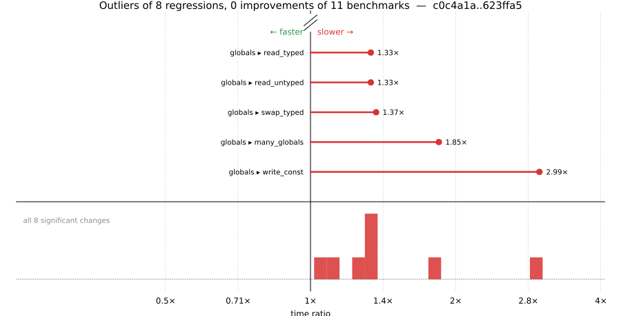

# Benchmark Report

## Summary

**11** benchmarks were executed, **8** showed regressions, and **0** showed improvements.



## Job Properties

*Commits:* [KenoAIStaging/julia@623ffa5b6803b63a788a72375b6bb2307dc4e0c5](https://github.com/KenoAIStaging/julia/commit/623ffa5b6803b63a788a72375b6bb2307dc4e0c5) vs [JuliaLang/julia@c0c4a1a8f1b48aa2f0e75f5ea1a619f13b8b2ed0](https://github.com/JuliaLang/julia/commit/c0c4a1a8f1b48aa2f0e75f5ea1a619f13b8b2ed0)

*Comparison Diff:* [link](https://github.com/JuliaLang/julia/compare/c0c4a1a8f1b48aa2f0e75f5ea1a619f13b8b2ed0...KenoAIStaging/julia:623ffa5b6803b63a788a72375b6bb2307dc4e0c5)

*Triggered By:* [link](https://github.com/JuliaLang/julia/pull/62335#issuecomment-4979039968)

*Tag Predicate:* `"globals"`

## Results

*Note: If Chrome is your browser, I strongly recommend installing the [Wide GitHub](https://chrome.google.com/webstore/detail/wide-github/kaalofacklcidaampbokdplbklpeldpj?hl=en)
extension, which makes the result table easier to read.*

Below is a table of this job's results, obtained by running the benchmarks found in
[JuliaCI/BaseBenchmarks.jl](https://github.com/JuliaCI/BaseBenchmarks.jl). The values
listed in the `ID` column have the structure `[parent_group, child_group, ..., key]`,
and can be used to index into the BaseBenchmarks suite to retrieve the corresponding
benchmarks.

The percentages accompanying time and memory values in the below table are noise tolerances. The "true"
time/memory value for a given benchmark is expected to fall within this percentage of the reported value.

A ratio greater than `1.0` denotes a possible regression (marked with :x:), while a ratio less
than `1.0` denotes a possible improvement (marked with :white_check_mark:). Only significant results - results
that indicate possible regressions or improvements - are shown below (thus, an empty table means that all
benchmark results remained invariant between builds).

| ID | time ratio | memory ratio |
|----|------------|--------------|
| `["globals", "getglobal_dynamic"]` | 1.07 (5%) :x: | 1.00 (1%)  |
| `["globals", "many_globals"]` | 1.85 (5%) :x: | 1.00 (1%)  |
| `["globals", "read_typed"]` | 1.33 (5%) :x: | 1.00 (1%)  |
| `["globals", "read_untyped"]` | 1.33 (5%) :x: | 1.00 (1%)  |
| `["globals", "rmw_typed"]` | 1.25 (5%) :x: | 1.00 (1%)  |
| `["globals", "swap_typed"]` | 1.37 (5%) :x: | 1.00 (1%)  |
| `["globals", "write_const"]` | 2.99 (5%) :x: | 1.00 (1%)  |
| `["globals", "write_varying"]` | 1.12 (5%) :x: | 1.00 (1%)  |

## Benchmark Group List

Here's a list of all the benchmark groups executed by this job:

- `["globals"]`

## Version Info

#### Primary Build

```
Julia Version 1.14.0-DEV.2648
Build Info:
  Commit 623ffa5b68 (2026-07-13 06:54 UTC)
  GC: Built with stock GC
  Sysimage: native (x86_64-linux-gnu)
Platform Info:
  OS: Linux (x86_64-unknown-linux-gnu)
      Ubuntu 22.04.5 LTS
  uname: Linux 5.15.0-174-generic #184-Ubuntu SMP Fri Mar 13 18:41:50 UTC 2026 x86_64 x86_64
  CPU: Intel(R) Xeon(R) CPU E3-1241 v3 @ 3.50GHz (haswell):
              speed         user         nice          sys         idle          irq
       #1  3500 MHz      54060 s         39 s      18402 s    8851283 s          0 s  
       #2  3500 MHz     362181 s         24 s      20538 s    8543881 s          0 s  
       #3  3500 MHz      50488 s         28 s      12563 s    8831881 s          0 s  
       #4  3500 MHz      45925 s         38 s      14416 s    8856040 s          0 s  
  Memory: 31.301372528076172 GiB (23833.3203125 MiB free)
  Uptime: 8.9362174e6 sec
  Load Avg:  2.67  7.19  5.61
  WORD_SIZE: 64
  LLVM: libLLVM-21.1.8 (ORCJIT, haswell)
Threads: 1 default, 1 interactive, 1 GC (on 4 virtual cores)

```

#### Comparison Build

```
Julia Version 1.14.0-DEV.2659
Build Info:
  Commit c0c4a1a8f1 (2026-07-14 21:42 UTC)
  GC: Built with stock GC
  Sysimage: native (x86_64-linux-gnu)
Platform Info:
  OS: Linux (x86_64-unknown-linux-gnu)
      Ubuntu 22.04.5 LTS
  uname: Linux 5.15.0-174-generic #184-Ubuntu SMP Fri Mar 13 18:41:50 UTC 2026 x86_64 x86_64
  CPU: Intel(R) Xeon(R) CPU E3-1241 v3 @ 3.50GHz (haswell):
              speed         user         nice          sys         idle          irq
       #1  3501 MHz      54072 s         39 s      18403 s    8851361 s          0 s  
       #2  3500 MHz     362211 s         24 s      20539 s    8543941 s          0 s  
       #3  3500 MHz      50533 s         28 s      12564 s    8831926 s          0 s  
       #4  3500 MHz      45942 s         38 s      14417 s    8856113 s          0 s  
  Memory: 31.301372528076172 GiB (23840.09375 MiB free)
  Uptime: 8.93630855e6 sec
  Load Avg:  1.44  5.54  5.17
  WORD_SIZE: 64
  LLVM: libLLVM-21.1.8 (ORCJIT, haswell)
Threads: 1 default, 1 interactive, 1 GC (on 4 virtual cores)

```

#### Nanosoldier
Nanosoldier commit: [`68f7ae1`](https://github.com/JuliaCI/Nanosoldier.jl/commit/68f7ae1308b5151b0b33c1cae9898f5c79df4f47)
