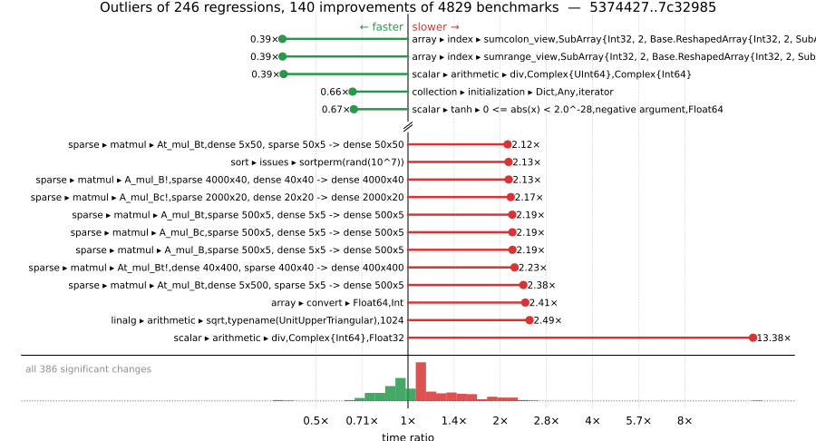

# Benchmark Report

## Summary

**4829** benchmarks were executed, **246** showed regressions, and **140** showed improvements.



## Job Properties

*Commits:* [JuliaLang/julia@7c32985bc3df4fafe892e426b83b1ed1564a8ec7](https://github.com/JuliaLang/julia/commit/7c32985bc3df4fafe892e426b83b1ed1564a8ec7) vs [JuliaLang/julia@5374427046e0c34ae42098c04a88c9567e4ac93b](https://github.com/JuliaLang/julia/commit/5374427046e0c34ae42098c04a88c9567e4ac93b)

*Comparison Diff:* [link](https://github.com/JuliaLang/julia/compare/5374427046e0c34ae42098c04a88c9567e4ac93b...7c32985bc3df4fafe892e426b83b1ed1564a8ec7)

*Triggered By:* [link](https://github.com/JuliaLang/julia/pull/63154#issuecomment-5681290074)

*Tag Predicate:* `ALL`

## Results

*Note: If Chrome is your browser, I strongly recommend installing the [Wide GitHub](https://chrome.google.com/webstore/detail/wide-github/kaalofacklcidaampbokdplbklpeldpj?hl=en)
extension, which makes the result table easier to read.*

Below is a table of this job's results, obtained by running the benchmarks found in
[JuliaCI/BaseBenchmarks.jl](https://github.com/JuliaCI/BaseBenchmarks.jl). The values
listed in the `ID` column have the structure `[parent_group, child_group, ..., key]`,
and can be used to index into the BaseBenchmarks suite to retrieve the corresponding
benchmarks.

The percentages accompanying time and memory values in the below table are noise tolerances. The "true"
time/memory value for a given benchmark is expected to fall within this percentage of the reported value.

A ratio greater than `1.0` denotes a possible regression (marked with :x:), while a ratio less
than `1.0` denotes a possible improvement (marked with :white_check_mark:). Only significant results - results
that indicate possible regressions or improvements - are shown below (thus, an empty table means that all
benchmark results remained invariant between builds).

| ID | time ratio | memory ratio |
|----|------------|--------------|
| `["alloc", "grow_array"]` | 1.07 (5%) :x: | 1.00 (1%)  |
| `["array", "accumulate", ("accumulate", "Int")]` | 1.06 (5%) :x: | 1.00 (1%)  |
| `["array", "accumulate", ("cumsum", "Int")]` | 1.09 (5%) :x: | 1.00 (1%)  |
| `["array", "bool", "boolarray_true_load!"]` | 1.06 (5%) :x: | 1.00 (1%)  |
| `["array", "cat", ("catnd", 5)]` | 0.94 (5%) :white_check_mark: | 1.00 (1%)  |
| `["array", "cat", ("hcat", 5)]` | 1.05 (5%) :x: | 1.00 (1%)  |
| `["array", "cat", ("hcat_setind", 5)]` | 1.07 (5%) :x: | 1.00 (1%)  |
| `["array", "convert", ("Float64", "Int")]` | 2.41 (5%) :x: | 1.00 (1%)  |
| `["array", "convert", ("Int", "Complex{Float64}")]` | 1.12 (5%) :x: | 1.00 (1%)  |
| `["array", "convert", ("Int", "Float64")]` | 1.30 (5%) :x: | 1.00 (1%)  |
| `["array", "index", "4d"]` | 0.94 (5%) :white_check_mark: | 1.00 (1%)  |
| `["array", "index", "5d"]` | 1.08 (5%) :x: | 1.00 (1%)  |
| `["array", "index", "6d"]` | 1.12 (5%) :x: | 1.00 (1%)  |
| `["array", "index", "7d"]` | 1.13 (5%) :x: | 1.00 (1%)  |
| `["array", "index", ("mapr_access", "BaseBenchmarks.ArrayBenchmarks.ArrayLF{Int32, 2}")]` | 1.87 (50%) :x: | 1.00 (1%)  |
| `["array", "index", ("mapr_access", "BaseBenchmarks.ArrayBenchmarks.ArrayLSLS{Int32, 2}")]` | 1.84 (50%) :x: | 1.00 (1%)  |
| `["array", "index", ("mapr_access", "BaseBenchmarks.ArrayBenchmarks.ArrayLS{Int32, 2}")]` | 1.84 (50%) :x: | 1.00 (1%)  |
| `["array", "index", ("mapr_access", "Matrix{Int32}")]` | 1.88 (50%) :x: | 1.00 (1%)  |
| `["array", "index", ("mapr_access", "Matrix{Int64}")]` | 1.60 (50%) :x: | 1.00 (1%)  |
| `["array", "index", ("mapr_access", "SubArray{Int32, 2, BaseBenchmarks.ArrayBenchmarks.ArrayLS{Int32, 2}, Tuple{Base.Slice{Base.OneTo{Int64}}, Base.Slice{Base.OneTo{Int64}}}, false}")]` | 1.82 (50%) :x: | 1.00 (1%)  |
| `["array", "index", ("mapr_access", "SubArray{Int32, 2, Matrix{Int32}, Tuple{Base.Slice{Base.OneTo{Int64}}, Base.Slice{Base.OneTo{Int64}}}, true}")]` | 1.88 (50%) :x: | 1.00 (1%)  |
| `["array", "index", ("sumcolon_view", "SubArray{Int32, 2, Array{Int32, 3}, Tuple{Int64, Base.Slice{Base.OneTo{Int64}}, Base.Slice{Base.OneTo{Int64}}}, true}")]` | 1.61 (50%) :x: | 1.00 (1%)  |
| `["array", "index", ("sumcolon_view", "SubArray{Int32, 2, Base.ReshapedArray{Int32, 2, SubArray{Int32, 3, Array{Int32, 3}, Tuple{Base.Slice{Base.OneTo{Int64}}, Base.Slice{Base.OneTo{Int64}}, Base.Slice{Base.OneTo{Int64}}}, true}, Tuple{}}, Tuple{Base.Slice{Base.OneTo{Int64}}, UnitRange{Int64}}, true}")]` | 0.39 (50%) :white_check_mark: | 1.00 (1%)  |
| `["array", "index", ("sumcolon_view", "SubArray{Int32, 2, BaseBenchmarks.ArrayBenchmarks.ArrayLS{Int32, 3}, Tuple{Int64, Base.Slice{Base.OneTo{Int64}}, Base.Slice{Base.OneTo{Int64}}}, false}")]` | 1.64 (50%) :x: | 1.00 (1%)  |
| `["array", "index", ("sumeach", "SubArray{Int32, 2, Array{Int32, 3}, Tuple{Int64, Base.Slice{Base.OneTo{Int64}}, Base.Slice{Base.OneTo{Int64}}}, true}")]` | 2.01 (50%) :x: | 1.00 (1%)  |
| `["array", "index", ("sumeach_view", "SubArray{Float32, 2, Array{Float32, 3}, Tuple{Int64, Base.Slice{Base.OneTo{Int64}}, Base.Slice{Base.OneTo{Int64}}}, true}")]` | 1.73 (50%) :x: | 1.00 (1%)  |
| `["array", "index", ("sumeach_view", "SubArray{Int32, 2, Array{Int32, 3}, Tuple{Int64, Base.Slice{Base.OneTo{Int64}}, Base.Slice{Base.OneTo{Int64}}}, true}")]` | 1.86 (50%) :x: | 1.00 (1%)  |
| `["array", "index", ("sumelt", "SubArray{Int32, 2, Array{Int32, 3}, Tuple{Int64, Base.Slice{Base.OneTo{Int64}}, Base.Slice{Base.OneTo{Int64}}}, true}")]` | 1.82 (50%) :x: | 1.00 (1%)  |
| `["array", "index", ("sumelt_boundscheck", "SubArray{Int32, 2, Array{Int32, 3}, Tuple{Int64, Base.Slice{Base.OneTo{Int64}}, Base.Slice{Base.OneTo{Int64}}}, true}")]` | 2.01 (50%) :x: | 1.00 (1%)  |
| `["array", "index", ("sumlinear", "SubArray{Int32, 2, Array{Int32, 3}, Tuple{Int64, Base.Slice{Base.OneTo{Int64}}, Base.Slice{Base.OneTo{Int64}}}, true}")]` | 1.99 (50%) :x: | 1.00 (1%)  |
| `["array", "index", ("sumlinear_view", "SubArray{Float32, 2, Array{Float32, 3}, Tuple{Int64, Base.Slice{Base.OneTo{Int64}}, Base.Slice{Base.OneTo{Int64}}}, true}")]` | 1.75 (50%) :x: | 1.00 (1%)  |
| `["array", "index", ("sumlinear_view", "SubArray{Int32, 2, Array{Int32, 3}, Tuple{Int64, Base.Slice{Base.OneTo{Int64}}, Base.Slice{Base.OneTo{Int64}}}, true}")]` | 1.79 (50%) :x: | 1.00 (1%)  |
| `["array", "index", ("sumrange_view", "SubArray{Int32, 2, Array{Int32, 3}, Tuple{Int64, Base.Slice{Base.OneTo{Int64}}, Base.Slice{Base.OneTo{Int64}}}, true}")]` | 1.54 (50%) :x: | 1.00 (1%)  |
| `["array", "index", ("sumrange_view", "SubArray{Int32, 2, Base.ReshapedArray{Int32, 2, SubArray{Int32, 3, Array{Int32, 3}, Tuple{Base.Slice{Base.OneTo{Int64}}, Base.Slice{Base.OneTo{Int64}}, Base.Slice{Base.OneTo{Int64}}}, true}, Tuple{}}, Tuple{Base.Slice{Base.OneTo{Int64}}, UnitRange{Int64}}, true}")]` | 0.39 (50%) :white_check_mark: | 1.00 (1%)  |
| `["array", "index", ("sumrange_view", "SubArray{Int32, 2, BaseBenchmarks.ArrayBenchmarks.ArrayLS{Int32, 3}, Tuple{Int64, Base.Slice{Base.OneTo{Int64}}, Base.Slice{Base.OneTo{Int64}}}, false}")]` | 1.56 (50%) :x: | 1.00 (1%)  |
| `["array", "reductions", ("maxabs", "Float64")]` | 0.72 (5%) :white_check_mark: | 1.00 (1%)  |
| `["array", "reductions", ("norm", "Int64")]` | 0.91 (5%) :white_check_mark: | 1.00 (1%)  |
| `["array", "reductions", ("norminf", "Float64")]` | 0.72 (5%) :white_check_mark: | 1.00 (1%)  |
| `["array", "reductions", ("norminf", "Int64")]` | 0.82 (5%) :white_check_mark: | 1.00 (1%)  |
| `["array", "reductions", ("sumabs2", "Float64")]` | 1.12 (5%) :x: | 1.00 (1%)  |
| `["array", "reverse", "rev_loadmul_slow!"]` | 1.10 (5%) :x: | 1.00 (1%)  |
| `["broadcast", "dotop", ("Float64", "(1000, 1000)", 2)]` | 1.20 (5%) :x: | 1.00 (1%)  |
| `["broadcast", "sparse", ("(1000, 1000)", 2)]` | 0.82 (5%) :white_check_mark: | 1.00 (1%)  |
| `["broadcast", "typeargs", ("array", 5)]` | 0.88 (5%) :white_check_mark: | 1.00 (1%)  |
| `["broadcast", "typeargs", ("tuple", 10)]` | 1.12 (5%) :x: | 1.00 (1%)  |
| `["broadcast", "typeargs", ("tuple", 5)]` | 0.80 (5%) :white_check_mark: | 1.00 (1%)  |
| `["collection", "deletion", ("IdDict", "Any", "filter!")]` | 1.25 (25%) :x: | 1.00 (1%)  |
| `["collection", "initialization", ("Dict", "Any", "iterator")]` | 0.66 (25%) :white_check_mark: | 1.00 (1%)  |
| `["collection", "set operations", ("Set", "Int", "⊆", "BitSet")]` | 1.42 (25%) :x: | 1.00 (1%)  |
| `["dates", "arithmetic", ("DateTime", "Hour")]` | 1.10 (5%) :x: | 1.00 (1%)  |
| `["dates", "arithmetic", ("DateTime", "Minute")]` | 1.10 (5%) :x: | 1.00 (1%)  |
| `["dates", "arithmetic", ("DateTime", "Second")]` | 1.10 (5%) :x: | 1.00 (1%)  |
| `["dates", "conversion", "Date -> DateTime"]` | 0.82 (5%) :white_check_mark: | 1.00 (1%)  |
| `["dates", "conversion", "DateTime -> Date"]` | 0.93 (5%) :white_check_mark: | 1.00 (1%)  |
| `["dates", "parse", "Date"]` | 0.94 (5%) :white_check_mark: | 1.00 (1%)  |
| `["dates", "parse", ("Date", "DateFormat")]` | 0.89 (5%) :white_check_mark: | 1.00 (1%)  |
| `["dates", "parse", ("Date", "ISODateFormat")]` | 0.92 (5%) :white_check_mark: | 1.00 (1%)  |
| `["dates", "parse", ("DateTime", "DateFormat")]` | 0.84 (5%) :white_check_mark: | 1.00 (1%)  |
| `["dates", "parse", ("DateTime", "RFC1123Format", "Lowercase")]` | 0.93 (5%) :white_check_mark: | 1.00 (1%)  |
| `["dates", "parse", ("DateTime", "RFC1123Format", "Titlecase")]` | 0.94 (5%) :white_check_mark: | 1.00 (1%)  |
| `["find", "findall", ("Vector{Bool}", "10-90")]` | 1.08 (5%) :x: | 1.00 (1%)  |
| `["find", "findall", ("Vector{Bool}", "50-50")]` | 0.95 (5%) :white_check_mark: | 1.00 (1%)  |
| `["find", "findall", ("Vector{Bool}", "90-10")]` | 1.11 (5%) :x: | 1.00 (1%)  |
| `["find", "findall", ("ispos", "Vector{Float64}")]` | 1.09 (5%) :x: | 1.00 (1%)  |
| `["find", "findnext", ("Vector{Bool}", "50-50")]` | 0.87 (5%) :white_check_mark: | 1.00 (1%)  |
| `["find", "findnext", ("ispos", "Vector{Float64}")]` | 1.06 (5%) :x: | 1.00 (1%)  |
| `["find", "findnext", ("ispos", "Vector{Int64}")]` | 0.89 (5%) :white_check_mark: | 1.00 (1%)  |
| `["find", "findprev", ("BitVector", "10-90")]` | 1.10 (5%) :x: | 1.00 (1%)  |
| `["find", "findprev", ("Vector{Bool}", "50-50")]` | 1.05 (5%) :x: | 1.00 (1%)  |
| `["inference", "abstract interpretation", "many_local_vars"]` | 1.12 (5%) :x: | 1.00 (1%)  |
| `["inference", "abstract interpretation", "many_method_matches"]` | 1.06 (5%) :x: | 1.00 (1%)  |
| `["inference", "optimization", "many_const_calls"]` | 1.09 (5%) :x: | 1.00 (1%)  |
| `["io", "read", "read"]` | 1.23 (5%) :x: | 1.00 (1%)  |
| `["io", "read", "readstring"]` | 1.08 (5%) :x: | 1.00 (1%)  |
| `["io", "serialization", ("serialize", "Matrix{Float64}")]` | 1.06 (5%) :x: | 1.00 (1%)  |
| `["linalg", "arithmetic", ("3-arg mul!", 2)]` | 1.85 (45%) :x: | 1.00 (1%)  |
| `["linalg", "arithmetic", ("sqrt", "typename(UnitUpperTriangular)", 1024)]` | 2.49 (45%) :x: | 1.00 (1%)  |
| `["misc", "18129"]` | 1.14 (5%) :x: | 1.00 (1%)  |
| `["misc", "bitshift", ("Int", "Int")]` | 1.08 (5%) :x: | 1.00 (1%)  |
| `["misc", "bitshift", ("Int", "UInt")]` | 1.08 (5%) :x: | 1.00 (1%)  |
| `["misc", "bitshift", ("UInt", "UInt")]` | 0.93 (5%) :white_check_mark: | 1.00 (1%)  |
| `["misc", "bitshift", ("UInt32", "UInt32")]` | 0.83 (5%) :white_check_mark: | 1.00 (1%)  |
| `["misc", "foldl", "foldl(+, filter(...); init = 0.0)"]` | 0.86 (5%) :white_check_mark: | 1.00 (1%)  |
| `["misc", "issue 12165", "Float16"]` | 1.05 (5%) :x: | 1.00 (1%)  |
| `["misc", "issue 12165", "Float32"]` | 1.12 (5%) :x: | 1.00 (1%)  |
| `["misc", "issue 12165", "Float64"]` | 1.08 (5%) :x: | 1.00 (1%)  |
| `["misc", "iterators", "zip(1:1)"]` | 1.11 (5%) :x: | 1.00 (1%)  |
| `["misc", "iterators", "zip(1:1000, 1:1000)"]` | 1.06 (5%) :x: | 1.00 (1%)  |
| `["misc", "iterators", "zip(1:1000, 1:1000, 1:1000)"]` | 1.07 (5%) :x: | 1.00 (1%)  |
| `["misc", "parse", "Float64"]` | 0.93 (5%) :white_check_mark: | 1.00 (1%)  |
| `["misc", "repeat", (200, 1, 24)]` | 1.61 (5%) :x: | 1.00 (1%)  |
| `["problem", "chaosgame", "chaosgame"]` | 0.95 (5%) :white_check_mark: | 1.00 (1%)  |
| `["scalar", "acos", ("0.5 <= abs(x) < 1", "negative argument", "Float32")]` | 1.18 (5%) :x: | 1.00 (1%)  |
| `["scalar", "acos", ("0.5 <= abs(x) < 1", "negative argument", "Float64")]` | 0.83 (5%) :white_check_mark: | 1.00 (1%)  |
| `["scalar", "acos", ("abs(x) < 0.5", "positive argument", "Float32")]` | 1.05 (5%) :x: | 1.00 (1%)  |
| `["scalar", "acos", ("one", "negative argument", "Float32")]` | 1.17 (5%) :x: | 1.00 (1%)  |
| `["scalar", "acos", ("one", "positive argument", "Float32")]` | 1.17 (5%) :x: | 1.00 (1%)  |
| `["scalar", "acos", ("small", "negative argument", "Float32")]` | 0.95 (5%) :white_check_mark: | 1.00 (1%)  |
| `["scalar", "acos", ("small", "negative argument", "Float64")]` | 0.95 (5%) :white_check_mark: | 1.00 (1%)  |
| `["scalar", "acos", ("small", "positive argument", "Float32")]` | 0.95 (5%) :white_check_mark: | 1.00 (1%)  |
| `["scalar", "acos", ("small", "positive argument", "Float64")]` | 0.95 (5%) :white_check_mark: | 1.00 (1%)  |
| `["scalar", "acos", ("zero", "Float32")]` | 0.95 (5%) :white_check_mark: | 1.00 (1%)  |
| `["scalar", "acos", ("zero", "Float64")]` | 0.95 (5%) :white_check_mark: | 1.00 (1%)  |
| `["scalar", "acosh", ("one", "Float32")]` | 1.06 (5%) :x: | 1.00 (1%)  |
| `["scalar", "arithmetic", ("div", "Complex{Int64}", "Float32")]` | 13.38 (50%) :x: | 1.00 (1%)  |
| `["scalar", "arithmetic", ("div", "Complex{UInt64}", "Complex{Int64}")]` | 0.39 (50%) :white_check_mark: | 1.00 (1%)  |
| `["scalar", "arithmetic", ("rem type", "Bool", "Bool")]` | 1.27 (25%) :x: | 1.00 (1%)  |
| `["scalar", "asin", ("0.5 <= abs(x) < 0.975", "negative argument", "Float32")]` | 0.78 (5%) :white_check_mark: | 1.00 (1%)  |
| `["scalar", "asin", ("0.5 <= abs(x) < 0.975", "negative argument", "Float64")]` | 0.72 (5%) :white_check_mark: | 1.00 (1%)  |
| `["scalar", "asin", ("abs(x) < 0.5", "negative argument", "Float64")]` | 0.91 (5%) :white_check_mark: | 1.00 (1%)  |
| `["scalar", "asin", ("abs(x) < 0.5", "positive argument", "Float64")]` | 0.91 (5%) :white_check_mark: | 1.00 (1%)  |
| `["scalar", "asin", ("one", "negative argument", "Float32")]` | 1.11 (5%) :x: | 1.00 (1%)  |
| `["scalar", "asin", ("one", "positive argument", "Float32")]` | 1.11 (5%) :x: | 1.00 (1%)  |
| `["scalar", "asin", ("small", "negative argument", "Float32")]` | 0.95 (5%) :white_check_mark: | 1.00 (1%)  |
| `["scalar", "asin", ("small", "negative argument", "Float64")]` | 0.90 (5%) :white_check_mark: | 1.00 (1%)  |
| `["scalar", "asin", ("small", "positive argument", "Float32")]` | 0.95 (5%) :white_check_mark: | 1.00 (1%)  |
| `["scalar", "asin", ("zero", "Float32")]` | 0.95 (5%) :white_check_mark: | 1.00 (1%)  |
| `["scalar", "asinh", ("0 <= abs(x) < 2^-28", "negative argument", "Float32")]` | 0.93 (5%) :white_check_mark: | 1.00 (1%)  |
| `["scalar", "asinh", ("0 <= abs(x) < 2^-28", "positive argument", "Float32")]` | 0.93 (5%) :white_check_mark: | 1.00 (1%)  |
| `["scalar", "asinh", ("very small", "positive argument", "Float32")]` | 0.95 (5%) :white_check_mark: | 1.00 (1%)  |
| `["scalar", "asinh", ("zero", "Float32")]` | 0.95 (5%) :white_check_mark: | 1.00 (1%)  |
| `["scalar", "atan", ("0 <= abs(x) < 7/16", "negative argument", "Float32")]` | 1.10 (5%) :x: | 1.00 (1%)  |
| `["scalar", "atan", ("0 <= abs(x) < 7/16", "negative argument", "Float64")]` | 0.90 (5%) :white_check_mark: | 1.00 (1%)  |
| `["scalar", "atan", ("0 <= abs(x) < 7/16", "positive argument", "Float32")]` | 1.10 (5%) :x: | 1.00 (1%)  |
| `["scalar", "atan", ("0 <= abs(x) < 7/16", "positive argument", "Float64")]` | 0.90 (5%) :white_check_mark: | 1.00 (1%)  |
| `["scalar", "atan", ("11/16 <= abs(x) < 19/16", "negative argument", "Float64")]` | 0.88 (5%) :white_check_mark: | 1.00 (1%)  |
| `["scalar", "atan", ("11/16 <= abs(x) < 19/16", "positive argument", "Float64")]` | 0.88 (5%) :white_check_mark: | 1.00 (1%)  |
| `["scalar", "atan", ("19/16 <= abs(x) < 39/16", "negative argument", "Float64")]` | 0.87 (5%) :white_check_mark: | 1.00 (1%)  |
| `["scalar", "atan", ("19/16 <= abs(x) < 39/16", "positive argument", "Float64")]` | 0.87 (5%) :white_check_mark: | 1.00 (1%)  |
| `["scalar", "atan", ("39/16 <= abs(x) < 2^66", "negative argument", "Float64")]` | 0.86 (5%) :white_check_mark: | 1.00 (1%)  |
| `["scalar", "atan", ("39/16 <= abs(x) < 2^66", "positive argument", "Float64")]` | 0.86 (5%) :white_check_mark: | 1.00 (1%)  |
| `["scalar", "atan", ("7/16 <= abs(x) < 11/16", "negative argument", "Float64")]` | 0.88 (5%) :white_check_mark: | 1.00 (1%)  |
| `["scalar", "atan", ("7/16 <= abs(x) < 11/16", "positive argument", "Float64")]` | 0.88 (5%) :white_check_mark: | 1.00 (1%)  |
| `["scalar", "atan", ("very large", "negative argument", "Float64")]` | 0.95 (5%) :white_check_mark: | 1.00 (1%)  |
| `["scalar", "atan", ("very large", "positive argument", "Float64")]` | 0.95 (5%) :white_check_mark: | 1.00 (1%)  |
| `["scalar", "atan", ("very small", "negative argument", "Float32")]` | 1.11 (5%) :x: | 1.00 (1%)  |
| `["scalar", "atan", ("very small", "negative argument", "Float64")]` | 1.06 (5%) :x: | 1.00 (1%)  |
| `["scalar", "atan", ("very small", "positive argument", "Float32")]` | 1.11 (5%) :x: | 1.00 (1%)  |
| `["scalar", "atan", ("very small", "positive argument", "Float64")]` | 1.05 (5%) :x: | 1.00 (1%)  |
| `["scalar", "atan", ("zero", "Float32")]` | 1.11 (5%) :x: | 1.00 (1%)  |
| `["scalar", "atan", ("zero", "Float64")]` | 1.06 (5%) :x: | 1.00 (1%)  |
| `["scalar", "atan2", ("abs(y/x) high", "y infinite", "y negative", "x finite", "x negative", "Float64")]` | 1.21 (5%) :x: | 1.00 (1%)  |
| `["scalar", "atan2", ("abs(y/x) high", "y negative", "x negative", "Float64")]` | 1.09 (5%) :x: | 1.00 (1%)  |
| `["scalar", "atan2", ("abs(y/x) high", "y negative", "x positive", "Float64")]` | 0.84 (5%) :white_check_mark: | 1.00 (1%)  |
| `["scalar", "atan2", ("abs(y/x) high", "y positive", "x negative", "Float64")]` | 1.14 (5%) :x: | 1.00 (1%)  |
| `["scalar", "atan2", ("abs(y/x) high", "y positive", "x positive", "Float64")]` | 0.84 (5%) :white_check_mark: | 1.00 (1%)  |
| `["scalar", "atan2", ("abs(y/x) safe (large)", "y negative", "x negative", "Float64")]` | 0.83 (5%) :white_check_mark: | 1.00 (1%)  |
| `["scalar", "atan2", ("abs(y/x) safe (large)", "y negative", "x positive", "Float64")]` | 0.85 (5%) :white_check_mark: | 1.00 (1%)  |
| `["scalar", "atan2", ("abs(y/x) safe (large)", "y positive", "x negative", "Float64")]` | 0.85 (5%) :white_check_mark: | 1.00 (1%)  |
| `["scalar", "atan2", ("abs(y/x) safe (large)", "y positive", "x positive", "Float64")]` | 0.84 (5%) :white_check_mark: | 1.00 (1%)  |
| `["scalar", "atan2", ("abs(y/x) safe (small)", "y negative", "x negative", "Float64")]` | 0.85 (5%) :white_check_mark: | 1.00 (1%)  |
| `["scalar", "atan2", ("abs(y/x) safe (small)", "y negative", "x positive", "Float64")]` | 0.81 (5%) :white_check_mark: | 1.00 (1%)  |
| `["scalar", "atan2", ("abs(y/x) safe (small)", "y positive", "x negative", "Float64")]` | 0.84 (5%) :white_check_mark: | 1.00 (1%)  |
| `["scalar", "atan2", ("abs(y/x) safe (small)", "y positive", "x positive", "Float64")]` | 0.84 (5%) :white_check_mark: | 1.00 (1%)  |
| `["scalar", "atan2", ("abs(y/x) small", "y positive", "x positive", "Float32")]` | 1.09 (5%) :x: | 1.00 (1%)  |
| `["scalar", "atan2", ("abs(y/x) small", "y positive", "x positive", "Float64")]` | 1.19 (5%) :x: | 1.00 (1%)  |
| `["scalar", "atan2", ("x one", "Float64")]` | 0.85 (5%) :white_check_mark: | 1.00 (1%)  |
| `["scalar", "atan2", ("x zero", "y negative", "Float32")]` | 0.94 (5%) :white_check_mark: | 1.00 (1%)  |
| `["scalar", "atan2", ("x zero", "y positive", "Float32")]` | 0.94 (5%) :white_check_mark: | 1.00 (1%)  |
| `["scalar", "atan2", ("y finite", "y negative", "x infinite", "x negative", "Float32")]` | 0.95 (5%) :white_check_mark: | 1.00 (1%)  |
| `["scalar", "atan2", ("y finite", "y negative", "x infinite", "x negative", "Float64")]` | 1.11 (5%) :x: | 1.00 (1%)  |
| `["scalar", "atan2", ("y finite", "y negative", "x infinite", "x positive", "Float32")]` | 0.95 (5%) :white_check_mark: | 1.00 (1%)  |
| `["scalar", "atan2", ("y finite", "y negative", "x infinite", "x positive", "Float64")]` | 1.10 (5%) :x: | 1.00 (1%)  |
| `["scalar", "atan2", ("y finite", "y positive", "x infinite", "x negative", "Float64")]` | 1.10 (5%) :x: | 1.00 (1%)  |
| `["scalar", "atan2", ("y finite", "y positive", "x infinite", "x positive", "Float64")]` | 1.10 (5%) :x: | 1.00 (1%)  |
| `["scalar", "atan2", ("y infinite", "y negative", "x finite", "x negative", "Float64")]` | 1.20 (5%) :x: | 1.00 (1%)  |
| `["scalar", "atan2", ("y infinite", "y negative", "x finite", "x positive", "Float64")]` | 1.21 (5%) :x: | 1.00 (1%)  |
| `["scalar", "atan2", ("y infinite", "y negative", "x infinite", "x negative", "Float64")]` | 1.10 (5%) :x: | 1.00 (1%)  |
| `["scalar", "atan2", ("y infinite", "y negative", "x infinite", "x positive", "Float64")]` | 1.10 (5%) :x: | 1.00 (1%)  |
| `["scalar", "atan2", ("y infinite", "y positive", "x finite", "x negative", "Float64")]` | 1.21 (5%) :x: | 1.00 (1%)  |
| `["scalar", "atan2", ("y infinite", "y positive", "x finite", "x positive", "Float64")]` | 1.21 (5%) :x: | 1.00 (1%)  |
| `["scalar", "atan2", ("y infinite", "y positive", "x infinite", "x negative", "Float64")]` | 1.10 (5%) :x: | 1.00 (1%)  |
| `["scalar", "atan2", ("y infinite", "y positive", "x infinite", "x positive", "Float64")]` | 1.10 (5%) :x: | 1.00 (1%)  |
| `["scalar", "atan2", ("y zero", "y negative", "x negative", "Float64")]` | 1.11 (5%) :x: | 1.00 (1%)  |
| `["scalar", "atan2", ("y zero", "y negative", "x positive", "Float32")]` | 1.06 (5%) :x: | 1.00 (1%)  |
| `["scalar", "atan2", ("y zero", "y negative", "x positive", "Float64")]` | 1.19 (5%) :x: | 1.00 (1%)  |
| `["scalar", "atan2", ("y zero", "y positive", "x negative", "Float32")]` | 1.06 (5%) :x: | 1.00 (1%)  |
| `["scalar", "atan2", ("y zero", "y positive", "x negative", "Float64")]` | 1.12 (5%) :x: | 1.00 (1%)  |
| `["scalar", "atan2", ("y zero", "y positive", "x positive", "Float32")]` | 1.06 (5%) :x: | 1.00 (1%)  |
| `["scalar", "atan2", ("y zero", "y positive", "x positive", "Float64")]` | 1.19 (5%) :x: | 1.00 (1%)  |
| `["scalar", "exp2", ("2pow127", "negative argument", "Float32")]` | 0.94 (5%) :white_check_mark: | 1.00 (1%)  |
| `["scalar", "exp2", ("2pow127", "positive argument", "Float32")]` | 0.94 (5%) :white_check_mark: | 1.00 (1%)  |
| `["scalar", "exp2", ("2pow35", "negative argument", "Float32")]` | 0.95 (5%) :white_check_mark: | 1.00 (1%)  |
| `["scalar", "exp2", ("2pow35", "positive argument", "Float32")]` | 1.06 (5%) :x: | 1.00 (1%)  |
| `["scalar", "expm1", ("huge", "positive argument", "Float3")]` | 1.06 (5%) :x: | 1.00 (1%)  |
| `["scalar", "expm1", ("huge", "positive argument", "Float64")]` | 0.91 (5%) :white_check_mark: | 1.00 (1%)  |
| `["scalar", "expm1", ("large", "negative argument", "Float32")]` | 1.06 (5%) :x: | 1.00 (1%)  |
| `["scalar", "expm1", ("large", "positive argument", "Float32")]` | 1.07 (5%) :x: | 1.00 (1%)  |
| `["scalar", "expm1", ("medium", "negative argument", "Float32")]` | 1.06 (5%) :x: | 1.00 (1%)  |
| `["scalar", "expm1", ("medium", "negative argument", "Float64")]` | 0.91 (5%) :white_check_mark: | 1.00 (1%)  |
| `["scalar", "expm1", ("medium", "positive argument", "Float32")]` | 1.07 (5%) :x: | 1.00 (1%)  |
| `["scalar", "mod2pi", ("argument reduction (easy) abs(x) < 2.0^20π/4", "negative argument", "Float64")]` | 0.91 (5%) :white_check_mark: | 1.00 (1%)  |
| `["scalar", "sin", ("no reduction", "zero", "Float32")]` | 1.05 (5%) :x: | 1.00 (1%)  |
| `["scalar", "tan", ("large", "negative argument", "Float64")]` | 0.91 (5%) :white_check_mark: | 1.00 (1%)  |
| `["scalar", "tan", ("large", "positive argument", "Float32")]` | 0.95 (5%) :white_check_mark: | 1.00 (1%)  |
| `["scalar", "tan", ("medium", "positive argument", "Float32")]` | 1.10 (5%) :x: | 1.00 (1%)  |
| `["scalar", "tanh", ("0 <= abs(x) < 2.0^-28", "negative argument", "Float64")]` | 0.67 (5%) :white_check_mark: | 1.00 (1%)  |
| `["scalar", "tanh", ("0 <= abs(x) < 2.0^-28", "positive argument", "Float64")]` | 0.68 (5%) :white_check_mark: | 1.00 (1%)  |
| `["scalar", "tanh", ("0 <= abs(x) < 2f0^-12", "negative argument", "Float32")]` | 1.05 (5%) :x: | 1.00 (1%)  |
| `["scalar", "tanh", ("0 <= abs(x) < 2f0^-12", "positive argument", "Float32")]` | 1.05 (5%) :x: | 1.00 (1%)  |
| `["scalar", "tanh", ("2.0^-28 <= abs(x) < 1.0", "negative argument", "Float64")]` | 0.68 (5%) :white_check_mark: | 1.00 (1%)  |
| `["scalar", "tanh", ("2.0^-28 <= abs(x) < 1.0", "positive argument", "Float64")]` | 0.68 (5%) :white_check_mark: | 1.00 (1%)  |
| `["scalar", "tanh", ("2f0^-12 <= abs(x) < 1f0", "negative argument", "Float32")]` | 1.05 (5%) :x: | 1.00 (1%)  |
| `["scalar", "tanh", ("2f0^-12 <= abs(x) < 1f0", "positive argument", "Float32")]` | 1.05 (5%) :x: | 1.00 (1%)  |
| `["scalar", "tanh", ("very large", "negative argument", "Float32")]` | 0.94 (5%) :white_check_mark: | 1.00 (1%)  |
| `["scalar", "tanh", ("very large", "negative argument", "Float64")]` | 0.95 (5%) :white_check_mark: | 1.00 (1%)  |
| `["scalar", "tanh", ("very large", "positive argument", "Float32")]` | 0.94 (5%) :white_check_mark: | 1.00 (1%)  |
| `["scalar", "tanh", ("very large", "positive argument", "Float64")]` | 0.95 (5%) :white_check_mark: | 1.00 (1%)  |
| `["scalar", "tanh", ("zero", "Float32")]` | 1.05 (5%) :x: | 1.00 (1%)  |
| `["scalar", "tanh", ("zero", "Float64")]` | 0.68 (5%) :white_check_mark: | 1.00 (1%)  |
| `["simd", ("Cartesian", "conditional_loop!", "Float32", 2, 32)]` | 0.73 (20%) :white_check_mark: | 1.00 (1%)  |
| `["simd", ("Cartesian", "conditional_loop!", "Float32", 2, 64)]` | 0.73 (20%) :white_check_mark: | 1.00 (1%)  |
| `["simd", ("Cartesian", "conditional_loop!", "Float32", 3, 64)]` | 0.77 (20%) :white_check_mark: | 1.00 (1%)  |
| `["simd", ("Cartesian", "conditional_loop!", "Float32", 4, 64)]` | 0.78 (20%) :white_check_mark: | 1.00 (1%)  |
| `["simd", ("Cartesian", "conditional_loop!", "Float64", 2, 32)]` | 0.73 (20%) :white_check_mark: | 1.00 (1%)  |
| `["simd", ("Cartesian", "conditional_loop!", "Float64", 2, 63)]` | 0.77 (20%) :white_check_mark: | 1.00 (1%)  |
| `["simd", ("Cartesian", "conditional_loop!", "Float64", 2, 64)]` | 0.73 (20%) :white_check_mark: | 1.00 (1%)  |
| `["simd", ("Cartesian", "conditional_loop!", "Float64", 3, 32)]` | 0.77 (20%) :white_check_mark: | 1.00 (1%)  |
| `["simd", ("Cartesian", "conditional_loop!", "Float64", 3, 63)]` | 0.79 (20%) :white_check_mark: | 1.00 (1%)  |
| `["simd", ("Cartesian", "conditional_loop!", "Float64", 3, 64)]` | 0.74 (20%) :white_check_mark: | 1.00 (1%)  |
| `["simd", ("Cartesian", "conditional_loop!", "Float64", 4, 32)]` | 0.78 (20%) :white_check_mark: | 1.00 (1%)  |
| `["simd", ("Cartesian", "conditional_loop!", "Float64", 4, 63)]` | 0.79 (20%) :white_check_mark: | 1.00 (1%)  |
| `["simd", ("Cartesian", "conditional_loop!", "Float64", 4, 64)]` | 0.75 (20%) :white_check_mark: | 1.00 (1%)  |
| `["simd", ("CartesianPartition", "conditional_loop!", "Float64", 2, 64)]` | 0.79 (20%) :white_check_mark: | 1.00 (1%)  |
| `["simd", ("CartesianPartition", "conditional_loop!", "Float64", 3, 64)]` | 0.79 (20%) :white_check_mark: | 1.00 (1%)  |
| `["simd", ("CartesianPartition", "conditional_loop!", "Float64", 4, 64)]` | 0.79 (20%) :white_check_mark: | 1.00 (1%)  |
| `["simd", ("Linear", "auto_conditional_loop!", "Float32", 4095)]` | 0.74 (20%) :white_check_mark: | 1.00 (1%)  |
| `["simd", ("Linear", "auto_conditional_loop!", "Float32", 4096)]` | 0.73 (20%) :white_check_mark: | 1.00 (1%)  |
| `["simd", ("Linear", "auto_conditional_loop!", "Float64", 4095)]` | 0.74 (20%) :white_check_mark: | 1.00 (1%)  |
| `["simd", ("Linear", "auto_conditional_loop!", "Float64", 4096)]` | 0.73 (20%) :white_check_mark: | 1.00 (1%)  |
| `["simd", ("Linear", "conditional_loop!", "Float32", 4095)]` | 0.74 (20%) :white_check_mark: | 1.00 (1%)  |
| `["simd", ("Linear", "conditional_loop!", "Float32", 4096)]` | 0.73 (20%) :white_check_mark: | 1.00 (1%)  |
| `["simd", ("Linear", "conditional_loop!", "Float64", 4095)]` | 0.73 (20%) :white_check_mark: | 1.00 (1%)  |
| `["simd", ("Linear", "conditional_loop!", "Float64", 4096)]` | 0.73 (20%) :white_check_mark: | 1.00 (1%)  |
| `["sort", "issues", "partialsort!(rand(10_000), 1:3, rev=true)"]` | 1.00 (20%)  | 0.94 (1%) :white_check_mark: |
| `["sort", "issues", "sortperm(rand(10^7))"]` | 2.13 (20%) :x: | 1.00 (1%)  |
| `["sort", "length = 10", "all same"]` | 1.29 (20%) :x: | 1.00 (1%)  |
| `["sort", "length = 1000", "Float64 unions with missing"]` | 1.24 (20%) :x: | 1.00 (1%)  |
| `["sort", "length = 3", "Int unions with missing"]` | 1.54 (20%) :x: | 1.00 (1%)  |
| `["sparse", "constructors", ("Bidiagonal", 1000)]` | 1.06 (5%) :x: | 1.00 (1%)  |
| `["sparse", "constructors", ("Diagonal", 1000)]` | 1.06 (5%) :x: | 1.00 (1%)  |
| `["sparse", "constructors", ("Tridiagonal", 100)]` | 1.07 (5%) :x: | 1.00 (1%)  |
| `["sparse", "matmul", ("A_mul_B!", "sparse 4000x40, dense 40x40 -> dense 4000x40")]` | 2.13 (30%) :x: | 1.00 (1%)  |
| `["sparse", "matmul", ("A_mul_B!", "sparse 4000x400, dense 400x40 -> dense 4000x40")]` | 1.36 (30%) :x: | 1.00 (1%)  |
| `["sparse", "matmul", ("A_mul_B!", "sparse 400x40, dense 40x400 -> dense 400x400")]` | 1.45 (30%) :x: | 1.00 (1%)  |
| `["sparse", "matmul", ("A_mul_B", "sparse 500x5, dense 5x5 -> dense 500x5")]` | 2.19 (30%) :x: | 1.00 (1%)  |
| `["sparse", "matmul", ("A_mul_B", "sparse 500x50, dense 50x5 -> dense 500x5")]` | 1.51 (30%) :x: | 1.00 (1%)  |
| `["sparse", "matmul", ("A_mul_B", "sparse 50x5, dense 5x50 -> dense 50x50")]` | 1.53 (30%) :x: | 1.00 (1%)  |
| `["sparse", "matmul", ("A_mul_Bc!", "sparse 2000x20, dense 20x20 -> dense 2000x20")]` | 2.17 (30%) :x: | 1.00 (1%)  |
| `["sparse", "matmul", ("A_mul_Bc!", "sparse 2000x200, dense 20x200 -> dense 2000x20")]` | 1.38 (30%) :x: | 1.00 (1%)  |
| `["sparse", "matmul", ("A_mul_Bc!", "sparse 200x20, dense 200x20 -> dense 200x200")]` | 1.46 (30%) :x: | 1.00 (1%)  |
| `["sparse", "matmul", ("A_mul_Bc", "sparse 500x5, dense 5x5 -> dense 500x5")]` | 2.19 (30%) :x: | 1.00 (1%)  |
| `["sparse", "matmul", ("A_mul_Bc", "sparse 500x50, dense 5x50 -> dense 500x5")]` | 1.44 (30%) :x: | 1.00 (1%)  |
| `["sparse", "matmul", ("A_mul_Bc", "sparse 50x5, dense 50x5 -> dense 50x50")]` | 1.51 (30%) :x: | 1.00 (1%)  |
| `["sparse", "matmul", ("A_mul_Bt!", "sparse 4000x40, dense 40x40 -> dense 4000x40")]` | 2.10 (30%) :x: | 1.00 (1%)  |
| `["sparse", "matmul", ("A_mul_Bt!", "sparse 4000x400, dense 40x400 -> dense 4000x40")]` | 1.30 (30%) :x: | 1.00 (1%)  |
| `["sparse", "matmul", ("A_mul_Bt!", "sparse 400x40, dense 400x40 -> dense 400x400")]` | 1.41 (30%) :x: | 1.00 (1%)  |
| `["sparse", "matmul", ("A_mul_Bt", "sparse 500x5, dense 5x5 -> dense 500x5")]` | 2.19 (30%) :x: | 1.00 (1%)  |
| `["sparse", "matmul", ("A_mul_Bt", "sparse 500x50, dense 5x50 -> dense 500x5")]` | 1.47 (30%) :x: | 1.00 (1%)  |
| `["sparse", "matmul", ("A_mul_Bt", "sparse 50x5, dense 50x5 -> dense 50x50")]` | 1.52 (30%) :x: | 1.00 (1%)  |
| `["sparse", "matmul", ("Ac_mul_B", "sparse 5x500, dense 5x5 -> dense 500x5")]` | 1.38 (30%) :x: | 1.00 (1%)  |
| `["sparse", "matmul", ("Ac_mul_Bc!", "dense 2000x20, sparse 2000x2000 -> dense 20x2000")]` | 1.48 (30%) :x: | 1.00 (1%)  |
| `["sparse", "matmul", ("Ac_mul_Bc!", "dense 2000x20, sparse 200x2000 -> dense 20x200")]` | 1.36 (30%) :x: | 1.00 (1%)  |
| `["sparse", "matmul", ("Ac_mul_Bc!", "dense 200x20, sparse 2000x200 -> dense 20x2000")]` | 1.50 (30%) :x: | 1.00 (1%)  |
| `["sparse", "matmul", ("Ac_mul_Bc!", "dense 200x200, sparse 200x200 -> dense 200x200")]` | 1.65 (30%) :x: | 1.00 (1%)  |
| `["sparse", "matmul", ("Ac_mul_Bc!", "dense 200x200, sparse 20x200 -> dense 200x20")]` | 1.58 (30%) :x: | 1.00 (1%)  |
| `["sparse", "matmul", ("Ac_mul_Bc!", "dense 20x20, sparse 2000x20 -> dense 20x2000")]` | 1.57 (30%) :x: | 1.00 (1%)  |
| `["sparse", "matmul", ("Ac_mul_Bc!", "dense 20x200, sparse 200x20 -> dense 200x200")]` | 1.63 (30%) :x: | 1.00 (1%)  |
| `["sparse", "matmul", ("Ac_mul_Bc!", "dense 20x2000, sparse 20x20 -> dense 2000x20")]` | 1.63 (30%) :x: | 1.00 (1%)  |
| `["sparse", "matmul", ("Ac_mul_Bc", "dense 50x5, sparse 500x50 -> dense 5x500")]` | 1.35 (30%) :x: | 1.00 (1%)  |
| `["sparse", "matmul", ("Ac_mul_Bc", "dense 50x50, sparse 50x50 -> dense 50x50")]` | 1.57 (30%) :x: | 1.00 (1%)  |
| `["sparse", "matmul", ("Ac_mul_Bc", "dense 50x50, sparse 5x50 -> dense 50x5")]` | 1.41 (30%) :x: | 1.00 (1%)  |
| `["sparse", "matmul", ("Ac_mul_Bc", "dense 5x5, sparse 500x5 -> dense 5x500")]` | 1.31 (30%) :x: | 1.00 (1%)  |
| `["sparse", "matmul", ("Ac_mul_Bc", "dense 5x50, sparse 50x5 -> dense 50x50")]` | 1.60 (30%) :x: | 1.00 (1%)  |
| `["sparse", "matmul", ("Ac_mul_Bc", "dense 5x500, sparse 5x5 -> dense 500x5")]` | 1.60 (30%) :x: | 1.00 (1%)  |
| `["sparse", "matmul", ("Ac_mul_Bc", "sparse 5x500, dense 5x5 -> dense 500x5")]` | 1.34 (30%) :x: | 1.00 (1%)  |
| `["sparse", "matmul", ("At_mul_B", "sparse 50x500, dense 50x5 -> dense 500x5")]` | 1.31 (30%) :x: | 1.00 (1%)  |
| `["sparse", "matmul", ("At_mul_B", "sparse 5x50, dense 5x50 -> dense 50x50")]` | 1.33 (30%) :x: | 1.00 (1%)  |
| `["sparse", "matmul", ("At_mul_B", "sparse 5x500, dense 5x5 -> dense 500x5")]` | 1.38 (30%) :x: | 1.00 (1%)  |
| `["sparse", "matmul", ("At_mul_Bt!", "dense 4000x40, sparse 4000x4000 -> dense 40x4000")]` | 1.99 (30%) :x: | 1.00 (1%)  |
| `["sparse", "matmul", ("At_mul_Bt!", "dense 4000x40, sparse 400x4000 -> dense 40x400")]` | 1.62 (30%) :x: | 1.00 (1%)  |
| `["sparse", "matmul", ("At_mul_Bt!", "dense 400x40, sparse 4000x400 -> dense 40x4000")]` | 2.06 (30%) :x: | 1.00 (1%)  |
| `["sparse", "matmul", ("At_mul_Bt!", "dense 40x40, sparse 4000x40 -> dense 40x4000")]` | 2.00 (30%) :x: | 1.00 (1%)  |
| `["sparse", "matmul", ("At_mul_Bt!", "dense 40x400, sparse 400x40 -> dense 400x400")]` | 2.23 (30%) :x: | 1.00 (1%)  |
| `["sparse", "matmul", ("At_mul_Bt!", "sparse 40x4000, dense 40x40 -> dense 4000x40")]` | 1.31 (30%) :x: | 1.00 (1%)  |
| `["sparse", "matmul", ("At_mul_Bt", "dense 50x50, sparse 50x50 -> dense 50x50")]` | 2.02 (30%) :x: | 1.00 (1%)  |
| `["sparse", "matmul", ("At_mul_Bt", "dense 50x50, sparse 5x50 -> dense 50x5")]` | 1.70 (30%) :x: | 1.00 (1%)  |
| `["sparse", "matmul", ("At_mul_Bt", "dense 5x50, sparse 50x5 -> dense 50x50")]` | 2.12 (30%) :x: | 1.00 (1%)  |
| `["sparse", "matmul", ("At_mul_Bt", "dense 5x500, sparse 5x5 -> dense 500x5")]` | 2.38 (30%) :x: | 1.00 (1%)  |
| `["sparse", "matmul", ("At_mul_Bt", "sparse 5x500, dense 5x5 -> dense 500x5")]` | 1.38 (30%) :x: | 1.00 (1%)  |
| `["sparse", "transpose", ("adjoint!", "(20000, 10000)")]` | 1.39 (30%) :x: | 1.00 (1%)  |
| `["sparse", "transpose", ("adjoint!", "(20000, 20000)")]` | 1.63 (30%) :x: | 1.00 (1%)  |
| `["sparse", "transpose", ("adjoint", "(20000, 10000)")]` | 1.38 (30%) :x: | 1.00 (1%)  |
| `["sparse", "transpose", ("adjoint", "(20000, 20000)")]` | 1.63 (30%) :x: | 1.00 (1%)  |
| `["sparse", "transpose", ("transpose!", "(20000, 20000)")]` | 1.51 (30%) :x: | 1.00 (1%)  |
| `["sparse", "transpose", ("transpose", "(20000, 20000)")]` | 1.52 (30%) :x: | 1.00 (1%)  |
| `["tuple", "linear algebra", ("matmat", "(4, 4)", "(4, 4)")]` | 1.52 (5%) :x: | 1.00 (1%)  |
| `["tuple", "linear algebra", ("matvec", "(16, 16)", "(16,)")]` | 1.08 (5%) :x: | 1.00 (1%)  |
| `["tuple", "linear algebra", ("matvec", "(2, 2)", "(2,)")]` | 0.93 (5%) :white_check_mark: | 1.00 (1%)  |
| `["tuple", "misc", "longtuple"]` | 1.34 (5%) :x: | 1.00 (1%)  |
| `["tuple", "reduction", ("minimum", "(16, 16)")]` | 0.72 (5%) :white_check_mark: | 1.00 (1%)  |
| `["tuple", "reduction", ("minimum", "(16,)")]` | 0.93 (5%) :white_check_mark: | 1.00 (1%)  |
| `["tuple", "reduction", ("minimum", "(2, 2)")]` | 1.38 (5%) :x: | 1.00 (1%)  |
| `["tuple", "reduction", ("minimum", "(2,)")]` | 1.13 (5%) :x: | 1.00 (1%)  |
| `["tuple", "reduction", ("minimum", "(4,)")]` | 1.40 (5%) :x: | 1.00 (1%)  |
| `["tuple", "reduction", ("minimum", "(8, 8)")]` | 0.81 (5%) :white_check_mark: | 1.00 (1%)  |
| `["tuple", "reduction", ("minimum", "(8,)")]` | 0.85 (5%) :white_check_mark: | 1.00 (1%)  |
| `["tuple", "reduction", ("sum", "(2, 2)")]` | 0.93 (5%) :white_check_mark: | 1.00 (1%)  |
| `["tuple", "reduction", ("sum", "(8,)")]` | 0.94 (5%) :white_check_mark: | 1.00 (1%)  |
| `["tuple", "reduction", ("sumabs", "(16,)")]` | 1.35 (5%) :x: | 1.00 (1%)  |
| `["tuple", "reduction", ("sumabs", "(2, 2)")]` | 1.47 (5%) :x: | 1.00 (1%)  |
| `["tuple", "reduction", ("sumabs", "(2,)")]` | 1.14 (5%) :x: | 1.00 (1%)  |
| `["tuple", "reduction", ("sumabs", "(4, 4)")]` | 1.43 (5%) :x: | 1.00 (1%)  |
| `["tuple", "reduction", ("sumabs", "(4,)")]` | 1.53 (5%) :x: | 1.00 (1%)  |
| `["tuple", "reduction", ("sumabs", "(8,)")]` | 1.33 (5%) :x: | 1.00 (1%)  |
| `["union", "array", ("broadcast", "*", "Bool", "(false, true)")]` | 0.93 (5%) :white_check_mark: | 1.00 (1%)  |
| `["union", "array", ("broadcast", "*", "Float32", "(false, false)")]` | 1.12 (5%) :x: | 1.00 (1%)  |
| `["union", "array", ("broadcast", "*", "Float32", "(false, true)")]` | 1.06 (5%) :x: | 1.00 (1%)  |
| `["union", "array", ("broadcast", "*", "Float64", "(false, false)")]` | 1.11 (5%) :x: | 1.00 (1%)  |
| `["union", "array", ("broadcast", "abs", "Int64", 1)]` | 1.06 (5%) :x: | 1.00 (1%)  |
| `["union", "array", ("broadcast", "abs", "Int8", 1)]` | 0.95 (5%) :white_check_mark: | 1.00 (1%)  |
| `["union", "array", ("broadcast", "identity", "BigInt", 1)]` | 1.05 (5%) :x: | 1.00 (1%)  |
| `["union", "array", ("broadcast", "identity", "ComplexF64", 1)]` | 1.10 (5%) :x: | 1.00 (1%)  |
| `["union", "array", ("broadcast", "identity", "Int8", 1)]` | 1.06 (5%) :x: | 1.00 (1%)  |
| `["union", "array", ("collect", "all", "BigFloat", 0)]` | 1.16 (5%) :x: | 1.00 (1%)  |
| `["union", "array", ("collect", "all", "BigFloat", 1)]` | 1.08 (5%) :x: | 1.00 (1%)  |
| `["union", "array", ("collect", "all", "Bool", 0)]` | 1.32 (5%) :x: | 1.00 (1%)  |
| `["union", "array", ("collect", "all", "Float32", 0)]` | 1.30 (5%) :x: | 1.00 (1%)  |
| `["union", "array", ("collect", "all", "Float64", 0)]` | 1.10 (5%) :x: | 1.00 (1%)  |
| `["union", "array", ("collect", "all", "Int64", 0)]` | 1.11 (5%) :x: | 1.00 (1%)  |
| `["union", "array", ("collect", "all", "Int8", 0)]` | 1.32 (5%) :x: | 1.00 (1%)  |
| `["union", "array", ("map", "*", "Bool", "(false, false)")]` | 1.11 (5%) :x: | 1.00 (1%)  |
| `["union", "array", ("map", "*", "Bool", "(false, true)")]` | 0.93 (5%) :white_check_mark: | 1.00 (1%)  |
| `["union", "array", ("map", "*", "Bool", "(true, true)")]` | 0.94 (5%) :white_check_mark: | 1.00 (1%)  |
| `["union", "array", ("map", "*", "Float32", "(false, false)")]` | 1.12 (5%) :x: | 1.00 (1%)  |
| `["union", "array", ("map", "*", "Float32", "(false, true)")]` | 0.90 (5%) :white_check_mark: | 1.00 (1%)  |
| `["union", "array", ("map", "*", "Float32", "(true, true)")]` | 0.85 (5%) :white_check_mark: | 1.00 (1%)  |
| `["union", "array", ("map", "*", "Float64", "(false, false)")]` | 1.11 (5%) :x: | 1.00 (1%)  |
| `["union", "array", ("map", "*", "Float64", "(false, true)")]` | 0.88 (5%) :white_check_mark: | 1.00 (1%)  |
| `["union", "array", ("map", "*", "Float64", "(true, true)")]` | 0.84 (5%) :white_check_mark: | 1.00 (1%)  |
| `["union", "array", ("map", "*", "Int64", "(true, true)")]` | 0.87 (5%) :white_check_mark: | 1.00 (1%)  |
| `["union", "array", ("map", "*", "Int8", "(false, false)")]` | 1.10 (5%) :x: | 1.00 (1%)  |
| `["union", "array", ("map", "abs", "BigInt", 1)]` | 0.93 (5%) :white_check_mark: | 1.00 (1%)  |
| `["union", "array", ("map", "abs", "Bool", 0)]` | 1.32 (5%) :x: | 1.00 (1%)  |
| `["union", "array", ("map", "abs", "Float32", 0)]` | 1.20 (5%) :x: | 1.00 (1%)  |
| `["union", "array", ("map", "abs", "Float64", 0)]` | 1.14 (5%) :x: | 1.00 (1%)  |
| `["union", "array", ("map", "abs", "Float64", 1)]` | 0.90 (5%) :white_check_mark: | 1.00 (1%)  |
| `["union", "array", ("map", "abs", "Int64", 0)]` | 1.11 (5%) :x: | 1.00 (1%)  |
| `["union", "array", ("map", "abs", "Int64", 1)]` | 1.06 (5%) :x: | 1.00 (1%)  |
| `["union", "array", ("map", "abs", "Int8", 0)]` | 1.16 (5%) :x: | 1.00 (1%)  |
| `["union", "array", ("map", "identity", "BigFloat", 0)]` | 1.15 (5%) :x: | 1.00 (1%)  |
| `["union", "array", ("map", "identity", "BigFloat", 1)]` | 1.05 (5%) :x: | 1.00 (1%)  |
| `["union", "array", ("map", "identity", "Bool", 0)]` | 1.32 (5%) :x: | 1.00 (1%)  |
| `["union", "array", ("map", "identity", "Float32", 0)]` | 1.30 (5%) :x: | 1.00 (1%)  |
| `["union", "array", ("map", "identity", "Float64", 0)]` | 1.10 (5%) :x: | 1.00 (1%)  |
| `["union", "array", ("map", "identity", "Int64", 0)]` | 1.11 (5%) :x: | 1.00 (1%)  |
| `["union", "array", ("map", "identity", "Int8", 0)]` | 1.32 (5%) :x: | 1.00 (1%)  |
| `["union", "array", ("perf_binaryop", "*", "Bool", "(true, true)")]` | 0.94 (5%) :white_check_mark: | 1.00 (1%)  |
| `["union", "array", ("perf_binaryop", "*", "Int8", "(true, true)")]` | 0.92 (5%) :white_check_mark: | 1.00 (1%)  |
| `["union", "array", ("perf_countequals", "BigInt")]` | 0.91 (5%) :white_check_mark: | 1.00 (1%)  |
| `["union", "array", ("perf_simplecopy", "BigFloat", 1)]` | 1.23 (5%) :x: | 1.00 (1%)  |
| `["union", "array", ("perf_simplecopy", "BigInt", 1)]` | 1.17 (5%) :x: | 1.00 (1%)  |
| `["union", "array", ("perf_sum", "BigFloat", 0)]` | 1.07 (5%) :x: | 1.00 (1%)  |
| `["union", "array", ("perf_sum", "BigFloat", 1)]` | 1.08 (5%) :x: | 1.00 (1%)  |
| `["union", "array", ("perf_sum2", "BigFloat", 1)]` | 1.06 (5%) :x: | 1.00 (1%)  |
| `["union", "array", ("perf_sum3", "ComplexF64", 1)]` | 1.08 (5%) :x: | 1.00 (1%)  |
| `["union", "array", ("perf_sum4", "BigFloat", 0)]` | 1.05 (5%) :x: | 1.00 (1%)  |
| `["union", "array", ("skipmissing", "collect", "Bool", 0)]` | 1.11 (5%) :x: | 1.00 (1%)  |
| `["union", "array", ("skipmissing", "collect", "Int8", 0)]` | 1.10 (5%) :x: | 1.00 (1%)  |
| `["union", "array", ("skipmissing", "filter", "Int64", 0)]` | 1.13 (5%) :x: | 1.00 (1%)  |
| `["union", "array", ("skipmissing", "filter", "Union{Missing, Int64}", 1)]` | 1.18 (5%) :x: | 1.00 (1%)  |
| `["union", "array", ("skipmissing", "filter", "Union{Nothing, Int64}", 0)]` | 1.17 (5%) :x: | 1.00 (1%)  |
| `["union", "array", ("skipmissing", "perf_sumskipmissing", "BigFloat", 0)]` | 1.08 (5%) :x: | 1.00 (1%)  |
| `["union", "array", ("skipmissing", "perf_sumskipmissing", "Int8", 0)]` | 0.89 (5%) :white_check_mark: | 1.00 (1%)  |
| `["union", "array", ("skipmissing", "perf_sumskipmissing", "Union{Nothing, BigFloat}", 0)]` | 1.06 (5%) :x: | 1.00 (1%)  |
| `["union", "array", ("skipmissing", "perf_sumskipmissing", "Union{Nothing, Int64}", 0)]` | 1.15 (5%) :x: | 1.00 (1%)  |
| `["union", "array", ("skipmissing", "sum", "BigFloat", 0)]` | 1.07 (5%) :x: | 1.00 (1%)  |
| `["union", "array", ("skipmissing", "sum", "ComplexF64", 0)]` | 1.07 (5%) :x: | 1.00 (1%)  |
| `["union", "array", ("skipmissing", "sum", "Union{Missing, BigFloat}", 1)]` | 1.05 (5%) :x: | 1.00 (1%)  |
| `["union", "array", ("sort", "BigInt", 0)]` | 0.94 (5%) :white_check_mark: | 1.00 (1%)  |
| `["union", "array", ("sort", "Bool", 0)]` | 1.95 (5%) :x: | 1.00 (1%)  |
| `["union", "array", ("sort", "Union{Missing, Float32}", 1)]` | 1.11 (5%) :x: | 1.00 (1%)  |
| `["union", "array", ("sort", "Union{Nothing, Float32}", 0)]` | 1.40 (5%) :x: | 1.00 (1%)  |
| `["union", "array", ("sort", "Union{Nothing, Float64}", 0)]` | 1.39 (5%) :x: | 1.00 (1%)  |
| `["union", "array", ("sort", "Union{Nothing, Int64}", 0)]` | 1.09 (5%) :x: | 1.00 (1%)  |
| `["union", "array", ("sort", "Union{Nothing, Int8}", 0)]` | 1.07 (5%) :x: | 1.00 (1%)  |

## Benchmark Group List

Here's a list of all the benchmark groups executed by this job:

- `["alloc"]`
- `["array", "accumulate"]`
- `["array", "any/all"]`
- `["array", "bool"]`
- `["array", "cat"]`
- `["array", "comprehension"]`
- `["array", "convert"]`
- `["array", "equality"]`
- `["array", "growth"]`
- `["array", "index"]`
- `["array", "reductions"]`
- `["array", "reverse"]`
- `["array", "setindex!"]`
- `["array", "subarray"]`
- `["broadcast"]`
- `["broadcast", "dotop"]`
- `["broadcast", "fusion"]`
- `["broadcast", "mix_scalar_tuple"]`
- `["broadcast", "sparse"]`
- `["broadcast", "typeargs"]`
- `["collection", "deletion"]`
- `["collection", "initialization"]`
- `["collection", "iteration"]`
- `["collection", "optimizations"]`
- `["collection", "queries & updates"]`
- `["collection", "set operations"]`
- `["dates", "accessor"]`
- `["dates", "arithmetic"]`
- `["dates", "construction"]`
- `["dates", "conversion"]`
- `["dates", "parse"]`
- `["dates", "query"]`
- `["dates", "string"]`
- `["find", "findall"]`
- `["find", "findnext"]`
- `["find", "findprev"]`
- `["frontend"]`
- `["globals"]`
- `["inference", "abstract interpretation"]`
- `["inference", "allinference"]`
- `["inference", "optimization"]`
- `["io", "array_limit"]`
- `["io", "read"]`
- `["io", "serialization"]`
- `["io"]`
- `["linalg", "arithmetic"]`
- `["linalg", "blas"]`
- `["linalg", "factorization"]`
- `["linalg"]`
- `["micro"]`
- `["misc"]`
- `["misc", "23042"]`
- `["misc", "afoldl"]`
- `["misc", "allocation elision view"]`
- `["misc", "bitshift"]`
- `["misc", "foldl"]`
- `["misc", "issue 12165"]`
- `["misc", "iterators"]`
- `["misc", "julia"]`
- `["misc", "parse"]`
- `["misc", "repeat"]`
- `["misc", "splatting"]`
- `["problem", "chaosgame"]`
- `["problem", "fem"]`
- `["problem", "go"]`
- `["problem", "grigoriadis khachiyan"]`
- `["problem", "imdb"]`
- `["problem", "json"]`
- `["problem", "laplacian"]`
- `["problem", "monte carlo"]`
- `["problem", "raytrace"]`
- `["problem", "seismic"]`
- `["problem", "simplex"]`
- `["problem", "spellcheck"]`
- `["problem", "stockcorr"]`
- `["problem", "ziggurat"]`
- `["random", "collections"]`
- `["random", "randstring"]`
- `["random", "ranges"]`
- `["random", "sequences"]`
- `["random", "types"]`
- `["scalar", "acos"]`
- `["scalar", "acosh"]`
- `["scalar", "arithmetic"]`
- `["scalar", "asin"]`
- `["scalar", "asinh"]`
- `["scalar", "atan"]`
- `["scalar", "atan2"]`
- `["scalar", "atanh"]`
- `["scalar", "cbrt"]`
- `["scalar", "cos"]`
- `["scalar", "cosh"]`
- `["scalar", "exp2"]`
- `["scalar", "expm1"]`
- `["scalar", "fastmath"]`
- `["scalar", "floatexp"]`
- `["scalar", "intfuncs"]`
- `["scalar", "iteration"]`
- `["scalar", "mod2pi"]`
- `["scalar", "predicate"]`
- `["scalar", "rem_pio2"]`
- `["scalar", "sin"]`
- `["scalar", "sincos"]`
- `["scalar", "sinh"]`
- `["scalar", "tan"]`
- `["scalar", "tanh"]`
- `["shootout"]`
- `["simd"]`
- `["sort", "insertionsort"]`
- `["sort", "issorted"]`
- `["sort", "issues"]`
- `["sort", "length = 10"]`
- `["sort", "length = 100"]`
- `["sort", "length = 1000"]`
- `["sort", "length = 10000"]`
- `["sort", "length = 3"]`
- `["sort", "length = 30"]`
- `["sort", "mergesort"]`
- `["sort", "quicksort"]`
- `["sparse", "arithmetic"]`
- `["sparse", "constructors"]`
- `["sparse", "index"]`
- `["sparse", "matmul"]`
- `["sparse", "sparse matvec"]`
- `["sparse", "sparse solves"]`
- `["sparse", "transpose"]`
- `["string", "==(::AbstractString, ::AbstractString)"]`
- `["string", "==(::SubString, ::String)"]`
- `["string", "findfirst"]`
- `["string"]`
- `["string", "readuntil"]`
- `["string", "repeat"]`
- `["tuple", "index"]`
- `["tuple", "linear algebra"]`
- `["tuple", "misc"]`
- `["tuple", "reduction"]`
- `["union", "array"]`

## Version Info

#### Primary Build

```
Julia Version 1.14.0-DEV.3218
Build Info:
  Commit 7c32985bc3 (2026-09-15 11:35 UTC)
  GC: Built with stock GC
  Sysimage: native (x86_64-linux-gnu)
Platform Info:
  OS: Linux (x86_64-unknown-linux-gnu)
      Ubuntu 22.04.5 LTS
  uname: Linux 5.15.0-174-generic #184-Ubuntu SMP Fri Mar 13 18:41:50 UTC 2026 x86_64 x86_64
  CPU: Intel(R) Xeon(R) CPU E3-1241 v3 @ 3.50GHz (haswell):
              speed         user         nice          sys         idle          irq
       #1  3494 MHz      90114 s         75 s      31273 s   14180352 s          0 s  
       #2  3500 MHz     573546 s         42 s      35160 s   13697502 s          0 s  
       #3  3500 MHz      78627 s         49 s      21016 s   14155592 s          0 s  
       #4  3500 MHz      69337 s         61 s      23897 s   14196610 s          0 s  
  Memory: 31.301 GiB (25.701 GiB free)
  Uptime: 1.432217251e7 sec
  Load Avg:  1.08  1.03  1.01
  WORD_SIZE: 64
  LLVM: libLLVM-23.1.1 (ORCJIT, haswell)
Threads: 1 default, 1 interactive, 1 GC (on 4 virtual cores)

```

#### Comparison Build

```
Julia Version 1.14.0-DEV.3203
Build Info:
  Commit 5374427046 (2026-09-15 10:47 UTC)
  GC: Built with stock GC
  Sysimage: native (x86_64-linux-gnu)
Platform Info:
  OS: Linux (x86_64-unknown-linux-gnu)
      Ubuntu 22.04.5 LTS
  uname: Linux 5.15.0-174-generic #184-Ubuntu SMP Fri Mar 13 18:41:50 UTC 2026 x86_64 x86_64
  CPU: Intel(R) Xeon(R) CPU E3-1241 v3 @ 3.50GHz (haswell):
              speed         user         nice          sys         idle          irq
       #1  3500 MHz      90260 s         75 s      31400 s   14193876 s          0 s  
       #2  3514 MHz     587078 s         42 s      35419 s   13697562 s          0 s  
       #3  3500 MHz      78677 s         49 s      21020 s   14169361 s          0 s  
       #4  3603 MHz      69349 s         61 s      23899 s   14210432 s          0 s  
  Memory: 31.301 GiB (25.950 GiB free)
  Uptime: 1.4336025e7 sec
  Load Avg:  1.01  1.01  1.0
  WORD_SIZE: 64
  LLVM: libLLVM-22.1.8 (ORCJIT, haswell)
Threads: 1 default, 1 interactive, 1 GC (on 4 virtual cores)

```

#### Nanosoldier
Nanosoldier commit: [`68f7ae1`](https://github.com/JuliaCI/Nanosoldier.jl/commit/68f7ae1308b5151b0b33c1cae9898f5c79df4f47)
