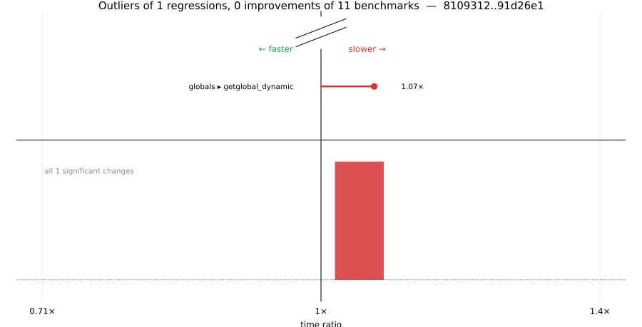

# Benchmark Report

## Summary

**11** benchmarks were executed, **1** showed regressions, and **0** showed improvements.



## Job Properties

*Commits:* [JuliaLang/julia@91d26e1258f19d69f23dff9928e457940e2d7005](https://github.com/JuliaLang/julia/commit/91d26e1258f19d69f23dff9928e457940e2d7005) vs [JuliaLang/julia@81093121d4e6cf469154d977e2ecd6b7488ea0de](https://github.com/JuliaLang/julia/commit/81093121d4e6cf469154d977e2ecd6b7488ea0de)

*Comparison Diff:* [link](https://github.com/JuliaLang/julia/compare/81093121d4e6cf469154d977e2ecd6b7488ea0de...91d26e1258f19d69f23dff9928e457940e2d7005)

*Triggered By:* [link](https://github.com/JuliaLang/julia/pull/63473#issuecomment-5879530615)

*Tag Predicate:* `"globals"`

## Results

*Note: If Chrome is your browser, I strongly recommend installing the [Wide GitHub](https://chrome.google.com/webstore/detail/wide-github/kaalofacklcidaampbokdplbklpeldpj?hl=en)
extension, which makes the result table easier to read.*

Below is a table of this job's results, obtained by running the benchmarks found in
[JuliaCI/BaseBenchmarks.jl](https://github.com/JuliaCI/BaseBenchmarks.jl). The values
listed in the `ID` column have the structure `[parent_group, child_group, ..., key]`,
and can be used to index into the BaseBenchmarks suite to retrieve the corresponding
benchmarks.

The percentages accompanying time and memory values in the below table are noise tolerances. The "true"
time/memory value for a given benchmark is expected to fall within this percentage of the reported value.

A ratio greater than `1.0` denotes a possible regression (marked with :x:), while a ratio less
than `1.0` denotes a possible improvement (marked with :white_check_mark:). Only significant results - results
that indicate possible regressions or improvements - are shown below (thus, an empty table means that all
benchmark results remained invariant between builds).

| ID | time ratio | memory ratio |
|----|------------|--------------|
| `["globals", "getglobal_dynamic"]` | 1.07 (5%) :x: | 1.00 (1%)  |

## Benchmark Group List

Here's a list of all the benchmark groups executed by this job:

- `["globals"]`

## Version Info

#### Primary Build

```
Julia Version 1.14.0-DEV.3267
Build Info:
  Commit 91d26e1258 (2026-09-28 21:58 UTC)
  GC: Built with stock GC
  Sysimage: native (x86_64-linux-gnu)
Platform Info:
  OS: Linux (x86_64-unknown-linux-gnu)
      Ubuntu 22.04.5 LTS
  uname: Linux 5.15.0-174-generic #184-Ubuntu SMP Fri Mar 13 18:41:50 UTC 2026 x86_64 x86_64
  CPU: Intel(R) Xeon(R) CPU E3-1241 v3 @ 3.50GHz (haswell):
              speed         user         nice          sys         idle          irq
       #1  3500 MHz      97709 s         81 s      34211 s   15306994 s          0 s  
       #2  3500 MHz     648712 s         45 s      39058 s   14756044 s          0 s  
       #3  3500 MHz      84988 s         55 s      22906 s   15280932 s          0 s  
       #4  3500 MHz      75368 s         66 s      25895 s   15324858 s          0 s  
  Memory: 31.301 GiB (21.906 GiB free)
  Uptime: 1.54610618e7 sec
  Load Avg:  3.4  7.46  5.56
  WORD_SIZE: 64
  LLVM: libLLVM-22.1.8 (ORCJIT, haswell)
Threads: 1 default, 1 interactive, 1 GC (on 4 virtual cores)

```

#### Comparison Build

```
Julia Version 1.14.0-DEV.3266
Build Info:
  Commit 81093121d4 (2026-09-18 13:42 UTC)
  GC: Built with stock GC
  Sysimage: native (x86_64-linux-gnu)
Platform Info:
  OS: Linux (x86_64-unknown-linux-gnu)
      Ubuntu 22.04.5 LTS
  uname: Linux 5.15.0-174-generic #184-Ubuntu SMP Fri Mar 13 18:41:50 UTC 2026 x86_64 x86_64
  CPU: Intel(R) Xeon(R) CPU E3-1241 v3 @ 3.50GHz (haswell):
              speed         user         nice          sys         idle          irq
       #1  3500 MHz      97716 s         81 s      34214 s   15307079 s          0 s  
       #2  3500 MHz     648752 s         45 s      39060 s   14756099 s          0 s  
       #3  3500 MHz      85001 s         55 s      22907 s   15281015 s          0 s  
       #4  3500 MHz      75411 s         66 s      25903 s   15324905 s          0 s  
  Memory: 31.301 GiB (21.901 GiB free)
  Uptime: 1.54611589e7 sec
  Load Avg:  1.6  5.72  5.13
  WORD_SIZE: 64
  LLVM: libLLVM-22.1.8 (ORCJIT, haswell)
Threads: 1 default, 1 interactive, 1 GC (on 4 virtual cores)

```

#### Nanosoldier
Nanosoldier commit: [`68f7ae1`](https://github.com/JuliaCI/Nanosoldier.jl/commit/68f7ae1308b5151b0b33c1cae9898f5c79df4f47)
