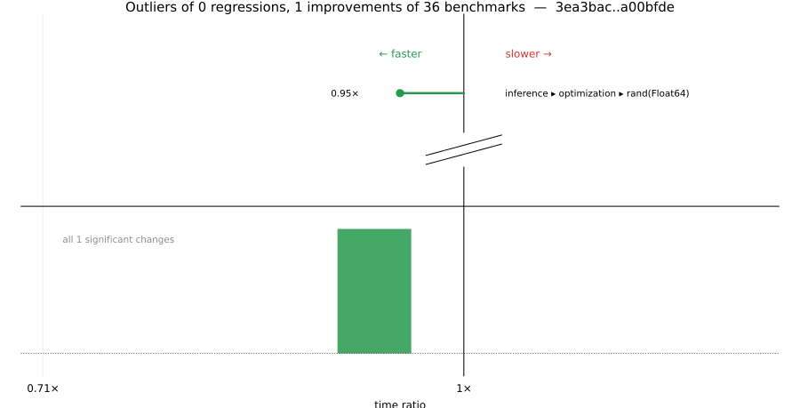

# Benchmark Report

## Summary

**36** benchmarks were executed, **0** showed regressions, and **1** showed improvements.



## Job Properties

*Commits:* [JuliaLang/julia@a00bfdeab71c7a93d612b2b3f1dfbeff7a216270](https://github.com/JuliaLang/julia/commit/a00bfdeab71c7a93d612b2b3f1dfbeff7a216270) vs [JuliaLang/julia@3ea3bac2a35ca565be0bf4dd1751a9224e27fe38](https://github.com/JuliaLang/julia/commit/3ea3bac2a35ca565be0bf4dd1751a9224e27fe38)

*Comparison Diff:* [link](https://github.com/JuliaLang/julia/compare/3ea3bac2a35ca565be0bf4dd1751a9224e27fe38...a00bfdeab71c7a93d612b2b3f1dfbeff7a216270)

*Triggered By:* [link](https://github.com/JuliaLang/julia/pull/61965#issuecomment-4607653131)

*Tag Predicate:* `"inference"`

## Results

*Note: If Chrome is your browser, I strongly recommend installing the [Wide GitHub](https://chrome.google.com/webstore/detail/wide-github/kaalofacklcidaampbokdplbklpeldpj?hl=en)
extension, which makes the result table easier to read.*

Below is a table of this job's results, obtained by running the benchmarks found in
[JuliaCI/BaseBenchmarks.jl](https://github.com/JuliaCI/BaseBenchmarks.jl). The values
listed in the `ID` column have the structure `[parent_group, child_group, ..., key]`,
and can be used to index into the BaseBenchmarks suite to retrieve the corresponding
benchmarks.

The percentages accompanying time and memory values in the below table are noise tolerances. The "true"
time/memory value for a given benchmark is expected to fall within this percentage of the reported value.

A ratio greater than `1.0` denotes a possible regression (marked with :x:), while a ratio less
than `1.0` denotes a possible improvement (marked with :white_check_mark:). Only significant results - results
that indicate possible regressions or improvements - are shown below (thus, an empty table means that all
benchmark results remained invariant between builds).

| ID | time ratio | memory ratio |
|----|------------|--------------|
| `["inference", "optimization", "rand(Float64)"]` | 0.95 (5%) :white_check_mark: | 1.00 (1%)  |

## Benchmark Group List

Here's a list of all the benchmark groups executed by this job:

- `["inference", "abstract interpretation"]`
- `["inference", "allinference"]`
- `["inference", "optimization"]`

## Version Info

#### Primary Build

```
Julia Version 1.14.0-DEV.2276
Build Info:
  Commit a00bfdeab7 (2026-06-02 16:10 UTC)
  GC: Built with stock GC
  Sysimage: native (x86_64-linux-gnu)
Platform Info:
  OS: Linux (x86_64-unknown-linux-gnu)
      Ubuntu 22.04.5 LTS
  uname: Linux 5.15.0-174-generic #184-Ubuntu SMP Fri Mar 13 18:41:50 UTC 2026 x86_64 x86_64
  CPU: Intel(R) Xeon(R) CPU E3-1241 v3 @ 3.50GHz (haswell):
              speed         user         nice          sys         idle          irq
       #1  3501 MHz      61902 s         24 s      15236 s    5180282 s          0 s  
       #2  3500 MHz     612442 s         17 s      16073 s    4635563 s          0 s  
       #3  3500 MHz      43755 s         21 s       6900 s    5197577 s          0 s  
       #4  3500 MHz      42673 s         10 s       7658 s    5213538 s          0 s  
  Memory: 31.301368713378906 GiB (24510.5 MiB free)
  Uptime: 5.27058827e6 sec
  Load Avg:  1.0  1.05  2.04
  WORD_SIZE: 64
  LLVM: libLLVM-21.1.8 (ORCJIT, haswell)
Threads: 1 default, 1 interactive, 1 GC (on 4 virtual cores)

```

#### Comparison Build

```
Julia Version 1.14.0-DEV.2275
Build Info:
  Commit 3ea3bac2a3 (2026-06-02 02:58 UTC)
  GC: Built with stock GC
  Sysimage: native (x86_64-linux-gnu)
Platform Info:
  OS: Linux (x86_64-unknown-linux-gnu)
      Ubuntu 22.04.5 LTS
  uname: Linux 5.15.0-174-generic #184-Ubuntu SMP Fri Mar 13 18:41:50 UTC 2026 x86_64 x86_64
  CPU: Intel(R) Xeon(R) CPU E3-1241 v3 @ 3.50GHz (haswell):
              speed         user         nice          sys         idle          irq
       #1  3500 MHz      61927 s         24 s      15252 s    5181709 s          0 s  
       #2  3500 MHz     613855 s         17 s      16075 s    4635624 s          0 s  
       #3  3500 MHz      43804 s         21 s       6907 s    5198993 s          0 s  
       #4  3501 MHz      42681 s         10 s       7658 s    5215004 s          0 s  
  Memory: 31.301368713378906 GiB (24530.54296875 MiB free)
  Uptime: 5.27206374e6 sec
  Load Avg:  1.0  1.0  1.19
  WORD_SIZE: 64
  LLVM: libLLVM-21.1.8 (ORCJIT, haswell)
Threads: 1 default, 1 interactive, 1 GC (on 4 virtual cores)

```

#### Nanosoldier
Nanosoldier commit: [`97af47c`](https://github.com/JuliaCI/Nanosoldier.jl/commit/97af47cb08d526629aa6f0680adb28fd8a94079b)
