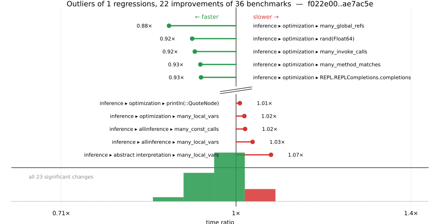

# Benchmark Report

## Summary

**36** benchmarks were executed, **1** showed regressions, and **22** showed improvements.



## Job Properties

*Commits:* [JuliaLang/julia@ae7ac5e080ba36f4a4a8aa3234a47e628b024151](https://github.com/JuliaLang/julia/commit/ae7ac5e080ba36f4a4a8aa3234a47e628b024151) vs [JuliaLang/julia@f022e008b5dd68c374e0d9b27354a74bc055e2d1](https://github.com/JuliaLang/julia/commit/f022e008b5dd68c374e0d9b27354a74bc055e2d1)

*Comparison Diff:* [link](https://github.com/JuliaLang/julia/compare/f022e008b5dd68c374e0d9b27354a74bc055e2d1...ae7ac5e080ba36f4a4a8aa3234a47e628b024151)

*Triggered By:* [link](https://github.com/JuliaLang/julia/pull/61930#issuecomment-4567326565)

*Tag Predicate:* `"inference"`

## Results

*Note: If Chrome is your browser, I strongly recommend installing the [Wide GitHub](https://chrome.google.com/webstore/detail/wide-github/kaalofacklcidaampbokdplbklpeldpj?hl=en)
extension, which makes the result table easier to read.*

Below is a table of this job's results, obtained by running the benchmarks found in
[JuliaCI/BaseBenchmarks.jl](https://github.com/JuliaCI/BaseBenchmarks.jl). The values
listed in the `ID` column have the structure `[parent_group, child_group, ..., key]`,
and can be used to index into the BaseBenchmarks suite to retrieve the corresponding
benchmarks.

The percentages accompanying time and memory values in the below table are noise tolerances. The "true"
time/memory value for a given benchmark is expected to fall within this percentage of the reported value.

A ratio greater than `1.0` denotes a possible regression (marked with :x:), while a ratio less
than `1.0` denotes a possible improvement (marked with :white_check_mark:). Only significant results - results
that indicate possible regressions or improvements - are shown below (thus, an empty table means that all
benchmark results remained invariant between builds).

| ID | time ratio | memory ratio |
|----|------------|--------------|
| `["inference", "abstract interpretation", "many_local_vars"]` | 1.07 (5%) :x: | 1.00 (1%)  |
| `["inference", "allinference", "Base.init_stdio(::Ptr{Cvoid})"]` | 1.00 (5%)  | 0.98 (1%) :white_check_mark: |
| `["inference", "allinference", "REPL.REPLCompletions.completions"]` | 0.99 (5%)  | 0.97 (1%) :white_check_mark: |
| `["inference", "allinference", "broadcasting"]` | 1.00 (5%)  | 0.98 (1%) :white_check_mark: |
| `["inference", "allinference", "many_const_calls"]` | 1.02 (5%)  | 0.98 (1%) :white_check_mark: |
| `["inference", "allinference", "many_global_refs"]` | 0.95 (5%)  | 0.93 (1%) :white_check_mark: |
| `["inference", "allinference", "many_invoke_calls"]` | 0.97 (5%)  | 0.95 (1%) :white_check_mark: |
| `["inference", "allinference", "many_local_vars"]` | 1.03 (5%)  | 0.98 (1%) :white_check_mark: |
| `["inference", "allinference", "many_method_matches"]` | 0.98 (5%)  | 0.97 (1%) :white_check_mark: |
| `["inference", "allinference", "many_opaque_closures"]` | 0.98 (5%)  | 0.96 (1%) :white_check_mark: |
| `["inference", "allinference", "println(::QuoteNode)"]` | 1.00 (5%)  | 0.98 (1%) :white_check_mark: |
| `["inference", "allinference", "rand(Float64)"]` | 1.00 (5%)  | 0.98 (1%) :white_check_mark: |
| `["inference", "allinference", "sin(42)"]` | 1.00 (5%)  | 0.97 (1%) :white_check_mark: |
| `["inference", "optimization", "Base.init_stdio(::Ptr{Cvoid})"]` | 0.98 (5%)  | 0.98 (1%) :white_check_mark: |
| `["inference", "optimization", "REPL.REPLCompletions.completions"]` | 0.93 (5%) :white_check_mark: | 1.00 (1%)  |
| `["inference", "optimization", "broadcasting"]` | 0.94 (5%) :white_check_mark: | 0.95 (1%) :white_check_mark: |
| `["inference", "optimization", "many_global_refs"]` | 0.88 (5%) :white_check_mark: | 0.86 (1%) :white_check_mark: |
| `["inference", "optimization", "many_invoke_calls"]` | 0.92 (5%) :white_check_mark: | 0.93 (1%) :white_check_mark: |
| `["inference", "optimization", "many_local_vars"]` | 1.02 (5%)  | 0.96 (1%) :white_check_mark: |
| `["inference", "optimization", "many_method_matches"]` | 0.93 (5%) :white_check_mark: | 0.94 (1%) :white_check_mark: |
| `["inference", "optimization", "many_opaque_closures"]` | 0.94 (5%) :white_check_mark: | 0.94 (1%) :white_check_mark: |
| `["inference", "optimization", "println(::QuoteNode)"]` | 1.01 (5%)  | 0.99 (1%) :white_check_mark: |
| `["inference", "optimization", "rand(Float64)"]` | 0.92 (5%) :white_check_mark: | 0.90 (1%) :white_check_mark: |

## Benchmark Group List

Here's a list of all the benchmark groups executed by this job:

- `["inference", "abstract interpretation"]`
- `["inference", "allinference"]`
- `["inference", "optimization"]`

## Version Info

#### Primary Build

```
Julia Version 1.14.0-DEV.2243
Build Info:
  Commit ae7ac5e080 (2026-05-28 17:46 UTC)
  GC: Built with stock GC
  Sysimage: native (x86_64-linux-gnu)
Platform Info:
  OS: Linux (x86_64-unknown-linux-gnu)
      Ubuntu 22.04.5 LTS
  uname: Linux 5.15.0-174-generic #184-Ubuntu SMP Fri Mar 13 18:41:50 UTC 2026 x86_64 x86_64
  CPU: Intel(R) Xeon(R) CPU E3-1241 v3 @ 3.50GHz (haswell):
              speed         user         nice          sys         idle          irq
       #1  3500 MHz      52192 s         22 s      13750 s    4746301 s          0 s  
       #2  3500 MHz     549662 s         14 s      14276 s    4254559 s          0 s  
       #3  3500 MHz      34481 s         21 s       5988 s    4763623 s          0 s  
       #4  3500 MHz      33921 s         10 s       6624 s    4777750 s          0 s  
  Memory: 31.301368713378906 GiB (24271.89453125 MiB free)
  Uptime: 4.82435973e6 sec
  Load Avg:  1.0  1.05  1.84
  WORD_SIZE: 64
  LLVM: libLLVM-21.1.8 (ORCJIT, haswell)
Threads: 1 default, 1 interactive, 1 GC (on 4 virtual cores)

```

#### Comparison Build

```
Julia Version 1.14.0-DEV.2243
Build Info:
  Commit f022e008b5 (2026-05-28 19:02 UTC)
  GC: Built with stock GC
  Sysimage: native (x86_64-linux-gnu)
Platform Info:
  OS: Linux (x86_64-unknown-linux-gnu)
      Ubuntu 22.04.5 LTS
  uname: Linux 5.15.0-174-generic #184-Ubuntu SMP Fri Mar 13 18:41:50 UTC 2026 x86_64 x86_64
  CPU: Intel(R) Xeon(R) CPU E3-1241 v3 @ 3.50GHz (haswell):
              speed         user         nice          sys         idle          irq
       #1  3500 MHz      52216 s         22 s      13766 s    4747715 s          0 s  
       #2  3500 MHz     551058 s         14 s      14278 s    4254620 s          0 s  
       #3  3500 MHz      34493 s         21 s       5988 s    4765067 s          0 s  
       #4  3501 MHz      33965 s         10 s       6630 s    4779159 s          0 s  
  Memory: 31.301368713378906 GiB (24243.3203125 MiB free)
  Uptime: 4.82581961e6 sec
  Load Avg:  1.0  1.01  1.16
  WORD_SIZE: 64
  LLVM: libLLVM-21.1.8 (ORCJIT, haswell)
Threads: 1 default, 1 interactive, 1 GC (on 4 virtual cores)

```

#### Nanosoldier
Nanosoldier commit: [`97af47c`](https://github.com/JuliaCI/Nanosoldier.jl/commit/97af47cb08d526629aa6f0680adb28fd8a94079b)
