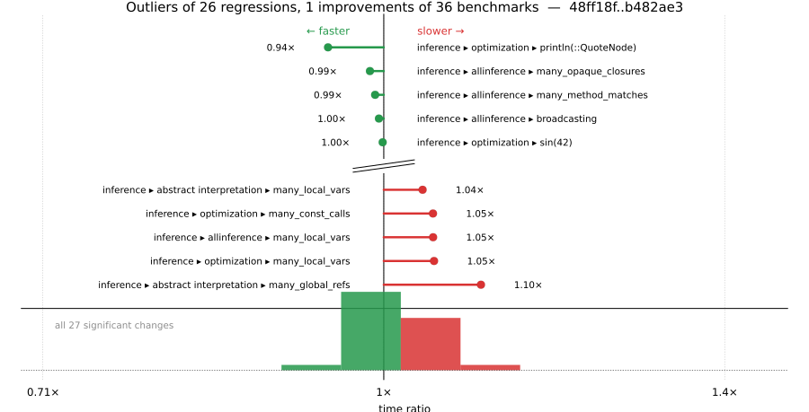

# Benchmark Report

## Summary

**36** benchmarks were executed, **26** showed regressions, and **1** showed improvements.



## Job Properties

*Commits:* [JuliaLang/julia@b482ae3bb07118757581b757aaed3a3b4f7ee23c](https://github.com/JuliaLang/julia/commit/b482ae3bb07118757581b757aaed3a3b4f7ee23c) vs [JuliaLang/julia@48ff18f4cd57135f7178a789007584a92ec94d63](https://github.com/JuliaLang/julia/commit/48ff18f4cd57135f7178a789007584a92ec94d63)

*Comparison Diff:* [link](https://github.com/JuliaLang/julia/compare/48ff18f4cd57135f7178a789007584a92ec94d63...b482ae3bb07118757581b757aaed3a3b4f7ee23c)

*Triggered By:* [link](https://github.com/JuliaLang/julia/pull/61714#issuecomment-4450425987)

*Tag Predicate:* `"inference"`

## Results

*Note: If Chrome is your browser, I strongly recommend installing the [Wide GitHub](https://chrome.google.com/webstore/detail/wide-github/kaalofacklcidaampbokdplbklpeldpj?hl=en)
extension, which makes the result table easier to read.*

Below is a table of this job's results, obtained by running the benchmarks found in
[JuliaCI/BaseBenchmarks.jl](https://github.com/JuliaCI/BaseBenchmarks.jl). The values
listed in the `ID` column have the structure `[parent_group, child_group, ..., key]`,
and can be used to index into the BaseBenchmarks suite to retrieve the corresponding
benchmarks.

The percentages accompanying time and memory values in the below table are noise tolerances. The "true"
time/memory value for a given benchmark is expected to fall within this percentage of the reported value.

A ratio greater than `1.0` denotes a possible regression (marked with :x:), while a ratio less
than `1.0` denotes a possible improvement (marked with :white_check_mark:). Only significant results - results
that indicate possible regressions or improvements - are shown below (thus, an empty table means that all
benchmark results remained invariant between builds).

| ID | time ratio | memory ratio |
|----|------------|--------------|
| `["inference", "abstract interpretation", "Base.init_stdio(::Ptr{Cvoid})"]` | 1.03 (5%)  | 1.08 (1%) :x: |
| `["inference", "abstract interpretation", "REPL.REPLCompletions.completions"]` | 1.03 (5%)  | 1.09 (1%) :x: |
| `["inference", "abstract interpretation", "broadcasting"]` | 1.01 (5%)  | 1.07 (1%) :x: |
| `["inference", "abstract interpretation", "many_const_calls"]` | 1.00 (5%)  | 1.09 (1%) :x: |
| `["inference", "abstract interpretation", "many_global_refs"]` | 1.10 (5%) :x: | 1.17 (1%) :x: |
| `["inference", "abstract interpretation", "many_invoke_calls"]` | 1.01 (5%)  | 1.07 (1%) :x: |
| `["inference", "abstract interpretation", "many_local_vars"]` | 1.04 (5%)  | 1.16 (1%) :x: |
| `["inference", "abstract interpretation", "many_method_matches"]` | 1.00 (5%)  | 1.07 (1%) :x: |
| `["inference", "abstract interpretation", "many_opaque_closures"]` | 1.00 (5%)  | 1.07 (1%) :x: |
| `["inference", "abstract interpretation", "println(::QuoteNode)"]` | 1.04 (5%)  | 1.07 (1%) :x: |
| `["inference", "abstract interpretation", "rand(Float64)"]` | 1.02 (5%)  | 1.07 (1%) :x: |
| `["inference", "abstract interpretation", "sin(42)"]` | 1.01 (5%)  | 1.07 (1%) :x: |
| `["inference", "allinference", "Base.init_stdio(::Ptr{Cvoid})"]` | 1.01 (5%)  | 1.03 (1%) :x: |
| `["inference", "allinference", "REPL.REPLCompletions.completions"]` | 1.00 (5%)  | 1.02 (1%) :x: |
| `["inference", "allinference", "broadcasting"]` | 1.00 (5%)  | 1.02 (1%) :x: |
| `["inference", "allinference", "many_const_calls"]` | 1.04 (5%)  | 1.05 (1%) :x: |
| `["inference", "allinference", "many_global_refs"]` | 1.02 (5%)  | 1.09 (1%) :x: |
| `["inference", "allinference", "many_local_vars"]` | 1.05 (5%) :x: | 1.08 (1%) :x: |
| `["inference", "allinference", "many_method_matches"]` | 0.99 (5%)  | 1.01 (1%) :x: |
| `["inference", "allinference", "many_opaque_closures"]` | 0.99 (5%)  | 1.01 (1%) :x: |
| `["inference", "allinference", "println(::QuoteNode)"]` | 1.00 (5%)  | 1.02 (1%) :x: |
| `["inference", "allinference", "rand(Float64)"]` | 1.00 (5%)  | 1.02 (1%) :x: |
| `["inference", "allinference", "sin(42)"]` | 1.01 (5%)  | 1.02 (1%) :x: |
| `["inference", "optimization", "many_const_calls"]` | 1.05 (5%) :x: | 1.00 (1%)  |
| `["inference", "optimization", "many_local_vars"]` | 1.05 (5%) :x: | 1.04 (1%) :x: |
| `["inference", "optimization", "println(::QuoteNode)"]` | 0.94 (5%) :white_check_mark: | 1.00 (1%)  |
| `["inference", "optimization", "sin(42)"]` | 1.00 (5%)  | 1.01 (1%) :x: |

## Benchmark Group List

Here's a list of all the benchmark groups executed by this job:

- `["inference", "abstract interpretation"]`
- `["inference", "allinference"]`
- `["inference", "optimization"]`

## Version Info

#### Primary Build

```
Julia Version 1.14.0-DEV.2118
Commit b482ae3bb0* (2026-05-05 16:59 UTC)
Platform Info:
  OS: Linux (x86_64-linux-gnu)
      Ubuntu 22.04.5 LTS
  uname: Linux 5.15.0-174-generic #184-Ubuntu SMP Fri Mar 13 18:41:50 UTC 2026 x86_64 x86_64
  CPU: Intel(R) Xeon(R) CPU E3-1241 v3 @ 3.50GHz: 
              speed         user         nice          sys         idle          irq
       #1  3500 MHz      41457 s         21 s      10680 s    3527651 s          0 s  
       #2  3501 MHz     448581 s          6 s      10669 s    3125834 s          0 s  
       #3  3500 MHz      24907 s         14 s       4066 s    3545906 s          0 s  
       #4  3500 MHz      23638 s          9 s       4522 s    3556776 s          0 s  
  Memory: 31.301368713378906 GB (24351.87890625 MB free)
  Uptime: 3.58910915e6 sec
  Load Avg:  1.0  1.04  1.84
  WORD_SIZE: 64
  LLVM: libLLVM-20.1.8 (ORCJIT, haswell)
  GC: Built with stock GC
Threads: 1 default, 1 interactive, 1 GC (on 4 virtual cores)

```

#### Comparison Build

```
Julia Version 1.14.0-DEV.2186
Commit 48ff18f4cd (2026-05-14 05:39 UTC)
Platform Info:
  OS: Linux (x86_64-linux-gnu)
      Ubuntu 22.04.5 LTS
  uname: Linux 5.15.0-174-generic #184-Ubuntu SMP Fri Mar 13 18:41:50 UTC 2026 x86_64 x86_64
  CPU: Intel(R) Xeon(R) CPU E3-1241 v3 @ 3.50GHz: 
              speed         user         nice          sys         idle          irq
       #1  3501 MHz      41478 s         21 s      10692 s    3529117 s          0 s  
       #2  3500 MHz     450017 s          6 s      10670 s    3125903 s          0 s  
       #3  3500 MHz      24957 s         14 s       4068 s    3547358 s          0 s  
       #4  3500 MHz      23662 s          9 s       4523 s    3558257 s          0 s  
  Memory: 31.301368713378906 GB (24342.69140625 MB free)
  Uptime: 3.59061516e6 sec
  Load Avg:  1.0  1.0  1.16
  WORD_SIZE: 64
  LLVM: libLLVM-21.1.8 (ORCJIT, haswell)
  GC: Built with stock GC
Threads: 1 default, 1 interactive, 1 GC (on 4 virtual cores)

```

#### Nanosoldier
Nanosoldier commit: [`97af47c`](https://github.com/JuliaCI/Nanosoldier.jl/commit/97af47cb08d526629aa6f0680adb28fd8a94079b)
