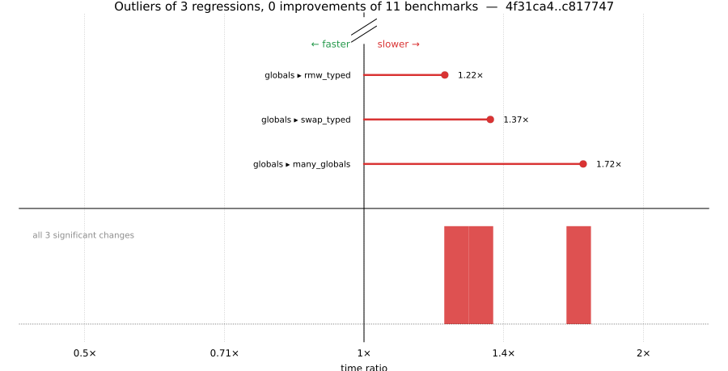

# Benchmark Report

## Summary

**11** benchmarks were executed, **3** showed regressions, and **0** showed improvements.



## Job Properties

*Commits:* [KenoAIStaging/julia@c81774707708706beec447f8a888a42c8cf69825](https://github.com/KenoAIStaging/julia/commit/c81774707708706beec447f8a888a42c8cf69825) vs [JuliaLang/julia@4f31ca4e7aeae318ce98a7c320d715976861f88d](https://github.com/JuliaLang/julia/commit/4f31ca4e7aeae318ce98a7c320d715976861f88d)

*Comparison Diff:* [link](https://github.com/JuliaLang/julia/compare/4f31ca4e7aeae318ce98a7c320d715976861f88d...KenoAIStaging/julia:c81774707708706beec447f8a888a42c8cf69825)

*Triggered By:* [link](https://github.com/JuliaLang/julia/pull/62401)

*Tag Predicate:* `"globals"`

## Results

*Note: If Chrome is your browser, I strongly recommend installing the [Wide GitHub](https://chrome.google.com/webstore/detail/wide-github/kaalofacklcidaampbokdplbklpeldpj?hl=en)
extension, which makes the result table easier to read.*

Below is a table of this job's results, obtained by running the benchmarks found in
[JuliaCI/BaseBenchmarks.jl](https://github.com/JuliaCI/BaseBenchmarks.jl). The values
listed in the `ID` column have the structure `[parent_group, child_group, ..., key]`,
and can be used to index into the BaseBenchmarks suite to retrieve the corresponding
benchmarks.

The percentages accompanying time and memory values in the below table are noise tolerances. The "true"
time/memory value for a given benchmark is expected to fall within this percentage of the reported value.

A ratio greater than `1.0` denotes a possible regression (marked with :x:), while a ratio less
than `1.0` denotes a possible improvement (marked with :white_check_mark:). Only significant results - results
that indicate possible regressions or improvements - are shown below (thus, an empty table means that all
benchmark results remained invariant between builds).

| ID | time ratio | memory ratio |
|----|------------|--------------|
| `["globals", "many_globals"]` | 1.72 (5%) :x: | 1.00 (1%)  |
| `["globals", "rmw_typed"]` | 1.22 (5%) :x: | 1.00 (1%)  |
| `["globals", "swap_typed"]` | 1.37 (5%) :x: | 1.00 (1%)  |

## Benchmark Group List

Here's a list of all the benchmark groups executed by this job:

- `["globals"]`

## Version Info

#### Primary Build

```
Julia Version 1.14.0-DEV.2654
Build Info:
  Commit c817747077 (2026-07-16 06:19 UTC)
  GC: Built with stock GC
  Sysimage: native (x86_64-linux-gnu)
Platform Info:
  OS: Linux (x86_64-unknown-linux-gnu)
      Ubuntu 22.04.5 LTS
  uname: Linux 5.15.0-174-generic #184-Ubuntu SMP Fri Mar 13 18:41:50 UTC 2026 x86_64 x86_64
  CPU: Intel(R) Xeon(R) CPU E3-1241 v3 @ 3.50GHz (haswell):
              speed         user         nice          sys         idle          irq
       #1  3500 MHz      93098 s         40 s      25221 s    8875393 s          0 s  
       #2  3500 MHz     913675 s         38 s      29309 s    8059987 s          0 s  
       #3  3500 MHz      71592 s         37 s      13113 s    8890669 s          0 s  
       #4  3501 MHz      76928 s         19 s      14785 s    8911441 s          0 s  
  Memory: 31.301368713378906 GiB (22112.078125 MiB free)
  Uptime: 9.01526107e6 sec
  Load Avg:  1.95  3.19  2.64
  WORD_SIZE: 64
  LLVM: libLLVM-21.1.8 (ORCJIT, haswell)
Threads: 1 default, 1 interactive, 1 GC (on 4 virtual cores)

```

#### Comparison Build

```
Julia Version 1.14.0-DEV.2666
Build Info:
  Commit 4f31ca4e7a (2026-07-15 21:38 UTC)
  GC: Built with stock GC
  Sysimage: native (x86_64-linux-gnu)
Platform Info:
  OS: Linux (x86_64-unknown-linux-gnu)
      Ubuntu 22.04.5 LTS
  uname: Linux 5.15.0-174-generic #184-Ubuntu SMP Fri Mar 13 18:41:50 UTC 2026 x86_64 x86_64
  CPU: Intel(R) Xeon(R) CPU E3-1241 v3 @ 3.50GHz (haswell):
              speed         user         nice          sys         idle          irq
       #1  3500 MHz      93107 s         40 s      25222 s    8875480 s          0 s  
       #2  3500 MHz     913704 s         38 s      29310 s    8060056 s          0 s  
       #3  3500 MHz      71640 s         37 s      13120 s    8890713 s          0 s  
       #4  3500 MHz      76948 s         19 s      14786 s    8911519 s          0 s  
  Memory: 31.301368713378906 GiB (22111.43359375 MiB free)
  Uptime: 9.01535896e6 sec
  Load Avg:  1.32  2.61  2.49
  WORD_SIZE: 64
  LLVM: libLLVM-21.1.8 (ORCJIT, haswell)
Threads: 1 default, 1 interactive, 1 GC (on 4 virtual cores)

```

#### Nanosoldier
Nanosoldier commit: [`68f7ae1`](https://github.com/JuliaCI/Nanosoldier.jl/commit/68f7ae1308b5151b0b33c1cae9898f5c79df4f47)
